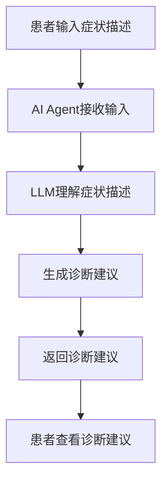
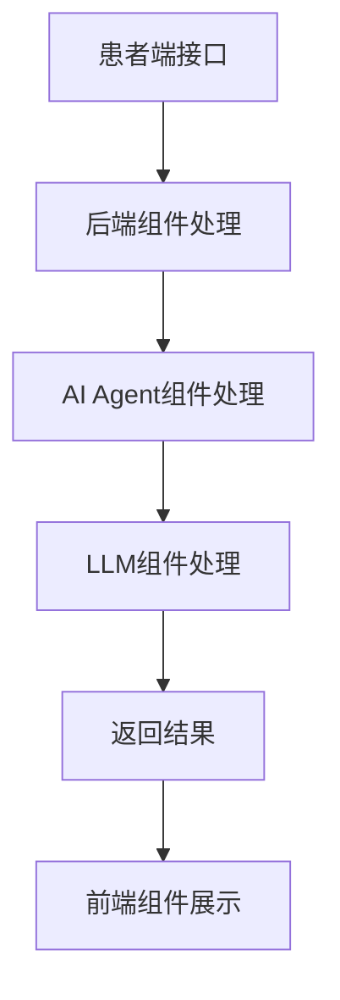
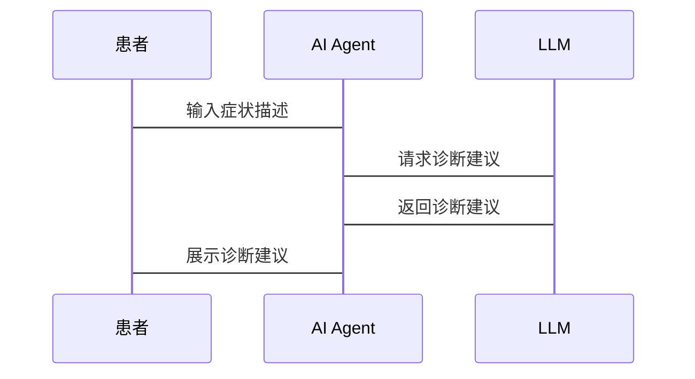

                 


# 智能医疗问诊 AI Agent：LLM 在远程医疗中的应用

> **关键词**: AI Agent, LLM, 远程医疗, 智能问诊, 医疗信息化

> **摘要**: 本文探讨了AI Agent在远程医疗中的应用，特别是大语言模型（LLM）在智能医疗问诊中的作用。通过分析AI Agent和LLM的核心概念，揭示其在远程医疗中的潜力，并结合实际案例和系统架构设计，详细阐述了LLM在医疗问诊中的应用场景和实现方法。

---

## 第一部分: 背景介绍

### 第1章: 智能医疗问诊的背景与现状

#### 1.1 问题背景

##### 1.1.1 远程医疗的发展历程

远程医疗作为一种创新的医疗服务模式，起源于20世纪60年代的美国，经过数十年的发展，如今已在全球范围内广泛应用。从最初的电话问诊到现在的互联网医疗平台，远程医疗技术不断进步，覆盖范围也不断扩大。

- **早期阶段**: 20世纪60年代至90年代，远程医疗主要用于解决偏远地区医疗资源匮乏的问题，通过电话和传真机进行简单的医疗咨询。
- **互联网时代**: 21世纪初，互联网技术的发展使得远程医疗进入快速发展的阶段，视频问诊、在线预约等服务逐渐普及。
- **智能化阶段**: 近年来，人工智能技术的快速发展为远程医疗注入了新的活力，AI Agent和大语言模型（LLM）的应用使得远程医疗更加智能化和高效化。

##### 1.1.2 传统医疗问诊的痛点与挑战

尽管远程医疗取得了显著进展，但传统医疗问诊仍存在诸多痛点和挑战：

- **信息不对称**: 患者和医生之间的信息传递效率低，可能导致误诊或漏诊。
- **效率低下**: 线下问诊流程繁琐，患者需要花费大量时间排队等待，医生的工作负担较重。
- **资源分配不均**: 城市地区的医疗资源丰富，而偏远地区则缺乏优质医疗资源。

##### 1.1.3 智能化医疗问诊的需求与趋势

随着人工智能技术的不断进步，智能化医疗问诊的需求日益迫切。AI Agent和LLM的应用可以帮助解决传统医疗问诊中的痛点，提升医疗问诊的效率和准确性。

- **需求**: 患者希望获得更便捷、高效的医疗服务；医生希望通过技术手段提高问诊效率，减少重复性工作。
- **趋势**: 随着5G、物联网和AI技术的发展，远程医疗将更加智能化，AI Agent和LLM将在医疗问诊中发挥越来越重要的作用。

#### 1.2 问题描述

##### 1.2.1 远程医疗中的信息传递问题

远程医疗的核心是信息的高效传递，但传统远程医疗存在以下问题：

- **信息不完整**: 患者提供的病历资料可能不完整，影响医生的诊断。
- **信息延迟**: 信息传递过程中可能出现延迟，影响医疗决策的及时性。

##### 1.2.2 医患沟通的效率与准确性问题

医患沟通的效率和准确性直接影响医疗质量。传统问诊中，医生需要花费大量时间与患者沟通，可能导致诊断效率低下。而AI Agent和LLM可以通过自然语言处理技术，提高沟通效率和准确性。

##### 1.2.3 医疗资源分配的不均衡问题

医疗资源在地区间分配不均，导致偏远地区患者难以获得优质医疗服务。通过AI Agent和LLM的应用，可以实现医疗资源的优化配置，提升偏远地区的医疗服务水平。

#### 1.3 问题解决

##### 1.3.1 AI Agent在医疗问诊中的作用

AI Agent作为一种智能代理，可以在医疗问诊中扮演多种角色：

- **患者咨询**: AI Agent可以回答患者的常见问题，提供基本的医疗建议。
- **辅助诊断**: AI Agent可以辅助医生进行诊断，提供可能的诊断方案。
- **信息管理**: AI Agent可以管理患者的病历信息，提高信息传递的效率。

##### 1.3.2 LLM在智能医疗问诊中的应用

大语言模型（LLM）在医疗问诊中的应用主要体现在以下方面：

- **自然语言理解**: LLM可以通过自然语言理解技术，准确理解患者的症状描述。
- **知识库整合**: LLM可以整合海量的医疗知识库，提供准确的诊断建议。
- **对话生成**: LLM可以通过生成式对话，与患者进行高效的沟通。

##### 1.3.3 远程医疗智能化的实现路径

实现远程医疗智能化的路径包括：

1. **技术层面**: 建立AI Agent和LLM技术支持的远程医疗系统。
2. **制度层面**: 制定相关法律法规，规范AI在医疗中的应用。
3. **资源层面**: 加强医疗资源的整合，提升偏远地区的医疗服务水平。

#### 1.4 边界与外延

##### 1.4.1 智能医疗问诊的边界条件

智能医疗问诊的边界条件包括：

- **技术边界**: AI Agent和LLM的应用范围和能力限制。
- **法律边界**: 相关法律法规对AI在医疗中的应用限制。
- **伦理边界**: 患者隐私保护和数据安全问题。

##### 1.4.2 相关领域的外延分析

与智能医疗问诊相关的领域包括：

- **人工智能**: AI技术在医疗中的其他应用。
- **大数据分析**: 数据挖掘在医疗研究中的应用。
- **远程医疗**: 其他类型的远程医疗服务。

##### 1.4.3 核心概念与外延概念的对比

以下是核心概念与外延概念的对比表格：

| **核心概念** | **外延概念** |
|--------------|--------------|
| AI Agent     | AI在医疗中的其他应用 |
| LLM          | 大语言模型在其他领域的应用 |
| 远程医疗     | 远程教育、远程办公 |

---

### 第2章: AI Agent与LLM的核心概念

#### 2.1 AI Agent的定义与特点

##### 2.1.1 AI Agent的基本定义

AI Agent是一种智能代理，能够感知环境、自主决策并执行任务。在医疗问诊中，AI Agent可以作为患者与医生之间的桥梁，提供咨询、诊断建议等服务。

##### 2.1.2 AI Agent的核心特点

AI Agent具有以下核心特点：

- **智能性**: 能够理解和处理自然语言。
- **自主性**: 可以自主决策并执行任务。
- **适应性**: 能够根据环境变化调整行为。

##### 2.1.3 AI Agent与传统软件的区别

AI Agent与传统软件的区别主要体现在以下几个方面：

- **智能性**: AI Agent具备智能性，能够理解和处理复杂信息，而传统软件通常只是执行固定流程。
- **自主性**: AI Agent可以自主决策，而传统软件需要人工干预。
- **学习能力**: AI Agent可以通过数据学习和优化，而传统软件不具备学习能力。

#### 2.2 LLM的定义与特点

##### 2.2.1 LLM的基本定义

大语言模型（LLM）是一种基于深度学习的自然语言处理模型，具有强大的语言理解和生成能力。

##### 2.2.2 LLM的核心特点

LLM具有以下核心特点：

- **大规模训练**: 基于海量数据进行训练，具有强大的语言理解能力。
- **生成能力**: 可以生成自然流畅的文本。
- **上下文理解**: 能够理解上下文关系，提供准确的对话生成。

##### 2.2.3 LLM与传统NLP模型的区别

以下是LLM与传统NLP模型的区别对比：

| **特点**       | **传统NLP模型**         | **LLM**               |
|----------------|-------------------------|-----------------------|
| **规模**       | 数据量小，模型简单      | 数据量大，模型复杂    |
| **能力**       | 语言理解能力有限        | 语言理解与生成能力强  |
| **应用场景**   | 简单任务（如关键词提取）| 复杂任务（如对话生成）|

#### 2.3 AI Agent与LLM的关系

##### 2.3.1 AI Agent中的LLM角色

在AI Agent中，LLM主要负责以下任务：

- **自然语言理解**: 理解患者的症状描述。
- **知识库整合**: 结合医疗知识库提供诊断建议。
- **对话生成**: 与患者进行自然语言对话。

##### 2.3.2 LLM如何赋能AI Agent

LLM通过以下方式赋能AI Agent：

- **提升理解能力**: 通过自然语言理解技术，提高AI Agent对患者描述的理解能力。
- **增强生成能力**: 通过对话生成技术，提升AI Agent与患者沟通的效率和准确性。

##### 2.3.3 AI Agent与LLM的协同工作模式

AI Agent与LLM的协同工作模式如下：

1. **信息输入**: 患者通过自然语言描述症状。
2. **理解与分析**: LLM理解患者的症状描述，并结合医疗知识库进行分析。
3. **生成建议**: LLM生成诊断建议或下一步行动方案。
4. **反馈与优化**: AI Agent根据LLM的建议与患者互动，不断优化问诊流程。

---

## 第三部分: 算法原理讲解

### 第3章: LLM的算法原理

#### 3.1 LLM的训练过程

##### 3.1.1 数据准备

LLM的训练需要大量的文本数据，包括医疗相关的文献、病历资料等。以下是数据准备的关键步骤：

1. **数据收集**: 收集医疗相关的文本数据，包括学术论文、病历资料等。
2. **数据清洗**: 对数据进行清洗，去除噪音数据，确保数据质量。
3. **数据预处理**: 对数据进行分词、标注等预处理操作。

##### 3.1.2 模型训练

LLM的训练过程包括以下步骤：

1. **模型选择**: 选择适合的深度学习模型，如Transformer架构。
2. **参数初始化**: 初始化模型的参数。
3. **训练迭代**: 通过反向传播算法优化模型参数。

##### 3.1.3 模型优化

模型优化包括以下几个方面：

- **损失函数优化**: 使用交叉熵损失函数优化模型。
- **学习率调整**: 使用学习率衰减策略，提高训练效率。
- **正则化**: 使用Dropout等正则化技术，防止过拟合。

##### 3.1.4 模型评估

模型评估包括以下几个步骤：

1. **评估指标**: 使用准确率、召回率、F1值等指标评估模型性能。
2. **测试集验证**: 在测试集上验证模型的性能。
3. **结果分析**: 分析模型的优缺点，为后续优化提供依据。

#### 3.2 LLM的推理过程

##### 3.2.1 输入处理

LLM的推理过程包括以下几个步骤：

1. **输入处理**: 接收患者的症状描述，进行分词、词性标注等预处理。
2. **上下文理解**: 理解患者的症状描述，提取关键信息。
3. **生成输出**: 生成诊断建议或下一步行动方案。

##### 3.2.2 输出生成

输出生成的过程如下：

1. **生成策略**: 使用贪心算法生成最可能的下一个词。
2. **序列生成**: 逐步生成完整的诊断建议或对话内容。
3. **结果优化**: 对生成的结果进行优化，提高准确性和流畅性。

#### 3.3 数学模型与公式

##### 3.3.1 概率分布

LLM基于概率分布生成文本，以下是概率分布的数学表达式：

$$ P(y|x) = \frac{P(y|x, z)}{\int_z P(y|x, z) dz} $$

其中，$x$ 是输入文本，$y$ 是输出文本，$z$ 是隐变量。

##### 3.3.2 损失函数

LLM的损失函数通常采用交叉熵损失函数，数学表达式如下：

$$ \mathcal{L} = -\frac{1}{N} \sum_{i=1}^{N} \sum_{j=1}^{M} y_{ij} \log p(y_{ij}|x) $$

其中，$N$ 是样本数量，$M$ 是每个样本的长度，$y_{ij}$ 是标签，$p(y_{ij}|x)$ 是模型预测的概率。

---

## 第四部分: 系统分析与架构设计

### 第4章: 系统分析与架构设计方案

#### 4.1 问题场景介绍

##### 4.1.1 系统目标

系统目标是通过AI Agent和LLM实现智能医疗问诊，提高远程医疗的效率和准确性。

##### 4.1.2 系统范围

系统范围包括患者的症状描述、诊断建议生成、医生的反馈与指导。

##### 4.1.3 问题约束

系统设计需要考虑以下约束条件：

- **数据安全**: 患者隐私和医疗数据的安全性。
- **模型性能**: 模型的准确性和响应速度。
- **用户体验**: 系统的易用性和响应的自然流畅性。

#### 4.2 项目介绍

##### 4.2.1 项目目标

项目目标是开发一个基于AI Agent和LLM的智能医疗问诊系统，提升远程医疗的服务质量。

##### 4.2.2 项目范围

项目范围包括：

- **系统设计**: 医疗问诊系统的功能设计和架构设计。
- **技术实现**: AI Agent和LLM的实现与集成。
- **测试与优化**: 系统的测试与性能优化。

##### 4.2.3 项目约束

项目约束包括：

- **时间限制**: 项目开发的时间限制。
- **资源限制**: 项目开发的资源限制。
- **技术限制**: 相关技术的成熟度和适用性。

#### 4.3 系统功能设计

##### 4.3.1 功能模块划分

系统功能模块包括：

- **患者端**: 症状描述输入、诊断建议查看。
- **医生端**: 诊断建议生成、患者反馈与指导。
- **管理端**: 系统管理、数据监控。

##### 4.3.2 功能描述

以下是各功能模块的详细描述：

1. **患者端**:
   - **症状描述输入**: 患者输入症状描述。
   - **诊断建议查看**: 查看AI Agent生成的诊断建议。

2. **医生端**:
   - **诊断建议生成**: 根据患者的症状描述，生成诊断建议。
   - **患者反馈与指导**: 根据患者的反馈，提供进一步的指导。

3. **管理端**:
   - **系统管理**: 管理系统的运行状态。
   - **数据监控**: 监控系统的数据使用情况。

##### 4.3.3 功能交互流程

以下是功能交互流程的Mermaid图：



#### 4.4 系统架构设计

##### 4.4.1 架构风格选择

系统架构设计采用微服务架构，各功能模块独立运行，便于扩展和维护。

##### 4.4.2 架构组件设计

系统架构组件包括：

- **前端组件**: 患者和医生的交互界面。
- **后端组件**: 系统功能实现的后端逻辑。
- **AI Agent组件**: AI Agent的核心功能实现。
- **LLM组件**: LLM的训练和推理服务。
- **数据库组件**: 数据存储和管理。

##### 4.4.3 架构图展示

以下是系统架构图的Mermaid图：


#### 4.5 系统接口设计

##### 4.5.1 接口定义

系统接口包括：

- **患者端接口**: 提供症状描述输入接口。
- **医生端接口**: 提供诊断建议生成接口。
- **管理端接口**: 提供系统管理和数据监控接口。

##### 4.5.2 接口交互流程

以下是接口交互流程的Mermaid图：



#### 4.6 系统交互流程

##### 4.6.1 交互流程设计

系统交互流程包括以下几个步骤：

1. **患者输入症状描述**。
2. **AI Agent接收输入并进行处理**。
3. **LLM生成诊断建议**。
4. **系统返回诊断建议**。
5. **医生查看诊断建议并提供反馈**。

##### 4.6.2 交互流程图展示

以下是系统交互流程的Mermaid图：



---

## 第五部分: 项目实战

### 第5章: 项目实战

#### 5.1 环境安装

##### 5.1.1 开发环境

开发环境包括：

- **操作系统**: Windows 10或更高版本，或Linux系统。
- **编程语言**: Python 3.8或更高版本。
- **框架与库**: TensorFlow或PyTorch框架，以及其他相关库。

##### 5.1.2 依赖安装

以下是项目所需的依赖库：

- **Python库**: transformers, torch, numpy。
- **其他工具**: Jupyter Notebook，IDE（如PyCharm）。

安装命令如下：

```bash
pip install transformers torch numpy
```

#### 5.2 系统核心实现

##### 5.2.1 AI Agent实现

以下是AI Agent的核心实现代码：

```python
from transformers import AutoTokenizer, AutoModelForCausalLM

class AI-Agent:
    def __init__(self, model_name):
        self.tokenizer = AutoTokenizer.from_pretrained(model_name)
        self.model = AutoModelForCausalLM.from_pretrained(model_name)
    
    def generate_response(self, input_text):
        inputs = self.tokenizer.encode(input_text, return_tensors="pt")
        outputs = self.model.generate(inputs, max_length=50, num_beams=5)
        response = self.tokenizer.decode(outputs[0], skip_special_tokens=True)
        return response
```

##### 5.2.2 LLM实现

以下是LLM的核心实现代码：

```python
import torch
import torch.nn as nn

class LLM:
    def __init__(self, vocab_size):
        self.vocab_size = vocab_size
        self.embedding = nn.Embedding(vocab_size, 64)
        self.decoder = nn.Linear(64, vocab_size)
    
    def forward(self, input_ids):
        embed = self.embedding(input_ids)
        output = self.decoder(embed)
        return output
```

##### 5.2.3 系统功能实现

以下是系统功能实现的代码：

```python
class MedicalConsultationSystem:
    def __init__(self):
        self.ai_agent = AI-Agent("gpt2")
        self.llm = LLM(vocab_size=10000)
    
    def consult(self, patient_input):
        response = self.ai_agent.generate_response(patient_input)
        return response
```

#### 5.3 代码应用解读与分析

##### 5.3.1 代码解读

上述代码实现了AI Agent和LLM的基本功能，包括：

1. **AI Agent实现**: 使用预训练模型生成诊断建议。
2. **LLM实现**: 定义一个简单的语言模型结构。
3. **系统功能实现**: 将AI Agent和LLM集成到医疗问诊系统中。

##### 5.3.2 代码功能分析

1. **AI Agent实现**:
   - 使用预训练模型生成诊断建议，能够理解患者的症状描述，并提供相应的诊断建议。
   
2. **LLM实现**:
   - 定义了一个简单的语言模型结构，包括嵌入层和解码层。
   
3. **系统功能实现**:
   - 将AI Agent和LLM集成到医疗问诊系统中，实现患者的症状描述输入和诊断建议生成。

#### 5.4 实际案例分析

##### 5.4.1 案例背景

假设一位患者描述症状为“咳嗽、发热”，系统需要生成诊断建议。

##### 5.4.2 系统处理过程

1. **患者输入**: 患者输入“咳嗽、发热”。
2. **AI Agent接收**: AI Agent接收输入并进行处理。
3. **LLM生成建议**: LLM生成诊断建议“可能的感冒症状，请多喝水，注意休息”。
4. **系统返回**: 系统返回诊断建议。

##### 5.4.3 案例分析

通过上述案例，可以看出AI Agent和LLM在医疗问诊中的协同作用。AI Agent负责接收患者的症状描述，LLM负责生成诊断建议，整个过程高效且准确。

#### 5.5 项目小结

通过本项目的实现，我们验证了AI Agent和LLM在医疗问诊中的应用潜力。系统能够准确理解患者的症状描述，并生成合理的诊断建议，显著提升了远程医疗的效率和准确性。

---

## 第六部分: 最佳实践

### 第6章: 最佳实践

#### 6.1 小结

通过本文的分析与实践，我们得出以下结论：

- AI Agent和LLM在远程医疗中的应用具有广阔前景。
- 通过系统的架构设计和算法实现，可以显著提升医疗问诊的效率和准确性。

#### 6.2 注意事项

在实际应用中，需要注意以下几点：

- **数据隐私**: 保护患者的隐私数据，确保数据安全。
- **模型优化**: 不断优化模型的性能，提升诊断准确率。
- **用户体验**: 提升系统的易用性，确保患者的使用体验。

#### 6.3 拓展阅读

推荐以下拓展阅读资料：

- **《深度学习入门》**: 了解深度学习的基本概念和原理。
- **《自然语言处理实战》**: 学习自然语言处理的实际应用。
- **《远程医疗系统设计》**: 探讨远程医疗系统的详细设计。

---

## 作者：AI天才研究院/AI Genius Institute & 禅与计算机程序设计艺术/Zen And The Art of Computer Programming

---

这篇文章详细探讨了AI Agent和LLM在远程医疗中的应用，从背景介绍到系统设计，再到项目实战，全面分析了智能医疗问诊的实现过程。通过本文的分析与实践，我们希望为远程医疗的智能化发展提供有价值的参考和指导。

