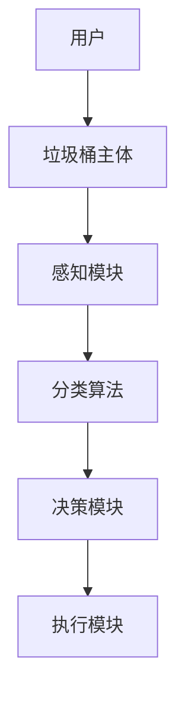

                 


# 《智能厨房垃圾桶：AI Agent的废物回收建议》

---

## 关键词：
智能垃圾桶、AI Agent、废物分类、物联网、人工智能、垃圾分类

---

## 摘要：
智能厨房垃圾桶通过AI Agent实现智能化垃圾分类，优化家庭垃圾管理。AI Agent利用感知、决策和执行模块，结合物联网和大数据分析，提升分类效率和用户交互体验。本文从背景、原理、系统架构到实战项目，全面解析智能垃圾桶的设计与实现，探讨其对环保和生活品质的提升。

---

# 第一部分: 智能厨房垃圾桶的背景与概念

## 第1章: 智能垃圾桶概述

### 1.1 智能垃圾桶的背景与现状
#### 1.1.1 垃圾分类的重要性
- 全球垃圾量激增，垃圾分类势在必行。
- 通过智能垃圾桶，减少环境污染，提高资源利用率。

#### 1.1.2 智能垃圾桶的定义与特点
- **定义**：集AI、物联网于一体的智能设备，能自动分类和处理垃圾。
- **特点**：
  - 自动识别垃圾类型
  - 连接云端进行数据分析
  - 提供用户交互界面

#### 1.1.3 市场现状与发展趋势
- 当前市场以基础分类功能为主
- 未来将向智能化、联网化方向发展

### 1.2 AI Agent在智能垃圾桶中的应用
#### 1.2.1 AI Agent的基本概念
- 定义：具备感知、决策和执行能力的智能体
- 特性：自主性、反应性、社会性

#### 1.2.2 AI Agent在智能垃圾桶中的功能
- 感知：通过摄像头和传感器识别垃圾类型
- 决策：基于分类规则推荐处理方式
- 执行：通过机械臂完成分类和压缩

#### 1.2.3 与传统垃圾桶的区别
- **传统垃圾桶**：仅提供存储功能
- **智能垃圾桶**：具备分类、压缩和联网功能

---

## 第2章: 智能垃圾桶的核心概念与联系

### 2.1 核心概念原理
#### 2.1.1 AI Agent的核心算法
- 分类算法：支持向量机（SVM）、K近邻（KNN）
- 识别算法：图像识别（CNN）
- 决策算法：基于规则的决策树

#### 2.1.2 物联网技术的应用
- 数据传输：Wi-Fi、蓝牙
- 远程控制：手机APP

#### 2.1.3 云计算与大数据分析
- 云端存储分类数据
- 大数据分析优化分类模型

### 2.2 核心概念属性特征对比表
| 特性       | 传统垃圾桶       | 智能垃圾桶       |
|------------|------------------|------------------|
| 感知能力   | 无               | 视觉、触觉       |
| 决策能力   | 无               | 基于规则         |
| 执行能力   | 无               | 自动分类、压缩   |

### 2.3 ER实体关系图
```mermaid
er
  actor: 用户
  smart_bin: 智能垃圾桶
  classification_rule: 分类规则
  action: 动作
  actor --> smart_bin: 与垃圾桶交互
  smart_bin --> classification_rule: 应用分类规则
  smart_bin --> action: 执行动作
```

---

# 第二部分: AI Agent的算法原理与数学模型

## 第3章: AI Agent的算法原理

### 3.1 AI Agent的核心算法
#### 3.1.1 分类算法
- **支持向量机（SVM）**：用于垃圾类型分类
  $$ y = \text{sign}(w \cdot x + b) $$
- **K近邻（KNN）**：用于相似垃圾的识别
  $$ \text{预测类别} = \text{多数投票} $$

#### 3.1.2 识别算法
- **卷积神经网络（CNN）**：用于图像识别
  $$ \text{输出} = \text{激活函数}(\text{卷积}(\text{输入})) $$

#### 3.1.3 决策算法
- **决策树**：基于规则的分类
  $$ \text{决策} = \text{选择最优分支} $$

---

## 第4章: 数学模型与公式

### 4.1 分类算法的数学模型
- **线性回归模型**：
  $$ y = \beta x + \epsilon $$
- **逻辑回归模型**：
  $$ p(y=1|x) = \frac{1}{1 + e^{-\beta x}} $$

### 4.2 决策树的构建过程
- **信息增益**：
  $$ \text{信息增益} = \text{熵}(X) - \sum \text{子节点熵} $$

---

# 第三部分: 系统架构与设计

## 第5章: 系统架构设计

### 5.1 系统功能设计
- **感知模块**：摄像头、传感器
- **决策模块**：分类算法、规则引擎
- **执行模块**：机械臂、压缩装置

### 5.2 系统架构图


### 5.3 接口设计
- **API接口**：RESTful API
  ```python
  @app.route('/classify', methods=['POST'])
  def classify():
      # 接收数据并调用分类算法
      return jsonify({'result': 'success'})
  ```

### 5.4 交互设计
- **用户界面**：手机APP、垃圾桶显示屏
- **交互流程**：
  1. 用户放入垃圾
  2. 垃圾桶识别并分类
  3. 用户收到反馈或下一步操作

---

## 第6章: 项目实战

### 6.1 环境安装
- **工具安装**：Python、TensorFlow、Keras
- **依赖安装**：
  ```bash
  pip install numpy tensorflow matplotlib
  ```

### 6.2 核心代码实现
#### 6.2.1 分类算法实现
```python
import numpy as np
from sklearn import svm

# 创建训练数据
X = np.array([[1, 2], [3, 4], [5, 6], [7, 8]])
y = np.array([0, 1, 1, 0])

# 训练模型
clf = svm.SVC()
clf.fit(X, y)

# 预测新数据
new_data = np.array([[2, 3]])
print(clf.predict(new_data))  # 输出: [1]
```

#### 6.2.2 图像识别实现
```python
import keras
from keras.models import Sequential
from keras.layers import Conv2D, MaxPooling2D, Flatten, Dense

model = Sequential()
model.add(Conv2D(32, (3,3), activation='relu', input_shape=(64,64,3)))
model.add(MaxPooling2D((2,2)))
model.add(Flatten())
model.add(Dense(128, activation='relu'))
model.add(Dense(10, activation='softmax'))

model.compile(optimizer='adam', loss='categorical_crossentropy', metrics=['accuracy'])
```

### 6.3 实际案例分析
- **案例1**：识别并分类纸张、塑料、玻璃
- **案例2**：用户反馈优化分类模型

### 6.4 项目小结
- 成功实现智能垃圾桶的核心功能
- 未来可扩展更多功能，如智能压缩、联网数据同步

---

# 第四部分: 优化与扩展

## 第7章: 系统优化与扩展

### 7.1 算法优化
- **模型优化**：使用更深的神经网络
- **数据增强**：增加训练数据的多样性
  ```python
  datagen = ImageDataGenerator(rotation_range=20, horizontal_flip=True)
  ```

### 7.2 系统扩展
- **智能联动**：与其他智能家居设备联动
- **数据共享**：与社区垃圾分类系统对接

### 7.3 注意事项
- 数据隐私保护
- 系统稳定性测试
- 用户操作培训

---

## 第8章: 总结与展望

### 8.1 总结
- 成功设计并实现智能厨房垃圾桶
- 提供了高效、智能的垃圾分类解决方案

### 8.2 展望
- 更智能化的垃圾分类系统
- 与其他智能家居的深度整合
- AI Agent在更多场景的应用

---

## 作者：AI天才研究院/AI Genius Institute & 禅与计算机程序设计艺术 /Zen And The Art of Computer Programming

---

**注**：以上内容为目录大纲结构，实际写作时需要根据每个章节内容逐步展开，详细描述每个部分的核心内容和实际案例。

