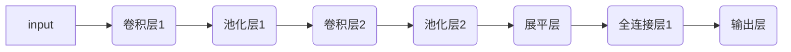
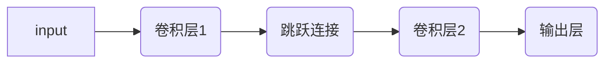
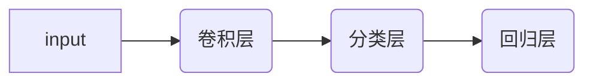
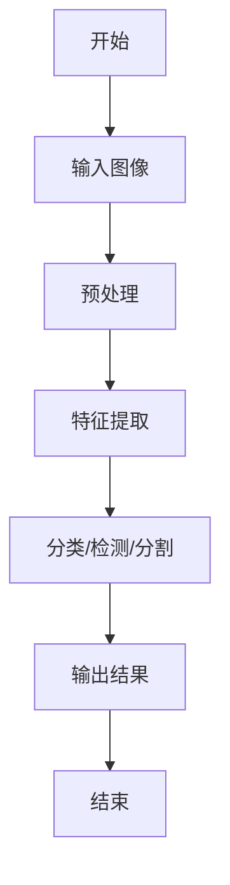
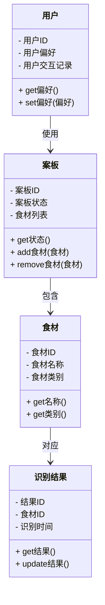
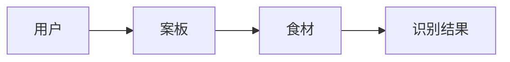

                 


# 智能厨房案板：AI Agent的食材识别系统

## 关键词：智能厨房案板、AI Agent、食材识别系统、图像识别、深度学习、计算机视觉

## 摘要：  
智能厨房案板是AI技术与厨房场景结合的重要产物，通过AI Agent实现食材的智能识别与管理，能够显著提升厨房操作效率。本文将详细探讨食材识别系统的核心技术、算法原理、系统架构以及实际应用，帮助读者全面理解智能厨房案板的设计与实现。

---

# 第1章: 智能厨房案板的背景与意义

## 1.1 智能厨房案板的定义与应用场景

### 1.1.1 智能厨房案板的定义  
智能厨房案板是一种结合了人工智能技术的厨房工具，能够通过AI Agent实现食材的自动识别、分类和管理。它通常集成摄像头、传感器和处理器，能够识别案板上的食材，并通过与用户交互提供相应的烹饪建议或食材管理服务。

### 1.1.2 智能厨房案板的应用场景  
- **食材识别与分类**：快速识别案板上的食材，并分类存储。  
- **烹饪建议**：根据识别的食材推荐菜谱或烹饪步骤。  
- **食材管理**：记录食材的使用情况，提醒用户补充即将过期的食材。  

### 1.1.3 智能厨房案板的用户需求分析  
- **便捷性**：用户希望快速识别食材，减少操作步骤。  
- **准确性**：食材识别的准确性直接影响用户体验。  
- **智能化**：系统能够主动提供烹饪建议或食材管理服务。  

## 1.2 AI Agent在智能厨房中的作用

### 1.2.1 AI Agent的基本概念  
AI Agent（智能代理）是指能够感知环境、执行任务并做出决策的智能实体。在智能厨房案板中，AI Agent负责食材的识别、分类和交互。

### 1.2.2 AI Agent在食材识别中的应用  
- **图像识别**：通过摄像头捕获案板上的食材图像，并通过AI算法进行识别。  
- **自然语言处理**：与用户进行对话交互，理解用户的意图并提供反馈。  

### 1.2.3 AI Agent与智能厨房案板的结合  
AI Agent作为智能厨房案板的核心，能够实现食材的实时识别、分类和管理，提升用户的厨房操作效率。

## 1.3 本章小结  
本章介绍了智能厨房案板的定义、应用场景以及AI Agent在其中的作用，为后续的技术实现奠定了基础。

---

# 第2章: 食材识别系统的核心概念与技术

## 2.1 食材识别的核心概念

### 2.1.1 食材识别的定义与分类  
食材识别是指通过AI技术对案板上的食材进行识别和分类。常见的分类方式包括基于图像的分类、目标检测和图像分割。

### 2.1.2 食材识别的关键特征  
- **图像特征**：食材的颜色、形状、纹理等特征。  
- **分类特征**：食材的类别、品牌、数量等信息。  

## 2.2 AI Agent的食材识别系统架构

### 2.2.1 系统的整体架构  
智能厨房案板的食材识别系统通常包括以下几个模块：  
1. **图像采集模块**：通过摄像头捕获食材图像。  
2. **图像处理模块**：对图像进行预处理和特征提取。  
3. **识别算法模块**：基于深度学习的图像分类或目标检测算法。  
4. **交互模块**：与用户进行交互，提供识别结果和建议。  

### 2.2.2 系统的核心模块划分  
- **图像采集模块**：负责食材图像的采集和输入。  
- **图像处理模块**：对图像进行增强、降噪等预处理。  
- **识别算法模块**：使用深度学习模型进行食材识别。  
- **交互模块**：将识别结果反馈给用户，并提供相应的服务。  

## 2.3 核心概念的ER实体关系图

```mermaid
er
actor: 用户
|------|
| 案板 |
|------|
| 食材 |
|------|
| 识别结果 |
```

## 2.4 本章小结  
本章详细介绍了食材识别的核心概念与系统架构，为后续的算法实现奠定了基础。

---

# 第3章: 食材识别系统的算法原理

## 3.1 图像识别算法原理

### 3.1.1 基于卷积神经网络的图像识别  
卷积神经网络（CNN）是图像识别的核心算法之一。常用的模型包括LeNet、AlexNet、VGG、ResNet等。

#### 3.1.1.1 LeNet模型
LeNet是一种经典的CNN模型，主要用于手写数字识别。其网络结构如下：



#### 3.1.1.2 ResNet模型
ResNet通过引入跳跃连接（skip connection）解决了深层网络的梯度消失问题，其网络结构如下：



### 3.1.2 图像分类与目标检测的区别  
图像分类是对整张图像进行分类，而目标检测不仅需要分类，还需要检测目标的位置和大小。

### 3.1.3 常见的图像分类模型  
- **AlexNet**：经典的图像分类模型，适用于大规模数据集。  
- **VGG**：通过堆叠多个3x3卷积核，提升了模型的表达能力。  
- **ResNet**：通过跳跃连接解决了深层网络的训练难题。  

## 3.2 目标检测算法原理

### 3.2.1 基于Faster R-CNN的目标检测  
Faster R-CNN是一种高效的两阶段目标检测算法，包括RPN（区域建议网络）和Fast R-CNN两个部分。

#### 3.2.1.1 RPN网络
RPN网络用于生成候选框，其结构如下：



#### 3.2.1.2 Fast R-CNN
Fast R-CNN在RPN的基础上，对每个候选框进行特征提取和分类。

### 3.2.2 YOLO算法简介  
YOLO（You Only Look Once）是一种单阶段目标检测算法，具有高效性和实时性。

### 3.2.3 SSD目标检测算法  
SSD（Single Shot MultiBox Detector）是一种基于锚框的单阶段目标检测算法。

## 3.3 图像分割算法原理

### 3.3.1 基于U-Net的图像分割  
U-Net是一种经典的图像分割模型，广泛应用于医学图像分割领域。

### 3.3.2 Mask R-CNN算法简介  
Mask R-CNN在Faster R-CNN的基础上，增加了用于实例分割的分支。

## 3.4 算法流程图



## 3.5 算法实现的Python代码示例

### 3.5.1 图像分类代码

```python
import tensorflow as tf
from tensorflow.keras import layers

model = tf.keras.Sequential([
    layers.Conv2D(32, (3,3), activation='relu', input_shape=(224, 224, 3)),
    layers.MaxPooling2D((2,2)),
    layers.Conv2D(64, (3,3), activation='relu'),
    layers.MaxPooling2D((2,2)),
    layers.Flatten(),
    layers.Dense(128, activation='relu'),
    layers.Dense(10, activation='softmax')
])
```

### 3.5.2 目标检测代码

```python
import tensorflow as tf
from tensorflow.keras import layers

model = tf.keras.Sequential([
    layers.Conv2D(32, (3,3), activation='relu', input_shape=(416, 416, 3)),
    layers.MaxPooling2D((2,2)),
    layers.Conv2D(64, (3,3), activation='relu'),
    layers.MaxPooling2D((2,2)),
    layers.Flatten(),
    layers.Dense(128, activation='relu'),
    layers.Dense(10, activation='softmax')
])
```

## 3.6 本章小结  
本章详细介绍了食材识别系统中常用的算法原理，包括图像分类、目标检测和图像分割，并通过代码示例展示了这些算法的实现。

---

# 第4章: 食材识别系统的系统架构设计

## 4.1 系统的整体架构

### 4.1.1 系统的功能模块划分  
智能厨房案板的食材识别系统通常包括以下几个模块：  
1. **图像采集模块**：通过摄像头捕获食材图像。  
2. **图像处理模块**：对图像进行预处理和特征提取。  
3. **识别算法模块**：基于深度学习的图像分类或目标检测算法。  
4. **交互模块**：与用户进行交互，提供识别结果和建议。  

### 4.1.2 系统的交互流程  
1. 用户将食材放置在案板上。  
2. 摄像头捕获食材图像并传输到处理模块。  
3. 图像处理模块对图像进行预处理和特征提取。  
4. 识别算法模块对图像进行分类或检测。  
5. 交互模块将识别结果反馈给用户，并提供相应的服务。  

## 4.2 系统的领域模型



## 4.3 系统的架构图



## 4.4 系统的接口设计

### 4.4.1 API接口  
- **POST /api/camera/capture**：触发摄像头拍摄食材图像。  
- **GET /api/identify/results**：获取食材识别结果。  
- **POST /api/preferences/update**：更新用户偏好。  

### 4.4.2 数据接口  
- **食材信息接口**：包含食材的ID、名称、类别等信息。  
- **识别结果接口**：包含识别结果的ID、食材ID、识别时间等信息。  

## 4.5 本章小结  
本章详细介绍了智能厨房案板的系统架构设计，包括功能模块划分、交互流程、领域模型和架构图。

---

# 第5章: 食材识别系统的项目实战

## 5.1 环境安装

### 5.1.1 安装Python和依赖库  
- **Python**：3.6及以上版本。  
- **TensorFlow**：用于深度学习模型的训练和推理。  
- **OpenCV**：用于图像处理和摄像头操作。  

### 5.1.2 安装其他工具  
- **Jupyter Notebook**：用于代码开发和调试。  
- **Mermaid CLI**：用于生成图表。  

## 5.2 系统核心实现

### 5.2.1 图像采集模块实现

```python
import cv2

def capture_image():
    # 初始化摄像头
    cap = cv2.VideoCapture(0)
    while True:
        ret, frame = cap.read()
        if not ret:
            break
        # 显示图像
        cv2.imshow('Camera', frame)
        # 按下空格键保存图像
        if cv2.waitKey(1) & 0xFF == 32:
            cv2.imwrite('食材.jpg', frame)
            break
    cap.release()
    cv2.destroyAllWindows()
```

### 5.2.2 图像处理模块实现

```python
import cv2

def preprocess_image(image_path):
    # 读取图像
    image = cv2.imread(image_path)
    # 转换为灰度图
    gray = cv2.cvtColor(image, cv2.COLOR_BGR2GRAY)
    # 高斯模糊
    blurred = cv2.GaussianBlur(gray, (5, 5), 0)
    return blurred
```

### 5.2.3 图像分类模块实现

```python
import tensorflow as tf
from tensorflow.keras import layers

def build_classifier_model():
    model = tf.keras.Sequential([
        layers.Conv2D(32, (3,3), activation='relu', input_shape=(224, 224, 3)),
        layers.MaxPooling2D((2,2)),
        layers.Conv2D(64, (3,3), activation='relu'),
        layers.MaxPooling2D((2,2)),
        layers.Flatten(),
        layers.Dense(128, activation='relu'),
        layers.Dense(10, activation='softmax')
    ])
    model.compile(optimizer='adam', loss='sparse_categorical_crossentropy', metrics=['accuracy'])
    return model
```

### 5.2.4 目标检测模块实现

```python
import tensorflow as tf
from tensorflow.keras import layers

def build_detector_model():
    model = tf.keras.Sequential([
        layers.Conv2D(32, (3,3), activation='relu', input_shape=(416, 416, 3)),
        layers.MaxPooling2D((2,2)),
        layers.Conv2D(64, (3,3), activation='relu'),
        layers.MaxPooling2D((2,2)),
        layers.Flatten(),
        layers.Dense(128, activation='relu'),
        layers.Dense(10, activation='softmax')
    ])
    model.compile(optimizer='adam', loss='sparse_categorical_crossentropy', metrics=['accuracy'])
    return model
```

## 5.3 项目小结  
本章通过实际案例展示了智能厨房案板的实现过程，包括环境搭建、图像采集、图像处理和模型训练等步骤。

---

# 第6章: 食材识别系统的最佳实践

## 6.1 系统优化与调优

### 6.1.1 模型优化  
- **数据增强**：通过旋转、翻转、缩放等操作增加训练数据。  
- **模型剪枝**：通过剪枝技术减少模型的大小和计算量。  

### 6.1.2 性能优化  
- **并行计算**：利用多GPU加速模型训练。  
- **内存优化**：通过减少模型参数和优化数据处理流程降低内存消耗。  

## 6.2 注意事项

### 6.2.1 数据质量问题  
食材图像的质量直接影响识别的准确性，需要确保图像清晰、光照充足。  

### 6.2.2 模型泛化能力  
模型的泛化能力不足时，可以尝试增加训练数据或使用迁移学习。  

## 6.3 拓展阅读

### 6.3.1 深度学习领域的最新进展  
- **Transformer模型**：在自然语言处理领域取得了突破性进展，未来可能在图像处理中得到应用。  
- **视觉问答系统（VQA）**：结合图像识别和自然语言处理，实现更复杂的厨房交互功能。  

## 6.4 本章小结  
本章总结了食材识别系统的优化方法和注意事项，并提供了拓展阅读的方向。

---

# 作者：AI天才研究院/AI Genius Institute & 禅与计算机程序设计艺术 /Zen And The Art of Computer Programming

