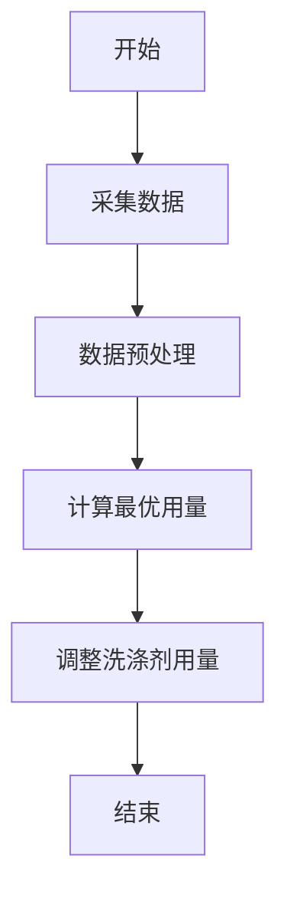
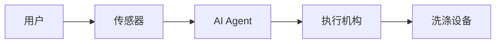
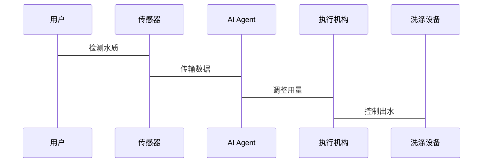

                 


# 智能厨房水槽：AI Agent的洗涤剂用量优化

## 关键词
智能厨房水槽，AI Agent，洗涤剂用量优化，数学模型，算法优化，系统架构

## 摘要
本文详细探讨了AI Agent在智能厨房水槽中的应用，特别是如何通过优化洗涤剂用量来提升效率和环保效果。文章从背景介绍、核心概念、算法原理、系统架构设计、项目实战到最佳实践，全面解析了洗涤剂用量优化的实现过程，帮助读者理解并掌握这一技术。

---

## 第一部分：背景介绍

### 第1章：智能厨房水槽与洗涤剂用量优化概述

#### 1.1 问题背景
1.1.1 智能厨房水槽的定义与现状  
智能厨房水槽是一种集成洗涤功能的厨房设备，通常配备传感器和智能控制系统，能够自动检测水质、水量和洗涤剂浓度。近年来，随着智能家居的普及，智能水槽逐渐成为厨房标配。

1.1.2 洗涤剂用量优化的必要性  
传统洗涤剂用量存在过量或不足的问题，导致清洁效果不佳或浪费资源。通过AI技术优化洗涤剂用量，可以提高清洁效率，减少浪费，同时降低环境负担。

#### 1.2 问题描述
1.2.1 洗涤剂用量过量与不足的问题  
洗涤剂过量会浪费资源并增加成本，不足则无法有效清洁，影响用户体验。

1.2.2 不同洗涤剂的适用场景与浓度要求  
不同洗涤剂适用于不同的污渍类型，浓度要求也不同，如何选择合适的洗涤剂用量是关键。

#### 1.3 问题解决
1.3.1 AI Agent在洗涤剂用量优化中的作用  
AI Agent通过分析洗涤数据，实时调整洗涤剂用量，确保清洁效果的同时节省资源。

1.3.2 智能厨房水槽的自动化控制机制  
水槽通过传感器检测水质和污渍类型，AI Agent根据数据计算最优洗涤剂用量，控制执行机构自动添加。

#### 1.4 边界与外延
1.4.1 洗涤剂用量优化的适用范围  
适用于家庭、商业厨房等场景，但需考虑不同洗涤剂的特性和环境限制。

1.4.2 与其他智能家居设备的协同  
与智能洗衣机、智能灶具等设备协同工作，进一步优化家居清洁效率。

#### 1.5 概念结构与核心要素组成
1.5.1 核心概念：AI Agent、洗涤剂用量、智能水槽  
AI Agent负责数据处理和决策，洗涤剂用量是优化目标，智能水槽是应用场景。

1.5.2 核心要素：传感器、数据采集、算法优化、执行机构  
传感器采集数据，AI Agent进行优化计算，执行机构调整洗涤剂用量。

---

## 第二部分：核心概念与联系

### 第2章：AI Agent与洗涤剂用量优化的核心概念

#### 2.1 核心概念原理
2.1.1 AI Agent的基本原理  
AI Agent通过感知环境、分析数据、制定决策和执行操作，实现智能化控制。

2.1.2 洗涤剂用量优化的数学模型  
建立数学模型，考虑污渍类型、水质、洗涤剂特性等因素，计算最优用量。

#### 2.2 概念属性特征对比表格
| 洗涤剂类型 | 适用场景 | 推荐用量 |
|------------|-----------|----------|
| 酶制剂     | 油污     | 20-30ml  |
| 表面活性剂 | 餐具油污 | 10-20ml  |
| 酸性清洁剂 | 银器     | 5-10ml   |

#### 2.3 ER实体关系图
```mermaid
er
actor 用户 {
  id: 用户ID
  厨房水槽ID
}
actor 洗涤剂 {
  id: 洗涤剂ID
  型号
}
actor AI Agent {
  id: AgentID
  智能水槽ID
}
```

---

## 第三部分：算法原理讲解

### 第3章：洗涤剂用量优化的算法原理

#### 3.1 算法优化原理
3.1.1 数学模型建立  
目标函数：最小化洗涤剂用量，最大化清洁效果。  
约束条件：污渍类型、水质、洗涤剂浓度。

$$ \text{目标函数：} \quad \min_{x} x $$
$$ \text{约束条件：} \quad y \geq \text{清洁阈值} $$

3.1.2 优化算法选择  
使用遗传算法或梯度下降算法，根据实时数据动态调整洗涤剂用量。

#### 3.2 算法实现步骤
1. 采集数据：传感器检测水质、污渍类型。
2. 数据预处理：去除噪声，提取有效特征。
3. 计算最优用量：AI Agent根据模型计算并调整用量。



#### 3.3 Python代码实现
```python
import numpy as np

def optimize_detergent用量(污渍类型, 水质):
    # 数据预处理
   特征 = extract_features(污渍类型, 水质)
    
    # 建立优化模型
    model =建立模型(特征)
    
    # 计算最优用量
    用量 = model.predict(特征)
    
    return 用量

# 示例调用
用量 = optimize_detergent用量("油污", "软水")
print("建议用量：", 用量)
```

---

## 第四部分：系统分析与架构设计方案

### 第4章：系统架构设计

#### 4.1 问题场景介绍
系统需在智能水槽中实时调整洗涤剂用量，确保清洁效果。

#### 4.2 系统功能设计
- 数据采集：传感器采集水质、污渍类型。
- 数据分析：AI Agent分析数据，优化洗涤剂用量。
- 执行机构：调整洗涤剂用量，控制出水。

#### 4.3 系统架构设计


#### 4.4 系统交互设计


---

## 第五部分：项目实战

### 第5章：洗涤剂用量优化的项目实现

#### 5.1 环境安装
安装Python、AI框架（如TensorFlow）和传感器驱动。

#### 5.2 核心功能实现
实现数据采集、模型训练和用量调整功能。

```python
def install_environment():
    import os
    os.system("pip install numpy tensorflow")
    print("环境安装完成")

install_environment()
```

#### 5.3 案例分析
通过实际案例展示优化效果，分析洗涤剂用量的变化。

---

## 第六部分：最佳实践

### 第6章：洗涤剂用量优化的最佳实践

#### 6.1 小结
通过AI Agent优化洗涤剂用量，提升了清洁效率和环保效果。

#### 6.2 注意事项
- 数据采集的准确性
- 模型的实时性和适应性
- 用户的使用习惯和偏好

#### 6.3 拓展阅读
推荐相关书籍和论文，深入学习AI在智能家居中的应用。

---

## 作者信息

作者：AI天才研究院/AI Genius Institute & 禅与计算机程序设计艺术 /Zen And The Art of Computer Programming

