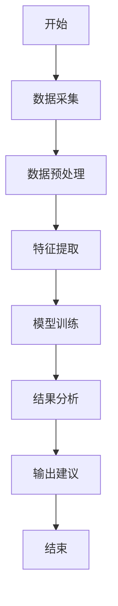
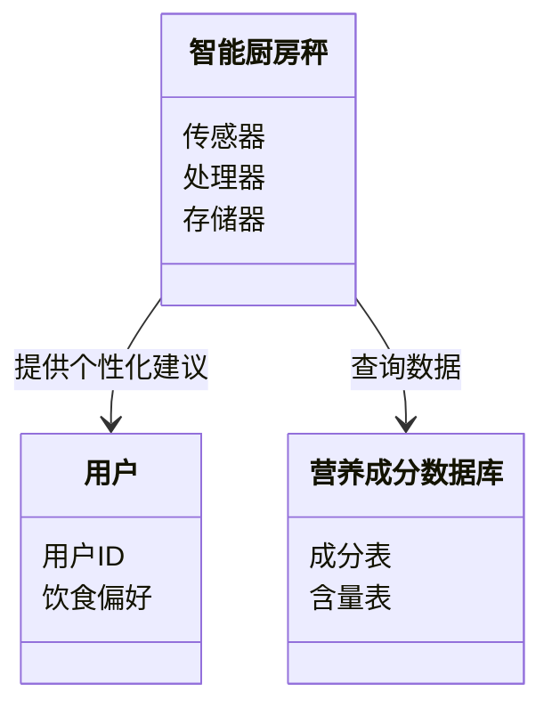
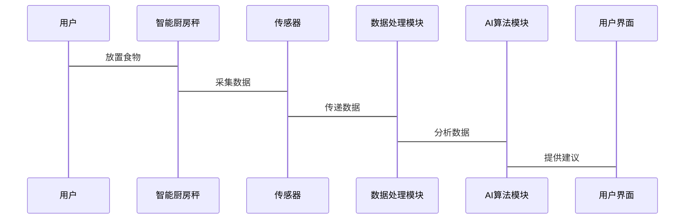

                 


# 智能厨房秤：AI Agent的营养成分分析

## 关键词：智能厨房秤，AI Agent，营养成分分析，传感器技术，机器学习，物联网

## 摘要：  
智能厨房秤通过集成AI Agent技术，能够实时分析食物的营养成分，为用户提供了便捷、精准的健康饮食管理工具。本文将详细探讨智能厨房秤的工作原理、AI Agent的核心算法、系统架构设计以及实际应用案例，帮助读者全面理解这一创新技术的应用潜力。

---

# 第1章: 智能厨房秤的背景与问题描述

## 1.1 智能厨房秤的背景

### 1.1.1 厨房秤的传统功能与局限性  
传统厨房秤主要用于测量食物的重量，但在营养成分分析方面存在明显不足：  
- 数据单一：只能提供重量信息，无法分析热量、蛋白质、脂肪等营养成分。  
- 手动计算：用户需要依赖营养数据库手动查找，耗时且容易出错。  
- 缺乏反馈：无法根据用户饮食需求提供个性化建议。

### 1.1.2 智能化趋势对厨房秤的影响  
随着人工智能和物联网技术的发展，智能厨房秤逐渐成为智能家居的重要组成部分，能够通过传感器和AI算法实现智能化的营养分析和健康管理。

### 1.1.3 智能厨房秤的市场需求  
- 健康意识提升：用户越来越关注饮食健康，尤其是控制热量摄入和营养均衡。  
- 智能化需求：消费者对智能设备的接受度不断提高，推动了智能厨房秤的市场需求。  
- 物联网生态：智能厨房秤可以与智能冰箱、智能音箱等设备联动，形成完整的智能家居生态。

## 1.2 问题背景与目标

### 1.2.1 营养成分分析的重要性  
营养成分分析是健康管理的核心，帮助用户制定科学的饮食计划，预防慢性疾病。

### 1.2.2 当前营养成分分析的痛点  
- 传统方法依赖手工计算，效率低且误差大。  
- 缺乏实时性和个性化建议。  
- 数据孤岛：营养数据无法与其他健康设备联动。

### 1.2.3 智能厨房秤的目标与价值  
- 目标：通过AI技术实现食物营养成分的自动分析与个性化建议。  
- 价值：提升用户体验，推动健康饮食普及。

## 1.3 问题解决与边界

### 1.3.1 智能厨房秤如何解决营养分析问题  
通过AI算法和传感器技术，智能厨房秤能够快速分析食物的营养成分，并提供个性化建议。  

### 1.3.2 边界与外延  
- 边界：仅限于营养成分分析，不涉及食材的烹饪方法或健康建议。  
- 外延：可与其他智能设备联动，如智能音箱、健康手环等。

### 1.3.3 核心要素与组成  
- 传感器：测量食物重量和成分。  
- AI算法：分析营养成分并提供个性化建议。  
- 用户界面：展示数据和建议。

---

# 第2章: AI Agent在智能厨房秤中的核心作用

## 2.1 AI Agent的基本概念

### 2.1.1 什么是AI Agent  
AI Agent（智能体）是指能够感知环境、自主决策并执行任务的智能系统。它通过传感器获取信息，利用算法进行分析，并通过执行器完成操作。

### 2.1.2 AI Agent的核心特征  
- 智能性：能够自主学习和优化。  
- 反应性：能够实时感知并做出反应。  
- 目标导向：以特定目标为导向执行任务。

### 2.1.3 AI Agent与传统算法的区别  
AI Agent不仅能够执行预设任务，还能根据环境变化动态调整策略，具备更强的适应性和灵活性。

## 2.2 智能厨房秤中的AI Agent架构

### 2.2.1 数据采集与处理  
- 传感器：重量、湿度、温度等数据采集。  
- 数据预处理：去除噪声，提取特征。

### 2.2.2 AI算法与模型  
- 机器学习模型：如线性回归、随机森林等，用于预测营养成分。  
- 深度学习模型：如神经网络，用于复杂模式识别。

### 2.2.3 用户交互与反馈  
- 用户界面：展示营养成分和建议。  
- 反馈机制：根据用户反馈优化算法。

## 2.3 核心概念与联系

### 2.3.1 核心概念原理  
AI Agent通过传感器获取数据，利用算法分析营养成分，并通过用户界面提供个性化建议。

### 2.3.2 概念属性对比表  
| 概念       | 属性       | 描述                                         |
|------------|------------|--------------------------------------------|
| AI Agent   | 智能性     | 能够自主学习和优化                          |
| 传感器数据 | 精准性     | 数据采集的精度和可靠性                      |
| 营养分析   | 综合性     | 多维度营养成分分析能力                      |

### 2.3.3 ER实体关系图  
```mermaid
erd
    entity 智能厨房秤 {
        id
        传感器数据
        时间戳
    }
    entity 营养成分 {
        成分
        含量
    }
    entity 用户 {
        用户ID
        饮食偏好
    }
    智能厨房秤 --> 营养成分: 分析
    智能厨房秤 --> 用户: 提供个性化建议
```

---

# 第3章: 智能厨房秤的算法原理

## 3.1 数据预处理与特征提取

### 3.1.1 数据预处理  
- 去除噪声：通过滤波算法消除传感器噪声。  
- 标准化：将数据归一化处理，便于模型训练。

### 3.1.2 特征提取  
- 重量特征：提取食物的重量信息。  
- 其他特征：如颜色、形状等，用于进一步分析。

## 3.2 算法实现

### 3.2.1 机器学习模型  
- 线性回归：用于预测营养成分的含量。  
- 支持向量机（SVM）：用于分类任务。

### 3.2.2 深度学习模型  
- 神经网络：用于复杂模式识别。

## 3.3 算法流程图



## 3.4 数学模型与公式

### 3.4.1 线性回归公式  
$$ y = \beta_0 + \beta_1 x + \epsilon $$  
其中，$y$是预测值，$x$是自变量，$\beta_0$是截距，$\beta_1$是回归系数，$\epsilon$是误差项。

### 3.4.2 神经网络模型  
$$ f(x) = \sigma(w x + b) $$  
其中，$\sigma$是激活函数，$w$是权重，$b$是偏置。

---

# 第4章: 系统分析与架构设计

## 4.1 系统功能设计

### 4.1.1 领域模型  


### 4.1.2 系统架构设计  


### 4.1.3 系统接口设计  
- 数据接口：传感器与处理器之间的数据传递。  
- 用户接口：用户与智能厨房秤的交互界面。

## 4.2 系统交互设计

### 4.2.1 交互流程图  


---

# 第5章: 项目实战与案例分析

## 5.1 项目环境搭建

### 5.1.1 环境要求  
- Python 3.8+  
- 传感器模块：如HX711传感器。  
- 开发工具：PyCharm或VS Code。

### 5.1.2 依赖安装  
```bash
pip install numpy scikit-learn matplotlib
```

## 5.2 系统核心实现

### 5.2.1 传感器数据采集  
```python
import hx711

scale = hx711.HX711(dout=13, sclk=11)
scale.set_weight_range(1)
weight = scale.get_weight()
```

### 5.2.2 数据分析与建模  
```python
from sklearn.linear_model import LinearRegression

# 训练模型
model = LinearRegression()
model.fit(X_train, y_train)

# 预测
y_pred = model.predict(X_test)
```

### 5.2.3 用户界面设计  
```python
import tkinter as tk

root = tk.Tk()
label = tk.Label(root, text="营养成分分析结果")
label.pack()
root.mainloop()
```

## 5.3 实际案例分析

### 5.3.1 案例背景  
用户希望分析一份沙拉的营养成分。

### 5.3.2 数据分析  
- 重量：100克  
- 营养成分：蛋白质5克，脂肪3克，碳水化合物10克，膳食纤维5克。

### 5.3.3 结果展示  
- 蛋白质：5克（占每日推荐摄入量的20%）  
- 脂肪：3克（占每日推荐摄入量的15%）  
- 碳水化合物：10克（占每日推荐摄入量的10%）  
- 膳食纤维：5克（占每日推荐摄入量的20%）

## 5.4 项目优化与总结

### 5.4.1 优化建议  
- 提高模型精度：引入深度学习算法。  
- 增加数据维度：引入更多传感器数据。  
- 改善用户体验：增加语音交互功能。

### 5.4.2 项目总结  
智能厨房秤通过AI Agent技术实现了营养成分的精准分析，为用户提供了便捷的健康管理工具。

---

# 第6章: 智能厨房秤的未来展望

## 6.1 技术发展趋势  
- 更高的精度：通过改进传感器和算法提升分析精度。  
- 更强的智能化：引入更多AI技术，如自然语言处理，实现更智能的交互。

## 6.2 应用场景扩展  
- 餐饮行业：餐厅可以使用智能厨房秤进行食材管理。  
- 健康管理：与医疗机构合作，提供更专业的营养分析服务。

## 6.3 挑战与机遇  
- 挑战：数据隐私和模型精度的提升。  
- 机遇：随着AI技术的发展，智能厨房秤的市场前景广阔。

---

# 参考文献  
[1] 《机器学习实战》, 周志华  
[2] 《深度学习入门：基于Python和Keras》， Aurélien Géron  
[3] 《传感器与智能仪器》，李建林  

---

# 作者  
作者：AI天才研究院 & 禅与计算机程序设计艺术

---

通过以上目录和内容设计，我们可以看到智能厨房秤不仅是一个称重工具，更是一个结合了AI技术的智能健康管理助手。通过AI Agent技术，智能厨房秤能够为用户提供精准的营养分析和个性化的饮食建议，推动健康饮食的普及。

