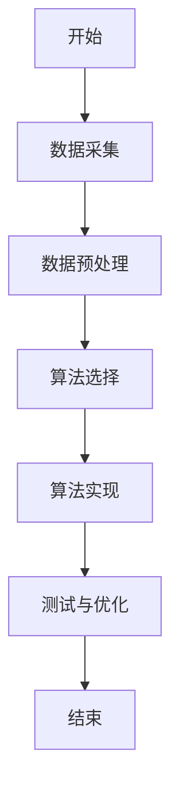

                 


# 《智能厨房置物架：AI Agent的调味品使用指导》

---

## 关键词
智能厨房置物架, AI Agent, 调味品管理, 人工智能, 物联网, 智能家居

---

## 摘要
本文探讨AI Agent在智能厨房置物架中的应用，重点分析AI Agent如何优化调味品的存储和使用。通过详细介绍AI Agent的核心原理、算法实现、系统架构以及实际应用案例，本文为读者提供全面的指导，帮助他们理解并实现智能化的调味品管理。

---

## 目录大纲

### 第一部分: 背景介绍

#### 第1章: 智能厨房置物架的背景介绍

##### 1.1 问题背景与目标
- 传统厨房置物架的局限性
- 智能厨房置物架的兴起
- AI Agent在调味品管理中的应用目标

##### 1.2 AI Agent的基本概念
- AI Agent的定义
- 智能厨房置物架中的AI Agent角色
- AI Agent的核心功能与优势

##### 1.3 本书的核心目标与结构
- 本书的核心目标
- 目录结构概览
- 读者对象与预期收获

### 第二部分: AI Agent的核心原理与实现

#### 第2章: AI Agent的核心概念与原理

##### 2.1 AI Agent的核心原理
- AI Agent的工作流程与逻辑
- 基于规则的AI Agent与基于学习的AI Agent对比
- AI Agent在调味品管理中的具体实现

##### 2.2 AI Agent的属性特征对比表
| 属性       | 基于规则的AI Agent | 基于学习的AI Agent |
|------------|---------------------|---------------------|
| 决策方式   | 预定义规则         | 数据驱动学习       |
| 灵活性     | 较低               | 较高               |
| 维护成本   | 较低               | 较高               |

##### 2.3 AI Agent的ER实体关系图
```mermaid
er
  entity 调味品 {
    id: int
    名称: string
    使用量: int
    过期日期: date
  }
  entity AI Agent {
    id: int
    状态: string
    当前任务: string
  }
  entity 交互记录 {
    id: int
    时间: datetime
    内容: string
  }
  relationship 管理 {
    调味品 --> AI Agent
    AI Agent --> 交互记录
  }
```

#### 第3章: AI Agent的算法原理

##### 3.1 算法原理概述
- 基于规则的AI Agent算法
- 基于学习的AI Agent算法
- 推荐算法的应用

##### 3.2 算法实现步骤
- 数据采集与预处理
- 算法选择与实现
- 系统集成与测试

##### 3.3 算法实现示例


##### 3.4 数学模型与公式
- 基于规则的AI Agent的逻辑条件
- 基于学习的AI Agent的概率计算
- 推荐算法的数学模型

### 第三部分: 系统分析与架构设计

#### 第4章: 系统分析与架构设计

##### 4.1 系统分析
- 问题场景介绍
- 系统功能需求
- 系统边界与外延

##### 4.2 系统架构设计
- 领域模型设计
- 系统架构图
- 系统交互流程图

##### 4.3 系统实现细节
- 数据流设计
- 模块划分与协作
- 接口设计与实现

#### 第5章: 项目实战

##### 5.1 环境安装与配置
- 开发环境搭建
- 依赖库安装
- 开发工具配置

##### 5.2 核心代码实现
- 数据采集模块
- 数据处理模块
- 算法实现模块
- 系统集成模块

##### 5.3 代码解读与分析
- 核心代码逐行解读
- 代码结构分析
- 代码优化建议

##### 5.4 实际案例分析
- 案例背景介绍
- 系统运行结果
- 案例总结与反思

### 第四部分: 总结与展望

#### 第6章: 总结与展望

##### 6.1 小结
- 本项目的核心成果
- AI Agent在调味品管理中的优势
- 项目实施的关键点

##### 6.2 注意事项
- 系统维护与更新
- 数据安全与隐私保护
- 系统兼容性问题

##### 6.3 拓展阅读
- AI Agent的其他应用场景
- 调味品管理的其他技术实现
- 智能家居的未来发展

---

## 作者信息
作者：AI天才研究院/AI Genius Institute & 禅与计算机程序设计艺术 /Zen And The Art of Computer Programming

