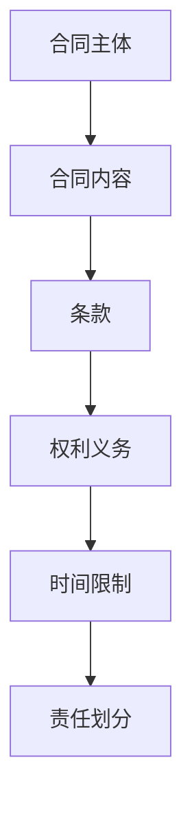
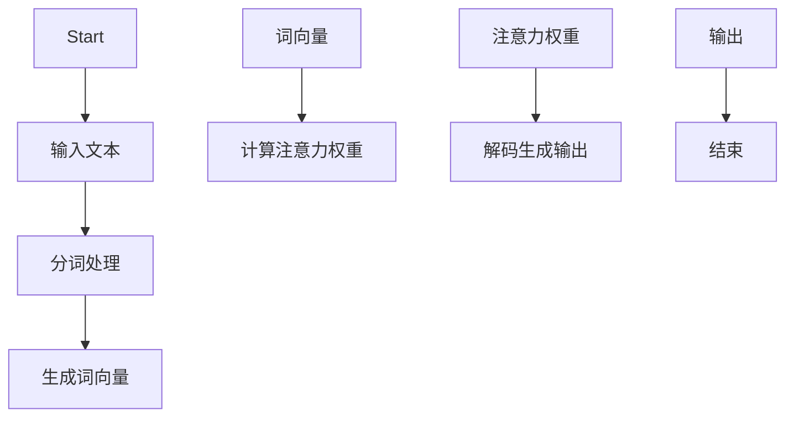

                 


# 《智能合同分析AI Agent：LLM在法律文本理解中的应用》

## 关键词：智能合同分析，LLM，法律文本理解，大语言模型，自然语言处理

## 摘要：本文详细探讨了如何利用大语言模型（LLM）进行智能合同分析，从背景介绍、核心概念、算法原理到系统设计和项目实战，全面解析了LLM在法律文本理解中的应用，展示了其在合同审查、条款匹配和风险评估中的巨大潜力。

---

## 第一部分：背景介绍

### 第1章：智能合同分析的背景与问题背景

#### 1.1 智能合同分析的背景

- **1.1.1 合同分析的现状与挑战**  
  合同分析是法律领域的重要任务，传统方法依赖人工审查，效率低且易出错。随着企业数字化转型，合同数量激增，人工处理成本高昂，亟需自动化解决方案。

- **1.1.2 大语言模型（LLM）的崛起与应用**  
  LLM如GPT-3、BERT等在自然语言处理领域的突破，为合同分析提供了强大的技术支持。LLM能够理解上下文，识别关键条款，提取实体信息，显著提升了合同分析的效率和准确性。

- **1.1.3 智能合同分析的定义与目标**  
  智能合同分析利用AI技术，自动化处理合同文本，提取关键信息，识别潜在风险，辅助法律专业人士快速理解合同内容，优化决策过程。

#### 1.2 问题背景与描述

- **1.2.1 合同分析的痛点**  
  合同内容复杂多样，条款繁多，人工审查耗时长，容易遗漏关键信息。此外，合同涉及的专业知识使得非专业人员难以准确理解。

- **1.2.2 LLM在合同分析中的优势**  
  LLM能够快速处理大量文本，识别模式和关系，提取实体信息，生成摘要，显著提高合同审查的效率和准确性。

- **1.2.3 智能合同分析的边界与外延**  
  智能合同分析不仅限于文本处理，还包括语义理解、风险评估等，未来可能扩展到合同生成和谈判辅助。

#### 1.3 核心概念与问题解决

- **1.3.1 LLM在合同分析中的核心作用**  
  LLM通过深度学习理解合同内容，辅助识别关键条款，如违约责任、履行期限等，帮助法律专业人士快速定位问题。

- **1.3.2 问题解决的思路与方法**  
  使用LLM进行合同分析，首先需要对文本进行预处理，提取关键词和实体，然后通过模型生成分析结果，最后进行结果验证和优化。

- **1.3.3 核心概念的结构与要素组成**  
  合同分析涉及合同结构、法律术语、条款分类等多个要素，构建合理的分析框架是关键。

---

## 第二部分：核心概念与联系

### 第2章：智能合同分析的核心概念

#### 2.1 核心概念的原理

- **2.1.1 合同结构与内容分析**  
  合同通常包括合同主体、权利义务、履行期限等部分，LLM能够识别这些结构并进行分类。

- **2.1.2 法律术语与语义理解**  
  法律术语的准确理解是合同分析的关键，LLM通过上下文推理，提升术语理解的准确性。

- **2.1.3 LLM在合同分析中的具体应用**  
  LLM可以用于合同分类、条款识别、风险评估等，帮助法律专业人士快速完成审查工作。

#### 2.2 核心概念的属性特征对比

- **2.2.1 合同分析的特征对比表**  
  | 特性 | 传统方法 | LLM方法 |
  |------|----------|---------|
  | 效率 | 低效 | 高效 |
  | 准确度 | 易出错 | 高准确度 |
  | 成本 | 高 | 低 |

- **2.2.2 LLM与其他文本分析方法的对比**  
  LLM在处理复杂语义和上下文关系方面具有显著优势，但对计算资源要求较高。

- **2.2.3 智能合同分析的优缺点分析**  
  优点：高效、准确、可扩展；缺点：依赖大量数据，模型解释性有限。

#### 2.3 实体关系图（ER图）



---

## 第三部分：算法原理讲解

### 第3章：大语言模型的算法原理

#### 3.1 LLM的基本原理

- **3.1.1 模型结构与训练过程**  
  LLM通常基于Transformer架构，通过自注意力机制处理输入文本，生成预测结果。

- **3.1.2 注意力机制与解码器**  
  注意力机制帮助模型关注重要部分，解码器生成输出文本。

- **3.1.3 模型的输入与输出过程**  
  输入：合同文本；输出：分析结果，如关键条款提取。

#### 3.2 算法流程图



#### 3.3 数学模型与公式

- **损失函数**：  
  $$ \mathcal{L} = -\sum_{i=1}^{n} \log P(w_i) $$

- **优化方法**：  
  使用Adam优化器，更新参数：  
  $$ \theta = \theta - \eta \frac{\partial \mathcal{L}}{\partial \theta} $$

- **注意力机制**：  
  $$ \text{Attention}(Q, K, V) = \text{softmax}\left(\frac{QK^T}{\sqrt{d_k}}\right)V $$

---

## 第四部分：系统分析与架构设计

### 第4章：智能合同分析系统的架构

#### 4.1 系统应用场景

- **合同审查**：快速识别潜在风险。
- **条款匹配**：自动匹配相似条款。
- **风险评估**：基于合同内容评估风险等级。

#### 4.2 系统功能设计

- **合同预处理**：分词、实体识别。
- **模型调用**：LLM分析合同内容。
- **结果解析**：输出分析结果，如关键条款摘要。

#### 4.3 系统架构图

```mermaid
graph LR
    Client --> API Gateway
    API Gateway --> Contract_Preprocessing
    Contract_Preprocessing --> LLM_Model
    LLM_Model --> Result_Parser
    Result_Parser --> Client
```

#### 4.4 系统交互图

```mermaid
graph LR
    Client --> API Gateway
    API Gateway --> Contract_Preprocessing
    Contract_Preprocessing --> LLM_Model
    LLM_Model --> Result_Parser
    Result_Parser --> API Gateway
    API Gateway --> Client
```

---

## 第五部分：项目实战

### 第5章：智能合同分析系统的实现

#### 5.1 环境安装

- 安装Python和相关库：  
  ```bash
  pip install transformers torch
  ```

#### 5.2 核心代码实现

```python
import torch
from transformers import AutoTokenizer, AutoModelForMaskLM

# 加载模型和分词器
model_name = "bert-large-uncased"
tokenizer = AutoTokenizer.from_pretrained(model_name)
model = AutoModelForMaskLM.from_pretrained(model_name)

# 合同文本预处理
def preprocess_contract(text):
    return tokenizer.tokenize(text)

# 模型推理
def analyze_contract(preprocessed_text):
    inputs = tokenizer(preprocessed_text, return_tensors="pt", padding=True, truncation=True)
    outputs = model(**inputs)
    return outputs
```

#### 5.3 案例分析

- **案例背景**：分析一份商业合同，提取关键条款。
- **分析过程**：预处理合同文本，调用LLM进行分析，生成结果摘要。
- **结果解读**：识别出违约责任、履行期限等关键条款，并生成风险评估报告。

#### 5.4 项目小结

- 通过项目实战，验证了LLM在合同分析中的有效性。
- 系统实现展示了从文本预处理到结果生成的完整流程。

---

## 第六部分：总结与展望

### 第6章：总结与未来展望

#### 6.1 全文总结

- 本文详细探讨了LLM在智能合同分析中的应用，从背景、算法到系统设计，全面展示了技术实现。

#### 6.2 未来展望

- **技术改进**：优化模型解释性，提升处理效率。
- **应用场景扩展**：从合同分析扩展到法律咨询、智能谈判等领域。
- **挑战与机遇**：数据隐私和模型解释性是未来需要解决的问题，而技术进步将带来更多可能性。

---

## 附录

- **附录A**：相关数据集链接
- **附录B**：工具安装与使用指南
- **附录C**：术语表

---

## 作者：AI天才研究院/AI Genius Institute & 禅与计算机程序设计艺术 /Zen And The Art of Computer Programming

