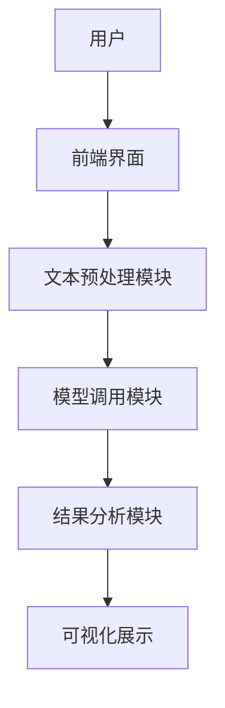

                 


# 智能合同审核 AI Agent：LLM 在法律文件处理中的应用

---

## 关键词：智能合同审核，LLM，法律文本处理，AI技术，合同合规性，自然语言处理，风险预警系统

---

## 摘要

随着人工智能技术的迅速发展，大语言模型（LLM）在法律文件处理中的应用日益广泛。智能合同审核AI Agent通过利用LLM的强大能力，能够高效、准确地处理复杂的法律文本，显著提升合同审核的效率和准确性。本文将从智能合同审核的背景与必要性出发，详细探讨LLM的核心原理、法律文本处理的挑战与解决方案，以及智能合同审核系统的架构设计与项目实战。通过对这些内容的深入分析，本文旨在为读者提供一个全面的技术视角，展示如何利用AI技术优化法律文件处理流程。

---

## 第一部分: 智能合同审核的背景与必要性

## 第1章: 智能合同审核的背景与问题描述

### 1.1 合同审核的背景与现状

#### 1.1.1 合同审核的基本概念

合同审核是法律服务中的核心环节，旨在确保合同的合规性、完整性和有效性。传统合同审核主要依赖人工操作，存在效率低、成本高、易出错等问题。

#### 1.1.2 传统合同审核的痛点与挑战

- **效率问题**：人工审核耗时长，尤其在处理大量合同或复杂条款时。
- **准确性问题**：人为疏忽可能导致遗漏关键条款或错误判断。
- **一致性问题**：不同律师的审核标准可能不一致，影响结果的可靠性。
- **成本问题**：需要大量专业人员参与，显著增加企业或组织的法律服务成本。

#### 1.1.3 智能化合同审核的必要性

通过引入AI技术，特别是大语言模型（LLM），可以实现合同审核的自动化、智能化，从而解决传统审核的痛点，提升效率和准确性。

---

### 1.2 LLM 在法律文件处理中的应用前景

#### 1.2.1 大语言模型（LLM）的基本概念

大语言模型（LLM）是一种基于深度学习的自然语言处理模型，具有强大的文本生成、理解和推理能力。其核心在于通过大量数据的训练，模型能够理解和生成人类语言。

#### 1.2.2 LLM 在法律领域的潜在应用

- **合同生成**：基于模板自动生成标准化合同。
- **合同审核**：快速识别合同中的关键条款、风险点和不合规内容。
- **法律咨询**：提供法律建议和解读。
- **案例分析**：辅助律师分析类似案例，提供参考。

#### 1.2.3 智能合同审核的核心价值

智能合同审核AI Agent通过LLM技术，能够实现合同的自动化审核，减少人为错误，提升审核效率，降低法律风险。

---

### 1.3 本章小结

本章介绍了智能合同审核的背景与必要性，分析了传统合同审核的痛点，并探讨了大语言模型（LLM）在法律文件处理中的潜在应用。通过智能化技术，合同审核流程将更加高效和可靠。

---

## 第二部分: 大语言模型（LLM）的核心原理

## 第2章: 大语言模型（LLM）的基本原理

### 2.1 LLM 的模型结构与特点

#### 2.1.1 深度学习模型的基本结构

大语言模型通常基于深度神经网络结构，包括编码器和解码器。编码器负责将输入文本转换为向量表示，解码器则根据向量生成输出文本。

#### 2.1.2 大语言模型的训练目标

模型通过大量真实文本的训练，学习语言的语法、语义和上下文关系。训练目标包括：

- **语言模型目标**：预测下一个词的概率分布。
- **预训练目标**：通过任务特定的预训练任务（如Masked Language Model）提升模型的通用性。

#### 2.1.3 模型的可解释性与局限性

- **可解释性**：目前LLM的决策过程仍较难解释。
- **局限性**：模型可能对训练数据中的偏差敏感，且在处理复杂法律文本时仍需人工干预。

---

### 2.2 LLM 的训练与推理机制

#### 2.2.1 基于转换器的模型结构

大语言模型通常采用转换器（Transformer）架构，包括编码层和解码层。编码层用于生成文本的向量表示，解码层用于生成输出。

#### 2.2.2 模型的训练过程与数学公式

训练过程中，模型通过优化损失函数来调整参数。损失函数通常采用交叉熵损失：

$$
\mathcal{L} = -\sum_{i=1}^{n} \log p(y_i | x_1, ..., x_{i-1})
$$

其中，$y_i$ 是第 $i$ 个词的标签，$x_i$ 是输入序列。

#### 2.2.3 模型的推理过程与实现方式

推理阶段，模型根据输入序列逐步生成输出文本。生成过程通常采用贪心算法或采样方法。

---

### 2.3 LLM 在法律文本处理中的优势

#### 2.3.1 法律文本的复杂性与特殊性

法律文本通常具有高度的专业性和复杂性，且涉及大量的术语和规则。

#### 2.3.2 LLM 在法律文本理解中的表现

大语言模型能够较好地理解法律文本的语义和上下文关系，尤其是在处理合同条款时表现突出。

#### 2.3.3 LLM 在合同审核中的应用潜力

通过LLM，可以实现合同条款的自动分类、风险评估和合规性检查。

---

### 2.4 本章小结

本章详细讲解了大语言模型的基本原理，包括模型结构、训练机制和推理过程。同时，分析了LLM在法律文本处理中的优势和应用潜力。

---

## 第三部分: 法律文本处理的挑战与解决方案

## 第3章: 法律文本处理的核心挑战

### 3.1 法律文本的复杂性

#### 3.1.1 法律术语的特殊性

法律术语具有高度的专业性和严格的定义，需要模型具备特定的法律知识库支持。

#### 3.1.2 文本结构的多样性

合同文本通常包含多个部分，如条款、声明、责任免除等，结构复杂。

#### 3.1.3 文本语义的模糊性

法律文本中的某些条款可能存在模糊性，需要结合上下文进行判断。

---

### 3.2 合同审核的典型问题

#### 3.2.1 合同条款的识别与分类

需要准确识别合同中的关键条款，如违约责任、保密条款等。

#### 3.2.2 合同风险的识别与评估

通过分析合同条款，识别潜在的法律风险，如不公平条款、不明确责任等。

#### 3.2.3 合同合规性的自动判断

根据相关法律法规，自动判断合同是否符合合规要求。

---

### 3.3 LLM 在法律文本处理中的解决方案

#### 3.3.1 基于LLM的文本理解框架

通过LLM对法律文本进行语义理解，识别关键条款和风险点。

#### 3.3.2 基于LLM的合同审核流程优化

利用LLM自动化处理合同审核流程，减少人工干预。

#### 3.3.3 基于LLM的合同风险预警系统

通过LLM实时分析合同内容，预警潜在法律风险。

---

### 3.4 本章小结

本章分析了法律文本处理的核心挑战，并提出了基于LLM的解决方案，为后续章节的系统设计奠定了基础。

---

## 第四部分: 智能合同审核系统的架构设计

## 第4章: 系统架构设计与实现

### 4.1 系统功能需求分析

#### 4.1.1 系统目标与范围

系统旨在实现合同的自动化审核，包括条款识别、风险评估和合规性检查。

#### 4.1.2 用户角色与权限

- **普通用户**：提交合同并查看审核结果。
- **管理员**：管理用户权限和系统设置。
- **法律专家**：对模型的输出进行校验和调整。

#### 4.1.3 系统核心功能模块

- 文本预处理模块
- 模型调用模块
- 结果分析与展示模块

---

### 4.2 系统功能设计

#### 4.2.1 文本预处理模块

- **文本清洗**：去除无关信息，提取关键内容。
- **分段处理**：将合同分成多个部分，便于模型处理。

#### 4.2.2 模型调用模块

- **模型选择**：根据任务选择合适的LLM模型。
- **参数调优**：调整模型参数以优化性能。

#### 4.2.3 结果分析与展示模块

- **结果解析**：将模型输出的分析结果进行结构化处理。
- **可视化展示**：以图表形式展示审核结果，便于用户理解。

---

### 4.3 系统架构设计

#### 4.3.1 系统整体架构图



#### 4.3.2 模块之间的交互关系

- 用户提交合同文本 → 前端界面接收并传递给文本预处理模块。
- 文本预处理模块处理后传递给模型调用模块。
- 模型调用模块返回结果给结果分析模块。
- 结果分析模块生成可视化展示内容。

#### 4.3.3 系统的可扩展性与维护性

系统设计注重模块化，便于后续功能扩展和维护。

---

### 4.4 本章小结

本章详细设计了智能合同审核系统的架构，包括功能模块划分、交互流程和系统架构图。为后续的项目实战奠定了基础。

---

## 第五部分: 项目实战与案例分析

## 第5章: 项目实战：智能合同审核系统的实现

### 5.1 项目环境搭建

#### 5.1.1 开发工具与依赖安装

- 开发工具：Python、Jupyter Notebook。
- 依赖库：Hugging Face Transformers库、Flask框架。

#### 5.1.2 数据集准备与预处理

- 数据来源：收集一批标准合同文本，进行清洗和标注。
- 数据预处理：文本分段、去除无关信息。

#### 5.1.3 模型选择与部署

选择开源的LLM模型（如GPT-2）进行微调，并部署到本地服务器。

---

### 5.2 代码实现与解读

#### 5.2.1 文本预处理代码

```python
import re

def preprocess_contract(text):
    # 去除特殊字符
    text = re.sub(r'[^\w\s]', '', text)
    # 分段处理
    paragraphs = text.split('\n')
    return paragraphs
```

#### 5.2.2 模型调用代码

```python
from transformers import GPT2LMHeadModel, GPT2Tokenizer

model_name = 'gpt2'
tokenizer = GPT2Tokenizer.from_pretrained(model_name)
model = GPT2LMHeadModel.from_pretrained(model_name)

def analyze_contract(paragraphs):
    inputs = tokenizer("\n".join(paragraphs), return_tensors='np')
    outputs = model.generate(inputs.input_ids)
    return tokenizer.decode(outputs[0])
```

#### 5.2.3 结果分析与展示代码

```python
def display_results(results):
    print("合同条款分析结果：")
    print(results)
```

---

### 5.3 案例分析与详细讲解

#### 5.3.1 案例背景

某企业需要审核一份复杂的商业合同，涉及多个条款和法律风险点。

#### 5.3.2 系统输入与处理

用户上传合同文本，系统进行预处理后调用LLM模型进行分析。

#### 5.3.3 分析结果与解读

系统输出合同中的关键条款和潜在风险点，并生成可视化报告。

---

### 5.4 本章小结

本章通过实际项目案例，详细讲解了智能合同审核系统的实现过程，包括环境搭建、代码实现和案例分析。

---

## 第六部分: 总结与展望

## 第6章: 总结与未来展望

### 6.1 本章总结

本文详细探讨了智能合同审核AI Agent的应用，从背景到技术实现，全面分析了LLM在法律文本处理中的潜力和挑战。

### 6.2 未来展望

未来，随着LLM技术的不断进步，智能合同审核将更加智能化和自动化。同时，结合区块链和法律知识图谱等技术，将进一步提升系统的可靠性和扩展性。

---

## 作者：AI天才研究院/AI Genius Institute & 禅与计算机程序设计艺术 /Zen And The Art of Computer Programming

