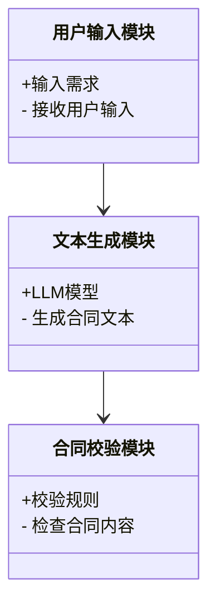
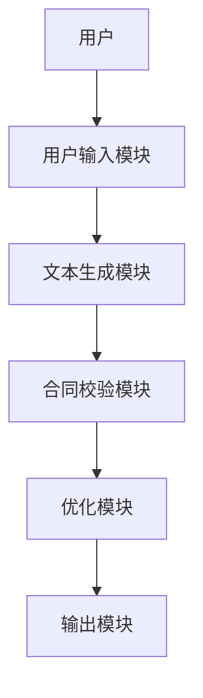
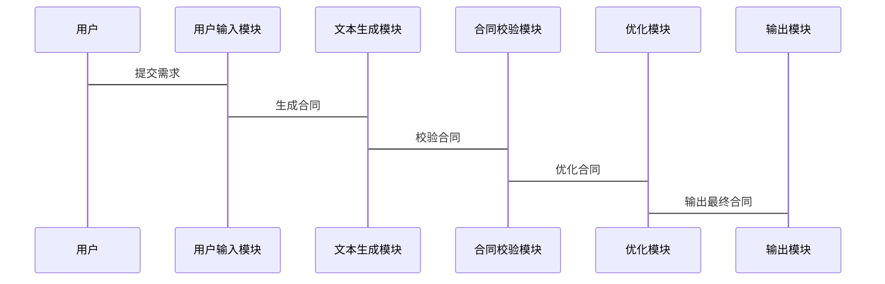

                 


# 智能合同生成AI Agent：LLM在法律文书撰写中的应用

> 关键词：智能合同生成、LLM、大语言模型、法律文书、AI Agent

> 摘要：本文深入探讨了智能合同生成AI Agent在法律文书撰写中的应用，分析了大语言模型（LLM）在合同生成中的优势与挑战，详细讲解了LLM的算法原理、系统架构设计以及实际案例，为读者提供了全面的技术视角。

---

# 第一部分: 智能合同生成AI Agent概述

## 第1章: 智能合同生成的背景与现状

### 1.1 智能合同生成的背景

#### 1.1.1 合同生成的痛点与挑战
传统的合同生成过程依赖于人工操作，存在效率低、成本高、易出错等问题。随着企业对高效法律服务的需求增加，传统的法律文书撰写方式已无法满足市场需求。此外，合同生成的标准化和个性化需求矛盾日益突出，亟需智能化解决方案。

#### 1.1.2 大语言模型的崛起
近年来，大语言模型（LLM）在自然语言处理领域取得了突破性进展，如GPT系列模型。这些模型具有强大的文本生成能力，能够理解上下文并生成符合语法规则的文本。LLM的出现为智能合同生成提供了技术基础。

#### 1.1.3 法律文书自动化的趋势
法律行业对自动化工具的需求日益增长，智能合同生成作为法律服务的重要组成部分，正在逐步取代传统的人工撰写方式。通过AI技术，企业可以快速生成标准化合同，降低法律服务成本，提高效率。

---

### 1.2 LLM在法律文书中的应用

#### 1.2.1 LLM的基本概念
大语言模型（LLM）是一种基于深度学习的自然语言处理模型，具有强大的文本生成、理解和推理能力。LLM的核心在于其训练数据和模型结构，能够通过大量数据学习语言的规律和语义信息。

#### 1.2.2 LLM在法律文书中的优势
LLM在法律文书撰写中的优势主要体现在以下几点：
1. **快速生成**：LLM可以在短时间内生成大量法律文本，显著提高工作效率。
2. **高准确性**：通过训练大量法律文档，LLM能够生成符合法律规范的文本。
3. **灵活性**：LLM可以根据不同的需求生成定制化的法律文书，满足个性化需求。

#### 1.2.3 智能合同生成的可行性分析
智能合同生成的可行性主要体现在技术成熟度和市场需求两个方面。LLM技术的不断进步为智能合同生成提供了可靠的技术支持，而企业对高效法律服务的需求则为智能合同生成的应用提供了广阔的市场空间。

---

### 1.3 本章小结
本章从背景和现状两个方面介绍了智能合同生成AI Agent的背景，分析了LLM在法律文书中的应用优势，并对智能合同生成的可行性进行了分析。这些内容为后续章节的深入探讨奠定了基础。

---

# 第二部分: 智能合同生成AI Agent的核心概念

## 第2章: 智能合同生成AI Agent的原理与机制

### 2.1 LLM的工作原理

#### 2.1.1 Transformer模型的结构
LLM的核心模型通常是基于Transformer架构。Transformer模型由编码器和解码器两部分组成，编码器负责将输入文本转化为语义向量，解码器则根据编码器的输出生成目标文本。

#### 2.1.2 注意力机制的实现
注意力机制是Transformer模型的核心，它通过计算输入文本中每个词与其他词的相关性，确定每个词在生成输出时的重要性。这种机制使得模型能够更好地理解上下文关系。

#### 2.1.3 梯度下降与优化算法
在训练过程中，模型通过最小化损失函数来优化参数。常用的优化算法包括随机梯度下降（SGD）、Adam优化器等。这些算法帮助模型在训练过程中找到最优参数，提高生成文本的质量。

---

### 2.2 法律知识库的构建

#### 2.2.1 知识库的设计与存储
法律知识库是智能合同生成的重要基础。知识库的设计需要考虑法律术语的规范性、法律条文的完整性以及数据的结构化存储。常见的存储方式包括关系型数据库和知识图谱。

#### 2.2.2 数据清洗与预处理
在构建法律知识库时，需要对数据进行清洗和预处理。数据清洗包括去除噪声数据、处理重复数据等。预处理步骤包括分词、停用词处理等，以提高模型的训练效果。

#### 2.2.3 知识库的更新与维护
法律知识库需要定期更新，以保持内容的准确性和时效性。知识库的更新可以通过自动化工具和人工审核相结合的方式进行。

---

### 2.3 智能合同生成的流程

#### 2.3.1 用户需求的解析
智能合同生成的第一步是解析用户的需求。用户可能需要生成不同类型和用途的合同，因此系统需要能够准确理解用户的需求。

#### 2.3.2 文本生成的实现
基于用户的需求解析，系统会调用LLM生成相应的合同文本。生成过程中，模型会根据训练数据和当前输入生成符合要求的文本。

#### 2.3.3 合同的校验与优化
生成的合同文本需要经过校验和优化。校验过程包括语法校验、法律条文的合规性检查等。优化过程则包括对文本的润色和调整，以提高合同的可读性和法律效力。

---

## 第3章: LLM与法律知识的结合

### 3.1 LLM的法律适应性

#### 3.1.1 法律文本的特点
法律文本具有高度的专业性和规范性，通常包含大量术语和复杂的逻辑结构。这些特点使得LLM在处理法律文本时需要特别注意。

#### 3.1.2 LLM在法律领域的局限性
尽管LLM在文本生成方面表现优异，但在处理法律问题时仍存在一些局限性，如对特定法律领域的理解不足、生成文本的法律合规性难以保证等。

#### 3.1.3 提升LLM法律适应性的方法
为了提高LLM在法律领域的适应性，可以通过以下方法：
1. **领域微调**：对LLM进行特定领域的微调，使其更好地适应法律文本的生成。
2. **知识增强**：结合法律知识库，增强模型对法律术语和条文的理解。
3. **人机协作**：通过人机协作模式，充分发挥人类法律专家的作用，弥补LLM的不足。

---

### 3.2 法律知识图谱的构建

#### 3.2.1 知识图谱的定义与作用
知识图谱是一种以图结构形式表示知识的工具，能够将法律术语、法律条文等信息以结构化的方式存储和展示。

#### 3.2.2 知识图谱的构建流程
知识图谱的构建流程包括数据收集、数据清洗、实体识别、关系抽取、知识融合和知识存储等步骤。这些步骤需要结合自然语言处理技术和人工审核。

#### 3.2.3 知识图谱的可视化
知识图谱的可视化可以通过图表的形式展示法律术语和条文之间的关系，帮助用户更好地理解和使用法律知识。

---

### 3.3 智能合同生成的逻辑推理

#### 3.3.1 逻辑推理的基本原理
逻辑推理是智能合同生成的重要组成部分。通过逻辑推理，模型可以根据已有的法律条文和用户需求生成符合逻辑的合同文本。

#### 3.3.2 基于知识图谱的推理
基于知识图谱的推理是一种常见的逻辑推理方法。通过知识图谱中的实体和关系，模型可以推导出新的法律条文或合同条款。

#### 3.3.3 推理结果的验证与优化
推理结果的验证和优化是确保合同生成质量的重要步骤。验证过程包括语法验证、法律合规性验证等，优化过程包括对推理结果的调整和优化。

---

## 第4章: 智能合同生成AI Agent的核心算法

### 4.1 基于LLM的文本生成算法

#### 4.1.1 概率生成模型
概率生成模型是一种基于概率分布的生成模型。通过计算每个词的概率分布，模型可以生成符合语法规则的文本。

#### 4.1.2 基于Transformer的生成网络
基于Transformer的生成网络是一种常用的文本生成算法。通过编码器和解码器的结合，模型可以生成高质量的文本。

#### 4.1.3 模型训练的数学公式
文本生成的训练过程可以通过以下公式表示：
$$ L = \text{loss}(y, y_{\text{pred}}) $$
其中，$L$表示损失函数，$y$表示真实标签，$y_{\text{pred}}$表示预测标签。

---

### 4.2 法律知识库的检索算法

#### 4.2.1 基于向量的检索方法
基于向量的检索方法是一种常见的知识库检索方法。通过将文本转化为向量表示，模型可以快速找到与查询相关的文本。

#### 4.2.2 基于关键词的检索方法
基于关键词的检索方法是一种简单有效的检索方法。通过匹配查询中的关键词，模型可以快速找到相关的法律条文。

#### 4.2.3 深度学习检索模型
深度学习检索模型是一种先进的检索方法。通过训练深度学习模型，模型可以更好地理解查询和文本的语义关系，提高检索的准确率。

---

### 4.3 合同校验与优化算法

#### 4.3.1 基于规则的校验算法
基于规则的校验算法是一种常用的校验方法。通过预定义的规则，模型可以检查合同文本的语法和格式是否符合要求。

#### 4.3.2 基于LLM的校验算法
基于LLM的校验算法是一种先进的校验方法。通过调用LLM模型，模型可以生成校验结果，并提供优化建议。

#### 4.3.3 多模态校验方法
多模态校验方法是一种综合性的校验方法。通过结合多种校验方法，模型可以全面检查合同文本的质量，确保其符合法律规范。

---

# 第三部分: 智能合同生成AI Agent的系统架构与实现

## 第5章: 智能合同生成系统的功能设计

### 5.1 系统功能模块划分

#### 5.1.1 用户需求输入模块
用户需求输入模块是系统的核心模块之一。该模块负责接收用户的输入需求，并将其转化为系统的操作指令。

#### 5.1.2 文本生成模块
文本生成模块是系统的关键模块。该模块负责根据用户需求生成相应的合同文本。生成过程可以通过调用LLM模型实现。

#### 5.1.3 合同校验与优化模块
合同校验与优化模块负责对生成的合同文本进行校验和优化。校验过程包括语法校验和法律合规性校验，优化过程包括对文本的润色和调整。

---

### 5.2 系统功能设计的类图



---

## 第6章: 系统架构设计

### 6.1 系统架构的总体设计

#### 6.1.1 系统架构图


---

### 6.2 系统接口设计

#### 6.2.1 接口描述
系统接口主要分为用户输入接口、文本生成接口和合同校验接口。用户输入接口负责接收用户的输入需求，文本生成接口负责生成合同文本，合同校验接口负责校验生成的文本。

---

### 6.3 系统交互流程

#### 6.3.1 交互流程图


---

# 第四部分: 项目实战

## 第7章: 智能合同生成系统实战

### 7.1 项目环境安装

#### 7.1.1 安装Python
```bash
# 安装Python
sudo apt-get install python3
```

#### 7.1.2 安装必要的库
```bash
pip install numpy
pip install transformers
pip install torch
```

---

### 7.2 系统核心代码实现

#### 7.2.1 用户输入模块
```python
def get_user_input():
    return input("请输入您的需求描述：")
```

#### 7.2.2 文本生成模块
```python
from transformers import AutoModelForCausalLM, AutoTokenizer

def generate_contract(text):
    model = AutoModelForCausalLM.from_pretrained("gpt2")
    tokenizer = AutoTokenizer.from_pretrained("gpt2")
    inputs = tokenizer(text, return_tensors="np")
    outputs = model.generate(inputs.input_ids, max_length=500)
    return tokenizer.decode(outputs[0], skip_special_tokens=True)
```

#### 7.2.3 合同校验模块
```python
def validate_contract(text):
    # 简单的语法校验
    import nltk
    from nltk.tokenize import sent_tokenize
    sentences = sent_tokenize(text)
    return len(sentences) > 0
```

---

### 7.3 实际案例分析

#### 7.3.1 案例背景
假设用户需要生成一份商业合作协议，系统将根据用户输入的需求生成相应的合同文本。

#### 7.3.2 代码实现
```python
user_input = get_user_input()
generated_text = generate_contract(user_input)
if validate_contract(generated_text):
    print("合同生成成功：")
    print(generated_text)
else:
    print("合同生成失败，请重新输入需求。")
```

---

## 第8章: 总结与扩展

### 8.1 总结

智能合同生成AI Agent通过结合大语言模型和法律知识库，显著提高了合同生成的效率和质量。LLM的文本生成能力和法律知识库的支持，使得智能合同生成系统能够满足多样化的法律需求。

---

### 8.2 最佳实践 Tips

1. 在实际应用中，建议结合人工审核，确保生成合同的法律合规性。
2. 定期更新法律知识库，保持知识的准确性和时效性。
3. 在处理复杂法律问题时，建议采用人机协作模式，充分发挥人类专家的作用。

---

### 8.3 未来展望

随着大语言模型技术的不断进步，智能合同生成系统将更加智能化和自动化。未来，可以通过以下方式进一步优化系统：
1. 引入多模态数据，如图像和音频，提高合同生成的多样性和便捷性。
2. 结合法律推理技术，增强合同生成的逻辑性和合规性。
3. 探索区块链技术的应用，提高合同的安全性和可信度。

---

作者：AI天才研究院/AI Genius Institute & 禅与计算机程序设计艺术/Zen And The Art of Computer Programming

---

通过以上内容，我们全面介绍了智能合同生成AI Agent的背景、核心概念、系统架构以及实际应用。希望读者能够通过本文深入了解LLM在法律文书撰写中的应用，并为未来的实践提供有价值的参考。

