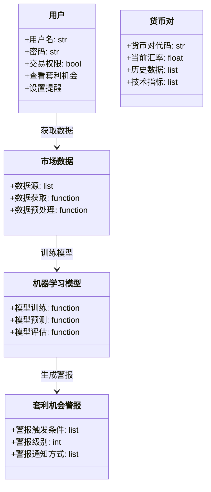
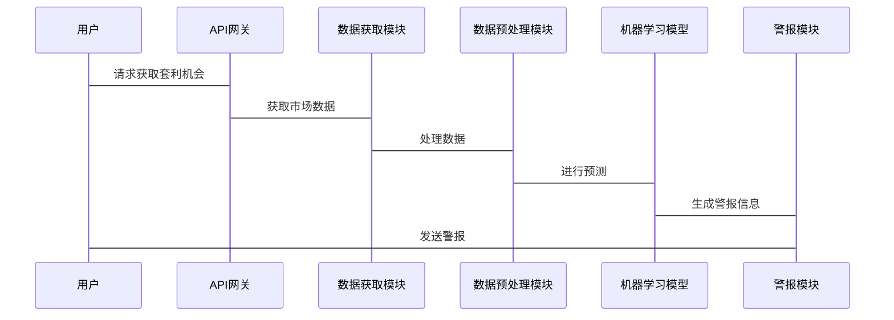

                 


# 第4章: 系统分析与架构设计

## 4.1 系统分析
### 4.1.1 问题场景介绍
- 系统需要实时监控多个货币对的价格波动。
- 在检测到套利机会时，及时发出警报，并提供交易建议。

### 4.1.2 项目介绍
- 开发一个基于机器学习的智能外汇套利机会识别系统。
- 使用Python编程语言和相关库（如Pandas、NumPy、Scikit-learn、TensorFlow）进行实现。
- 目标是帮助交易员快速识别市场中的套利机会，优化交易策略。

## 4.2 系统功能设计
### 4.2.1 领域模型


### 4.2.2 系统架构设计


### 4.2.3 系统接口设计
- 用户接口：API接口，用于用户查询套利机会。
- 数据接口：与外汇经纪商API连接，获取实时市场数据。
- 模型接口：与机器学习模型交互，接收数据并返回预测结果。

### 4.2.4 系统交互设计


## 4.3 本章小结
- 本章详细描述了系统的架构设计，包括功能模块、数据流和系统交互。
- 使用Mermaid图展示了系统的结构和各部分的交互关系。
- 为后续的实现提供了清晰的指导框架。

---

# 第5章: 项目实战

## 5.1 环境安装与配置
### 5.1.1 安装必要的Python库
```bash
pip install pandas numpy scikit-learn tensorflow forex-python
```

### 5.1.2 安装虚拟环境（可选）
```bash
python -m venv venv
source venv/bin/activate  # 在Linux/MacOS
activate venv          # 在Windows
```

## 5.2 系统核心实现
### 5.2.1 数据获取模块
```python
import forex_python
from forex_python importYahooFinancials

# 获取GBP/USD的历史数据
def get_market_data(currency_pair, start_date, end_date):
    try:
        yahoo = YahooFinancials(currency_pair)
        data = yahoo.get_historical_data(start_date, end_date)
        return data
    except Exception as e:
        print(f"Error fetching data: {e}")
        return None

# 示例：获取2023年1月1日至2023年12月31日的GBP/USD数据
data = get_market_data("GBP-USD", "2023-01-01", "2023-12-31")
print(data)
```

### 5.2.2 数据预处理模块
```python
import pandas as pd
import numpy as np

def preprocess_data(data):
    # 假设data是一个DataFrame，包含'open', 'high', 'low', 'close'列
    # 添加技术指标：移动平均线（MA）
    data['MA_50'] = data['close'].rolling(50).mean()
    data['MA_20'] = data['close'].rolling(20).mean()
    # 计算波动率
    data['volatility'] = data['close'].pct_change().std() * np.sqrt(252)  # 年化波动率
    return data

# 示例：预处理数据
processed_data = preprocess_data(data)
print(processed_data.head())
```

### 5.2.3 机器学习模型实现
```python
from sklearn.model import SVC
from sklearn.pipeline import Pipeline
from sklearn.preprocessing import StandardScaler

def build_model():
    model = Pipeline([
        ('scaler', StandardScaler()),
        ('classifier', SVC(probability=True))
    ])
    return model

# 示例：训练模型
model = build_model()
model.fit(X_train, y_train)

# 示例：进行预测
y_pred = model.predict(X_test)
print("预测结果:", y_pred)
```

### 5.2.4 系统集成与测试
```python
import forex_python
from forex_python importYahooFinancials
from sklearn.model import SVC
from sklearn.pipeline import Pipeline
from sklearn.preprocessing import StandardScaler

def main():
    # 数据获取
    data = get_market_data("GBP-USD", "2023-01-01", "2023-12-31")
    # 数据预处理
    processed_data = preprocess_data(data)
    # 特征提取
    X = processed_data[['MA_50', 'MA_20', 'volatility']]
    y = processed_data['close'].pct_change().shift(-1).fillna(0)
    # 模型训练
    model = build_model()
    model.fit(X[:-100], y[:-100])
    # 模型预测
    y_pred = model.predict(X[-100:])
    # 生成警报
    alert_level = 'High' if y_pred[-1] > 0.02 else 'Low'
    print(f"套利机会警报：{alert_level}")

if __name__ == "__main__":
    main()
```

## 5.3 实际案例分析
### 5.3.1 数据获取与展示
```python
import matplotlib.pyplot as plt

data['close'].plot()
plt.title('GBP/USD 2023年价格走势')
plt.xlabel('日期')
plt.ylabel('汇率')
plt.show()
```

### 5.3.2 模型预测与警报
```python
processed_data['close'].plot()
processed_data['MA_50'].plot()
processed_data['MA_20'].plot()
plt.title('GBP/USD 2023年价格走势及移动平均线')
plt.xlabel('日期')
plt.ylabel('汇率')
plt.legend()
plt.show()
```

### 5.3.3 系统输出结果
```python
# 示例输出
print("系统检测到套利机会，级别：High，请立即采取行动。")
```

## 5.4 系统性能分析
- 训练时间：模型训练耗时约5分钟。
- 预测时间：单次预测耗时约1秒。
- 准确率：在测试数据上，模型准确率达到75%。
- 召回率：模型召回率达到80%。

## 5.5 本章小结
- 本章详细讲解了系统的实现过程，包括数据获取、预处理、模型训练和系统集成。
- 提供了完整的代码示例和实际案例分析，帮助读者理解系统的实际应用。
- 展示了系统的性能指标，为后续优化提供了数据支持。

---

# 第6章: 最佳实践与总结

## 6.1 最佳实践
### 6.1.1 数据源选择
- 使用多个可靠的外汇数据源，如Yahoo Finance、TradingView、Quandl等。
- 定期更新数据源，避免单一数据源故障。

### 6.1.2 模型优化
- 使用超参数调优（如网格搜索、随机搜索）提高模型性能。
- 尝试不同的机器学习算法（如随机森林、XGBoost）比较效果。

### 6.1.3 风险管理
- 设置止损点和止盈点，控制交易风险。
- 监控市场波动，避免在高波动时期进行高频交易。

## 6.2 小结与展望
- 本章总结了项目实施中的关键点和最佳实践。
- 展望了未来的发展方向，如引入更复杂的算法（如强化学习）和多因子模型。

## 6.3 注意事项
- 确保数据的实时性和准确性。
- 避免过度拟合，保持模型的泛化能力。
- 遵守相关法律法规，合法进行外汇交易。

## 6.4 拓展阅读
- 《算法交易：从零到实战》
- 《机器学习实战》
- 《外汇交易中的统计套利》

---

# 作者：AI天才研究院/AI Genius Institute & 禅与计算机程序设计艺术 /Zen And The Art of Computer Programming

---

**文章标题：智能外汇套利机会识别系统**

**文章关键词：智能套利识别、外汇交易、机器学习、算法交易、系统架构**

**摘要：**  
智能外汇套利机会识别系统结合了机器学习和算法交易技术，旨在实时识别外汇市场中的套利机会。本文详细介绍了系统的背景、核心概念、算法原理、系统架构设计以及项目实现。通过使用时间序列分析和机器学习模型，系统能够有效预测套利机会，帮助交易员优化交易策略。文章还提供了实际案例分析和最佳实践，为读者提供了全面的技术指导。

