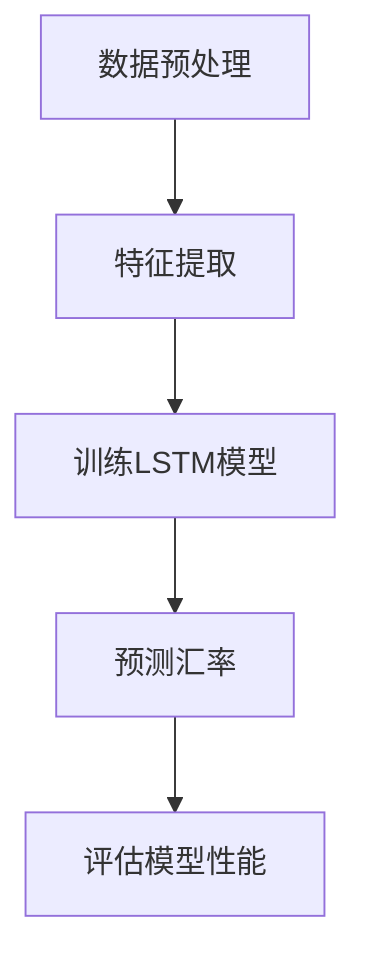
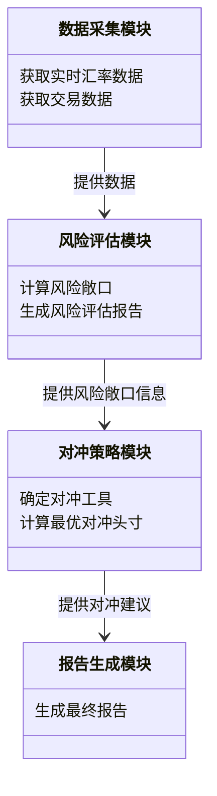
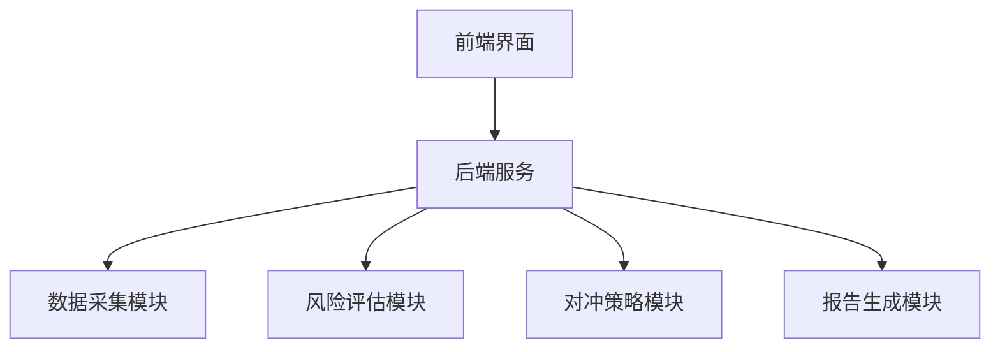
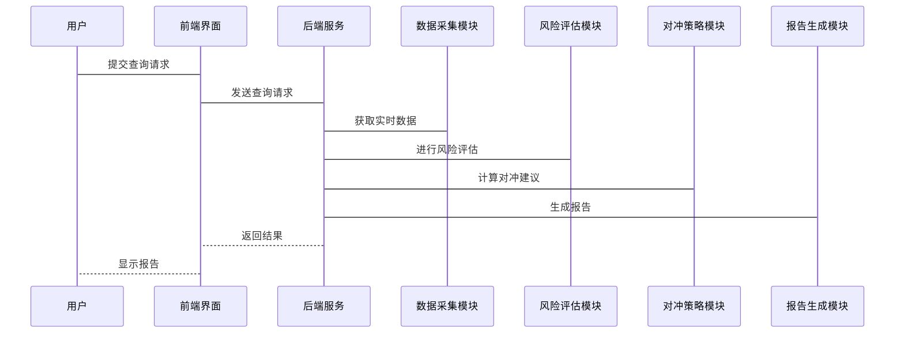

                 


# 智能外汇风险敞口管理系统

> 关键词：外汇风险管理，智能系统，时间序列分析，机器学习，系统架构，项目实战

> 摘要：本文详细探讨了智能外汇风险敞口管理系统的构建与实现，从背景与核心概念、算法原理、系统架构设计到项目实战，结合实际案例和代码示例，全面解析系统的设计思路与技术实现。

---

## 第一部分: 智能外汇风险敞口管理系统的背景与核心概念

### 第1章: 外汇风险敞口管理的背景与问题描述

#### 1.1 外汇风险敞口的基本概念

##### 1.1.1 外汇风险的定义与分类
外汇风险是指由于汇率波动导致的资产损失或收益变化的风险。常见的外汇风险类型包括：
- **交易风险**：因未来交易的结算时的汇率变化而产生的风险。
- **折算风险**：因资产负债表中的外币项目在转换为本币时产生的风险。
- **经济风险**：因汇率变化对企业整体财务状况的影响。

##### 1.1.2 风险敞口的形成机制
风险敞口的形成通常与企业的跨国贸易、外币投资和借贷活动密切相关。企业通过进口、出口、对外投资等活动，形成了对汇率波动敏感的资产或负债头寸。

##### 1.1.3 外汇市场波动对企业的影响
外汇市场的波动可能直接影响企业的利润、资产价值和财务稳定性。例如，一家出口型企业如果因汇率波动导致出口收入减少，可能面临利润下降甚至亏损的风险。

#### 1.2 外汇风险敞口管理的重要性

##### 1.2.1 企业财务管理的需求
企业需要通过有效的外汇风险管理，降低汇率波动对财务状况的影响，确保稳健经营。

##### 1.2.2 全球化背景下的风险管理挑战
随着全球经济一体化的深入，企业面临的外汇风险更加复杂和多样化。传统的静态管理方法已难以应对动态的市场变化。

##### 1.2.3 智能化管理的必要性
传统的外汇风险管理依赖人工分析和经验判断，效率低下且容易受主观因素影响。智能化管理能够通过大数据分析和机器学习算法，实时捕捉市场波动，提高风险管理的准确性和效率。

#### 1.3 问题背景与目标

##### 1.3.1 当前外汇风险管理的痛点
- 数据来源分散，难以实时获取和处理。
- 风险评估模型单一，缺乏动态调整能力。
- 缺乏智能化工具，难以应对复杂多变的市场环境。

##### 1.3.2 智能化管理的解决方案
通过构建智能外汇风险敞口管理系统，整合多源数据，构建动态风险评估模型，实现智能化、实时化的风险管理。

##### 1.3.3 系统边界与外延
系统的边界包括数据输入、模型计算和结果输出三个部分。外延则包括与企业财务系统、交易系统的无缝对接。

---

### 第2章: 智能外汇风险敞口管理的核心概念

#### 2.1 智能外汇风险敞口管理的定义

##### 2.1.1 系统的核心目标
通过智能化算法，实时监控和评估外汇风险敞口，提供风险预警和最优对冲策略。

##### 2.1.2 智能化管理的特点
- 数据驱动：基于实时数据和历史数据分析。
- 模型动态调整：根据市场变化自动优化风险评估模型。
- 实时性：提供实时风险评估和对冲建议。

#### 2.2 核心概念的属性特征对比

| 特性       | 传统风险管理 | 智能化风险管理 |
|------------|--------------|----------------|
| 数据来源   | 单一，依赖历史数据 | 多源，实时数据采集 |
| 分析方法   | 统计分析为主 | 统计分析+机器学习 |
| 响应时间   | 周期性评估 | 实时评估 |
| 精准度     | 较低 | 较高 |

#### 2.3 ER实体关系图

```mermaid
erDiagram
    customer[客户] {
        id : integer
        name : string
        account : string
    }
    transaction[交易] {
        id : integer
        amount : float
        currency : string
        date : datetime
    }
    risk_assessment[风险评估] {
        id : integer
        risk_level : integer
        assessment_date : datetime
    }
    customer --> transaction : 发起的交易
    transaction --> risk_assessment : 生成的风险评估
```

---

## 第二部分: 智能外汇风险敞口管理系统的算法原理

### 第3章: 时间序列分析与外汇预测算法

#### 3.1 时间序列分析的基本原理

##### 3.1.1 时间序列的特征分解
时间序列通常具有趋势性、周期性和随机性。通过分解这些特征，可以更好地理解数据的波动规律。

##### 3.1.2 常见的时间序列模型
- **ARIMA模型**：自回归积分滑动平均模型，适用于线性时间序列预测。
- **GARCH模型**：广义自回归条件异方差模型，适用于波动率预测。

##### 3.1.3 外汇价格预测的数学模型
$$ ARIMA(p, d, q) $$
其中，p为自回归阶数，d为差分阶数，q为滑动平均阶数。

#### 3.2 基于机器学习的外汇价格预测

##### 3.2.1 机器学习模型的选择
常用的模型包括随机森林、支持向量机（SVM）和长短期记忆网络（LSTM）。

##### 3.2.2 LSTM网络的实现流程


##### 3.2.3 LSTM网络的代码实现
```python
import numpy as np
from tensorflow.keras.models import Sequential
from tensorflow.keras.layers import LSTM, Dense

# 数据预处理
data = ...  # 输入数据

# 模型构建
model = Sequential()
model.add(LSTM(64, input_shape=(timesteps, features)))
model.add(Dense(1))
model.compile(optimizer='adam', loss='mean_squared_error')

# 训练
model.fit(X_train, y_train, epochs=100, batch_size=32)
```

---

### 第4章: 风险评估与对冲策略

#### 4.1 风险评估模型

##### 4.1.1 风险敞口的量化方法
$$ 风险敞口 = \sum_{i=1}^{n} (金额_i \times 汇率_i) $$

##### 4.1.2 风险评估模型的选择
常用的模型包括VaR（在险价值）和CVaR（条件在险价值）。

#### 4.2 对冲策略的优化

##### 4.2.1 对冲工具的选择
常用的对冲工具包括远期合约、期权和掉期交易。

##### 4.2.2 对冲策略的动态调整
通过实时监控市场波动，动态调整对冲头寸，确保风险敞口始终在可控范围内。

---

## 第三部分: 系统分析与架构设计

### 第5章: 系统分析与架构设计

#### 5.1 项目背景

##### 5.1.1 项目目标
构建一个智能化的外汇风险敞口管理系统，实现风险的实时监控和动态管理。

##### 5.1.2 项目范围
系统将整合实时汇率数据、交易数据和市场分析报告，提供风险评估和对冲建议。

#### 5.2 系统功能设计

##### 5.2.1 功能模块划分
- 数据采集模块
- 风险评估模块
- 对冲策略模块
- 报告生成模块

##### 5.2.2 领域模型类图


#### 5.3 系统架构设计

##### 5.3.1 系统架构图


##### 5.3.2 接口设计
- 数据接口：提供API用于实时数据的获取和传输。
- 用户接口：提供友好的人机交互界面，方便用户操作和查看报告。

#### 5.4 系统交互流程图


---

## 第四部分: 项目实战

### 第6章: 项目实战

#### 6.1 环境安装

##### 6.1.1 系统需求
- 操作系统：Windows/Mac/Linux
- Python版本：3.6+
- 必需的库：numpy、pandas、tensorflow、matplotlib

##### 6.1.2 安装步骤
```bash
pip install numpy pandas tensorflow matplotlib
```

#### 6.2 核心代码实现

##### 6.2.1 数据采集模块
```python
import requests
import json

def get_realtime_data(currency):
    url = f"https://api.exchangerate-api.com/v2/latest/{currency}"
    response = requests.get(url)
    data = json.loads(response.text)
    return data['rates']
```

##### 6.2.2 风险评估模块
```python
from tensorflow.keras.models import load_model

model = load_model('risk_assessment_model.h5')
predictions = model.predict(X_test)
```

##### 6.2.3 对冲策略模块
```python
def calculate_hedge(position, model_predictions):
    hedge_ratio = model_predictions[0]
    return position * hedge_ratio
```

#### 6.3 代码应用解读与分析

##### 6.3.1 数据预处理
对采集到的汇率数据进行清洗和特征工程处理，例如归一化、滑动窗口生成序列数据。

##### 6.3.2 模型训练与评估
使用训练好的LSTM模型进行预测，并评估模型的准确性和稳定性。

##### 6.3.3 实际案例分析
以某企业的进出口交易为例，展示系统如何实时监控风险敞口，并提供对冲建议。

#### 6.4 项目小结
通过实际案例的分析，验证系统的有效性和实用性，总结经验教训，为后续优化提供参考。

---

## 第五部分: 最佳实践与总结

### 第7章: 最佳实践

#### 7.1 小结
智能外汇风险敞口管理系统通过整合多源数据，利用先进算法，实现风险的实时监控和动态管理，为企业提供高效的风险管理工具。

#### 7.2 注意事项
- 数据质量是系统运行的关键，需确保数据的实时性和准确性。
- 模型的可解释性和鲁棒性需重点关注，避免因模型失效导致的风险敞口扩大。
- 系统的维护和更新需持续进行，以适应市场环境的变化。

#### 7.3 未来趋势
- 更加智能化的算法，如强化学习的应用。
- 多模态数据的融合，提升系统的预测能力。
- 区块链技术的应用，增强数据的安全性和可信度。

#### 7.4 拓展阅读
建议读者进一步阅读《机器学习实战》、《时间序列分析》等书籍，深入理解相关技术原理。

---

## 作者信息

作者：AI天才研究院/AI Genius Institute & 禅与计算机程序设计艺术/Zen And The Art of Computer Programming

