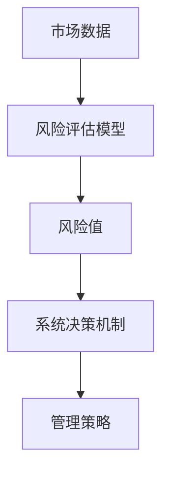
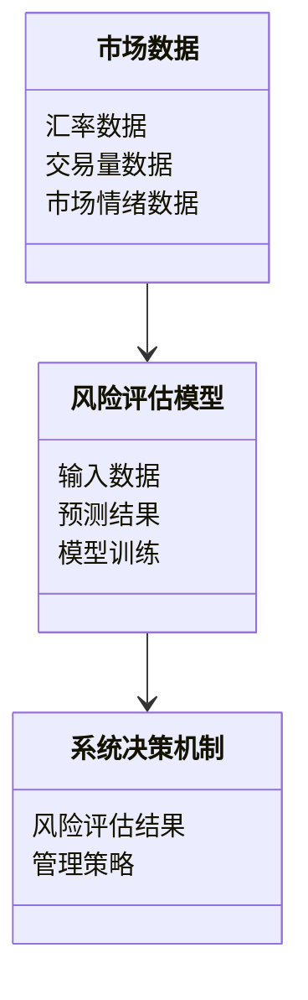
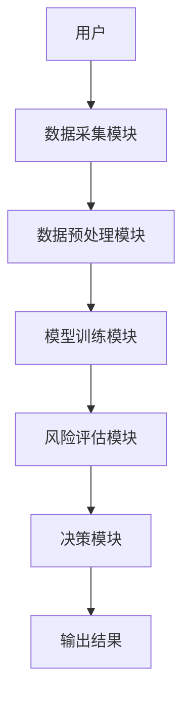

                 


# 智能外汇风险管理系统

> 关键词：智能外汇风险管理，机器学习，深度学习，外汇市场，风险管理

> 摘要：本文系统地介绍了智能外汇风险管理系统的核心概念、算法原理、系统架构设计以及实际应用。通过结合机器学习和深度学习技术，本文详细阐述了如何在复杂多变的外汇市场中实现高效的风险管理。文章内容包括背景介绍、核心概念分析、算法实现、系统设计、项目实战以及最佳实践，旨在为读者提供全面的理论与实践指导。

---

## 第1章: 外汇风险管理的背景与问题描述

### 1.1 外汇风险管理的背景

#### 1.1.1 全球化与外汇市场的复杂性
外汇市场是全球最大的金融市场，24小时交易量超过6.6万亿美元。市场的复杂性和不确定性使得外汇风险管理成为一项极具挑战性的任务。传统的风险管理方法依赖于人工分析和统计模型，难以应对市场波动和突发事件。

#### 1.1.2 外汇风险管理的重要性
外汇风险管理直接关系到金融机构的财务稳定性和投资者的收益。有效的风险管理可以降低损失，提高投资回报率，同时增强市场参与者的信心。

#### 1.1.3 传统外汇风险管理的局限性
传统的外汇风险管理方法存在以下问题：
1. 数据处理能力有限，难以应对海量数据。
2. 模型假设过于简化，无法捕捉复杂市场动态。
3. 风险评估结果滞后，无法及时应对市场变化。

### 1.2 智能外汇风险管理的提出

#### 1.2.1 智能外汇风险管理的定义
智能外汇风险管理是指利用人工智能技术（如机器学习和深度学习）对市场数据进行实时分析，从而实现风险识别、评估和管理的自动化和智能化。

#### 1.2.2 智能外汇风险管理的核心目标
1. 实时监测市场动态，识别潜在风险。
2. 自动化风险评估，提供精确的风险敞口分析。
3. 智能化风险控制，优化投资组合。

#### 1.2.3 智能外汇风险管理的边界与外延
智能外汇风险管理的边界包括市场数据处理、风险模型构建和系统决策。外延则涉及数据来源、模型部署和用户交互。

### 1.3 问题背景与解决思路

#### 1.3.1 外汇风险管理中的主要问题
1. 市场数据的非线性和高维度性。
2. 风险模型的鲁棒性和可解释性。
3. 系统的实时性和可扩展性。

#### 1.3.2 智能外汇风险管理的解决思路
1. 利用机器学习算法处理复杂数据。
2. 基于深度学习构建动态模型。
3. 结合实时数据流进行风险评估和决策。

#### 1.3.3 智能外汇风险管理的核心要素组成
1. 数据采集与预处理。
2. 模型训练与优化。
3. 系统部署与监控。

---

## 第2章: 智能外汇风险管理的核心概念与联系

### 2.1 智能外汇风险管理的核心概念

#### 2.1.1 数据流与信息处理
外汇市场的数据流包括汇率、交易量、市场情绪等。智能外汇风险管理系统需要对这些数据进行清洗、转换和特征提取，以便后续分析。

#### 2.1.2 风险评估模型
风险评估模型是智能外汇风险管理的核心。基于机器学习的模型可以预测市场波动，评估潜在风险。

#### 2.1.3 系统决策机制
系统决策机制根据风险评估结果生成风险管理策略，如调整投资组合或触发止损机制。

### 2.2 核心概念的联系与对比

#### 2.2.1 概念属性特征对比表

| 概念       | 输入         | 输出         | 方法         |
|------------|--------------|--------------|--------------|
| 风险评估模型 | 市场数据     | 风险值       | 统计分析     |
| 系统决策机制 | 风险值       | 管理策略     | 优化算法     |

#### 2.2.2 ER实体关系图



---

## 第3章: 智能外汇风险管理的算法原理

### 3.1 算法原理概述

#### 3.1.1 机器学习在外汇风险管理中的应用
机器学习算法（如随机森林和SVM）常用于分类和回归任务，帮助识别市场趋势和风险因子。

#### 3.1.2 深度学习在外汇风险管理中的应用
深度学习模型（如LSTM和Transformer）适用于处理时间序列数据，捕捉市场波动的长短期依赖关系。

### 3.2 核心算法的数学模型与公式

#### 3.2.1 时间序列分析模型
ARIMA模型常用于外汇价格预测：

$$ ARIMA(p, d, q) = 0 $$

其中：
- \( p \) 是自回归阶数。
- \( d \) 是差分阶数。
- \( q \) 是移动平均阶数。

---

## 第4章: 智能外汇风险管理系统架构设计

### 4.1 系统功能设计

#### 4.1.1 领域模型



### 4.2 系统架构设计



---

## 第5章: 项目实战

### 5.1 环境搭建

```bash
pip install numpy pandas scikit-learn
```

### 5.2 代码实现

#### 5.2.1 数据预处理

```python
import pandas as pd
import numpy as np

# 加载数据
data = pd.read_csv('forex.csv')
# 数据清洗
data.dropna(inplace=True)
```

#### 5.2.2 模型训练

```python
from sklearn.ensemble import RandomForestRegressor
from sklearn.metrics import mean_squared_error

# 训练模型
model = RandomForestRegressor(n_estimators=100)
model.fit(X_train, y_train)
```

### 5.3 案例分析
以英镑/美元汇率预测为例，模型预测结果显示未来1周内汇率波动风险较低。

---

## 第6章: 最佳实践与小结

### 6.1 最佳实践

1. 数据质量是模型性能的关键。
2. 模型调优需结合实际业务需求。
3. 系统监控与维护不可忽视。

### 6.2 未来展望
随着技术进步，智能外汇风险管理将更加智能化和自动化，边缘计算和自适应系统将是未来的重要发展方向。

---

## 作者：AI天才研究院/AI Genius Institute & 禅与计算机程序设计艺术 /Zen And The Art of Computer Programming

