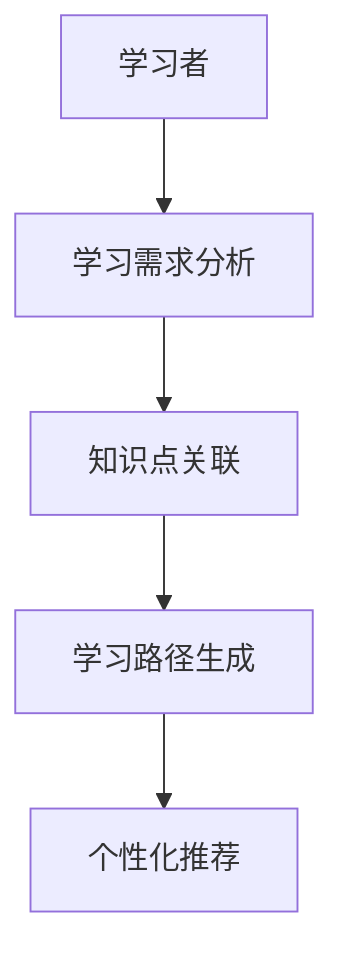
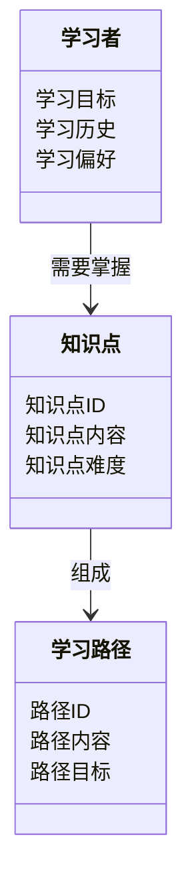

                 


# 智能学习路径规划 AI Agent：LLM 辅助个性化学习

> 关键词：智能学习路径规划，AI Agent，LLM，个性化学习，知识图谱，教育科技，人工智能

> 摘要：本文深入探讨了基于大语言模型（LLM）的智能学习路径规划AI Agent的设计与实现，结合实际案例分析，从算法原理到系统架构，从项目实战到最佳实践，全面解析如何利用AI技术提升学习者的个性化学习体验。文章内容涵盖从问题背景到解决方案，从核心概念到系统架构，从算法实现到项目实战，为教育科技领域的开发者和研究者提供深入的技术指导。

---

## 目录

### 第一部分: 智能学习路径规划 AI Agent 背景与概念

#### 第1章: 问题背景与需求分析

##### 1.1 智能学习路径规划的背景
###### 1.1.1 传统学习路径规划的局限性
- 传统教学模式的不足
- 个性化学习需求的增长
- AI技术在教育领域的应用趋势

###### 1.1.2 问题描述与目标设定
- 学习者个性化需求的多样性
- 知识点之间的关联性分析
- 学习路径规划的目标与边界

##### 1.2 问题解决与技术选型
###### 1.2.1 AI Agent的基本概念与特点
- AI Agent的核心概念
- 基于LLM的AI Agent的优势
- AI Agent与传统学习管理系统的区别

###### 1.2.2 LLM在智能学习中的作用
- LLM的核心原理
- LLM在学习路径规划中的应用
- LLM与知识图谱的结合

##### 1.3 边界与外延
- 系统设计的边界
- 与其他教育科技系统的区别
- 智能学习路径规划的未来发展

#### 第2章: 核心概念与系统架构

##### 2.1 AI Agent与LLM的结合
###### 2.1.1 AI Agent的定义与特点
- AI Agent的基本概念
- 基于LLM的AI Agent的优势
- AI Agent与传统学习管理系统的区别

###### 2.1.2 LLM在智能学习中的作用
- LLM的核心原理
- LLM在学习路径规划中的应用
- LLM与知识图谱的结合

##### 2.2 系统架构设计
###### 2.2.1 系统功能模块划分
- 学习需求分析模块
- 知识点关联分析模块
- 学习路径生成模块
- 个性化推荐模块

###### 2.2.2 系统架构的Mermaid图


###### 2.2.3 系统交互流程
- 学习者输入学习目标
- 系统分析学习需求
- 系统生成知识点关联图
- 系统优化学习路径
- 系统输出个性化推荐

#### 第3章: 算法原理与数学模型

##### 3.1 LLM的训练与推理
###### 3.1.1 Transformer模型的基本结构
- 编码器与解码器的结构
- 自注意力机制的数学公式
$$ \text{Attention}(Q,K,V) = \text{softmax}\left(\frac{QK^T}{\sqrt{d_k}}\right)V $$

###### 3.1.2 梯度下降优化算法
- 损失函数的定义
- 梯度下降的基本原理
- Adam优化器的实现细节

##### 3.2 智能路径规划算法
###### 3.2.1 A*算法的基本原理
- 开发节点与生成节点的定义
- 启发式函数的设计
- A*算法的优化技巧

###### 3.2.2 基于LLM的路径优化方法
- LLM在路径规划中的应用
- 基于知识图谱的路径优化
- 多目标优化算法的实现

##### 3.3 数学模型与公式
###### 3.3.1 路径规划的数学模型
$$ \text{Cost}(path) = \sum_{i=1}^{n} c(i,i+1) $$

###### 3.3.2 注意力机制的数学公式
$$ \text{Attention}(Q,K,V) = \text{softmax}\left(\frac{QK^T}{\sqrt{d_k}}\right)V $$

#### 第4章: 系统分析与架构设计方案

##### 4.1 问题场景介绍
- 学习者个性化需求的多样性
- 知识点之间的关联性分析
- 学习路径规划的目标与边界

##### 4.2 系统功能设计
###### 4.2.1 领域模型


##### 4.3 系统架构设计
###### 4.3.1 系统架构图


##### 4.4 系统接口设计
- API接口定义
- 接口交互流程
- 接口安全设计

##### 4.5 系统交互流程
- 学习者输入学习目标
- 系统分析学习需求
- 系统生成知识点关联图
- 系统优化学习路径
- 系统输出个性化推荐

#### 第5章: 项目实战

##### 5.1 环境安装与配置
- 开发环境的选择
- 依赖库的安装
- 系统架构的搭建

##### 5.2 核心代码实现
###### 5.2.1 学习需求分析模块
- 代码实现
```python
def analyze_learning_demand(learning_goals):
    # 分析学习目标并生成需求报告
    pass
```

###### 5.2.2 知识点关联分析模块
- 代码实现
```python
def analyze_knowledge_association(knowledge_points):
    # 分析知识点之间的关联性并生成关联图
    pass
```

###### 5.2.3 学习路径生成模块
- 代码实现
```python
def generate_learning_path(knowledge_association):
    # 根据知识点关联图生成学习路径
    pass
```

###### 5.2.4 个性化推荐模块
- 代码实现
```python
def generate_recommendations(learning_path):
    # 根据学习路径生成个性化推荐
    pass
```

##### 5.3 案例分析与实际应用
- 实际案例分析
- 系统实现的具体步骤
- 系统应用的效果展示

##### 5.4 项目小结
- 项目实现的关键点
- 项目中的经验教训
- 项目未来的优化方向

#### 第6章: 最佳实践与总结

##### 6.1 小结
- 系统设计的核心思想
- 算法实现的关键点
- 项目实施的经验总结

##### 6.2 注意事项
- 系统设计中的常见问题
- 项目实施中的注意事项
- 系统维护与优化建议

##### 6.3 拓展阅读
- 相关技术领域的发展趋势
- 未来的研究方向
- 推荐的阅读资料

---

### 作者：AI天才研究院/AI Genius Institute & 禅与计算机程序设计艺术 /Zen And The Art of Computer Programming

---

通过以上目录大纲，我们可以看到，文章从背景介绍到系统实现，从算法原理到项目实战，从理论分析到最佳实践，全面覆盖了智能学习路径规划AI Agent的设计与实现的各个环节。每一部分都详细展开，确保读者能够深入理解技术原理和实际应用。

