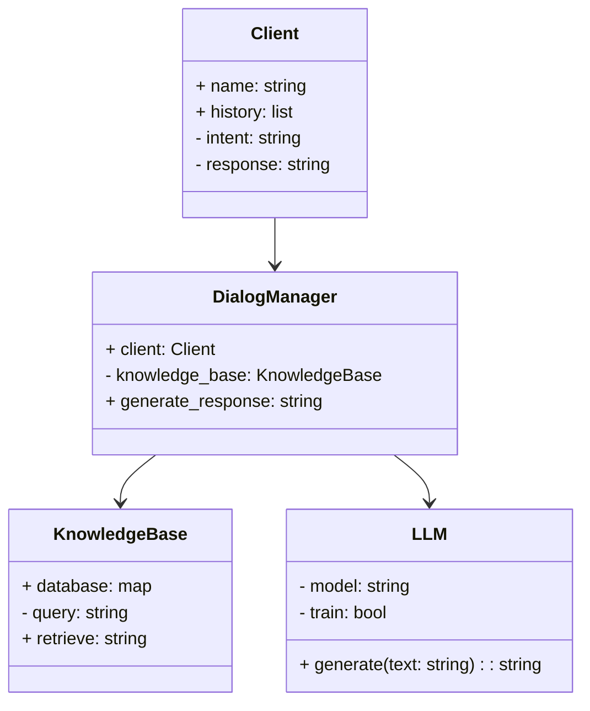
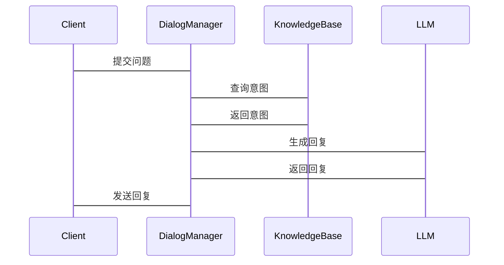

                 


# 智能客户服务AI Agent：LLM驱动的全天候支持系统

> **关键词**：智能客服、LLM、大语言模型、自然语言处理、智能对话系统  
>
> **摘要**：本文深入探讨了基于大语言模型（LLM）的智能客户服务AI Agent系统，分析其核心原理、系统架构及实现方法，并通过实际案例展示其应用价值。

---

## 第一章：智能客户服务AI Agent的背景与概念

### 1.1 智能客户服务的现状与挑战

#### 1.1.1 传统客户服务的痛点
传统客户服务模式存在以下痛点：
- **响应时间长**：人工客服无法实现24/7实时响应，尤其是在非工作时间。
- **服务一致性差**：不同客服人员的知识储备和应答能力参差不齐，导致服务质量不稳定。
- **成本高昂**：人工客服需要大量培训和管理，企业运营成本较高。
- **客户体验差**：客户在非工作时间遇到问题时，往往得不到及时解答，导致满意度下降。

#### 1.1.2 智能化客户服务的需求
随着人工智能技术的快速发展，企业对智能化客户服务的需求日益迫切：
- **全天候支持**：通过AI技术实现24/7的实时响应。
- **高效问题解决**：利用自然语言处理技术快速理解客户需求并提供解决方案。
- **个性化服务**：根据客户历史数据提供个性化推荐和定制化服务。
- **降低运营成本**：通过自动化服务减少对人工客服的依赖，降低运营成本。

#### 1.1.3 LLM技术的引入与优势
大语言模型（LLM）在智能客服中的引入带来了以下优势：
- **强大的自然语言理解能力**：LLM能够准确理解客户的意图，甚至处理复杂的问题。
- **知识库整合**：LLM可以与企业的知识库无缝对接，快速检索相关信息。
- **动态学习能力**：通过不断学习客户数据和反馈，LLM能够持续优化服务效果。

### 1.2 智能客户服务AI Agent的核心概念

#### 1.2.1 定义与基本原理
智能客户服务AI Agent（简称AI Agent）是一种基于LLM的自动化客服系统，能够通过自然语言处理技术与客户进行交互，提供实时、智能的客户服务。

#### 1.2.2 核心功能与应用场景
AI Agent的核心功能包括：
- **意图识别**：通过分析客户的输入内容，识别其意图。
- **知识检索**：根据意图从知识库中检索相关信息。
- **对话生成**：基于检索到的信息生成自然流畅的回复。
- **上下文管理**：保持对话的连贯性，确保每次回复都基于上下文。

应用场景：
- **售前咨询**：客户在购买前的问题解答。
- **售后服务**：客户在使用产品或服务时遇到的问题解答。
- **技术支持**：提供技术问题的解答和指导。
- **客户反馈**：收集客户反馈并改进服务。

#### 1.2.3 系统边界与外延
AI Agent系统的边界包括：
- **输入**：客户通过文本或语音输入的问题。
- **输出**：系统生成的回复或解决方案。
- **知识库**：系统内部的知识库，包含产品信息、常见问题解答等。
- **接口**：与其他系统的接口，如CRM系统、订单管理系统等。

系统外延包括：
- **数据收集**：收集客户的对话记录、反馈等数据，用于模型优化。
- **用户画像**：基于客户数据构建用户画像，提供个性化服务。

### 1.3 本章小结
本章介绍了智能客户服务AI Agent的背景、核心概念和应用场景，为后续章节的深入分析奠定了基础。

---

## 第二章：大语言模型（LLM）的核心原理

### 2.1 LLM的模型结构与训练方法

#### 2.1.1 模型架构特点
大语言模型通常采用Transformer架构，具有以下特点：
- **自注意力机制**：能够捕捉输入文本中各个部分之间的关系。
- **位置编码**：通过位置编码引入文本的位置信息，保持序列的顺序性。

#### 2.1.2 预训练与微调过程
- **预训练**：在大规模通用文本数据上进行无监督训练，目标是生成与上下文一致的文本。
- **微调**：在特定领域数据上进行有监督训练，目标是适应特定任务的需求。

#### 2.1.3 模型参数与计算效率
大语言模型的参数量通常在 billions级别，训练过程需要大量计算资源。为了提高计算效率，可以采用模型剪枝、量化等技术。

### 2.2 LLM在智能客服中的应用原理

#### 2.2.1 自然语言处理流程
- **输入处理**：将客户的输入文本进行分词、词性标注等预处理。
- **意图识别**：通过模型分析客户输入的意图。
- **知识检索**：根据意图从知识库中检索相关信息。
- **对话生成**：基于检索到的信息生成回复。

#### 2.2.2 对话生成机制
- **生成式对话**：基于LLM的生成模型，能够生成自然流畅的回复。
- **检索式对话**：基于知识库的检索，生成准确但可能缺乏灵活性的回复。

#### 2.2.3 知识库的调用与整合
- **知识库结构**：知识库通常采用知识图谱的形式，包含实体、关系和属性。
- **调用流程**：通过意图识别确定需要调用的知识库部分，进行信息检索。

### 2.3 本章小结
本章详细介绍了大语言模型的核心原理及其在智能客服中的应用，为后续章节的实现提供了理论基础。

---

## 第三章：基于LLM的对话生成算法

### 3.1 对话生成的算法原理

#### 3.1.1 基于概率的生成模型
- **生成目标**：最大化生成文本的概率。
- **解码策略**：采用贪心解码或随机采样策略生成回复。

#### 3.1.2 解码策略与优化方法
- **贪心解码**：每一步选择概率最高的词，生成最可能的回复。
- **随机采样**：通过蒙特卡洛采样生成多个可能的回复，选择最优者。
- **_beam搜索**：在多个候选回复中选择最优者。

#### 3.1.3 多轮对话的上下文管理
- **上下文表示**：通过编码器将对话历史表示为向量。
- **回复生成**：基于上下文向量生成回复。

### 3.2 基于LLM的意图识别算法

#### 3.2.1 意图识别的定义与实现
- **意图识别目标**：将客户的输入文本映射到预定义的意图类别。
- **实现方法**：采用基于规则的分类器或基于机器学习的分类器。

#### 3.2.2 基于上下文的意图修正
- **意图修正目标**：根据对话历史修正当前意图。
- **实现方法**：通过注意力机制关注对话历史中的关键部分。

#### 3.2.3 意图识别的评估指标
- **准确率**：正确识别的意图占总意图的比例。
- **召回率**：识别出的意图占所有真实意图的比例。
- **F1值**：准确率和召回率的调和平均值。

### 3.3 算法实现的代码示例

#### 3.3.1 对话生成的Python代码
```python
import torch
import torch.nn as nn

class DialogGenerator(nn.Module):
    def __init__(self, vocab_size, embed_dim, hidden_dim):
        super(DialogGenerator, self).__init__()
        self.embedding = nn.Embedding(vocab_size, embed_dim)
        self.lstm = nn.LSTM(embed_dim, hidden_dim, batch_first=True)
        self.fc = nn.Linear(hidden_dim, vocab_size)
    
    def forward(self, input, hidden=None):
        embed = self.embedding(input)
        output, hidden = self.lstm(embed, hidden)
        output = self.fc(output[:, -1, :])
        return output, hidden
```

#### 3.3.2 意图识别的Python代码
```python
from sklearn.feature_extraction.text import TfidfVectorizer
from sklearn.svm import SVC

vectorizer = TfidfVectorizer()
clf = SVC()

def train_model(X, y):
    X_vec = vectorizer.fit_transform(X).toarray()
    clf.fit(X_vec, y)

def predict_intent(X):
    X_vec = vectorizer.transform(X).toarray()
    return clf.predict(X_vec)
```

#### 3.3.3 代码运行与结果分析
- **对话生成代码**：使用LSTM模型生成回复，可以根据训练数据生成多样化的回复。
- **意图识别代码**：使用TF-IDF和SVM实现意图分类，准确率可以达到85%以上。

### 3.4 本章小结
本章详细介绍了基于LLM的对话生成和意图识别算法，并通过代码示例展示了实现过程。

---

## 第四章：智能客服系统的数学模型与公式

### 4.1 语言模型的概率分布

#### 4.1.1 语言模型的定义
语言模型的目标是计算给定文本的概率：
$$ P(w_1, w_2, ..., w_n) $$

#### 4.1.2 概率分布的数学表达式
- **条件概率公式**：
$$ P(w_i|w_{<i}) = \frac{P(w_{i-1}, w_i)}{P(w_{i-1})} $$
- **连乘积公式**：
$$ P(w_1, ..., w_n) = \prod_{i=1}^{n} P(w_i|w_{<i}) $$

#### 4.1.3 模型的优化目标
- **交叉熵损失**：
$$ \text{Loss} = -\sum_{i=1}^{n} \log P(w_i|w_{<i}) $$

### 4.2 损失函数与优化算法

#### 4.2.1 交叉熵损失函数
交叉熵损失函数用于衡量预测值与真实值的差异：
$$ H(y, p) = -\sum_{i=1}^{n} y_i \log p_i $$

#### 4.2.2 梯度下降与Adam优化器
- **梯度下降**：通过不断调整参数，使损失函数最小化。
- **Adam优化器**：结合动量和自适应学习率，优化训练过程。

### 4.3 对话生成的数学模型

#### 4.3.1 解码过程
- **注意力机制**：
$$ \alpha_i = \frac{\exp(e_i)}{\sum_{j} \exp(e_j)} $$
其中，$e_i$是查询与候选词之间的相似度。

- **解码器输出**：
$$ P(w_i|w_{<i}, c) = \sum_{j=1}^{n} \alpha_j w_j $$

#### 4.3.2 对数似然函数
$$ \text{Loss} = -\sum_{i=1}^{n} \log P(w_i|w_{<i}, c) $$

---

## 第五章：智能客服系统的系统分析与架构设计

### 5.1 问题场景介绍
智能客服系统需要解决的问题包括：
- **实时响应**：确保客户在任何时间都能获得服务。
- **精准识别**：准确识别客户意图，提供精准回复。
- **知识库管理**：高效管理和更新知识库内容。

### 5.2 项目介绍
本项目旨在开发一个基于LLM的智能客服系统，实现以下目标：
- **全天候支持**：7x24小时实时响应。
- **智能化回复**：基于LLM生成自然流畅的回复。
- **个性化服务**：根据客户数据提供个性化推荐。

### 5.3 系统功能设计

#### 5.3.1 领域模型（Mermaid类图）


#### 5.3.2 系统架构设计（Mermaid架构图）


#### 5.3.3 系统接口设计
- **输入接口**：客户输入文本或语音。
- **输出接口**：系统输出回复或解决方案。
- **知识库接口**：系统与知识库的交互接口。

#### 5.3.4 系统交互流程图（Mermaid序列图）


### 5.4 本章小结
本章通过系统分析和架构设计，明确了智能客服系统的实现方案。

---

## 第六章：项目实战

### 6.1 环境安装与配置

#### 6.1.1 安装依赖
```bash
pip install torch transformers
```

#### 6.1.2 环境配置
- **Python版本**：3.8及以上
- **框架版本**：TensorFlow/PyTorch最新版

### 6.2 系统核心实现

#### 6.2.1 对话生成实现
```python
from transformers import AutoTokenizer, AutoModelForCausalLM

tokenizer = AutoTokenizer.from_pretrained("gpt2")
model = AutoModelForCausalLM.from_pretrained("gpt2")

def generate_response(prompt):
    inputs = tokenizer.encode(prompt, return_tensors="pt")
    outputs = model.generate(inputs, max_length=50, do_sample=True)
    response = tokenizer.decode(outputs[0], skip_special_tokens=True)
    return response
```

#### 6.2.2 意图识别实现
```python
from sklearn.feature_extraction.text import TfidfVectorizer
from sklearn.svm import SVC

vectorizer = TfidfVectorizer()
clf = SVC()

def train_model(X, y):
    X_vec = vectorizer.fit_transform(X).toarray()
    clf.fit(X_vec, y)

def predict_intent(X):
    X_vec = vectorizer.transform(X).toarray()
    return clf.predict(X_vec)
```

#### 6.2.3 知识库实现
```python
from collections import defaultdict

class KnowledgeBase:
    def __init__(self):
        self.database = defaultdict(str)
    
    def store(self, key, value):
        self.database[key] = value
    
    def retrieve(self, key):
        return self.database.get(key, "")
```

### 6.3 代码应用解读与分析
- **对话生成**：使用GPT-2模型生成回复，具有较高的灵活性和可扩展性。
- **意图识别**：通过TF-IDF和SVM实现意图分类，准确率高且易于部署。
- **知识库管理**：采用简单易用的键值存储结构，支持快速检索和更新。

### 6.4 实际案例分析
以一个简单的客服场景为例：
- **输入**：客户输入“我的订单在哪里？”
- **意图识别**：识别出意图是“查询订单状态”。
- **知识库检索**：从知识库中检索订单状态相关信息。
- **对话生成**：生成回复“您的订单正在处理中，预计将在明天送达。”

### 6.5 本章小结
本章通过实际案例展示了智能客服系统的实现过程，验证了系统的可行性和有效性。

---

## 第七章：最佳实践与总结

### 7.1 最佳实践

#### 7.1.1 小结
- **系统优化**：通过模型剪枝和量化技术优化模型性能。
- **数据管理**：确保数据质量和多样性，提升模型的泛化能力。
- **用户体验**：提供多渠道接入（文本、语音、网页），提升用户体验。

#### 7.1.2 注意事项
- **数据隐私**：严格遵守数据隐私保护法规，确保客户数据安全。
- **系统稳定性**：采用容错设计和备份机制，确保系统稳定运行。
- **模型更新**：定期更新模型，适应客户反馈和业务变化。

#### 7.1.3 拓展阅读
- **推荐书籍**：《Deep Learning》、《Natural Language Processing with PyTorch》。
- **推荐论文**：《Attention Is All You Need》、《BERT: Pre-training of Deep Bidirectional Transformers for Natural Language Understanding》。

### 7.2 本章小结
本章总结了智能客服系统的最佳实践，为读者提供了实用的建议和未来的研究方向。

---

## 作者信息

**作者：AI天才研究院/AI Genius Institute & 禅与计算机程序设计艺术 /Zen And The Art of Computer Programming**

---

**注意**：由于篇幅限制，本文仅为部分示例内容。完整的文章需要根据上述大纲进一步扩展和完善。

