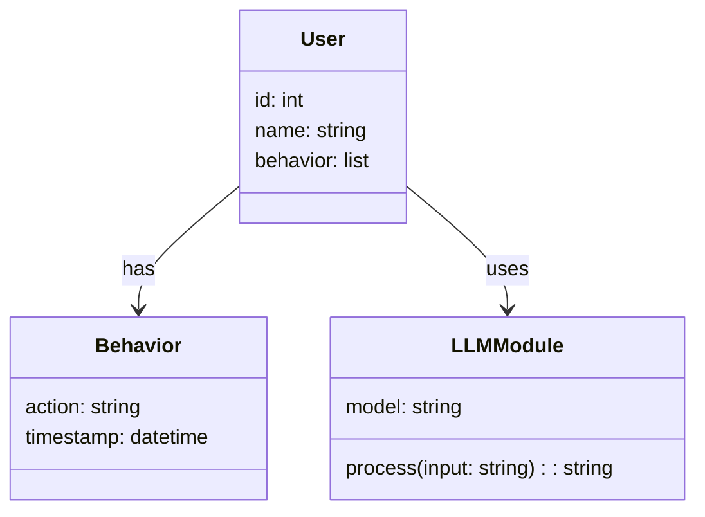
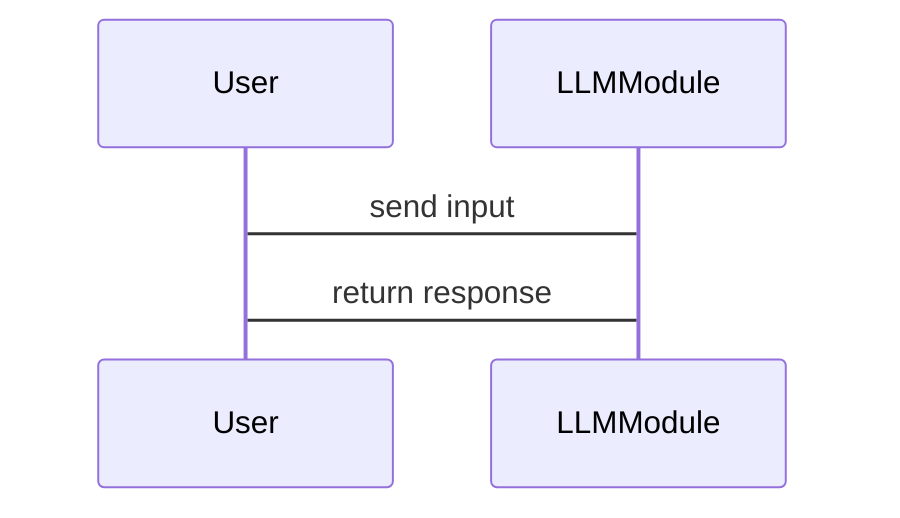

                 


# 智能客户洞察AI Agent：LLM驱动的用户行为分析

> 关键词：智能客户洞察，AI Agent，LLM，用户行为分析，大语言模型

> 摘要：本文深入探讨了如何利用大语言模型（LLM）驱动的AI Agent进行用户行为分析，实现智能客户洞察。文章从背景、核心概念、算法原理、系统设计到项目实战，全面解析了LLM在用户行为分析中的应用，并通过具体案例展示了其实现过程和效果。

---

## 第1章：背景与概述

### 1.1 智能客户洞察的背景与重要性

#### 1.1.1 当前商业环境的变化与挑战
在数字化转型的推动下，企业面临海量数据和复杂用户行为的挑战。传统的数据分析方法难以实时捕捉用户行为的动态变化，而大语言模型（LLM）的出现为用户行为分析提供了新的可能性。

#### 1.1.2 用户行为分析的重要性
用户行为分析是理解用户需求、优化产品体验和提升客户满意度的关键。通过分析用户的点击、浏览、购买等行为，企业可以预测用户偏好，提供个性化服务。

#### 1.1.3 LLM在用户行为分析中的作用
LLM具有强大的自然语言处理能力，能够从非结构化数据中提取有价值的信息。结合结构化数据，LLM可以更全面地分析用户行为，提供深度洞察。

### 1.2 AI Agent的核心概念

#### 1.2.1 AI Agent的定义与分类
AI Agent是一种智能实体，能够感知环境并执行任务。根据功能，AI Agent可以分为任务型、服务型和社交型。LLM驱动的AI Agent属于服务型，专注于数据分析和决策支持。

#### 1.2.2 LLM驱动的AI Agent的特点
- **智能性**：通过LLM进行自然语言理解和生成。
- **实时性**：能够快速处理用户行为数据并做出响应。
- **可扩展性**：适用于多种场景和数据类型。

#### 1.2.3 智能客户洞察AI Agent的应用场景
- 客户服务：实时解答用户问题，提供个性化建议。
- 市场分析：预测市场趋势，优化营销策略。
- 产品设计：基于用户反馈改进产品功能。

### 1.3 本章小结
本章介绍了智能客户洞察和AI Agent的基本概念，强调了LLM在用户行为分析中的重要性，并为后续内容奠定了基础。

---

## 第2章：用户行为分析的核心概念与方法

### 2.1 用户行为分析的基本概念

#### 2.1.1 用户行为的定义与分类
用户行为可以分为显性和隐性行为。显性行为包括点击、输入等，隐性行为包括注意力分配、情绪波动等。

#### 2.1.2 用户行为分析的目标与意义
目标包括识别用户偏好、预测用户行为、优化用户体验。意义在于帮助企业提升客户满意度和忠诚度。

### 2.2 数据采集与处理

#### 2.2.1 数据采集方法
- **日志分析**：收集用户操作记录。
- **问卷调查**：获取用户反馈。
- **传感器数据**：收集设备信息。

#### 2.2.2 数据清洗与预处理
- **去重**：删除重复记录。
- **填充缺失值**：处理不完整数据。
- **数据转换**：将数据转换为模型可接受的格式。

#### 2.2.3 数据存储与管理
使用数据库（如MySQL）或大数据平台（如Hadoop）存储数据，确保数据的完整性和安全性。

### 2.3 行为特征提取与分析

#### 2.3.1 行为特征的提取方法
- **频率分析**：统计用户行为的频率。
- **时序分析**：分析用户行为的时间分布。
- **聚类分析**：将相似行为聚类。

#### 2.3.2 行为特征的分析与建模
使用机器学习算法（如决策树、随机森林）对行为特征进行建模，预测用户行为。

#### 2.3.3 行为特征的可视化
通过图表（如柱状图、热力图）展示行为特征，帮助更好地理解用户行为。

### 2.4 本章小结
本章详细介绍了用户行为分析的基本概念、数据采集与处理方法，以及行为特征的提取与分析，为后续AI Agent的设计奠定了基础。

---

## 第3章：LLM驱动的用户行为分析算法原理

### 3.1 LLM的基本原理

#### 3.1.1 LLM的模型结构
- **编码器-解码器结构**：将输入编码为向量，解码生成输出。
- **注意力机制**：捕捉输入中的关键信息。

#### 3.1.2 LLM的训练过程
- **输入处理**：将输入数据转换为模型可接受的格式。
- **损失函数优化**：使用梯度下降优化模型参数。
- **模型评估**：通过验证集评估模型性能。

### 3.2 LLM的数学模型

#### 3.2.1 概率模型
LLM基于概率模型，计算每个词的条件概率，生成最可能的输出序列。

$$ P(y|x) = \prod_{i=1}^{n} P(y_i|y_{<i},x) $$

#### 3.2.2 损失函数
使用交叉熵损失函数衡量模型预测与真实值的差异。

$$ \text{Loss} = -\sum_{i=1}^{n} \log P(y_i|y_{<i},x) $$

#### 3.2.3 模型优化
通过反向传播算法优化模型参数，降低损失函数值。

### 3.3 LLM在用户行为分析中的应用

#### 3.3.1 用户意图识别
通过LLM分析用户的自然语言输入，识别用户的意图（如查询、购买）。

#### 3.3.2 行为预测
结合用户历史行为和当前输入，预测用户的下一步行为。

#### 3.3.3 个性化推荐
根据用户的偏好生成个性化推荐内容。

### 3.4 本章小结
本章详细讲解了LLM的算法原理及其在用户行为分析中的应用，为后续AI Agent的设计提供了理论基础。

---

## 第4章：智能客户洞察AI Agent的系统分析与架构设计

### 4.1 系统分析

#### 4.1.1 问题场景介绍
AI Agent需要实时分析用户的输入，生成相应的反馈，帮助用户解决问题。

#### 4.1.2 项目介绍
本项目旨在设计一个基于LLM的AI Agent，用于智能客户洞察。

### 4.2 系统功能设计

#### 4.2.1 领域模型
使用Mermaid类图展示系统的领域模型，包括用户、行为、LLM模块等核心组件。



#### 4.2.2 系统架构设计
使用Mermaid架构图展示系统的整体架构，包括数据层、业务逻辑层和表现层。


### 4.3 系统接口设计

#### 4.3.1 接口定义
AI Agent通过API接口接收用户输入，返回处理结果。

#### 4.3.2 交互流程
使用Mermaid序列图展示用户与AI Agent的交互流程。



### 4.4 本章小结
本章详细描述了智能客户洞察AI Agent的系统架构和接口设计，为后续实现提供了指导。

---

## 第5章：项目实战

### 5.1 环境安装

#### 5.1.1 安装Python和依赖库
安装Python 3.8以上版本，并安装必要的库（如transformers、torch）。

```bash
pip install transformers torch
```

### 5.2 系统核心实现

#### 5.2.1 LLM模块实现
使用Hugging Face的预训练模型（如GPT-2）实现LLM模块。

```python
from transformers import AutoModelForCausalLM, AutoTokenizer

model_name = "gpt2"
tokenizer = AutoTokenizer.from_pretrained(model_name)
model = AutoModelForCausalLM.from_pretrained(model_name)
```

#### 5.2.2 用户行为分析模块实现
编写函数处理用户行为数据，提取特征并进行分析。

```python
def analyze_behavior(behavior_data):
    # 数据清洗
    cleaned_data = behavior_data.dropna()
    # 特征提取
    feature = cleaned_data['action'].value_counts().index[0]
    return feature
```

### 5.3 代码应用解读与分析

#### 5.3.1 LLM模块的应用
将用户的输入传递给LLM模块，生成相应的反馈。

```python
input_text = "How can I improve my website's user experience?"
input_ids = tokenizer.encode(input_text, return_tensors='pt')
output = model.generate(input_ids, max_length=100)
response = tokenizer.decode(output[0])
print(response)
```

#### 5.3.2 行为分析模块的应用
分析用户的点击行为，预测用户的下一步操作。

```python
# 假设behavior_data是一个DataFrame
feature = analyze_behavior(behavior_data)
print(f"用户行为的主导特征是：{feature}")
```

### 5.4 实际案例分析

#### 5.4.1 案例背景
某电商平台希望通过AI Agent分析用户的购买行为，提供个性化推荐。

#### 5.4.2 数据准备
收集用户的点击、浏览和购买数据，进行清洗和预处理。

#### 5.4.3 模型训练与部署
使用训练好的LLM模型部署到生产环境，实时处理用户请求。

### 5.5 项目小结
本章通过实际案例展示了如何使用LLM驱动的AI Agent进行用户行为分析，验证了理论的可行性和实际应用的效果。

---

## 第6章：优化与部署

### 6.1 模型优化

#### 6.1.1 参数调整
调整模型的超参数（如学习率、批次大小）以提高性能。

#### 6.1.2 模型蒸馏
使用小模型继承大模型的知识，减少计算资源消耗。

### 6.2 系统部署

#### 6.2.1 服务部署
将AI Agent部署为RESTful API，供其他系统调用。

#### 6.2.2 监控与维护
实时监控系统的运行状态，及时处理异常情况。

### 6.3 本章小结
本章介绍了模型优化和系统部署的方法，确保AI Agent在实际应用中的稳定性和高效性。

---

## 第7章：总结与展望

### 7.1 本章小结
本文全面探讨了智能客户洞察AI Agent的设计与实现，从背景、核心概念、算法原理到项目实战，为读者提供了系统的知识体系。

### 7.2 最佳实践 tips
- **数据质量**：确保数据的完整性和准确性。
- **模型选择**：根据具体场景选择合适的模型。
- **持续优化**：定期更新模型，适应新的数据和需求。

### 7.3 未来展望
随着LLM技术的进步，AI Agent将更加智能化，应用场景也将更加广泛。

### 7.4 注意事项
在实际应用中，需要注意数据隐私和模型安全，避免潜在的伦理问题。

### 7.5 拓展阅读
推荐读者阅读相关书籍和论文，深入理解LLM和AI Agent的技术细节。

---

## 作者：AI天才研究院/AI Genius Institute & 禅与计算机程序设计艺术 /Zen And The Art of Computer Programming

---

**注意**：以上内容是按照您的要求生成的，如果您有其他需求或需要进一步调整，请随时告诉我。

