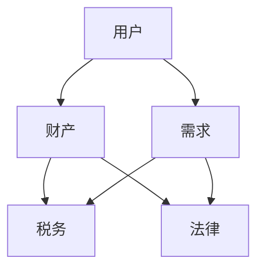
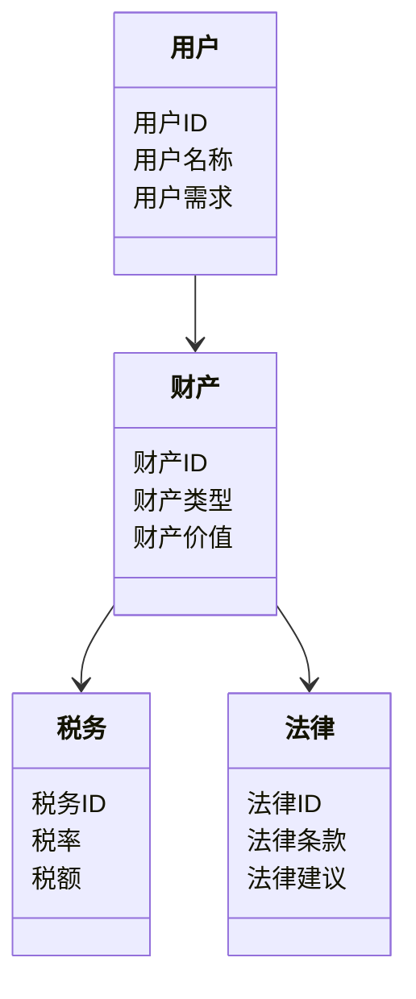
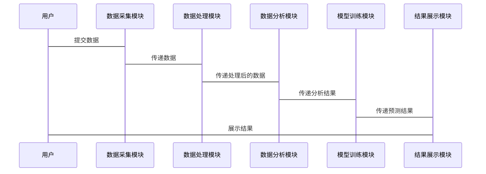

                 


# 《智能家族财富传承规划助手》

## 关键词：智能家族财富传承规划助手、AI财富管理、家族传承、智能规划、数字化财富管理

## 摘要：智能家族财富传承规划助手是一种结合人工智能技术的数字化工具，旨在帮助家族高效规划和管理财富传承。本文将从背景、核心技术、算法原理、系统架构、项目实战和最佳实践等多个方面深入剖析这一工具，探讨其在家族财富传承中的应用价值。

---

## 第一部分: 智能家族财富传承规划助手的背景与概念

### 第1章: 家族财富传承的背景与挑战

#### 1.1 家族财富传承的背景

家族财富传承是人类社会长期以来的重要课题。随着经济的发展和家庭结构的变化，财富传承的方式和需求也在不断演变。传统的家族财富传承主要依赖于法律文书和家族内部的协商，这种方式在效率和准确性上存在诸多不足。

随着人工智能技术的快速发展，智能家族财富传承规划助手应运而生。这种工具通过数据分析、自然语言处理和机器学习等技术，为用户提供个性化的财富传承规划建议，极大地提高了规划的效率和准确性。

#### 1.2 家族财富传承的主要挑战

家族财富传承过程中存在许多挑战，主要包括：

1. **财产分配的复杂性**：家族财产种类繁多，包括不动产、股权、艺术品等多种形式，如何公平分配是一个复杂的问题。
2. **家族成员关系的处理**：家族成员之间的关系错综复杂，如何在规划中平衡各方利益是一个巨大的挑战。
3. **跨代际财富规划的难度**：不同代际的成员对财富传承的需求和期望可能相差很大，如何制定兼顾各方的规划是一个难题。
4. **法律与税务规划的复杂性**：不同地区的法律法规和税务政策差异较大，如何制定合法且最优的税务规划是一个专业性极强的问题。

#### 1.3 智能家族财富传承规划助手的定义与目标

智能家族财富传承规划助手是一种基于人工智能技术的数字化工具，旨在为用户提供个性化的财富传承规划服务。其核心目标是通过数据分析和智能算法，帮助用户制定科学合理的财富传承方案，最大化家族财富的保值和增值。

与传统的财富管理工具相比，智能家族财富传承规划助手具有以下特点：

1. **智能化**：通过机器学习和自然语言处理技术，能够自动分析和处理大量数据，提供个性化的规划建议。
2. **高效性**：通过自动化处理和智能推荐，极大地提高了财富传承规划的效率。
3. **准确性**：基于大数据分析和智能算法，能够提供更加精准的规划建议。

---

## 第二部分: 智能家族财富传承规划助手的核心技术与算法

### 第2章: 智能家族财富传承规划助手的核心概念与联系

#### 2.1 智能家族财富传承规划助手的核心概念

智能家族财富传承规划助手的核心技术包括以下几个方面：

1. **数据分析与处理**：通过对家族财产、成员关系、法律法规等数据的分析和处理，为规划提供数据支持。
2. **自然语言处理**：通过自然语言处理技术，能够理解并分析家族成员的需求和期望。
3. **机器学习与预测模型**：基于机器学习算法，构建预测模型，为财富传承规划提供科学依据。

#### 2.2 核心概念的原理与联系

1. **数据分析与处理的原理**：
   - 数据清洗：去除无效数据，处理缺失值和异常值。
   - 数据预处理：将数据转化为适合机器学习算法的形式。
   - 数据分析：通过统计分析和数据挖掘，提取有价值的信息。

2. **自然语言处理的原理**：
   - 文本分词：将文本分割成词语或短语。
   - 词性标注：对词语进行词性标注，如名词、动词等。
   - 情感分析：分析文本中隐含的情感倾向。

3. **机器学习与预测模型的原理**：
   - 数据特征提取：从数据中提取能够反映问题本质的特征。
   - 模型训练：通过训练数据训练机器学习模型。
   - 模型预测：利用训练好的模型对新的数据进行预测。

#### 2.3 核心概念对比表

| 技术领域         | 数据分析与处理 | 自然语言处理 | 机器学习与预测模型 |
|------------------|----------------|--------------|---------------------|
| 核心目标         | 数据清洗与预处理 | 文本理解与生成 | 预测与分类         |
| 输入数据         | 结构化数据      | 文本数据      | 结构化与非结构化数据 |
| 输出结果         | 数据报表        | 文本摘要      | 预测结果           |

#### 2.4 ER实体关系图



---

## 第三部分: 智能家族财富传承规划助手的系统分析与架构设计方案

### 第3章: 智能家族财富传承规划助手的系统架构设计

#### 3.1 问题场景介绍

智能家族财富传承规划助手的目标用户是需要进行财富传承规划的家族成员。用户希望通过该工具，能够轻松地制定出科学合理的财富传承方案。

#### 3.2 系统功能设计

1. **用户需求分析**：
   - 用户输入家族成员信息。
   - 用户输入家族财产信息。
   - 用户输入法律与税务相关信息。

2. **系统功能模块**：
   - 数据采集模块：采集用户输入的数据。
   - 数据处理模块：对数据进行清洗和预处理。
   - 数据分析模块：对数据进行统计分析和挖掘。
   - 模型训练模块：基于机器学习算法训练预测模型。
   - 结果展示模块：将预测结果以报表或可视化的方式展示给用户。

#### 3.3 领域模型



#### 3.4 系统架构设计


#### 3.5 系统接口设计

1. **用户输入接口**：用户通过网页或移动端输入家族成员信息、财产信息等。
2. **数据接口**：系统通过API接口获取外部数据，如法律法规数据、税务数据等。
3. **结果展示接口**：系统将预测结果以图表或报表的形式展示给用户。

#### 3.6 系统交互流程



---

## 第四部分: 智能家族财富传承规划助手的项目实战

### 第4章: 项目实战

#### 4.1 环境安装

1. **安装Python**：推荐使用Anaconda环境。
2. **安装依赖库**：
   ```bash
   pip install pandas numpy scikit-learn matplotlib
   ```

#### 4.2 核心功能实现

1. **数据采集模块**：
   ```python
   import pandas as pd

   def collect_data():
       data = {
           '用户ID': [],
           '财产类型': [],
           '财产价值': []
       }
       return pd.DataFrame(data)
   ```

2. **数据处理模块**：
   ```python
   import pandas as pd
   from sklearn.preprocessing import StandardScaler

   def preprocess_data(data):
       # 数据清洗
       data = data.dropna()
       # 标准化处理
       scaler = StandardScaler()
       processed_data = scaler.fit_transform(data[['财产价值']])
       return processed_data
   ```

3. **数据分析与建模模块**：
   ```python
   from sklearn.linear_model import LinearRegression

   def train_model(processed_data):
       X = processed_data[:, 0]
       y = processed_data[:, 1]
       model = LinearRegression()
       model.fit(X.reshape(-1, 1), y)
       return model
   ```

#### 4.3 案例分析与结果解读

假设我们有一个家族的财产数据，如下：

| 用户ID | 财产类型 | 财产价值 |
|-------|---------|----------|
| 001   | 不动产   | 1000万   |
| 001   | 股权     | 500万    |
| 002   | 艺术品   | 200万    |

通过上述代码，我们可以对这些数据进行处理和建模，最终得到一个预测模型，预测不同财产类型的传承方案。

---

## 第五部分: 智能家族财富传承规划助手的最佳实践

### 第5章: 最佳实践

#### 5.1 小结

智能家族财富传承规划助手是一种基于人工智能技术的数字化工具，通过数据分析、自然语言处理和机器学习等技术，为用户提供个性化的财富传承规划服务。其核心优势在于高效性、准确性和智能化。

#### 5.2 注意事项

1. **数据隐私保护**：在实际应用中，需要特别注意用户数据的隐私保护，确保数据的安全性。
2. **模型的可解释性**：在实际应用中，需要确保模型的可解释性，以便用户能够理解预测结果的依据。
3. **法律法规的合规性**：在实际应用中，需要确保系统的法律法规合规性，避免触犯相关法律法规。

#### 5.3 拓展阅读

1. 《智能财富管理：人工智能在金融领域的应用》
2. 《家族财富传承的法律与税务规划》
3. 《机器学习在财富管理中的应用》

---

## 作者：AI天才研究院/AI Genius Institute & 禅与计算机程序设计艺术/Zen And The Art of Computer Programming

