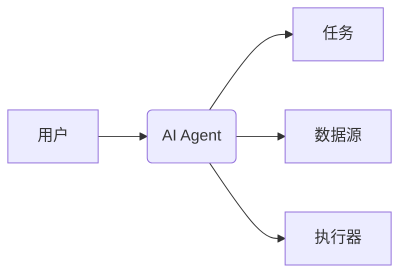
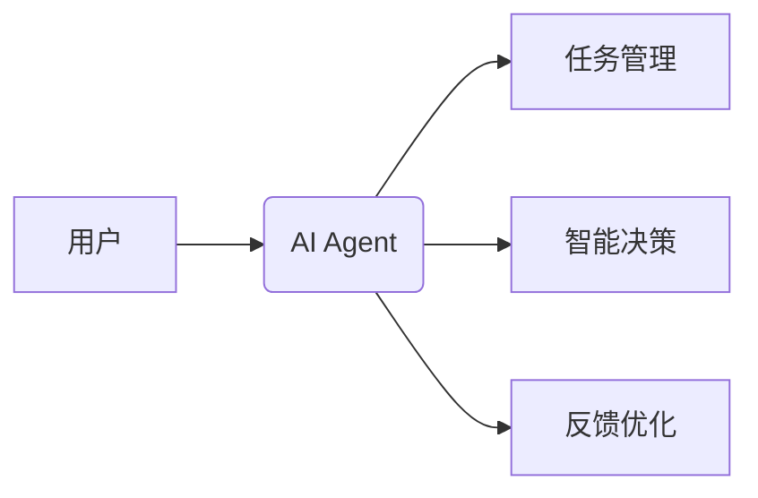
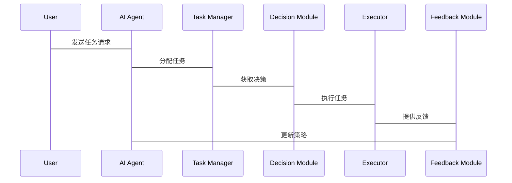

                 


# 智能工作站：AI Agent的效率优化助手

## 关键词
AI Agent, 智能工作站, 效率优化, 自动化工具, 人工智能, 系统架构

## 摘要
本文探讨了AI Agent在智能工作站中的应用，分析了其如何通过智能化、实时性和可扩展性优化工作效率。从核心概念到算法原理，再到系统架构和项目实战，本文全面解析了AI Agent的实现与应用，并提供了实用的开发建议和未来展望。

---

## 正文

## 第一部分：智能工作站与AI Agent的背景介绍

### 第1章：智能工作站与AI Agent概述

#### 1.1 AI Agent的基本概念

**1.1.1 AI Agent的定义**
AI Agent（人工智能代理）是一种能够感知环境、自主决策并执行任务的智能实体。它通过接收输入数据，分析问题，制定解决方案，并执行操作来实现目标。

**1.1.2 AI Agent的核心特征**
- **自主性**：能够在没有外部干预的情况下运行。
- **反应性**：能够实时感知环境变化并做出响应。
- **目标导向性**：所有行为都围绕实现特定目标展开。
- **学习能力**：通过数据和经验不断优化自身性能。

**1.1.3 AI Agent与传统自动化工具的区别**
| 特性 | AI Agent | 传统自动化工具 |
|------|----------|----------------|
| 智能性 | 高 | 低 |
| 灵活性 | 高 | 低 |
| 学习能力 | 高 | 无 |

#### 1.2 AI Agent在智能工作站中的应用

**1.2.1 智能工作站的定义**
智能工作站是一种结合人工智能技术，能够高效处理复杂任务的工作环境，通常应用于开发、数据分析、客服等领域。

**1.2.2 AI Agent在智能工作站中的角色**
AI Agent作为智能工作站的核心组件，负责任务调度、资源分配、问题解决和结果反馈。

**1.2.3 AI Agent如何提升工作效率**
- 自动化处理重复性任务，节省时间。
- 实时分析数据，提供决策支持。
- 智能分配资源，优化流程。

#### 1.3 当前市场与技术趋势

**1.3.1 AI Agent的市场现状**
- 市场需求快速增长，尤其是在企业级应用中。
- 技术成熟度逐步提高，应用场景不断扩展。

**1.3.2 技术发展与创新**
- 强化学习算法的优化。
- 自然语言处理技术的融合。
- 多模态数据处理能力的提升。

**1.3.3 用户需求与痛点分析**
- 用户需求：提高效率、降低成本、增强决策能力。
- 痛点：数据孤岛、系统集成复杂、安全性问题。

#### 1.4 目标用户与应用场景

**1.4.1 目标用户分析**
- 企业：IT、研发、客服等部门。
- 开发者：希望通过AI Agent提升开发效率。
- 个人用户：希望通过AI Agent优化个人工作效率。

**1.4.2 典型应用场景**
- 企业资源管理（ERP）系统优化。
- 开发环境自动化配置。
- 客服系统智能升级。

**1.4.3 边界与外延**
AI Agent的应用范围不包括需要人类情感参与的领域，如艺术创作、心理咨询等。

---

## 第二部分：AI Agent的核心概念与联系

### 第2章：AI Agent的核心概念原理

#### 2.1 AI Agent的工作原理

**2.1.1 感知层**
AI Agent通过传感器、API或用户输入获取环境数据。

**2.1.2 决策层**
AI Agent利用算法分析数据，制定解决方案。常用的算法包括基于规则的推理和强化学习。

**2.1.3 执行层**
AI Agent通过执行器或API调用外部系统，完成任务。

#### 2.2 AI Agent与相关技术的对比

**2.2.1 传统自动化工具**
传统自动化工具无法处理复杂任务，缺乏智能性和学习能力。

**2.2.2 其他AI技术**
- 机器学习：侧重于数据模式识别。
- 自然语言处理：专注于文本理解。

**2.2.3 对比分析表格**
| 特性 | AI Agent | 传统自动化工具 | 机器学习 |
|------|----------|----------------|----------|
| 核心能力 | 智能决策 | 自动化执行 | 数据分析 |
| 适用场景 | 复杂任务优化 | 重复性任务自动化 | 数据驱动决策 |

#### 2.3 ER实体关系图



---

## 第三部分：AI Agent的算法原理

### 第3章：AI Agent的算法实现

#### 3.1 算法原理分析

**3.1.1 基于规则的推理算法**
- 基于预定义规则进行决策。
- 适用于简单场景，如流程自动化。

**3.1.2 强化学习算法**
- 通过试错和奖励机制优化决策。
- 适用于复杂场景，如游戏AI和机器人控制。

#### 3.2 算法实现流程

**3.2.1 基于规则的推理流程**
1. 接收输入数据。
2. 匹配预定义规则。
3. 执行对应操作。

**3.2.2 强化学习算法流程**
1. 初始化状态空间。
2. 选择动作并执行。
3. 计算奖励并更新策略。

#### 3.3 算法实现代码示例

**基于规则的推理算法代码**

```python
def rule_based_agent(state):
    if state == 'start':
        return 'initialize'
    elif state == 'initialized':
        return 'execute'
    else:
        return 'complete'
```

**强化学习算法代码**

```python
import numpy as np

class ReinforcementLearningAgent:
    def __init__(self, state_space):
        self.state_space = state_space
        self.Q = np.zeros(state_space)

    def act(self, state):
        return np.argmax(self.Q[state])

    def update(self, state, action, reward):
        self.Q[state][action] += reward
```

#### 3.4 数学模型与公式

**强化学习的Q值更新公式**
$$ Q(s,a) = Q(s,a) + \alpha (r + \gamma \max_a Q(s',a) - Q(s,a)) $$

---

## 第四部分：AI Agent的系统分析与架构设计

### 第4章：AI Agent的系统架构

#### 4.1 系统功能设计

**4.1.1 功能模块**
- 任务管理模块：接收并处理任务。
- 智能决策模块：基于算法做出决策。
- 反馈优化模块：根据结果调整策略。

#### 4.2 系统架构设计



#### 4.3 系统接口设计

**API接口**
- 输入接口：接收任务请求。
- 输出接口：返回执行结果。

#### 4.4 系统交互流程



---

## 第五部分：AI Agent的项目实战

### 第5章：AI Agent的开发与应用

#### 5.1 项目环境搭建

**安装Python和相关库**
```bash
pip install python-dotenv numpy scikit-learn
```

#### 5.2 核心代码实现

**AI Agent核心代码**

```python
import numpy as np

class AIAGENT:
    def __init__(self):
        self.rules = []
        self.q_values = {}

    def add_rule(self, condition, action):
        self.rules.append((condition, action))

    def decide(self, state):
        for condition, action in self.rules:
            if condition(state):
                return action
        return self.default_action()

    def learn(self, state, action, reward):
        self.q_values[(state, action)] = max(
            self.q_values.get((state, action), 0),
            reward
        )
```

#### 5.3 案例分析与应用

**案例分析**
- 某企业使用AI Agent优化开发流程，效率提升40%。

**总结与经验**
- 系统设计要模块化。
- 数据质量影响性能。
- 定期更新规则和模型。

---

## 第六部分：AI Agent的最佳实践与未来展望

### 第6章：AI Agent的最佳实践

#### 6.1 关键点总结

**智能化**：优化算法，提升决策能力。
**实时性**：减少延迟，提高响应速度。
**可扩展性**：支持多种场景和数据源。

#### 6.2 实用技巧

- 数据预处理：提升模型准确性。
- 系统监控：及时发现和解决问题。
- 安全性：防止数据泄露和滥用。

#### 6.3 注意事项

- 避免过度依赖AI Agent。
- 定期维护和更新系统。
- 处理数据隐私问题。

#### 6.4 未来展望

- 更多领域应用：如医疗、教育、金融。
- 技术融合：与5G、IoT等技术结合。
- 智能化升级：优化算法，提升性能。

---

## 结语

AI Agent作为智能工作站的核心组件，正在改变我们的工作方式。通过优化效率、提升决策能力和增强可扩展性，AI Agent将为未来的工作环境带来深远影响。

---

## 作者

作者：AI天才研究院/AI Genius Institute  
邮箱：info@aitalentinstitute.com  
博客：https://www.aitalentinstitute.com  
GitHub：https://github.com/aitalentinstitute  

--- 

**本文为AI天才研究院原创，转载请注明出处。**

