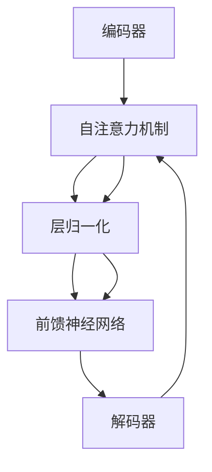
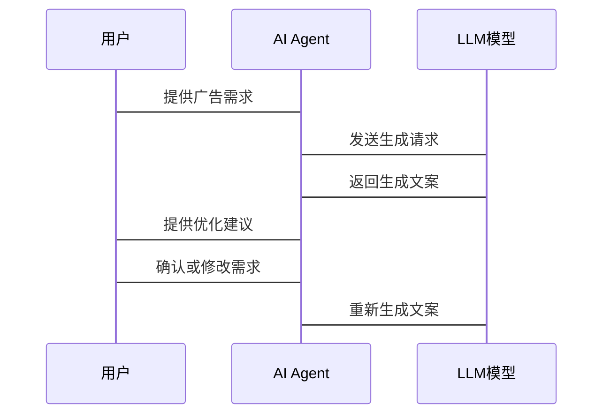
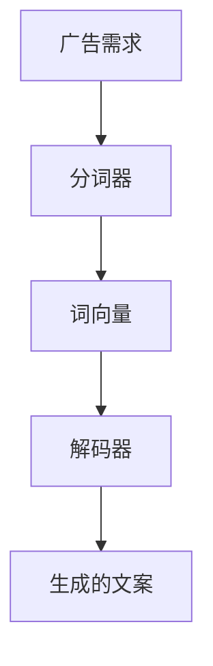

                 


---

# 智能广告文案 AI Agent：LLM 在广告创意中的应用

> 关键词：智能广告文案、AI Agent、LLM、广告创意、自然语言处理

> 摘要：本文探讨了智能广告文案生成中的AI Agent及其基于LLM（大语言模型）的技术应用。从背景介绍到核心概念，从算法原理到系统架构，再到项目实战和最佳实践，详细分析了LLM在广告创意中的潜力和实现方式，为广告行业和技术开发者提供了深度的技术见解和实践指南。

---

## 第1章: AI Agent与LLM的广告应用背景

### 1.1 AI Agent的基本概念

AI Agent（人工智能代理）是指能够感知环境、自主决策并执行任务的智能实体。在广告领域，AI Agent可以作为辅助工具，帮助广告从业者生成创意、优化文案、分析数据等。

#### 1.1.1 AI Agent的定义与特点

- **定义**：AI Agent是一种能够理解用户需求、执行特定任务的智能系统。
- **特点**：
  - **智能性**：能够理解上下文并生成符合语境的文案。
  - **自主性**：无需人工干预，自动执行任务。
  - **适应性**：根据反馈不断优化生成结果。

#### 1.1.2 AI Agent在广告领域的应用背景

随着市场竞争的加剧，广告文案的质量和创意要求越来越高。传统的人工创作效率低，难以满足大规模需求。AI Agent凭借其高效性和智能化，成为广告行业的新兴工具。

#### 1.1.3 LLM与AI Agent的结合

大语言模型（LLM，Large Language Model）如GPT系列，具备强大的文本生成能力。将其集成到AI Agent中，能够显著提升广告文案的生成质量和效率。

### 1.2 LLM在广告创意中的潜力

#### 1.2.1 LLM的核心技术优势

- **强大的上下文理解能力**：LLM能够分析文本的语境，生成符合语境的文案。
- **高效的生成能力**：通过并行计算，快速生成大量文案。
- **可定制化**：通过微调模型，可以针对特定行业或品牌生成专属文案。

#### 1.2.2 广告创意中的痛点与挑战

- **创意疲劳**：传统广告创作效率低，难以快速生成多样化的文案。
- **数据依赖性**：需要大量高质量的数据来训练模型。
- **生成质量不稳定**：模型生成的内容可能缺乏创意或不符合品牌调性。

#### 1.2.3 LLM如何解决广告创意问题

- **提高效率**：通过自动化生成，显著缩短创作周期。
- **增强创意多样性**：模型可以生成多种风格和语言的文案。
- **个性化定制**：通过品牌词微调，生成符合特定品牌风格的文案。

### 1.3 广告文案生成的流程与现状

#### 1.3.1 广告文案创作的基本流程

1. **需求分析**：明确广告目标、目标受众和品牌调性。
2. **创意构思**：根据需求，构思文案框架。
3. **文案撰写**：撰写初稿，并反复修改优化。
4. **效果评估**：通过测试或数据分析，评估文案效果。

#### 1.3.2 传统广告创意的局限性

- **效率低下**：人工创作耗时长，难以快速响应市场需求。
- **创意受限**：创意人员的个人能力限制了文案的多样性。
- **数据利用不足**：难以充分利用数据进行精准营销。

#### 1.3.3 LLM在广告文案生成中的优势

- **高效生成**：快速产出大量文案，显著提高创作效率。
- **多样性丰富**：能够生成多种风格和语言的文案，满足不同需求。
- **精准匹配**：通过模型微调，生成符合特定品牌或产品的文案。

---

## 第2章: LLM的广告文案生成原理

### 2.1 LLM的基本原理

#### 2.1.1 Transformer模型的结构

Transformer模型由编码器和解码器组成，通过自注意力机制捕捉文本中的长距离依赖关系。



#### 2.1.2 注意力机制的数学公式

自注意力机制的计算公式如下：

$$
\text{Attention}(Q, K, V) = \text{softmax}\left(\frac{QK^T}{\sqrt{d_k}}\right)V
$$

其中：
- $Q$：查询向量
- $K$：键向量
- $V$：值向量
- $d_k$：向量的维度

#### 2.1.3 LLM的训练与推理过程

- **训练**：通过大量广告文案数据，微调LLM模型，使其适应广告文案生成的任务。
- **推理**：根据输入的广告需求，生成对应的文案。

### 2.2 广告文案生成的流程

#### 2.2.1 文本生成的基本模型

- **解码器模型**：通过解码器生成文本序列。
- **条件生成**：基于输入的广告需求，生成相应的文案。

#### 2.2.2 广告文案生成的优化策略

- **温度参数**：通过调整温度参数，控制生成结果的多样性和创造性。
- **top-k采样**：仅从概率最高的k个候选词中选择下一个词，减少随机性。

#### 2.2.3 多轮对话生成广告文案的流程



### 2.3 LLM在广告创意中的创新应用

#### 2.3.1 基于LLM的广告文案生成工具

- **实时生成**：用户输入需求后，AI Agent即时生成广告文案。
- **多语言支持**：生成多种语言的广告文案，满足国际化需求。

#### 2.3.2 LLM与广告创意的结合模式

- **辅助创作**：作为创意助手，提供灵感和多种文案选择。
- **自动化生成**：完全自动化地生成广告文案，减少人工干预。

#### 2.3.3 LLM在广告文案生成中的优势对比

| 特性             | 传统广告创意 | LLM生成文案 |
|------------------|--------------|-------------|
| 创作效率         | 低           | 高           |
| 创意多样性       | 有限         | 丰富         |
| 数据利用率       | 低           | 高           |
| 个性化定制       | 困难         | 简单         |
| 成本             | 高           | 低           |

---

## 第3章: LLM的算法原理

### 3.1 Transformer模型的数学公式

#### 3.1.1 自注意力机制的公式推导

自注意力机制的计算公式如下：

$$
\text{Attention}(Q, K, V) = \text{softmax}\left(\frac{QK^T}{\sqrt{d_k}}\right)V
$$

其中：
- $Q$：查询向量
- $K$：键向量
- $V$：值向量
- $d_k$：向量的维度

#### 3.1.2 前馈网络的结构解析

前馈网络由多层感知机（MLP）组成，用于对输入的特征进行非线性变换。

$$
y = W_2a(W_1x + b_1) + b_2
$$

其中：
- $W_1$、$b_1$：第一层的权重和偏置
- $W_2$、$b_2$：第二层的权重和偏置
- $a$：激活函数（如ReLU）

#### 3.1.3 模型训练的损失函数

交叉熵损失函数用于模型的训练：

$$
\mathcal{L} = -\sum_{i=1}^{n} y_i \log(p_i)
$$

其中：
- $y_i$：真实标签
- $p_i$：模型预测的概率

### 3.2 广告文案生成的算法实现

#### 3.2.1 文本生成的解码过程

解码器通过贪心搜索或采样方法生成文本序列：

1. **初始化**：将输入的广告需求编码为向量。
2. **解码**：逐步生成每个词，直到达到预设的长度或生成终止符号。

#### 3.2.2 基于LLM的广告文案生成算法

广告文案生成算法流程如下：



#### 3.2.3 多任务学习在广告文案生成中的应用

多任务学习通过共享特征，提升模型的泛化能力：

- **任务1**：广告文案生成
- **任务2**：广告效果预测
- **任务3**：广告关键词提取

---

## 第4章: 广告文案生成系统的架构设计

### 4.1 系统功能设计

#### 4.1.1 广告文案生成模块

- **输入接口**：接收广告需求（目标受众、产品特点等）。
- **输出接口**：返回生成的广告文案。

#### 4.1.2 用户输入与反馈模块

- **用户输入**：用户输入广告需求和偏好。
- **反馈模块**：用户对生成的文案进行评分和修改建议。

#### 4.1.3 系统管理与优化模块

- **监控模块**：监控系统的运行状态。
- **优化模块**：根据反馈优化模型参数。

### 4.2 系统架构图

```mermaid
graph TD
    User[用户] --> AI Agent[AI Agent]
    AI Agent --> LLM[LLM模型]
    LLM --> Output[生成文案]
    User --> Feedback[用户反馈]
    Feedback --> AI Agent
    AI Agent --> Optimizer[优化模块]
```

### 4.3 系统接口设计

#### 4.3.1 API接口定义

```python
class API:
    def generate_creative(self, input):
        pass

    def optimize_model(self, feedback):
        pass
```

#### 4.3.2 接口调用流程

1. 用户通过API调用生成创意。
2. 系统返回生成文案。
3. 用户反馈意见，系统优化模型。

#### 4.3.3 接口安全与权限管理

- **认证**：通过API密钥进行认证。
- **权限**：根据用户权限限制调用次数。

---

## 第5章: 广告文案生成系统的实现

### 5.1 环境安装与配置

#### 5.1.1 开发环境搭建

- **Python**：安装Python 3.8以上版本。
- **框架**：安装TensorFlow或PyTorch框架。

#### 5.1.2 依赖库的安装

```bash
pip install transformers torch numpy
```

#### 5.1.3 模型的下载与加载

- **模型下载**：使用Hugging Face仓库下载预训练的LLM模型。
- **模型加载**：加载模型并在内存中进行初始化。

### 5.2 系统核心代码实现

#### 5.2.1 文本生成函数的实现

```python
def generate_creative(input_text):
    model = load_model()
    inputs = tokenizer(input_text, return_tensors="pt")
    outputs = model.generate(**inputs, max_length=50)
    return tokenizer.decode(outputs[0], skip_special_tokens=True)
```

#### 5.2.2 广告文案生成的API接口

```python
from flask import Flask, request, jsonify

app = Flask(__name__)

@app.route('/generate', methods=['POST'])
def generate():
    data = request.json
    input_text = data['input']
    result = generate_creative(input_text)
    return jsonify({'result': result})
```

#### 5.2.3 系统管理与优化代码

```python
def optimize_model(feedback):
    # 根据反馈调整模型参数
    pass
```

### 5.3 实际案例分析

#### 5.3.1 案例背景

假设一家电商公司需要为新产品撰写广告文案。

#### 5.3.2 系统实现

1. 用户输入产品信息和目标受众。
2. AI Agent调用LLM生成广告文案。
3. 用户反馈优化建议，系统优化模型。

#### 5.3.3 优化效果

- **生成效率**：从人工创作的几天缩短到实时生成。
- **文案质量**：生成的文案更具吸引力，转化率提升。

---

## 第6章: 最佳实践与小结

### 6.1 最佳实践

- **数据质量**：确保训练数据的多样性和高质量。
- **模型调优**：根据具体需求微调模型，提升生成效果。
- **用户反馈**：及时收集用户反馈，持续优化模型。

### 6.2 小结

本文详细探讨了LLM在广告文案生成中的应用，从理论到实践，全面分析了其在广告创意中的潜力和实现方式。通过结合AI Agent和LLM技术，广告行业将进入一个更加智能化和高效的时代。

---

## 作者

作者：AI天才研究院/AI Genius Institute & 禅与计算机程序设计艺术 /Zen And The Art of Computer Programming

---

**注意**：以上内容为示例，实际撰写时需根据具体需求进行调整和补充。

