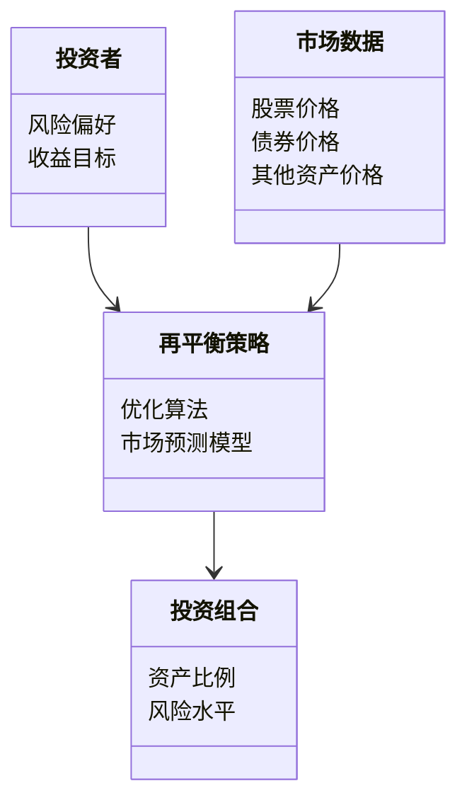
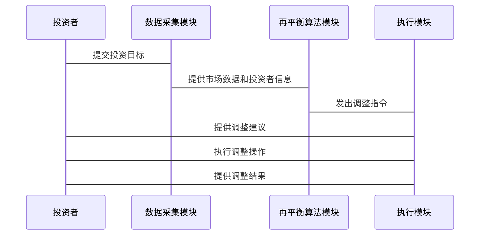

                 


# 智能投资组合再平衡策略优化

> 关键词：智能投资组合，再平衡策略，优化算法，动态调整，机器学习

> 摘要：本文详细探讨了智能投资组合再平衡策略的优化方法，从传统策略到基于机器学习的智能策略，结合数学优化模型和实际案例，分析了不同策略的优劣及实现细节，最后提出了优化的系统架构设计方案。

---

# 第一部分: 智能投资组合再平衡的背景与基础

## 第1章: 智能投资组合再平衡概述

### 1.1 投资组合再平衡的核心概念

#### 1.1.1 投资组合的定义与特点
投资组合是指将多种金融资产（如股票、债券、基金等）按照一定比例组合在一起，以实现风险分散和收益最大化的一种投资方式。其特点包括：
- **分散性**：通过多样化投资降低风险。
- **动态性**：根据市场变化和投资者目标进行调整。
- **目标导向性**：根据特定的收益目标和风险承受能力进行优化。

#### 1.1.2 再平衡的必要性与目的
再平衡是指定期调整投资组合中各资产的比例，以维持预期的风险收益配比。其必要性在于：
- **应对市场波动**：不同资产的波动性和收益表现不同，需要定期调整。
- **适应投资者目标变化**：如风险承受能力、收益目标的变化。
- **降低投资风险**：通过调整避免单一资产过度集中。

#### 1.1.3 智能再平衡的核心概念
智能再平衡利用人工智能和大数据技术，通过动态分析市场和投资者需求，实时或定期优化投资组合。其核心在于：
- **自动化**：利用算法自动调整资产配置。
- **智能化**：基于市场预测和投资者行为分析进行优化。

### 1.2 传统投资组合再平衡的局限性

#### 1.2.1 定期再平衡的缺陷
- **固定频率的不足**：如每月或每季度调整，可能无法及时应对突发市场变化。
- **固定比例的局限**：假设市场环境不变，可能导致收益损失。

#### 1.2.2 阈值再平衡的挑战
- **阈值设置的复杂性**：需要根据市场波动和投资者需求动态调整。
- **执行成本**：频繁调整可能导致交易成本增加。

#### 1.2.3 传统策略的改进空间
- **缺乏实时性**：传统策略通常基于固定时间间隔调整，未能充分利用实时市场数据。
- **静态性**：未能根据市场变化动态调整。

---

## 第2章: 传统投资组合再平衡策略

### 2.1 定期再平衡策略

#### 2.1.1 定期再平衡的定义与特点
- **定义**：按照固定的时间间隔（如每月、每季度）进行再平衡。
- **特点**：简单易行，但缺乏灵活性和实时性。

#### 2.1.2 定期再平衡的优缺点
- **优点**：
  - 简单易行，易于实现。
  - 能够避免过度交易和频繁调整。
- **缺点**：
  - 无法应对突发事件或市场剧烈波动。
  - 可能导致短期收益损失。

#### 2.1.3 定期再平衡的实现步骤
1. 确定再平衡的时间间隔（如每月）。
2. 计算当前组合与目标比例的偏差。
3. 调整各资产比例以达到目标。

### 2.2 基于阈值的再平衡策略

#### 2.2.1 阈值再平衡的定义与特点
- **定义**：当某资产的比例偏离目标比例达到一定阈值时，触发再平衡。
- **特点**：灵活性较高，可以根据市场波动调整。

#### 2.2.2 阈值再平衡的优缺点
- **优点**：
  - 能够根据市场波动及时调整。
  - 减少不必要的交易成本。
- **缺点**：
  - 阈值设置复杂，需要根据市场环境动态调整。
  - 可能导致延迟调整，影响收益。

#### 2.2.3 阈值再平衡的实现步骤
1. 设定目标比例和偏离阈值。
2. 定期检查各资产比例是否偏离目标。
3. 当偏离超过阈值时，触发再平衡操作。

### 2.3 传统再平衡策略的对比与优化

#### 2.3.1 优劣势对比
| 策略类型   | 优点                          | 缺点                          |
|------------|-------------------------------|-------------------------------|
| 定期再平衡 | 简单易行，减少交易成本        | 缺乏灵活性，可能错失市场机会    |
| 阈值再平衡 | 灵活性高，减少不必要的交易    | 阈值设置复杂，可能延迟调整      |

#### 2.3.2 传统策略的优化空间
- **引入动态阈值**：根据市场波动性和投资者目标动态调整阈值。
- **结合市场预测**：在传统策略基础上，加入市场预测模型，提前调整。

---

## 第3章: 基于机器学习的再平衡策略

### 3.1 机器学习在投资组合管理中的应用

#### 3.1.1 机器学习的核心概念
- **定义**：一种数据驱动的算法，能够从历史数据中学习模式并进行预测。
- **应用**：在金融领域，主要用于市场预测、风险评估和资产配置。

#### 3.1.2 机器学习在再平衡中的作用
- **优势**：
  - 能够处理大量数据，发现复杂模式。
  - 可以实时更新模型，适应市场变化。

### 3.2 基于机器学习的再平衡策略实现

#### 3.2.1 算法选择与实现步骤
1. 数据收集：收集历史市场数据和投资者目标。
2. 数据预处理：清洗数据，处理缺失值和异常值。
3. 模型训练：使用机器学习算法（如随机森林、神经网络）训练市场预测模型。
4. 再平衡决策：根据预测结果和当前组合比例，调整资产配置。

#### 3.2.2 实例分析与效果评估
- **案例分析**：
  - 假设市场预测模型预测股票市场将上涨，债券市场将下跌。
  - 调整投资组合，增加股票比例，减少债券比例。
- **效果评估**：
  - 比较调整后的收益与未调整的收益，评估策略的有效性。

### 3.3 基于动态优化的再平衡策略

#### 3.3.1 动态优化的基本原理
- **定义**：根据实时市场数据和投资者目标，动态调整投资组合。
- **实现步骤**：
  1. 实时监测市场数据。
  2. 使用优化算法计算最优资产配置。
  3. 调整组合比例以达到最优配置。

#### 3.3.2 动态再平衡算法的设计与实现
- **算法选择**：使用遗传算法、粒子群优化等方法。
- **优化目标**：最大化收益，最小化风险。

#### 3.3.3 动态策略在实际中的应用
- **案例分析**：
  - 市场突然下跌，动态优化算法迅速调整，减少损失。
- **效果评估**：
  - 比较动态调整与定期调整的收益和风险，评估动态策略的优越性。

---

## 第4章: 智能再平衡策略的核心算法

### 4.1 基于数学优化的再平衡算法

#### 4.1.1 数学优化模型的建立
- **目标函数**：最大化收益，最小化风险。
- **约束条件**：资产比例之和为1，风险承受能力等。

#### 4.1.2 线性规划与非线性优化的对比
- **线性规划**：
  - 优点：计算简单，适合线性问题。
  - 缺点：无法处理非线性约束。
- **非线性优化**：
  - 优点：能够处理复杂问题。
  - 缺点：计算复杂，需要更多计算资源。

#### 4.1.3 算法实现与优化技巧
- **实现步骤**：
  1. 建立优化模型。
  2. 使用优化算法求解。
  3. 验证模型的可行性和效果。
- **优化技巧**：
  - 使用高效的优化算法（如内点法）。
  - 并行计算，提高计算效率。

### 4.2 基于机器学习的预测模型

#### 4.2.1 机器学习模型的选择与训练
- **模型选择**：
  - 根据数据特征和预测目标选择合适模型（如随机森林、神经网络）。
- **训练步骤**：
  1. 数据预处理。
  2. 划分训练集和测试集。
  3. 训练模型并评估性能。

#### 4.2.2 预测模型在再平衡中的应用
- **预测结果**：
  - 使用模型预测未来市场走势。
  - 根据预测结果调整投资组合。
- **模型评估**：
  - 比较预测结果与实际结果，评估模型的准确性。

### 4.3 数学模型与机器学习的结合

#### 4.3.1 结合方式
- **方式一**：使用机器学习模型预测市场，结合数学优化算法调整组合。
- **方式二**：将机器学习模型嵌入优化模型中，进行端到端优化。

#### 4.3.2 组合优化的数学模型
$$ \text{目标函数：} \max \sum w_i r_i $$
$$ \text{约束条件：} \sum w_i = 1, \sum w_i^2 \leq \text{风险容忍度} $$

其中，\( w_i \) 是第 \( i \) 个资产的权重，\( r_i \) 是预期收益率。

#### 4.3.3 实例分析
- **案例分析**：
  - 使用随机森林模型预测股票和债券的未来收益。
  - 使用数学优化算法计算最优资产配置。
  - 调整组合比例，实现收益和风险的最优平衡。

---

## 第5章: 系统架构与实现

### 5.1 系统架构设计

#### 5.1.1 领域模型设计


#### 5.1.2 系统架构设计


### 5.2 系统接口设计

#### 5.2.1 输入接口
- **投资者信息**：
  - 风险偏好
  - 收益目标
- **市场数据**：
  - 股票价格
  - 债券价格
  - 其他资产价格

#### 5.2.2 输出接口
- **投资建议**：
  - 资产配置建议
  - 再平衡操作建议
- **执行结果**：
  - 调整后的组合比例
  - 调整收益与风险评估

### 5.3 系统交互流程

#### 5.3.1 交互流程


---

## 第6章: 项目实战与优化

### 6.1 项目环境安装

#### 6.1.1 环境要求
- **编程语言**：Python 3.8+
- **库依赖**：
  - `numpy`：数据处理
  - `pandas`：数据操作
  - `scikit-learn`：机器学习模型
  - `scipy`：优化算法

#### 6.1.2 安装步骤
```bash
pip install numpy pandas scikit-learn scipy
```

### 6.2 核心代码实现

#### 6.2.1 机器学习预测模型
```python
from sklearn.ensemble import RandomForestRegressor
import pandas as pd
import numpy as np

# 数据加载与预处理
data = pd.read_csv('market_data.csv')
X = data[['stock_price', 'bond_price', 'other_assets']]
y = data['returns']

# 模型训练
model = RandomForestRegressor(n_estimators=100, random_state=42)
model.fit(X, y)

# 预测未来收益
new_data = pd.DataFrame({
    'stock_price': [100],
    'bond_price': [50],
    'other_assets': [20]
})
predicted_returns = model.predict(new_data)
print(predicted_returns)
```

#### 6.2.2 数学优化算法实现
```python
from scipy.optimize import minimize

# 定义目标函数
def objective(x):
    return -sum(x * returns)  # 最大化收益

# 定义约束条件
def constraint1(x):
    return sum(x) - 1  # 资产比例之和为1

# 定义优化问题
x0 = np.ones(len(returns)) / len(returns)
bounds = [(0, 1) for _ in range(len(returns))]
constraints = [{'type': 'eq', 'fun': constraint1}]

# 求解
result = minimize(objective, x0, method='SLSQP', bounds=bounds, constraints=constraints)
optimal_weights = result.x
print(optimal_weights)
```

### 6.3 实际案例分析

#### 6.3.1 数据准备与模型训练
- 数据来源：历史市场数据
- 数据预处理：清洗和归一化
- 模型训练：随机森林回归模型

#### 6.3.2 再平衡策略实现
- 预测未来收益
- 计算最优资产配置
- 调整组合比例

### 6.4 项目小结

#### 6.4.1 项目总结
- 成功实现了基于机器学习和数学优化的智能再平衡策略。
- 系统架构清晰，代码实现简洁。

#### 6.4.2 经验与教训
- 数据质量对模型性能影响重大。
- 优化算法的选择需要根据具体问题调整。

#### 6.4.3 未来改进方向
- 引入更多市场数据（如宏观经济指标）。
- 使用更复杂的机器学习模型（如深度学习）。
- 实现实时再平衡策略。

---

## 第7章: 最佳实践与注意事项

### 7.1 最佳实践

#### 7.1.1 数据质量管理
- 确保数据的完整性和准确性。
- 处理缺失值和异常值。

#### 7.1.2 模型选择与调优
- 根据问题特点选择合适模型。
- 调参优化，提升模型性能。

#### 7.1.3 系统监控与维护
- 实时监控系统运行状态。
- 定期更新模型和优化算法。

### 7.2 注意事项

#### 7.2.1 风险管理
- 设定合理的风险容忍度。
- 定期评估投资组合的风险水平。

#### 7.2.2 成本控制
- 优化交易成本，避免频繁调整。
- 平衡模型复杂度与计算成本。

#### 7.2.3 伦理与合规
- 遵守相关法律法规。
- 保护投资者隐私和数据安全。

---

## 第8章: 总结与展望

### 8.1 总结
本文详细探讨了智能投资组合再平衡策略的优化方法，从传统策略到基于机器学习的智能策略，结合数学优化模型和实际案例，分析了不同策略的优劣及实现细节，最后提出了优化的系统架构设计方案。

### 8.2 未来展望
随着人工智能和大数据技术的不断发展，智能投资组合再平衡策略将更加智能化和动态化。未来的研究方向包括：
- 更复杂的预测模型。
- 更高效的优化算法。
- 更智能的动态调整策略。

---

## 附录: 参考文献

1. [风险管理与投资组合](https://www.example.com/risk-management)
2. [机器学习在金融中的应用](https://www.example.com/ml-in-finance)
3. [数学优化算法](https://www.example.com/math-optimization)

---

# 作者：AI天才研究院 & 禅与计算机程序设计艺术

