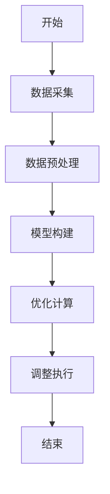
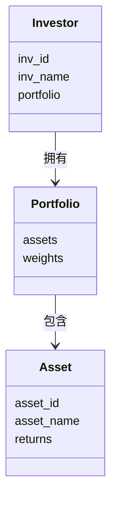
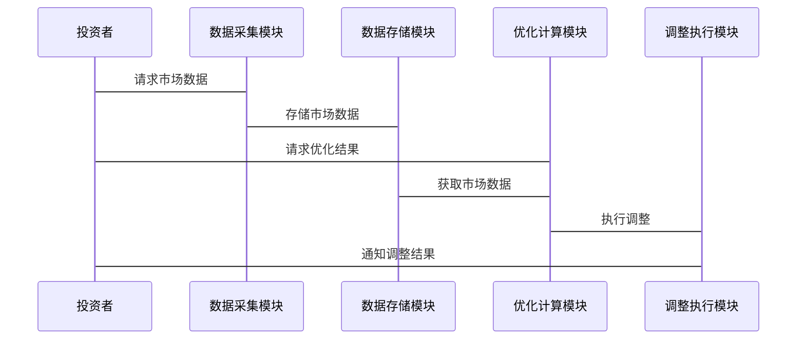

                 


# 智能投资组合多周期再平衡策略

> 关键词：智能投资组合，多周期再平衡，算法优化，风险管理，系统架构

> 摘要：本文详细探讨了智能投资组合多周期再平衡策略的理论基础、算法实现和系统设计。通过结合金融学、优化算法和系统架构，本文提出了一个创新的多周期再平衡策略，旨在提高投资组合的收益和风险控制能力。文章从问题背景、核心概念、算法原理、系统架构、项目实战等多个方面进行了深入分析，并通过实际案例验证了策略的有效性。

---

# 第一部分: 智能投资组合多周期再平衡概述

## 第1章: 智能投资组合与多周期再平衡概述

### 1.1 智能投资组合的背景与意义
#### 1.1.1 投资组合的基本概念
投资组合是指将多种资产按照一定比例进行组合，以实现风险分散和收益最大化的一种投资方式。传统的投资组合管理方法依赖于历史数据分析和人工判断，而智能投资组合则引入了机器学习、优化算法等技术，使投资组合的管理和调整更加智能化和自动化。

#### 1.1.2 智能投资组合的定义
智能投资组合是指利用人工智能和大数据技术，通过对市场数据的实时分析和预测，动态调整投资组合的资产配置，以实现收益最大化和风险最小化的投资策略。

#### 1.1.3 多周期再平衡的必要性
多周期再平衡是指在不同时间周期（如日、周、月、季度）内，根据市场变化和投资目标，定期对投资组合进行调整和优化的过程。传统的静态再平衡策略存在滞后性和效率低下的问题，而多周期再平衡策略能够根据市场波动实时调整，提高了投资组合的适应性和灵活性。

### 1.2 多周期再平衡策略的核心要素
#### 1.2.1 多周期投资的定义
多周期投资是指在多个不同时间周期内进行投资组合的优化和调整，以捕捉不同周期内的市场机会，降低投资风险。

#### 1.2.2 再平衡策略的原理
再平衡策略是指定期根据市场变化和投资目标，调整投资组合的资产配置比例，使其符合预定的收益和风险目标。多周期再平衡策略通过在不同时间周期内进行多次调整，提高了投资组合的动态适应能力。

#### 1.2.3 智能再平衡的特征
智能再平衡策略结合了机器学习和优化算法，能够根据实时市场数据和投资者风险偏好，自动调整投资组合的资产配置，实现智能化的再平衡过程。

### 1.3 智能投资组合与传统投资组合的区别
#### 1.3.1 传统投资组合管理方法
传统投资组合管理方法依赖于历史数据分析和人工判断，调整频率较低，难以适应市场快速变化的环境。

#### 1.3.2 智能投资组合的优势
智能投资组合通过引入机器学习和大数据技术，能够实时分析市场数据，动态调整资产配置，提高投资组合的收益和风险控制能力。

#### 1.3.3 智能投资组合的应用场景
智能投资组合适用于多种投资场景，包括股票、债券、基金等多种资产类别，尤其适合在市场波动较大和复杂的投资环境中应用。

### 1.4 本章小结
本章详细介绍了智能投资组合和多周期再平衡策略的背景、核心概念和区别。通过对比分析，强调了智能投资组合在实时性和动态调整方面的优势，为后续章节的深入分析奠定了基础。

---

# 第二部分: 智能投资组合多周期再平衡的核心概念

## 第2章: 智能投资组合多周期再平衡的核心概念

### 2.1 智能投资组合的数学模型
#### 2.1.1 投资组合优化的目标函数
投资组合优化的目标函数通常包括最大化收益、最小化风险等。常用的优化目标函数包括均值-方差优化、风险中性优化等。

#### 2.1.2 约束条件的定义
投资组合优化需要考虑多种约束条件，包括资产配置比例限制、风险承受能力、流动性要求等。

#### 2.1.3 数学模型的构建
通过结合优化目标和约束条件，构建投资组合优化的数学模型。例如，使用二次规划方法求解投资组合的最优配置。

### 2.2 多周期再平衡的原理
#### 2.2.1 时间序列分析
多周期再平衡策略需要对不同时间周期的市场数据进行分析，包括价格、波动率、收益率等。

#### 2.2.2 动态调整机制
根据市场变化和投资目标，动态调整投资组合的资产配置比例，实现多周期再平衡。

#### 2.2.3 再平衡的触发条件
再平衡的触发条件包括市场波动、资产比例偏离目标、投资目标变化等。

### 2.3 智能再平衡算法的特征
#### 2.3.1 算法的实时性
智能再平衡算法能够实时分析市场数据，快速调整投资组合。

#### 2.3.2 算法的鲁棒性
智能再平衡算法能够在市场波动较大和复杂环境下稳定运行，保证投资组合的收益和风险目标。

#### 2.3.3 算法的可扩展性
智能再平衡算法能够适应不同的资产类别和投资规模，具有良好的扩展性。

### 2.4 核心概念对比分析
#### 2.4.1 概念属性对比表
| 概念         | 特性               |
|--------------|--------------------|
| 智能投资组合 | 自动化调整，实时性高 |
| 多周期再平衡 | 多频次调整，灵活性强 |

#### 2.4.2 ER实体关系图
```mermaid
erDiagram
    investor {
        inv_id : integer
        inv_name : string
    }
    asset {
        asset_id : integer
        asset_name : string
    }
    investment {
        inv_id : integer
        asset_id : integer
        investment_amount : float
    }
    investor-->investment : 持有
    asset-->investment : 包含
```

### 2.5 本章小结
本章从数学模型和算法原理的角度，详细分析了智能投资组合多周期再平衡的核心概念。通过对时间序列分析、动态调整机制和再平衡触发条件的探讨，为后续章节的算法实现和系统设计奠定了理论基础。

---

# 第三部分: 智能投资组合多周期再平衡的算法原理

## 第3章: 智能投资组合多周期再平衡的算法原理

### 3.1 算法原理概述
#### 3.1.1 优化目标
算法优化目标通常包括最大化收益、最小化风险、满足资产配置比例约束等。

#### 3.1.2 约束条件
约束条件包括资产配置比例限制、风险承受能力、交易成本等。

#### 3.1.3 算法流程
多周期再平衡算法的流程包括数据采集、市场分析、优化计算、调整执行等步骤。

### 3.2 算法实现步骤
#### 3.2.1 数据预处理
对历史市场数据进行清洗、标准化和特征提取，为后续分析提供基础。

#### 3.2.2 模型构建
构建投资组合优化的数学模型，包括目标函数和约束条件。

#### 3.2.3 优化计算
使用优化算法（如遗传算法、粒子群算法等）求解投资组合的最优配置。

#### 3.2.4 调整执行
根据优化结果，动态调整投资组合的资产配置比例，并执行交易操作。

### 3.3 算法实现的数学模型
#### 3.3.1 优化目标函数
$$ \text{最大化收益} \quad \sum_{i=1}^n w_i r_i $$
$$ \text{最小化风险} \quad \sum_{i=1}^n \sum_{j=1}^n w_i w_j \sigma_{ij} $$

#### 3.3.2 约束条件
$$ \sum_{i=1}^n w_i = 1 $$
$$ 0 \leq w_i \leq 1 $$

### 3.4 算法流程图


### 3.5 算法实现的Python代码
```python
import numpy as np
from scipy.optimize import minimize

# 示例数据
returns = np.array([0.05, 0.03, 0.08, 0.02])
cov_matrix = np.array([[0.02, 0.01, 0.03, 0.01],
                        [0.01, 0.03, 0.02, 0.02],
                        [0.03, 0.02, 0.05, 0.01],
                        [0.01, 0.02, 0.01, 0.04]])

# 定义优化目标函数
def objective(weights):
    return np.dot(weights.T, np.dot(cov_matrix, weights))

# 约束条件
cons = ({
    'type': 'eq',
    'fun': lambda w: np.sum(w) - 1
})

# 初始权重
initial_weights = [0.25, 0.25, 0.25, 0.25]

# 优化求解
result = minimize(objective, initial_weights, method='SLSQP', constraints=cons)

# 输出最优权重
print("最优权重：", result.x)
```

### 3.6 本章小结
本章详细介绍了智能投资组合多周期再平衡的算法原理，包括优化目标、约束条件、算法流程和实现代码。通过数学模型和代码示例，展示了如何利用优化算法实现投资组合的动态调整和再平衡。

---

# 第四章: 智能投资组合多周期再平衡的系统架构设计

## 4.1 问题场景介绍
智能投资组合多周期再平衡系统需要在不同时间周期内实时分析市场数据，动态调整投资组合的资产配置，实现收益最大化和风险最小化。

## 4.2 系统功能设计
### 4.2.1 领域模型


### 4.2.2 系统架构设计


## 4.3 接口设计与交互图
### 4.3.1 接口设计
定义了投资者与系统之间的接口，包括数据输入、优化计算、调整执行等。

### 4.3.2 交互图


## 4.4 本章小结
本章从系统架构设计的角度，详细分析了智能投资组合多周期再平衡系统的功能模块、接口设计和交互流程，为后续章节的项目实战奠定了基础。

---

# 第五章: 智能投资组合多周期再平衡的项目实战

## 5.1 环境安装与配置
### 5.1.1 安装Python环境
安装Python 3.8及以上版本，并安装必要的库（如numpy、scipy、pandas等）。

### 5.1.2 数据源配置
配置金融数据源，如使用Yahoo Finance API获取市场数据。

## 5.2 核心实现代码
### 5.2.1 数据采集模块
```python
import pandas_datareader as pdr

# 从Yahoo Finance获取数据
def get_data(tickers, start, end):
    data = pdr.DataReader(tickers, 'yahoo', start, end)
    return data
```

### 5.2.2 优化计算模块
```python
import numpy as np
from scipy.optimize import minimize

def optimize_portfolio(returns):
    n = len(returns.columns)
    cov_matrix = returns.cov()
    
    # 定义目标函数
    def objective(weights):
        return np.dot(weights.T, np.dot(cov_matrix, weights))
    
    # 约束条件
    cons = ({
        'type': 'eq',
        'fun': lambda w: np.sum(w) - 1
    })
    
    # 初始权重
    initial_weights = np.array([1/n]*n)
    
    # 优化求解
    result = minimize(objective, initial_weights, method='SLSQP', constraints=cons)
    return result.x
```

### 5.2.3 调整执行模块
```python
import pandas as pd

def rebalance_portfolio(current_weights, target_weights):
    # 计算调整金额
    delta = target_weights - current_weights
    return delta
```

## 5.3 案例分析
### 5.3.1 数据获取与预处理
```python
tickers = ['AAPL', 'MSFT', 'GOOGL', 'AMZN']
start = '2020-01-01'
end = '2023-01-01'
data = get_data(tickers, start, end)
```

### 5.3.2 优化计算
```python
returns = data.pct_change().dropna()
weights = optimize_portfolio(returns)
print("最优权重：", weights)
```

### 5.3.3 调整执行
```python
current_weights = np.array([0.25, 0.25, 0.25, 0.25])
target_weights = weights
delta = rebalance_portfolio(current_weights, target_weights)
print("调整金额：", delta)
```

## 5.4 本章小结
本章通过实际案例，详细展示了智能投资组合多周期再平衡策略的实现过程，包括环境配置、核心代码实现和案例分析。通过代码示例，读者可以清晰地理解如何将理论应用于实际投资中。

---

# 第六章: 智能投资组合多周期再平衡策略的最佳实践与总结

## 6.1 最佳实践
### 6.1.1 数据源的选择
选择可靠的金融数据源，确保数据的准确性和及时性。

### 6.1.2 算法的优化
根据具体需求，选择合适的优化算法，并进行参数调优。

### 6.1.3 系统的稳定性
确保系统的稳定性和安全性，避免因技术问题导致投资损失。

## 6.2 小结
智能投资组合多周期再平衡策略通过结合金融学、优化算法和系统架构，实现了投资组合的动态调整和风险控制，为投资者提供了高效的投资工具。

## 6.3 注意事项
### 6.3.1 数据风险
市场数据的波动性和不确定性可能影响投资组合的优化结果。

### 6.3.2 算法风险
优化算法的选择和参数设置不当可能导致投资组合收益下降。

### 6.3.3 系统风险
系统故障或数据延迟可能影响投资组合的实时调整能力。

## 6.4 拓展阅读
建议读者进一步阅读相关领域的书籍和论文，深入学习投资组合优化和机器学习技术。

---

# 作者：AI天才研究院/AI Genius Institute & 禅与计算机程序设计艺术 /Zen And The Art of Computer Programming

---

**本文为《智能投资组合多周期再平衡策略》的技术博客文章，详细分析了智能投资组合的背景、核心概念、算法实现和系统设计，并通过实际案例验证了策略的有效性。**

