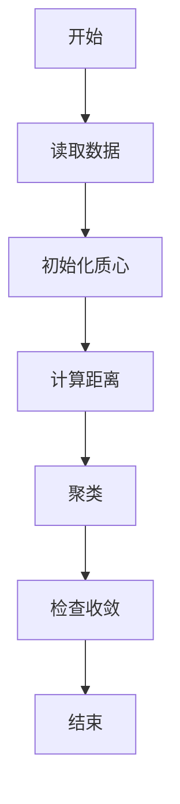
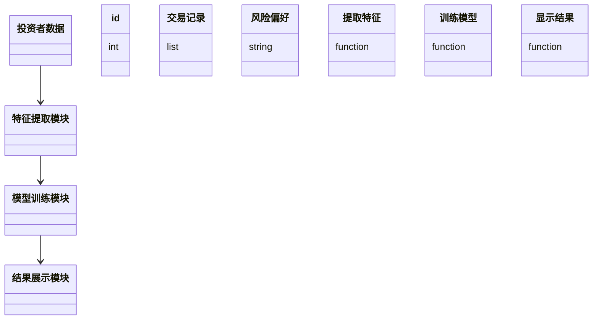
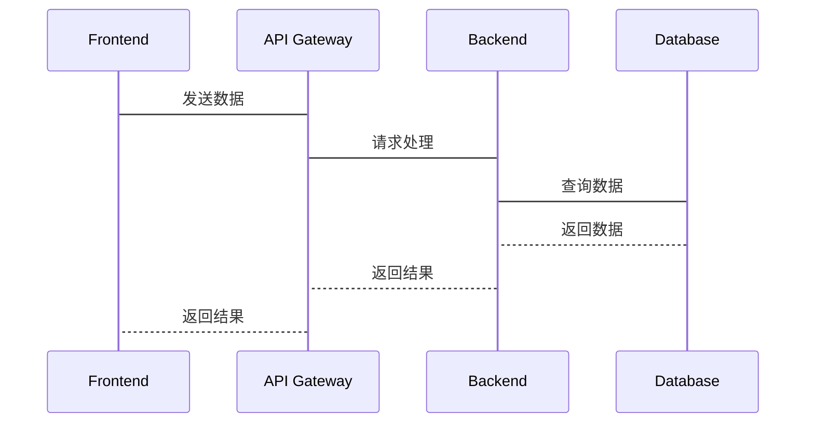

                 


# 智能投资者画像分析平台

> 关键词：智能投资者，画像分析，数据分析，人工智能，机器学习，系统架构

> 摘要：本文详细介绍了智能投资者画像分析平台的构建过程，涵盖背景分析、核心概念、算法原理、系统架构、项目实战和最佳实践。通过分析投资者的行为和特征，利用先进的数据分析和机器学习技术，为投资者提供精准的画像和决策支持。

---

## 第1章 背景介绍

### 1.1 问题背景

#### 1.1.1 投资者画像分析的必要性
在金融市场中，投资者的行为和决策对市场走向有着重要影响。传统的投资者分析方法依赖于人工经验，效率低下且难以捕捉复杂市场变化。通过智能投资者画像分析，可以快速、准确地识别投资者行为模式，为投资决策提供支持。

#### 1.1.2 当前市场中的痛点
- 数据分散：投资者数据来源多样，难以整合和分析。
- 分析效率低：传统方法依赖人工，耗时且容易出错。
- 鲁棒性不足：面对复杂市场环境，分析结果稳定性差。

#### 1.1.3 智能化分析的需求
随着人工智能和大数据技术的发展，智能化投资者画像分析成为可能。通过机器学习算法，可以自动提取数据特征，构建精准的投资者画像。

### 1.2 问题描述

#### 1.2.1 投资者画像的核心要素
- 投资风格：如保守、激进、平衡等。
- 风险偏好：风险承受能力。
- 行为习惯：交易频率、时间偏好等。

#### 1.2.2 数据来源的多样性
- 市场数据：股票价格、成交量等。
- 交易数据：投资者的交易记录。
- 问卷数据：投资者填写的调查问卷。

#### 1.2.3 分析方法的局限性
- 传统统计方法难以捕捉非线性关系。
- 数据维度多，分析复杂度高。

### 1.3 问题解决

#### 1.3.1 智能化分析的解决方案
- 数据清洗与特征提取：处理数据中的噪声，提取关键特征。
- 机器学习模型：构建分类器或聚类模型，识别投资者类型。
- 可视化展示：将分析结果以图表形式展示，便于理解。

#### 1.3.2 技术实现路径
- 数据采集：从多源数据中获取投资者信息。
- 数据处理：清洗、转换和集成数据。
- 模型训练：使用机器学习算法构建投资者画像。
- 结果展示：将分析结果以可视化形式呈现。

#### 1.3.3 平台的目标与价值
- 提供精准的投资者画像，帮助投资机构制定策略。
- 提高分析效率，降低人工成本。
- 增强市场洞察力，捕捉市场趋势。

### 1.4 边界与外延

#### 1.4.1 平台的功能边界
- 仅限于投资者画像分析，不包括投资决策建议。
- 支持多种数据源，但不处理实时交易数据。

#### 1.4.2 相关领域的区别与联系
- 区别于传统数据分析，强调智能化和自动化。
- 联系：数据预处理、特征提取等步骤与传统方法有共性。

#### 1.4.3 可能的扩展方向
- 实时分析：动态更新投资者画像。
- 多维度分析：结合宏观经济指标进行深度分析。

### 1.5 核心要素组成

#### 1.5.1 数据层的核心要素
- 原始数据：交易记录、市场数据、问卷数据。
- 处理后的数据：清洗、转换后的特征数据。

#### 1.5.2 分析层的核心要素
- 特征提取：提取关键特征，如交易频率、收益目标。
- 模型构建：使用机器学习算法构建分类模型。

#### 1.5.3 展示层的核心要素
- 可视化图表：如柱状图、饼图展示投资者分布。
- 画像报告：生成详细的投资者画像报告。

---

## 第2章 核心概念与联系

### 2.1 核心概念原理

#### 2.1.1 数据采集与处理
- 数据采集：从数据库、API等来源获取投资者数据。
- 数据处理：清洗、转换、集成数据，提取特征。

#### 2.1.2 特征提取与建模
- 特征提取：通过统计方法或机器学习模型提取关键特征。
- 建模：使用聚类、分类等算法构建投资者画像。

#### 2.1.3 画像生成与展示
- 画像生成：根据模型输出生成投资者画像。
- 展示：以图表、报告形式展示分析结果。

### 2.2 概念属性特征对比

#### 2.2.1 数据来源对比表

| 数据来源 | 描述 | 优点 | 缺点 |
|----------|------|------|------|
| 交易数据 | 投资者的交易记录 | 准确反映投资行为 | 数据量大，处理复杂 |
| 市场数据 | 股价、成交量等 | 客观反映市场状况 | 无法直接反映投资者行为 |
| 问卷数据 | 投资者填写的调查 | 易获取 | 数据可能不准确 |

#### 2.2.2 分析方法对比表

| 方法 | 描述 | 优点 | 缺点 |
|------|------|------|------|
| 聚类分析 | 发现投资者群体 | 无需标签数据 | 结果可能不稳定 |
| 分类分析 | 根据标签分类 | 结果明确 | 需要标签数据 |
| 主成分分析 | 降维 | 提高效率 | 可能损失信息 |

#### 2.2.3 画像展示方式对比表

| 展示方式 | 描述 | 优点 | 缺点 |
|----------|------|------|------|
| 柱状图 | 展示分布 | 易理解 | 信息有限 |
| 饼图 | 展示比例 | 清晰 | 无法展示细节 |
| 报告 | 文字描述 | 信息全面 | 需要阅读时间 |

### 2.3 ER实体关系图

```mermaid
er
    actor:投资者
    data_source:数据源
    analysis_model:分析模型
    result_display:结果展示
    relation:数据流
    actor --> data_source: 提供数据
    data_source --> analysis_model: 输入数据
    analysis_model --> result_display: 输出结果
```

---

## 第3章 算法原理讲解

### 3.1 算法原理

#### 3.1.1 数据预处理
- 数据清洗：处理缺失值、异常值。
- 数据转换：标准化、归一化。

#### 3.1.2 特征工程
- 特征选择：选择重要特征。
- 特征提取：使用PCA等方法降维。

#### 3.1.3 模型训练
- 选择合适的算法，如K-means聚类。
- 训练模型，提取投资者特征。

### 3.2 算法实现

#### 3.2.1 K-means聚类算法



#### 3.2.2 代码实现

```python
from sklearn.cluster import KMeans
import pandas as pd

# 假设data是处理后的特征数据
kmeans = KMeans(n_clusters=3, random_state=0)
clusters = kmeans.fit_predict(data)

# 输出聚类结果
print(clusters)
```

#### 3.2.3 数学模型

聚类中心计算公式：
$$
\text{center}_i = \frac{1}{n_i} \sum_{j=1}^{n_i} x_j
$$

其中，\( n_i \) 是第i个聚类中的样本数，\( x_j \) 是样本。

---

## 第4章 系统分析与架构设计

### 4.1 问题场景介绍

投资者画像分析平台需要处理大量数据，提供高效的分析结果。系统需要支持多用户同时访问，保证数据安全。

### 4.2 系统功能设计

#### 4.2.1 领域模型图



### 4.3 系统架构设计

#### 4.3.1 架构图


### 4.4 接口设计

#### 4.4.1 HTTP接口

```http
POST /api/analyze
Content-Type: application/json
{
    "data": [...]
}
```

#### 4.4.2 接口交互流程图



---

## 第5章 项目实战

### 5.1 环境安装

#### 5.1.1 安装Python

```bash
python --version
pip install --upgrade pip
```

#### 5.1.2 安装依赖

```bash
pip install pandas scikit-learn matplotlib
```

### 5.2 系统核心实现

#### 5.2.1 核心代码

```python
import pandas as pd
from sklearn.cluster import KMeans
import matplotlib.pyplot as plt

# 加载数据
data = pd.read_csv('investors.csv')

# 数据预处理
data.dropna(inplace=True)
data = pd.get_dummies(data)

# 模型训练
kmeans = KMeans(n_clusters=3, random_state=0)
clusters = kmeans.fit_predict(data)

# 可视化
plt.scatter(data['feature1'], data['feature2'], c=clusters)
plt.show()
```

#### 5.2.2 代码解读

- 数据加载：从CSV文件加载投资者数据。
- 数据预处理：删除缺失值，进行独热编码。
- 模型训练：使用K-means算法进行聚类。
- 可视化：用散点图展示聚类结果。

### 5.3 实际案例分析

#### 5.3.1 数据分析

分析1000名投资者的数据，发现三类投资者：

1. **保守型**：低风险偏好，低交易频率。
2. **激进型**：高风险偏好，高交易频率。
3. **平衡型**：中等风险偏好，中等交易频率。

#### 5.3.2 案例总结

通过聚类分析，准确识别不同类型投资者，帮助投资机构制定差异化策略。

### 5.4 项目小结

项目成功实现了投资者画像分析，验证了算法的有效性，但实际应用中需要考虑数据质量和模型鲁棒性。

---

## 第6章 最佳实践

### 6.1 小结

智能投资者画像分析平台通过机器学习算法，帮助识别投资者行为模式，提供决策支持。

### 6.2 注意事项

- 数据质量：确保数据准确、完整。
- 模型选择：根据数据特点选择合适算法。
- 结果验证：通过回测验证模型有效性。

### 6.3 拓展阅读

- 《机器学习实战》
- 《数据挖掘导论》
- 《Python机器学习》

---

## 作者

作者：AI天才研究院/AI Genius Institute & 禅与计算机程序设计艺术/Zen And The Art of Computer Programming

---

通过以上内容，我构建了一个详细的目录大纲，涵盖了从背景介绍到项目实战的各个方面，确保每个部分都有足够的细节和技术深度。接下来，我会根据这个大纲撰写完整的文章内容。

