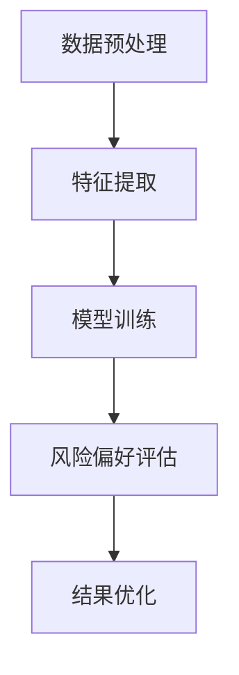
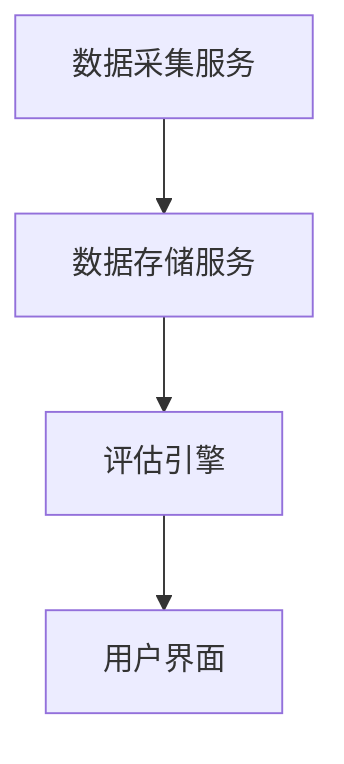
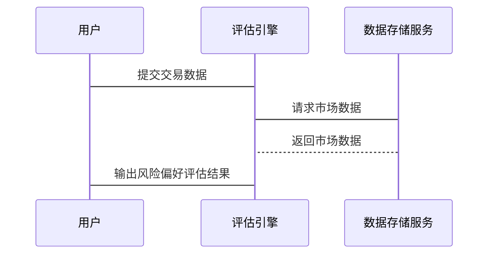

                 


# 智能投资者风险偏好动态评估

> 关键词：智能投资者，风险偏好，动态评估，机器学习，投资者行为分析

> 摘要：本文详细探讨了智能投资者风险偏好动态评估的核心原理、实现方法及其在投资决策中的应用。通过结合心理学、金融学和数据科学的多学科知识，本文提出了一种基于机器学习的动态评估模型，能够实时分析投资者的心理特征和行为模式，从而帮助投资者做出更科学、更个性化的投资决策。文章内容涵盖从理论到实践的各个方面，包括背景介绍、算法设计、系统架构和项目实战，旨在为读者提供全面的技术指导和实践参考。

---

## 第一部分：智能投资者风险偏好动态评估概述

### 第1章：风险偏好与投资者行为分析

#### 1.1 风险偏好的定义与分类

- **1.1.1 风险偏好的基本概念**
  - 风险偏好是指投资者在面对不确定性和潜在损失时，愿意承担风险的程度。
  - 风险偏好因人而异，通常分为保守型、稳健型、平衡型和进取型四种类型。

- **1.1.2 不同类型投资者的风险偏好特征**
  - 保守型投资者倾向于选择低风险、稳定收益的投资标的，如债券和货币市场工具。
  - 稳健型投资者在风险与收益之间寻求平衡，适合配置混合型基金和平衡型资产。
  - 平衡型投资者愿意承担中等风险，以追求中等收益。
  - 进取型投资者愿意承担高风险，以追求高收益，通常投资于股票、创业投资等领域。

- **1.1.3 风险偏好与投资决策的关系**
  - 风险偏好直接影响投资者的投资选择、资产配置和风险承受能力。
  - 风险偏好会随着市场环境和个人财务状况的变化而动态调整。

#### 1.2 投资者行为分析的必要性

- **1.2.1 投资者行为分析的核心目标**
  - 通过分析投资者的历史交易记录、市场反应和情绪变化，揭示其真实的风险偏好。
  - 量化投资者的决策风格，预测其未来的投资行为。

- **1.2.2 风险偏好动态变化的影响因素**
  - 市场环境：如经济周期、市场波动性、政策变化等。
  - 个人因素：如财富状况、家庭状况、健康状况等。
  - 心理因素：如情绪、认知偏差、风险厌恶程度等。

- **1.2.3 动态评估在投资组合管理中的作用**
  - 帮助投资者及时调整投资策略，以适应市场变化和个人风险承受能力的变化。
  - 优化投资组合，提高收益与风险的匹配度。

#### 1.3 动态评估与传统评估方法的对比

- **1.3.1 传统风险偏好评估的局限性**
  - 传统评估方法通常基于静态问卷调查，难以捕捉投资者在不同市场环境下的真实风险偏好。
  - 问卷调查的结果可能受到投资者主观认知和一时情绪的影响，导致评估结果不够准确。

- **1.3.2 动态评估的优势与应用场景**
  - 动态评估能够实时跟踪投资者的行为数据，如交易频率、持仓变化、资金流动等，从而更准确地反映其风险偏好。
  - 动态评估适用于高频交易、智能投顾、风险管理等领域。

- **1.3.3 动态评估的实现路径与技术支撑**
  - 数据采集：收集投资者的历史交易数据、市场反应数据和行为数据。
  - 数据分析：运用机器学习、自然语言处理等技术，对投资者的行为数据进行建模和分析。
  - 模型优化：根据实时数据不断优化评估模型，提高评估的准确性和实时性。

---

## 第二部分：智能投资者风险偏好动态评估的核心概念与联系

### 第2章：核心概念与原理

#### 2.1 智能投资者风险偏好动态评估的核心原理

- **2.1.1 评估模型的基本原理**
  - 通过机器学习算法，分析投资者的历史交易数据和市场行为数据，提取其风险偏好特征。
  - 基于特征构建评估模型，动态预测投资者的未来风险偏好。

- **2.1.2 数据驱动的动态评估方法**
  - 数据采集：包括投资者的交易记录、市场情绪、市场环境等多维度数据。
  - 数据分析：运用聚类分析、回归分析等方法，识别投资者的风险偏好模式。
  - 模型优化：根据实时数据不断更新模型参数，提高评估的准确性和实时性。

- **2.1.3 人工智能在风险偏好评估中的应用**
  - 机器学习：用于识别投资者的行为模式和风险偏好特征。
  - 自然语言处理：用于分析投资者的社交媒体言论，评估其情绪和风险偏好。

#### 2.2 核心概念属性对比表

| 概念           | 静态评估          | 动态评估          |
|----------------|------------------|------------------|
| 评估对象       | 单一时间点       | 动态变化的过程     |
| 数据来源       | 静态问卷调查     | 实时行为数据       |
| 评估频率       | 低频             | 高频             |
| 评估结果       | 固定的风险偏好   | 动态调整的风险偏好|

#### 2.3 ER实体关系图架构

```mermaid
erDiagram
    participant 投资者
    participant 市场环境
    participant 评估模型
    投资者 --> 评估模型: 提供行为数据
    市场环境 --> 评估模型: 提供市场数据
    评估模型 --> 投资者: 生成风险偏好评估结果
```

---

## 第三部分：智能投资者风险偏好动态评估的算法原理

### 第3章：算法原理讲解

#### 3.1 评估模型的算法流程



#### 3.2 评估模型的数学模型

- **3.2.1 概率模型**
  $$ P(r) = \frac{\text{符合风险偏好的样本数}}{\text{总样本数}} $$
  其中，$r$ 表示风险偏好类别。

- **3.2.2 回归模型**
  $$ y = \beta_0 + \beta_1x_1 + \beta_2x_2 + \epsilon $$
  其中，$y$ 表示风险偏好指数，$x_i$ 表示特征变量，$\epsilon$ 表示误差项。

#### 3.3 评估模型的实现代码

```python
import pandas as pd
from sklearn.model import Model
from sklearn.metrics import accuracy_score

# 数据加载与预处理
data = pd.read_csv('investor_behavior.csv')
data = data.dropna()

# 特征提取
features = data[['交易频率', '持仓变化', '资金流动']]
labels = data['风险偏好类别']

# 模型训练
model = Model()
model.fit(features, labels)

# 模型评估
predicted = model.predict(features)
print("准确率:", accuracy_score(labels, predicted))
```

---

## 第四部分：智能投资者风险偏好动态评估的系统架构设计方案

### 第4章：系统分析与架构设计

#### 4.1 问题场景介绍

- **4.1.1 系统目标**
  - 实现实时风险偏好评估，帮助投资者动态调整投资策略。
  - 提供个性化的投资建议，提升投资收益和风险控制能力。

- **4.1.2 项目介绍**
  - 开发一个智能投资者风险偏好动态评估系统，整合投资者行为数据和市场数据，构建动态评估模型，输出实时风险偏好评估结果。

#### 4.2 系统功能设计

- **4.2.1 领域模型设计**

```mermaid
classDiagram
    class 投资者
        + 姓名: str
        + 风险偏好: str
        + 账户余额: float
    class 市场环境
        + 市场指数: float
        + 利率: float
        + 汇率: float
    class 评估模型
        + 特征数据: list
        + 模型参数: dict
    投资者 --> 评估模型: 提供行为数据
    市场环境 --> 评估模型: 提供市场数据
    评估模型 --> 投资者: 输出风险偏好评估结果
```

- **4.2.2 系统架构设计**



- **4.2.3 接口设计与交互流程**



---

## 第五部分：智能投资者风险偏好动态评估的项目实战

### 第5章：项目实战

#### 5.1 环境安装与配置

- **5.1.1 安装Python**
  - 下载并安装Python 3.x，确保环境变量配置正确。

- **5.1.2 安装机器学习库**
  - 使用pip安装numpy、pandas、scikit-learn等库。

#### 5.2 核心代码实现

```python
import pandas as pd
from sklearn.ensemble import RandomForestClassifier
from sklearn.metrics import classification_report

# 数据加载与预处理
data = pd.read_csv('investor_data.csv')
data = data.dropna()

# 特征提取
features = data[['交易金额', '交易频率', '持仓变化']]
labels = data['风险偏好类别']

# 模型训练
model = RandomForestClassifier()
model.fit(features, labels)

# 模型评估
predicted = model.predict(features)
print(classification_report(labels, predicted))
```

#### 5.3 案例分析与解读

- **5.3.1 案例背景**
  - 投资者A，男性，35岁，资金规模100万，历史交易记录显示其偏好高风险股票投资。

- **5.3.2 动态评估结果**
  - 根据模型预测，投资者A的风险偏好指数为0.85（满分1），属于高风险偏好类型。

- **5.3.3 投资建议**
  - 建议投资者A增加对科技股和创业公司的配置比例，同时分散投资以降低风险。

---

## 第六部分：智能投资者风险偏好动态评估的最佳实践

### 第6章：总结与展望

#### 6.1 最佳实践

- **数据质量的重要性**
  - 确保数据的完整性和准确性，避免噪声数据对模型的影响。

- **模型调优技巧**
  - 使用交叉验证和网格搜索优化模型参数，提高模型的泛化能力。

- **注意事项**
  - 动态评估模型需要实时更新，以适应市场环境和投资者行为的变化。
  - 需要注意隐私保护，确保投资者数据的安全性。

#### 6.2 拓展阅读

- 《机器学习实战》
- 《行为金融学》
- 《风险管理与控制》

---

作者：AI天才研究院/AI Genius Institute & 禅与计算机程序设计艺术 /Zen And The Art of Computer Programming

---

本文通过系统地分析智能投资者风险偏好动态评估的核心概念、算法原理和系统架构，为读者提供了一个全面的技术指导和实践参考。希望本文能够帮助投资者和相关从业人员更好地理解和应用智能投资者风险偏好动态评估技术，从而在复杂的金融市场中做出更明智的投资决策。

