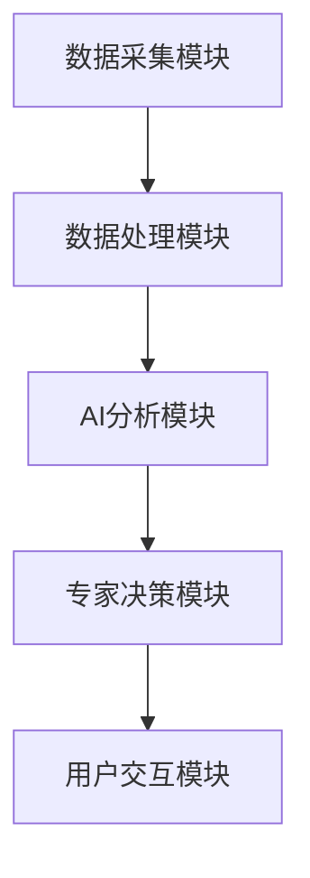

                 


# 智能投资顾问：AI与人类专家的协同策略

> 关键词：智能投资顾问，人工智能，协同策略，投资决策，系统架构，算法原理

> 摘要：智能投资顾问通过结合人工智能技术与人类专家的专业知识，实现了高效、精准的投资决策支持。本文将从背景、概念、算法、系统架构、实战案例等多个维度，全面分析智能投资顾问的核心原理和实现策略。通过详细的技术解读和实际案例分析，探讨AI与人类专家协同工作的最佳实践，为投资顾问行业提供创新思路和实践指导。

---

# 第一部分: 智能投资顾问的背景与概念

## 第1章: 智能投资顾问的背景介绍

### 1.1 传统投资顾问的现状与挑战

#### 1.1.1 传统投资顾问的核心功能
传统投资顾问通过人工分析市场趋势、客户资产配置需求，为投资者提供个性化的投资建议。其核心功能包括资产配置、风险评估、投资组合优化和市场分析。

#### 1.1.2 传统投资顾问的局限性
- **效率问题**：人工分析耗时长，难以满足大量客户的实时需求。
- **成本高昂**：专业顾问的招聘和培养成本高，难以覆盖中小投资者。
- **主观性较强**：依赖顾问的个人经验和判断，存在主观偏差。

#### 1.1.3 投资者需求的变化与挑战
随着金融市场的复杂化和投资者需求的多样化，传统投资顾问难以满足快速、精准、个性化的投资需求。投资者对实时数据处理、多策略分析和风险控制的要求不断提高。

---

### 1.2 AI技术的发展与应用

#### 1.2.1 AI技术的快速发展
人工智能技术在算法优化、数据处理和自然语言理解方面取得了突破性进展，尤其是在金融领域的应用日益广泛。

#### 1.2.2 AI在金融领域的应用现状
- **量化交易**：AI通过算法分析市场数据，优化交易策略。
- **风险管理**：利用机器学习模型预测市场波动，评估投资组合风险。
- **客户画像**：通过大数据分析客户行为，提供个性化服务。

#### 1.2.3 AI在投资顾问领域的潜力
AI能够快速处理海量数据，提供实时市场分析和个性化投资建议，显著提升投资顾问的效率和准确性。

---

### 1.3 智能投资顾问的必要性

#### 1.3.1 提高投资效率的需求
AI能够快速分析市场数据，实时生成投资建议，显著提高投资效率。

#### 1.3.2 降低投资成本的需求
通过自动化处理和AI算法，智能投资顾问能够降低人力成本，为更多投资者提供服务。

#### 1.3.3 提升投资决策的准确性
AI通过深度学习和大数据分析，能够发现人类难以察觉的市场规律，提升投资决策的准确性。

---

## 第2章: 智能投资顾问的核心概念

### 2.1 智能投资顾问的定义与特点

#### 2.1.1 智能投资顾问的定义
智能投资顾问是一种结合人工智能技术，能够根据投资者的需求和市场数据，提供实时、个性化的投资建议的系统。

#### 2.1.2 智能投资顾问的核心特点
- **实时性**：能够实时分析市场数据，快速生成投资建议。
- **个性化**：基于投资者的资产状况和风险偏好，提供定制化服务。
- **准确性**：通过AI算法和大数据分析，提升投资决策的准确性。

#### 2.1.3 智能投资顾问与传统投资顾问的对比

| 特性                | 传统投资顾问                      | 智能投资顾问                      |
|---------------------|----------------------------------|----------------------------------|
| 服务效率            | 较低，依赖人工分析               | 高，AI自动处理                 |
| 服务成本            | 较高，需要大量人力               | 较低，自动化服务                |
| 决策准确性          | 受限于人类经验和判断             | 基于大数据分析和机器学习         |

---

### 2.2 AI与人类专家的协同机制

#### 2.2.1 协同的基本原理
AI系统负责数据处理、市场分析和策略生成，人类专家则负责策略优化、风险控制和客户沟通，两者协同工作，共同完成投资决策。

#### 2.2.2 协同的优势与劣势
- **优势**：
  - **高效性**：AI快速处理数据，专家进行策略优化。
  - **准确性**：AI提供数据支持，专家进行最终决策。
- **劣势**：
  - **技术依赖**：AI系统可能出现技术瓶颈。
  - **人机互动**：需要良好的协同机制。

#### 2.2.3 协同的实现方式
- **数据共享**：AI系统与专家共享市场数据和分析结果。
- **任务分工**：AI负责数据处理和初步分析，专家负责策略优化和最终决策。
- **实时互动**：通过人机交互界面，专家可以随时调整AI的分析参数。

---

### 2.3 智能投资顾问的系统架构

#### 2.3.1 系统的组成模块
- **数据采集模块**：从金融市场获取实时数据。
- **数据处理模块**：清洗、转换和存储数据。
- **AI分析模块**：利用机器学习算法生成投资建议。
- **专家决策模块**：专家对AI建议进行优化和调整。
- **用户交互模块**：提供可视化界面供用户查看和操作。

#### 2.3.2 各模块的功能描述
- **数据采集模块**：从股票、基金、债券等市场获取实时数据。
- **数据处理模块**：清洗数据，去除异常值，转换数据格式。
- **AI分析模块**：基于机器学习算法，生成投资策略和建议。
- **专家决策模块**：专家对AI建议进行评估和调整。
- **用户交互模块**：提供直观的用户界面，展示分析结果和投资建议。

#### 2.3.3 系统的整体架构图



---

## 第3章: 智能投资顾问的算法原理

### 3.1 推荐算法的核心原理

#### 3.1.1 基于协同过滤的推荐算法
协同过滤是一种基于用户行为相似性推荐投资产品的算法。其核心思想是：如果两个用户在过去的行为相似，那么他们未来的投资行为也可能相似。

#### 3.1.2 基于内容的推荐算法
基于内容的推荐算法通过分析投资产品的特征（如收益、风险、行业等），为用户推荐相似的产品。

#### 3.1.3 混合推荐算法
混合推荐算法结合协同过滤和内容推荐的优点，通过集成多个推荐算法，提升推荐的准确性和多样性。

---

### 3.2 自然语言处理在投资顾问中的应用

#### 3.2.1 文本挖掘的基本原理
文本挖掘通过对新闻、报告等文本数据的分析，提取市场趋势和行业动态。

#### 3.2.2 情感分析在投资决策中的作用
情感分析通过对市场评论的情感倾向分析，预测市场走势。

#### 3.2.3 机器翻译在投资信息处理中的应用
机器翻译帮助投资者理解多语言的市场信息，扩大信息获取范围。

---

### 3.3 智能投资顾问的数学模型

#### 3.3.1 协同过滤的数学模型
协同过滤的数学模型可以表示为：
$$
\hat{r}_{u,i} = \bar{r}_u + \bar{r}_i + \sum \lambda_{u,i}(r_{u,j} - \bar{r}_j)
$$
其中，$\hat{r}_{u,i}$ 是用户 $u$ 对产品 $i$ 的预测评分，$\bar{r}_u$ 是用户 $u$ 的平均评分，$\bar{r}_i$ 是产品 $i$ 的平均评分，$\lambda_{u,i}$ 是相似度权重。

#### 3.3.2 基于矩阵分解的推荐算法
基于矩阵分解的推荐算法将用户-产品评分矩阵分解为用户特征矩阵和产品特征矩阵，通过优化矩阵乘积来最小化预测误差。

#### 3.3.3 时间序列分析模型
时间序列分析模型用于预测未来市场走势，常见的模型包括ARIMA和LSTM。

---

## 第4章: 智能投资顾问的系统分析与架构设计

### 4.1 系统功能设计

#### 4.1.1 用户需求分析
用户需求包括实时市场分析、个性化投资建议、风险控制和投资组合优化。

#### 4.1.2 系统功能模块划分
系统功能模块包括数据采集、数据处理、AI分析、专家决策和用户交互。

#### 4.1.3 功能模块的交互流程
用户通过用户交互模块提交投资需求，系统通过数据采集模块获取数据，AI分析模块生成投资建议，专家决策模块优化建议，最后通过用户交互模块展示结果。

---

### 4.2 系统架构设计

#### 4.2.1 分层架构设计
分层架构包括数据层、业务逻辑层和用户界面层。

#### 4.2.2 微服务架构设计
微服务架构将系统功能分解为独立的服务，通过API进行通信。

#### 4.2.3 系统的可扩展性设计
系统通过模块化设计，支持功能的扩展和升级。

---

### 4.3 系统接口设计

#### 4.3.1 API接口的设计原则
API接口设计应遵循RESTful原则，支持JSON格式数据传输。

#### 4.3.2 接口的安全性设计
通过HTTPS协议和JWT令牌认证，确保接口的安全性。

#### 4.3.3 接口的兼容性设计
设计兼容的API版本，支持不同版本的调用。

---

## 第5章: 智能投资顾问的项目实战

### 5.1 项目环境的安装与配置

#### 5.1.1 开发环境的选择
推荐使用Python和Jupyter Notebook作为开发环境。

#### 5.1.2 依赖库的安装
安装Pandas、NumPy、Scikit-learn和TensorFlow等依赖库。

#### 5.1.3 开发工具的配置
配置Jupyter Notebook的Kernel为Python。

---

### 5.2 系统核心功能的实现

#### 5.2.1 推荐算法的实现
实现基于协同过滤的推荐算法，代码如下：

```python
import numpy as np
from sklearn.metrics.pairwise import cosine_similarity

# 示例数据矩阵
matrix = np.array([[4, 3, 0], [5, 1, 0], [2, 0, 0]])

# 计算余弦相似度
similarity = cosine_similarity(matrix)
print(similarity)
```

---

#### 5.2.2 自然语言处理功能的实现
使用N

