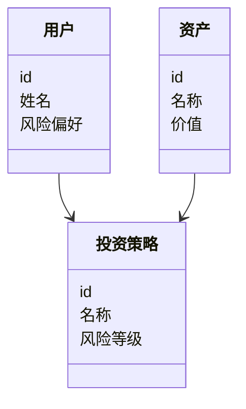
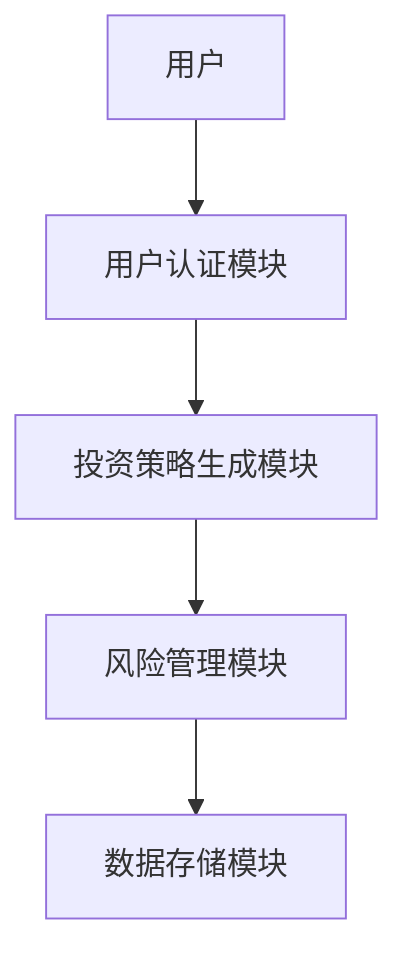
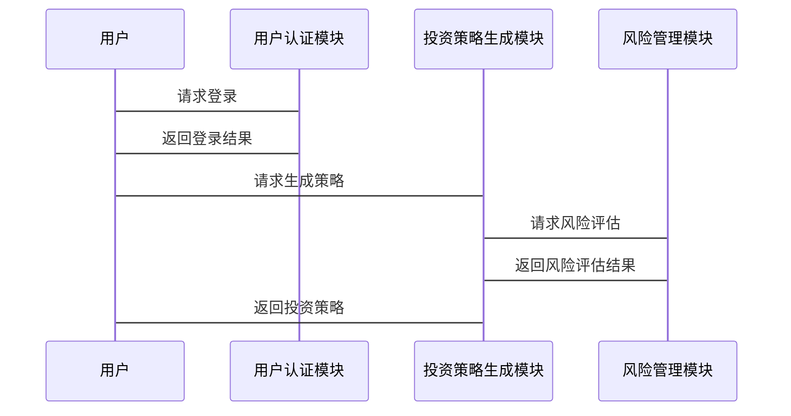

                 


# 智能投顾平台的架构设计与实现

## 关键词：智能投顾、人工智能、投资策略、系统架构、风险管理

## 摘要：智能投顾平台利用人工智能和大数据技术，为用户提供个性化的投资建议和资产配置方案。本文详细分析了智能投顾的核心概念、算法原理、系统架构，并通过实际案例展示了平台的实现过程，最后总结了最佳实践和未来发展方向。

---

## 第一部分: 智能投顾平台的背景与核心概念

### 第1章: 智能投顾平台的背景介绍

#### 1.1 智能投顾的定义与问题背景
- **1.1.1 传统投资顾问的局限性**
  - 传统投资顾问服务成本高、覆盖范围有限，难以满足普通投资者的需求。
  - 顾问的意见受主观因素影响，缺乏客观性和及时性。

- **1.1.2 智能投顾的定义与特点**
  - 智能投顾是利用AI和大数据技术，为投资者提供自动化、个性化的投资建议。
  - 特点包括高效性、低成本、个性化和实时性。

- **1.1.3 智能投顾平台的核心问题与目标**
  - 核心问题：如何准确理解用户需求，制定最优投资策略。
  - 目标：实现个性化的资产配置，最大化投资收益并控制风险。

#### 1.2 智能投顾平台的技术基础
- **1.2.1 人工智能与大数据技术的结合**
  - 使用机器学习算法分析用户数据，构建用户画像。
  - 大数据技术处理海量市场数据，提供实时分析。

- **1.2.2 云计算与分布式系统的重要性**
  - 云计算提供弹性计算资源，支持高并发访问。
  - 分布式系统确保平台的高可用性和扩展性。

- **1.2.3 区块链在智能投顾中的潜在应用**
  - 区块链技术可以用于交易记录和数据存证，提高透明度和信任度。

#### 1.3 传统投顾与智能投顾的对比分析
- **1.3.1 服务模式的差异**
  - 传统投顾依赖人工分析，服务范围有限。
  - 智能投顾通过自动化技术，覆盖更多用户。

- **1.3.2 技术实现的差异**
  - 传统投顾依赖人工经验，智能投顾利用AI算法进行分析和预测。

- **1.3.3 成本与效率的对比**
  - 传统投顾成本高、效率低。
  - 智能投顾降低成本，提高服务效率。

#### 1.4 智能投顾平台设计的关键点
- **1.4.1 用户需求的多样性**
  - 不同用户有不同的风险偏好和收益目标，需要个性化的服务。

- **1.4.2 投资策略的动态调整**
  - 市场环境变化快，投资策略需要实时调整。

- **1.4.3 平台的可扩展性与安全性**
  - 系统设计要支持用户和数据的快速增长。
  - 确保用户数据和交易安全，防范风险。

### 1.5 本章小结
- **1.5.1 智能投顾平台的核心价值**
  - 提供高效、低成本的个性化投资服务。

- **1.5.2 平台设计的关键挑战**
  - 如何准确理解用户需求，制定最优策略。

- **1.5.3 后续章节的框架概述**
  - 接下来将深入探讨核心概念、算法原理和系统架构。

---

## 第2章: 智能投顾平台的核心概念与联系

### 2.1 核心概念原理
- **2.1.1 用户画像的构建**
  - 通过收集用户数据，分析其风险偏好、财务状况和投资目标。
  - 例如，用户A可能风险厌恶，适合配置债券和低风险基金。

- **2.1.2 投资策略的生成与优化**
  - 根据用户画像，生成适合的投资组合。
  - 使用优化算法动态调整策略，以适应市场变化。

- **2.1.3 风险评估与控制**
  - 使用VaR（在险值）等方法评估投资组合的风险。
  - 设置止损点和止盈点，控制风险。

### 2.2 核心概念属性特征对比表格
| 概念       | 属性特征                 |
|------------|--------------------------|
| 用户画像    | 年龄、收入、风险偏好等   |
| 投资策略    | 资产配置、分散投资等     |
| 风险评估    | 方差、VaR、最大回撤等     |

### 2.3 ER实体关系图
```mermaid
er
    entity 用户 {
        id
        姓名
        风险偏好
    }
    entity 资产 {
        id
        名称
        价值
    }
    entity 投资策略 {
        id
        名称
        风险等级
    }
    用户 -[1..n]-> 投资策略
    资产 -[1..n]-> 投资策略
```

---

## 第3章: 智能投顾平台的算法原理

### 3.1 用户画像构建算法
- **3.1.1 数据收集与预处理**
  - 收集用户的基本信息、财务数据和投资历史。
  - 清洗数据，去除异常值和缺失值。

- **3.1.2 基于聚类的用户分群**
  - 使用K-means算法将用户分为不同的风险偏好群。
  - 例如，分为保守型、稳健型和进取型三类。

- **3.1.3 基于决策树的用户画像细化**
  - 使用决策树算法进一步细分用户特征。
  - 例如，根据年龄和收入进一步划分用户群体。

### 3.2 投资策略生成算法
- **3.2.1 基于强化学习的投资组合优化**
  - 使用强化学习算法，模拟投资环境，优化投资组合。
  - 例如，使用深度Q网络（DQN）进行资产配置。

- **3.2.2 基于遗传算法的资产配置**
  - 使用遗传算法搜索最优资产组合。
  - 例如，设定目标收益和风险，通过遗传算法找到最优解。

### 3.3 风险评估与控制算法
- **3.3.1 风险评估的数学模型**
  - 使用方差和标准差衡量资产的风险。
  - $$ \text{方差} = \frac{1}{n}\sum_{i=1}^{n}(x_i - \mu)^2 $$
  - $$ \text{标准差} = \sqrt{\text{方差}} $$

- **3.3.2 风险控制策略**
  - 设置止损点，当资产价值下跌超过设定值时，触发卖出指令。
  - 使用VaR模型评估投资组合的风险，并制定相应的风险对冲策略。

---

## 第4章: 智能投顾平台的系统架构设计

### 4.1 系统分析与功能设计
- **4.1.1 问题场景介绍**
  - 平台需要支持大量用户同时访问，实时处理投资数据。
  - 需要保证数据的安全性和系统的稳定性。

- **4.1.2 系统功能设计**
  - 用户模块：注册、登录、个人信息管理。
  - 投资策略模块：生成、优化、调整投资策略。
  - 风险管理模块：实时监控、风险预警、风险对冲。

- **4.1.3 领域模型类图**


### 4.2 系统架构设计
- **4.2.1 系统架构图**


- **4.2.2 系统接口设计**
  - 用户接口：API用于用户认证、策略生成和风险评估。
  - 数据接口：与数据源（如股票市场数据API）对接，获取实时数据。

### 4.3 系统交互流程
- **4.3.1 系统交互序列图**


---

## 第5章: 智能投顾平台的项目实战

### 5.1 环境安装与配置
- 安装Python、Jupyter Notebook、Flask框架、TensorFlow库。
- 安装数据库（如MySQL）和相关开发工具。

### 5.2 核心功能实现
- **5.2.1 用户画像构建**
  - 使用Python代码收集用户数据，清洗和分析。
  ```python
  import pandas as pd
  # 读取用户数据
  df = pd.read_csv('users.csv')
  # 清洗数据
  df.dropna(inplace=True)
  # 聚类分析
  from sklearn.cluster import KMeans
  X = df[['收入', '风险偏好']]
  kmeans = KMeans(n_clusters=3, random_state=0)
  kmeans.fit(X)
  ```

- **5.2.2 投资策略生成**
  - 使用遗传算法优化资产配置。
  ```python
  import numpy as np
  from numpy import random

  def fitness(population):
      # 计算收益和风险，返回适应度
      pass

  def mutate(individual):
      # 随机调整资产配置比例
      pass

  # 初始化种群
  population = np.random.rand(10, 5)
  ```

### 5.3 项目小结
- **5.3.1 项目实现的经验**
  - 确保数据质量和算法的准确性，优化系统性能。

- **5.3.2 项目实施的教训**
  - 数据获取困难，需要与多方合作。
  - 算法调优复杂，需要大量实验和调整。

---

## 第6章: 智能投顾平台的最佳实践

### 6.1 小结与反思
- 平台设计的关键点包括用户需求分析、算法优化和系统架构设计。
- 需要不断优化算法，提升用户体验。

### 6.2 注意事项
- 数据隐私和安全是核心问题，必须严格遵守相关法律法规。
- 系统设计要考虑可扩展性和可维护性。

### 6.3 拓展阅读
- 推荐阅读《Python机器学习实战》和《深入浅出分布式系统》。
- 关注金融行业的最新动态和技术发展。

---

## 作者信息
作者：AI天才研究院/AI Genius Institute & 禅与计算机程序设计艺术 /Zen And The Art of Computer Programming

