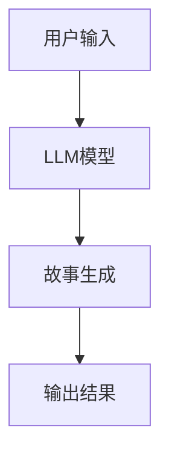
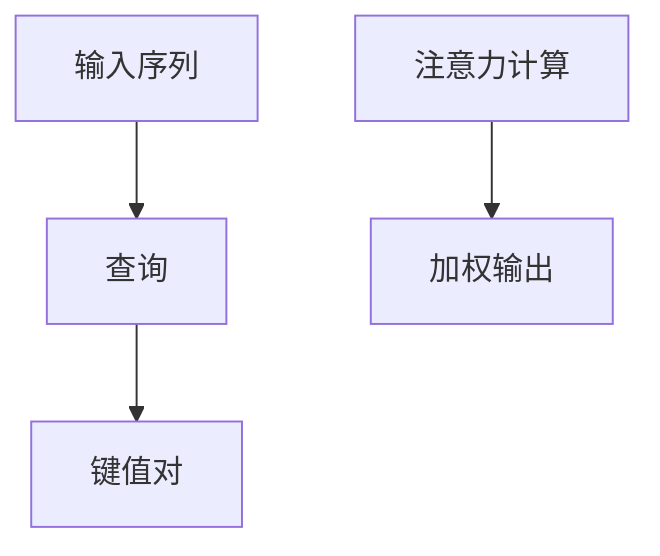
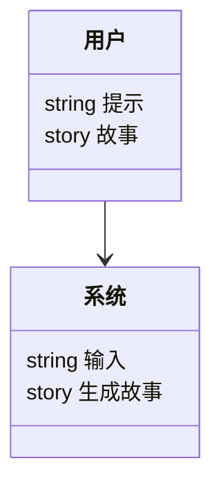
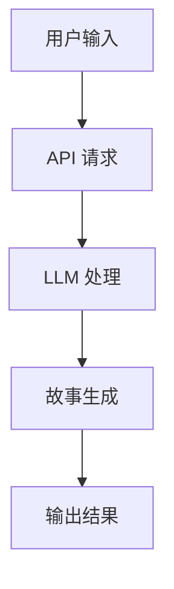

                 


# 智能故事生成 AI Agent：LLM 驱动的创意写作系统

> 关键词：人工智能，大语言模型，LLM，创意写作，故事生成，AI Agent

> 摘要：本文探讨了基于大语言模型（LLM）的智能故事生成 AI Agent 的实现与应用。通过分析问题背景、核心概念、算法原理、系统架构、项目实战及最佳实践，深入剖析了 LLM 在创意写作中的潜力与挑战。

---

## 第一部分: 智能故事生成 AI Agent 背景介绍

### 第1章: 问题背景与描述

#### 1.1 问题背景
- **创意写作的挑战**：传统写作工具依赖模板或人工干预，难以提供个性化的创意支持。
- **人工智能在写作中的应用**：AI 已经在内容生成、编辑优化等领域展现潜力，但故事生成仍需更深度的创新。
- **大语言模型（LLM）的优势**：LLM 具备强大的上下文理解能力，能够生成连贯且富有创意的故事内容。

#### 1.2 问题描述
- **现有写作工具的局限性**：传统工具缺乏智能化，难以满足用户对多样化故事的需求。
- **用户需求分析**：用户希望 AI 能够根据输入的关键词或情节生成完整且吸引人的故事。
- **智能故事生成的必要性**：通过 LLM 的驱动，实现自动化、个性化的故事创作，提升创作效率。

#### 1.3 边界与外延
- **系统功能边界**：专注于故事生成，不涉及后续编辑或排版。
- **与其他系统的区别**：区别于简单的文本生成工具，本系统注重故事的连贯性和创意性。

#### 1.4 核心要素
- **数据输入**：用户提供的故事主题或初始情节。
- **模型处理**：LLM 根据输入生成后续故事内容。
- **输出结果**：生成的完整故事或情节建议。

---

### 第2章: 核心概念与组成

#### 2.1 核心概念
- **AI Agent**：能够根据用户输入执行任务的智能体，负责接收指令并生成输出。
- **LLM**：大语言模型，具备强大的文本生成能力，是故事生成的核心驱动力。

#### 2.2 核心要素
- **输入数据**：用户提供的初始情节或关键词。
- **模型处理**：通过 LLM 的生成机制，输出连贯且符合逻辑的故事内容。
- **输出结果**：生成的故事文本或情节建议。

---

## 第二部分: 核心概念与联系

### 第3章: LLM 原理与模型对比

#### 3.1 原理分析
- **大语言模型的训练目标**：通过大量数据训练，掌握语言的语法、语义和上下文关系。
- **生成机制**：基于概率的生成方法，通过解码器生成最可能的文本序列。
- **注意力机制**：模型能够关注输入中的关键部分，提升生成内容的相关性。

#### 3.2 模型对比
- **不同模型的特征对比表**
| 模型 | 参数量（亿） | 基础架构 | 代表作 |
|------|------------|----------|--------|
| GPT-3 | 175B       | Transformer | OpenAI |
| PaLM  | 500B       | Pathways  | Google |
| LLaMA | 70B        | Transformer | Meta   |

- **Mermaid 实体关系图**


---

## 第三部分: 算法原理与数学模型

### 第4章: 算法原理

#### 4.1 注意力机制
- **Mermaid 流程图**


- **数学公式**
$$\text{注意力权重} = \frac{\exp(qW_qk^T)}{\sum_{i} \exp(qW_qk_i^T)}$$

- **示例说明**：假设输入为“在一片森林里”，模型会关注“森林”相关的上下文，生成后续情节。

#### 4.2 模型训练
- **损失函数计算**
$$\text{损失} = -\sum_{i=1}^{n} \log p(x_i|x_{<i})$$

- **梯度下降优化**
$$\theta = \theta - \eta \frac{\partial L}{\partial \theta}$$

#### 4.3 示例说明
- **简单的故事生成**：输入“开始的故事是‘在一个小镇上’”，模型生成后续情节。

---

## 第四部分: 系统分析与架构设计

### 第5章: 系统架构

#### 5.1 问题场景
- **用户需求**：用户希望输入关键词，生成完整的故事。
- **系统目标**：提供一个高效的 LLM 驱动的故事生成系统。

#### 5.2 功能设计
- **领域模型**


#### 5.3 系统架构
- **Mermaid 架构图**


---

## 第五部分: 项目实战

### 第6章: 项目实战

#### 6.1 环境安装
- **Python 环境**：安装 Python 3.8+
- **依赖库**：`transformers`, `torch`

#### 6.2 核心代码实现
```python
from transformers import AutoTokenizer, AutoModelForCausalLM

tokenizer = AutoTokenizer.from_pretrained("gpt2")
model = AutoModelForCausalLM.from_pretrained("gpt2")

def generate_story(prompt):
    inputs = tokenizer.encode(prompt, return_tensors="pt")
    outputs = model.generate(inputs, max_length=500, do_sample=True)
    story = tokenizer.decode(outputs[0], skip_special_tokens=True)
    return story

# 示例
prompt = "开始的故事是‘在一个小镇上’"
print(generate_story(prompt))
```

#### 6.3 案例分析
- **案例输入**：开始的故事是“在一个小镇上”。
- **生成结果**：模型生成后续情节，构建完整的故事框架。

---

## 第六部分: 最佳实践

### 第7章: 最佳实践

#### 7.1 小结
- **系统优势**：LLM 驱动的故事生成系统能够提供高效、个性化的创意支持。
- **潜在问题**：生成内容可能缺乏深度，需要进一步优化。

#### 7.2 注意事项
- **数据隐私**：确保用户输入和生成内容的安全性。
- **模型优化**：通过微调提升模型在特定领域的表现。

#### 7.3 拓展阅读
- 推荐阅读《生成式 AI：从Transformer到GPT-4》、《大语言模型的训练与优化》。

---

## 作者信息

作者：AI天才研究院/AI Genius Institute & 禅与计算机程序设计艺术 /Zen And The Art of Computer Programming

---

本文通过系统化的分析与实践，深入探讨了基于 LLM 的智能故事生成 AI Agent 的实现与应用。从背景介绍到算法原理，从系统架构到项目实战，全面剖析了该系统的潜力与挑战，为后续研究提供了理论与实践的双重参考。

