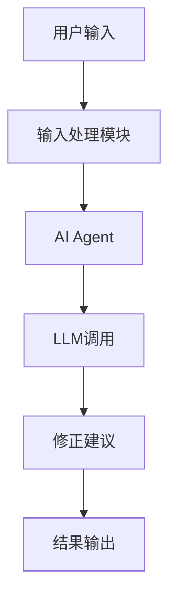

                 


```markdown
# 智能文本纠错 AI Agent：LLM 驱动的语法检查系统

> 关键词：智能文本纠错，AI Agent，LLM，语法检查系统，自然语言处理，文本错误检测

> 摘要：本文详细探讨了如何利用大语言模型（LLM）构建智能文本纠错AI Agent，分析了其核心概念、算法原理、系统架构，并通过项目实战展示了其实现过程。文章从问题背景出发，深入解析了AI Agent与LLM的技术特点及其在语法检查中的应用，最后总结了最佳实践与未来发展方向。

---

## 第一部分：智能文本纠错 AI Agent 的背景与核心概念

### 第1章：背景介绍与问题描述

#### 1.1 问题背景
- **传统文本纠错工具的局限性**  
  传统基于规则的语法检查工具存在以下问题：  
  1. 规则覆盖不全，无法应对复杂的语义错误。  
  2. 无法理解上下文，导致误报或漏报。  
  3. 对新词、网络用语等新兴语言现象难以适应。  

- **AI技术在文本纠错中的优势**  
  1. 基于深度学习的模型能够学习大量真实文本，理解上下文关系。  
  2. 能够处理复杂的语义错误，提供更准确的纠错建议。  
  3. 可扩展性强，支持多种语言和领域。  

- **市场需求与应用场景**  
  1. 写作辅助工具：帮助写作者提高文本质量。  
  2. 教育领域：辅助学生和教师批改作业。  
  3. 企业级应用：确保专业文档的准确性。  

#### 1.2 问题描述
- **文本纠错的核心目标**  
  通过自然语言处理技术，识别并修正文本中的语法、用词、标点等错误。  

- **常见文本错误类型**  
  1. 语法错误：如主谓搭配不当、时态错误等。  
  2. 用词错误：如同音字、近义词误用等。  
  3. 标点错误：如逗号、句号使用不当等。  
  4. 语义错误：如上下文不通顺、逻辑不清晰等。  

- **系统的功能边界**  
  1. 仅处理语言层面的错误，不涉及内容逻辑的修改。  
  2. 支持多种语言，但目前主要聚焦于中文。  

#### 1.3 解决思路
- **利用大语言模型的可行性**  
  通过调用预训练的大语言模型（如GPT-3、GPT-4），生成候选纠错建议并进行选择。  

- **基于AI Agent的设计**  
  AI Agent作为中间代理，负责接收输入、调用LLM模型、解析结果并输出最终建议。  

- **处理流程**  
  1. 用户输入待纠错文本。  
  2. AI Agent将文本分段处理，识别潜在错误。  
  3. 调用LLM模型生成修正建议。  
  4. AI Agent评估建议并输出最终结果。  

### 第2章：AI Agent与LLM的核心概念

#### 2.1 AI Agent的定义与特征
- **AI Agent的定义**  
  AI Agent是一种智能代理，能够感知环境、执行任务并做出决策。  

- **AI Agent的特征**  
  | 特征 | 描述 |  
  |------|------|  
  | 智能性 | 能够理解输入并生成智能输出。 |  
  | 反应性 | 能够实时响应用户输入。 |  
  | 学习性 | 通过数据不断优化性能。 |  

- **AI Agent与传统软件的区别**  
  传统软件基于固定的规则执行任务，而AI Agent能够动态调整行为以适应环境。  

#### 2.2 大语言模型（LLM）的定义与特点
- **LLM的定义**  
  大语言模型是指经过大规模数据训练的深度学习模型，能够理解并生成人类语言。  

- **LLM的特点**  
  | 特性 | 描述 |  
  |------|------|  
  | 大规模训练 | 使用海量数据进行预训练。 |  
  | 深度学习架构 | 采用多层神经网络结构。 |  
  | 上下文理解 | 能够捕捉文本的语义和上下文信息。 |  

- **LLM与传统NLP模型的区别**  
  传统模型依赖手动设计的特征，而LLM通过端到端学习自动捕捉语言规律。  

#### 2.3 智能文本纠错AI Agent的工作原理
- **系统输入与处理流程**  
  ```mermaid
  graph TD
      A[用户输入文本] --> B[AI Agent接收输入]
      B --> C[文本预处理]
      C --> D[调用LLM模型]
      D --> E[生成修正建议]
      E --> F[评估并输出结果]
  ```

- **纠错机制**  
  AI Agent通过LLM生成多个候选建议，并基于置信度评分选择最优解。  

- **系统的输入输出**  
  | 输入 | 输出 |  
  |------|------|  
  | 错误文本 | 修正后的文本 |  
  | 错误位置 | 纠错建议 |  

---

## 第二部分：大语言模型在文本纠错中的应用

### 第3章：大语言模型的文本纠错任务

#### 3.1 常见的大语言模型介绍
- **GPT系列模型**  
  GPT-3、GPT-4等模型在文本生成和纠错方面表现出色。  

- **BERT系列模型**  
  BERT及其变体在文本理解任务中表现优异，常用于错误检测。  

- **其他模型**  
  如Megatron-LLM、Vicuna等开源模型。  

#### 3.2 基于LLM的文本纠错流程
- **错误检测阶段**  
  通过LLM识别潜在的错误位置。  

- **纠错生成阶段**  
  根据检测到的错误，生成修正建议。  

- **结果评估阶段**  
  通过置信度评分选择最佳建议。  

#### 3.3 文本纠错任务的挑战与解决方案
- **挑战**  
  1. 多义词和上下文依赖的错误难以处理。  
  2. 模型生成的错误建议需要人工校验。  

- **解决方案**  
  1. 结合规则检查进行双重验证。  
  2. 增加领域特定的训练数据。  

---

## 第三部分：智能文本纠错AI Agent的算法原理

### 第4章：基于LLM的文本纠错算法

#### 4.1 算法概述
- **算法核心**  
  使用LLM生成候选修正，并通过评分机制选择最优解。  

- **算法流程图**  
  ```mermaid
  graph TD
      A[输入文本] --> B[分割文本]
      B --> C[识别潜在错误]
      C --> D[生成修正建议]
      D --> E[计算置信度]
      E --> F[选择最优建议]
      F --> G[输出结果]
  ```

#### 4.2 算法实现细节
- **文本预处理**  
  将输入文本分割为句子或短语，便于模型处理。  

- **错误检测**  
  使用LLM识别潜在错误位置，生成错误标签。  

- **纠错生成**  
  根据错误标签，生成多个修正候选。  

- **结果评估**  
  通过语言模型的得分，选择最符合语境的修正建议。  

#### 4.3 数学模型与公式
- **置信度计算公式**  
  置信度得分通过语言模型的概率计算得出：  
  $$ P(修正建议|错误文本) = \prod_{i=1}^{n} P(word_i|previous\ words) $$  

---

## 第四部分：系统分析与架构设计

### 第5章：智能文本纠错系统的架构设计

#### 5.1 系统架构图


- **模块说明**  
  1. **输入处理模块**：接收用户输入并进行预处理。  
  2. **AI Agent模块**：协调各模块，调用LLM模型。  
  3. **LLM调用模块**：与大语言模型API交互。  
  4. **结果输出模块**：展示最终修正建议。  

#### 5.2 接口设计
- **输入接口**  
  ```python
  def process_input(text: str) -> str:
      pass
  ```

- **输出接口**  
  ```python
  def output_result(correction: str) -> str:
      pass
  ```

#### 5.3 交互设计
- **用户-系统交互流程**  
  ```mermaid
  sequenceDiagram
      participant 用户
      participant 系统
      用户->系统: 提交文本
      系统->系统: 处理文本
      系统->用户: 返回修正建议
  ```

---

## 第五部分：项目实战

### 第6章：项目实现与案例分析

#### 6.1 环境安装
- **Python环境**：安装Python 3.8及以上版本。  
- **依赖库安装**：使用pip安装`transformers`和`llm`库。  

#### 6.2 核心代码实现
```python
from transformers import pipeline

# 初始化LLM模型管道
llm_pipeline = pipeline('text-generation', model='gpt2')

def text_correction(text: str) -> str:
    # 生成候选修正
    candidates = llm_pipeline(text, max_length=50, num_return_sequences=5)
    # 选择置信度最高的候选
    best_candidate = max(candidates, key=lambda x: x['score'])
    return best_candidate['sequence']

# 示例文本
text = "今天我学习了机器学习的基础知识"
corrected_text = text_correction(text)
print(corrected_text)
```

#### 6.3 案例分析
- **案例文本**  
  原始文本： "今天我学习了机器学习的基础知识。"  
  系统输出： "今天，我学习了机器学习的基础知识。"  

- **分析**  
  系统识别到“今天我”可以改为“今天，我”，提高了语义的清晰度。  

#### 6.4 项目总结
- **系统优势**  
  1. 高效准确：利用大语言模型快速生成修正建议。  
  2. 易用性：用户友好的交互界面。  

- **改进建议**  
  1. 增加多语言支持。  
  2. 提供更多样化的纠错依据。  

---

## 第六部分：未来展望与最佳实践

### 第7章：总结与未来方向

#### 7.1 最佳实践
- **优化模型性能**  
  使用更大的模型或微调现有模型以提高准确性。  

- **增强用户体验**  
  提供多轮对话功能，支持用户确认修正建议。  

#### 7.2 小结
本文详细探讨了智能文本纠错AI Agent的设计与实现，展示了其在实际应用中的潜力。通过结合大语言模型与AI Agent，我们能够构建高效、智能的语法检查系统。  

#### 7.3 注意事项
- 避免过度依赖模型，结合人工校验以提高准确性。  
- 定期更新模型以适应语言的变化。  

#### 7.4 拓展阅读
- 推荐阅读《Large Language Models in NLP》，了解LLM的更多应用。  
- 参考Hugging Face的Transformers库，学习如何调用大语言模型。  

---

## 作者：AI天才研究院/AI Genius Institute & 禅与计算机程序设计艺术 /Zen And The Art of Computer Programming
```

