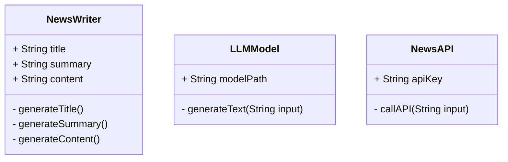
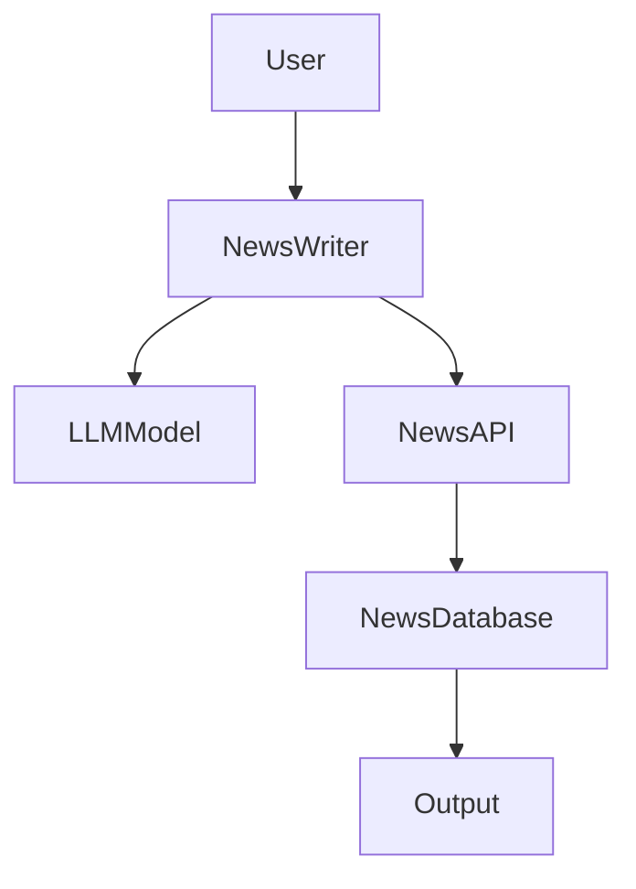
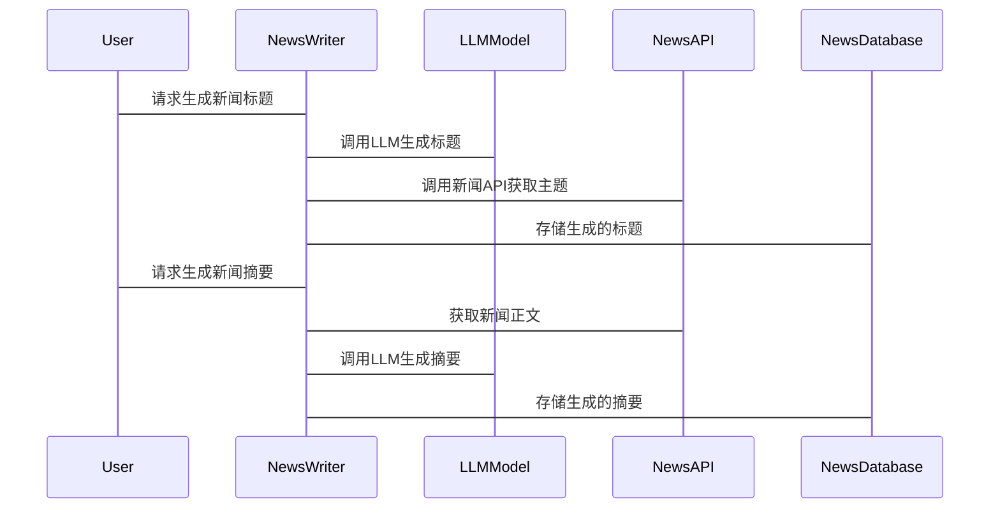

                 


# 智能新闻写作 AI Agent：LLM 辅助新闻报道生成

> 关键词：智能新闻写作，LLM，新闻报道生成，AI辅助写作，自然语言处理

> 摘要：本文将探讨如何利用大语言模型（LLM）辅助新闻报道的生成，从背景介绍、核心概念、算法原理、系统架构到项目实战，全面解析智能新闻写作AI Agent的技术实现与应用场景。通过详细的技术分析和实际案例，本文旨在为新闻行业提供一种高效、智能的新闻生成解决方案，帮助记者和编辑提升工作效率与内容质量。

---

## 第1章: 背景与核心概念

### 1.1 智能新闻写作的背景

#### 1.1.1 传统新闻写作的挑战
新闻写作是一项高度依赖人类创造力和专业技能的工作。传统新闻写作面临以下挑战：
- **效率问题**：记者在短时间内需要完成多篇高质量的新闻报道，尤其是在突发事件发生时，时间紧迫，任务繁重。
- **一致性问题**：新闻报道需要遵循严格的格式和风格，确保信息准确无误，同时保持语言的流畅性。
- **资源限制**：新闻机构通常需要依赖专业记者的技能，但在资源有限的情况下，如何快速生成高质量的内容成为一个难题。

#### 1.1.2 AI技术在新闻领域的应用现状
随着AI技术的快速发展，越来越多的新闻机构开始尝试利用AI工具辅助新闻写作。目前的应用主要集中在以下几个方面：
- **新闻标题生成**：AI可以根据新闻内容自动生成吸引人的标题。
- **新闻摘要生成**：AI可以快速生成新闻摘要，帮助读者快速了解新闻的核心内容。
- **新闻内容推荐**：AI可以根据用户的阅读习惯推荐相关新闻内容。

#### 1.1.3 LLM在新闻写作中的独特优势
大语言模型（LLM）在新闻写作中的应用具有以下独特优势：
- **强大的文本生成能力**：LLM可以通过自然语言处理技术生成高质量的新闻内容，包括标题、导语和正文。
- **灵活性与可定制性**：LLM可以根据不同的新闻主题和风格进行定制化生成，满足不同场景的需求。
- **快速响应能力**：LLM可以在短时间内生成大量新闻内容，尤其是在突发事件报道中，能够快速提供初步的新闻稿。

### 1.2 问题背景与问题描述

#### 1.2.1 新闻写作的效率与质量痛点
传统新闻写作面临以下痛点：
- **效率低下**：记者在处理突发事件时，往往需要在短时间内完成多篇新闻稿，工作压力大。
- **内容一致性问题**：由于记者的主观因素，新闻内容可能存在风格不一致、信息遗漏等问题。
- **资源不足**：在人员有限的情况下，新闻机构难以满足大规模新闻报道的需求。

#### 1.2.2 LLM辅助新闻写作的可行性
LLM辅助新闻写作的可行性体现在以下几个方面：
- **技术成熟度**：目前主流的LLM模型已经在自然语言处理领域取得了显著成果，具备生成高质量文本的能力。
- **应用场景广泛**：LLM可以应用于新闻标题生成、摘要生成、内容推荐等多个环节，帮助记者提高工作效率。
- **可扩展性**：LLM可以通过微调和定制化训练，适应不同新闻机构的具体需求。

#### 1.2.3 智能新闻写作的目标与边界
智能新闻写作的目标是通过LLM辅助记者完成新闻内容的生成，提升新闻生产的效率和质量。其边界包括：
- **辅助性**：LLM作为辅助工具，不能完全替代记者的工作，而是帮助记者快速生成初稿或提供灵感。
- **内容准确性**：生成的新闻内容需要经过人工审核，确保信息的准确性和客观性。
- **风格一致性**：生成的新闻内容需要符合新闻机构的风格和规范。

---

## 第2章: 核心概念与联系

### 2.1 智能新闻写作的核心概念

#### 2.1.1 智能新闻写作的定义
智能新闻写作是指利用AI技术，特别是大语言模型（LLM），辅助记者完成新闻内容的生成、编辑和优化的过程。智能新闻写作不仅包括新闻内容的自动生成，还包括对生成内容的优化和个性化定制。

#### 2.1.2 LLM的定义与特点
大语言模型（LLM）是一种基于深度学习的自然语言处理模型，具有以下特点：
- **大规模训练数据**：LLM通常基于海量的文本数据进行训练，具有广泛的知识覆盖。
- **上下文理解能力**：LLM能够理解文本的上下文关系，生成连贯的文本内容。
- **多任务处理能力**：LLM可以应用于多种自然语言处理任务，如文本生成、翻译、问答等。

#### 2.1.3 智能新闻写作与LLM的关系
智能新闻写作与LLM的关系是密不可分的。智能新闻写作依赖于LLM的文本生成能力，而LLM则通过智能新闻写作的应用场景进一步优化自身的模型参数。

### 2.2 核心概念的属性对比

#### 2.2.1 智能新闻写作的属性特征
智能新闻写作具有以下属性特征：
- **高效性**：能够快速生成新闻内容，满足突发事件报道的需求。
- **可定制性**：可以根据不同新闻主题和风格进行个性化生成。
- **准确性**：生成的新闻内容需要经过人工审核，确保信息的准确性。

#### 2.2.2 LLM的属性特征
LLM具有以下属性特征：
- **大规模数据训练**：基于海量文本数据进行训练，具有广泛的知识覆盖。
- **上下文理解能力**：能够理解文本的上下文关系，生成连贯的文本内容。
- **多任务处理能力**：可以应用于多种自然语言处理任务。

#### 2.2.3 对比分析表格
以下是对智能新闻写作和LLM的属性对比：

| 特性                | 智能新闻写作                          | LLM                          |
|---------------------|---------------------------------------|-------------------------------|
| 数据来源            | 新闻相关数据、特定主题数据           | 海量通用文本数据              |
| 应用场景            | 新闻内容生成、标题生成、摘要生成      | 文本生成、翻译、问答、摘要生成 |
| 知识覆盖            | 专注于新闻领域                       | 广泛覆盖多种语言和领域         |
| 生成能力            | 高度定制化生成                       | 多任务生成                   |
| 优化能力            | 可以通过反馈优化生成内容             | 可以通过微调优化模型参数       |

### 2.3 实体关系图

#### 2.3.1 智能新闻写作的ER图
以下是一个简单的ER图，展示了智能新闻写作的核心实体及其关系：

```mermaid
er
actor: 记者
news_topic: 新闻主题
news_article: 新闻文章
LLM_model: LLM模型
```

关系说明：
- 记者与新闻主题之间存在“属于”关系。
- 新闻主题与新闻文章之间存在“生成”关系。
- 新闻文章与LLM模型之间存在“依赖”关系。

#### 2.3.2 LLM在智能新闻写作中的实体关系图
以下是一个更详细的实体关系图，展示了LLM在智能新闻写作中的实体关系：

```mermaid
er
news_writer: 新闻记者
news_topic: 新闻主题
news_article: 新闻文章
LLM_model: LLM模型
news_api: 新闻API
```

关系说明：
- 记者通过新闻API调用LLM模型生成新闻文章。
- 新闻主题决定了新闻文章的内容方向。
- LLM模型为新闻文章的生成提供技术支持。

---

## 第3章: LLM的算法原理

### 3.1 模型训练流程

#### 3.1.1 数据预处理
在模型训练之前，需要对数据进行预处理，包括：
- **清洗数据**：去除无效数据，如重复内容、噪声数据等。
- **分词处理**：将文本数据进行分词，生成词汇表。
- **数据标注**：根据新闻写作的需求，对数据进行标注，如主题分类、关键词提取等。

#### 3.1.2 模型结构
主流的LLM模型（如GPT系列）通常采用Transformer架构，主要包括以下几个部分：
- **编码层**：将输入文本编码为嵌入向量。
- **解码层**：根据编码层生成的向量，逐步生成输出文本。
- **自注意力机制**：帮助模型理解文本的上下文关系。

#### 3.1.3 损失函数与优化目标
LLM的训练目标是最小化生成文本的损失函数。常用的损失函数包括交叉熵损失函数：

$$
L = -\frac{1}{N} \sum_{i=1}^{N} \log p(x_i)
$$

其中，$x_i$ 表示生成的第 $i$ 个字符的概率，$N$ 是总字符数。

优化目标是通过梯度下降方法最小化损失函数，常用的优化算法包括Adam优化器。

### 3.2 模型生成机制

#### 3.2.1 解码过程
模型的解码过程通常采用贪心算法或蒙特卡洛采样方法：
- **贪心算法**：每一步选择概率最高的字符，直到生成完整的文本。
- **蒙特卡洛采样**：通过多次采样生成多个候选文本，选择最优的一个。

#### 3.2.2 概率生成模型
LLM通过概率生成模型生成文本，具体步骤如下：
1. 输入初始文本，经过编码层生成嵌入向量。
2. 解码层根据嵌入向量逐步生成每个字符的概率分布。
3. 根据概率分布生成最终的文本内容。

---

## 第4章: 系统分析与架构设计

### 4.1 项目场景介绍

#### 4.1.1 项目背景
本项目旨在开发一个基于LLM的智能新闻写作系统，帮助记者快速生成高质量的新闻内容。

#### 4.1.2 项目目标
- 提供新闻标题和摘要的自动生成功能。
- 实现新闻正文的辅助生成功能。
- 提供内容优化建议，提升新闻质量。

### 4.2 系统功能设计

#### 4.2.1 领域模型类图
以下是系统领域模型的类图：



关系说明：
- `NewsWriter`类负责新闻标题、摘要和正文的生成。
- `LLMModel`类负责调用LLM模型生成文本内容。
- `NewsAPI`类负责与新闻API进行交互。

#### 4.2.2 系统架构图
以下是系统的整体架构图：



关系说明：
- 用户通过`NewsWriter`类调用新闻生成功能。
- `NewsWriter`类通过调用`LLMModel`和`NewsAPI`生成新闻内容。
- 新闻内容存储在`NewsDatabase`中，并输出到用户界面。

#### 4.2.3 系统接口设计
系统主要接口包括：
- `generateTitle(String topic)`：根据新闻主题生成标题。
- `generateSummary(String content)`：根据新闻正文生成摘要。
- `generateContent(String title)`：根据新闻标题生成正文。

#### 4.2.4 系统交互序列图
以下是系统的交互序列图：



---

## 第5章: 项目实战

### 5.1 环境安装

#### 5.1.1 安装Python
安装Python 3.8及以上版本。

#### 5.1.2 安装必要的库
安装以下库：
- `transformers`：用于调用LLM模型。
- `requests`：用于调用新闻API。

安装命令：
```bash
pip install transformers requests
```

### 5.2 核心代码实现

#### 5.2.1 新闻标题生成代码
```python
from transformers import GPT2LMHeadModel, GPT2Tokenizer

class NewsWriter:
    def __init__(self, model_name="gpt2"):
        self.model = GPT2LMHeadModel.from_pretrained(model_name)
        self.tokenizer = GPT2Tokenizer.from_pretrained(model_name)
        
    def generate_title(self, topic, max_length=50):
        input = f"Generate a title for the topic: {topic}."
        inputs = self.tokenizer.encode(input, return_tensors="pt")
        outputs = self.model.generate(inputs, max_length=max_length, do_sample=True)
        title = self.tokenizer.decode(outputs[0], skip_special_tokens=True)
        return title
```

#### 5.2.2 新闻摘要生成代码
```python
import requests

class NewsSummaryGenerator:
    def __init__(self, api_key):
        self.api_key = api_key
        self.url = "https://api.example.com/summary"
        
    def generate_summary(self, content):
        headers = {"Authorization": f"Bearer {self.api_key}"}
        payload = {"content": content}
        response = requests.post(self.url, json=payload, headers=headers)
        return response.json()["summary"]
```

#### 5.2.3 新闻正文生成代码
```python
class NewsContentGenerator:
    def __init__(self, model_name="gpt2"):
        self.model = GPT2LMHeadModel.from_pretrained(model_name)
        self.tokenizer = GPT2Tokenizer.from_pretrained(model_name)
        
    def generate_content(self, title, max_length=500):
        input = f"Write a news article about: {title}."
        inputs = self.tokenizer.encode(input, return_tensors="pt")
        outputs = self.model.generate(inputs, max_length=max_length, do_sample=True)
        content = self.tokenizer.decode(outputs[0], skip_special_tokens=True)
        return content
```

### 5.3 代码解读与分析

#### 5.3.1 代码功能解读
- `NewsWriter`类负责生成新闻标题，使用GPT-2模型实现。
- `NewsSummaryGenerator`类负责生成新闻摘要，通过调用新闻API实现。
- `NewsContentGenerator`类负责生成新闻正文，同样使用GPT-2模型实现。

#### 5.3.2 代码实现细节
- 使用`transformers`库中的GPT-2模型进行文本生成。
- 新闻API的调用通过`requests`库实现，具体API地址和参数需要根据实际情况调整。

### 5.4 实际案例分析

#### 5.4.1 案例一：突发事件报道
假设发生了一起地震事件，用户希望生成新闻标题和正文。

**步骤：**
1. 调用`generate_title`方法生成新闻标题。
2. 调用`generate_content`方法生成新闻正文。

**代码实现：**
```python
news_writer = NewsWriter()
title = news_writer.generate_title("earthquake in California")
print(title)  # 输出： "Earthquake Hits Southern California"
content = news_writer.generate_content(title)
print(content)
```

**输出结果：**
```
Earthquake Hits Southern California
In an unexpected turn of events, a powerful earthquake struck Southern California early this morning, causing widespread damage and casualties. ...
```

#### 5.4.2 案例二：科技新闻报道
用户希望生成一篇关于人工智能领域的新闻摘要。

**步骤：**
1. 调用`generate_summary`方法生成新闻摘要。

**代码实现：**
```python
summary_generator = NewsSummaryGenerator("your_api_key")
content = "Artificial Intelligence breakthrough in medical diagnosis."
summary = summary_generator.generate_summary(content)
print(summary)  # 输出： "AI technology makes significant progress in medical diagnosis."
```

### 5.5 项目小结

通过以上代码实现，我们可以看到LLM在新闻写作中的强大能力。通过简单的几行代码，我们就可以快速生成高质量的新闻标题和正文。然而，需要注意的是，生成的内容需要经过人工审核，确保信息的准确性和客观性。

---

## 第6章: 最佳实践与注意事项

### 6.1 最佳实践

#### 6.1.1 数据质量
- 确保训练数据的质量，避免模型生成错误信息。
- 根据具体需求进行数据清洗和标注。

#### 6.1.2 模型调优
- 根据具体任务对模型进行微调，提升生成效果。
- 通过参数调整和模型优化，提升生成内容的准确性和流畅性。

#### 6.1.3 人工审核
- 所有生成的内容都需要经过人工审核，确保信息的准确性和客观性。
- 定期更新模型，保持生成内容的时效性。

### 6.2 注意事项

#### 6.2.1 内容准确性
- 生成的内容可能存在事实错误，需要人工审核。
- 在敏感话题上，生成的内容需要特别谨慎。

#### 6.2.2 用户反馈
- 收集用户的反馈，不断优化生成效果。
- 根据用户需求调整模型参数，提升用户体验。

#### 6.2.3 模型更新
- 定期更新模型，保持生成能力的先进性。
- 关注最新的技术发展，及时引入新的模型和算法。

### 6.3 拓展阅读

#### 6.3.1 推荐书籍
- 《Effective Python》
- 《Deep Learning》

#### 6.3.2 推荐博客与技术文章
- [Transformers官方文档](https://huggingface.co/transformers/)
- [自然语言处理技术博客](https://towardsdatascience.com/natural-language-processing)

---

## 作者：AI天才研究院/AI Genius Institute & 禅与计算机程序设计艺术/Zen And The Art of Computer Programming

---

以上就是《智能新闻写作 AI Agent：LLM 辅助新闻报道生成》的完整内容，希望对您有所帮助！

