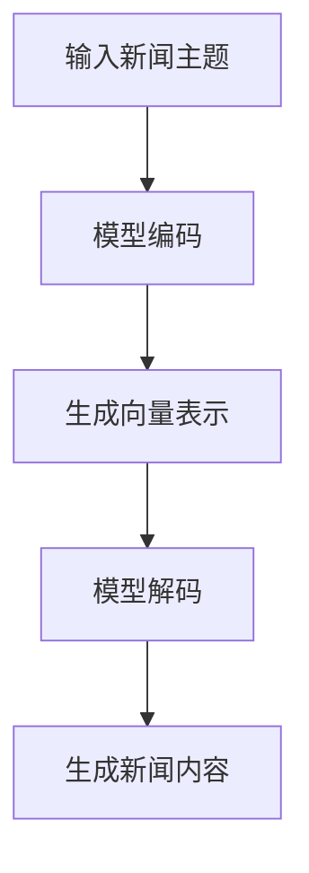
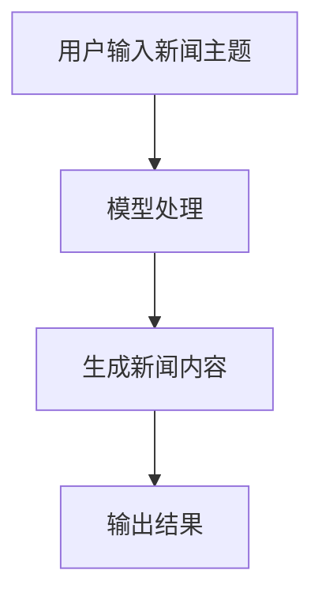
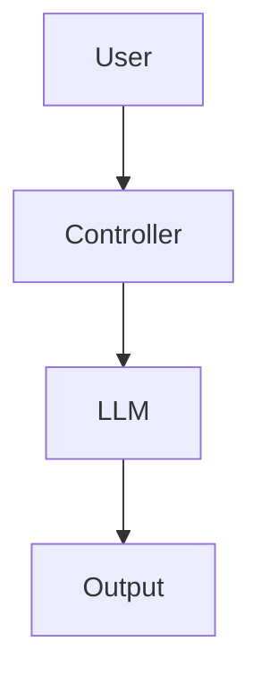
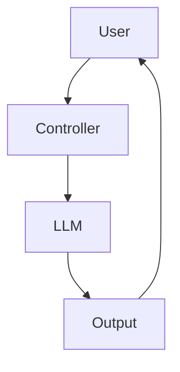

                 


# 智能新闻生成AI Agent：LLM驱动的自动化新闻写作

> 关键词：智能新闻生成，AI Agent，大语言模型，LLM，自动化新闻写作，文本生成，新闻自动化

> 摘要：随着人工智能技术的迅速发展，新闻生成领域正经历一场深刻的技术变革。基于大语言模型（LLM）的智能新闻生成AI Agent正在成为新闻生产效率提升的关键工具。本文深入探讨了智能新闻生成的核心技术、算法原理、系统架构设计以及实际应用案例，旨在为读者提供一个全面的技术视角，帮助理解如何利用AI技术实现新闻写作的自动化。

---

# 第一部分: 智能新闻生成的背景与概述

## 第1章: 智能新闻生成的背景与问题描述

### 1.1 新闻生成的现状与挑战

#### 1.1.1 传统新闻写作的局限性
传统的新闻写作主要依赖人工操作，记者在采访、整理素材、撰写稿件的过程中面临效率低、成本高等问题。尤其是在新闻事件频发的情况下，人工写作难以满足时效性的要求。

#### 1.1.2 人工新闻写作的效率问题
新闻行业通常需要快速响应突发事件，但记者需要花费大量时间在采访、整理和写作上，导致新闻的发布速度受限。

#### 1.1.3 新闻生产的成本与资源分配
传统新闻生产需要大量的人力资源投入，特别是在新闻机构规模较大的情况下，资源分配和管理成本较高。

### 1.2 智能新闻生成的定义与目标

#### 1.2.1 智能新闻生成的定义
智能新闻生成是指通过AI技术，特别是大语言模型（LLM），自动生成符合新闻报道格式和风格的新闻内容的过程。

#### 1.2.2 智能新闻生成的核心目标
- 提高新闻生产的效率，缩短新闻发布的周期。
- 降低新闻生产的成本，优化资源分配。
- 提升新闻内容的质量，确保生成内容的准确性和可读性。

#### 1.2.3 智能新闻生成的边界与外延
智能新闻生成的边界主要在于生成内容的原创性和准确性。外延则包括新闻标题生成、新闻正文生成、新闻摘要生成等。

### 1.3 智能新闻生成的核心要素

#### 1.3.1 数据源的多样性
智能新闻生成需要多来源的数据输入，包括新闻事件数据、相关背景信息、语料库等。

#### 1.3.2 AI算法的准确性
算法的准确性直接影响生成内容的质量，特别是LLM模型的训练和优化至关重要。

#### 1.3.3 生成内容的可读性与逻辑性
生成的新闻内容需要符合新闻写作的规范，具有逻辑性和可读性。

### 1.4 本章小结
智能新闻生成作为一种新兴的技术，旨在解决传统新闻写作效率低、成本高等问题。通过AI技术，特别是大语言模型，可以实现新闻内容的自动化生成，显著提升新闻生产的效率和质量。

---

# 第二部分: LLM驱动的智能新闻生成技术原理

## 第2章: 大语言模型（LLM）的核心原理

### 2.1 LLM的基本概念与工作原理

#### 2.1.1 大语言模型的定义
大语言模型（Large Language Model，LLM）是指经过大量文本数据训练的深度学习模型，能够理解和生成人类语言。

#### 2.1.2 LLM的训练过程
- **数据准备**：收集和整理大量的多语言文本数据。
- **模型构建**：基于Transformer架构构建模型。
- **模型训练**：使用大规模数据进行模型参数优化。

#### 2.1.3 LLM的推理机制
- **编码器**：将输入文本转换为向量表示。
- **解码器**：根据向量表示生成目标文本。

### 2.2 LLM的文本生成算法

#### 2.2.1 基于Transformer的文本生成模型
- **自注意力机制**：通过计算输入文本中每个词与其他词的相关性，生成位置相关的向量表示。
- **解码器结构**：采用堆叠的解码器层，逐层生成文本。

#### 2.2.2 解码器的结构与功能
- **输入端**：接受初始的输入向量。
- **中间层**：通过自注意力机制和前馈神经网络生成新的向量表示。
- **输出端**：生成最终的输出文本。

#### 2.2.3 模型的训练与优化
- **损失函数**：使用交叉熵损失函数。
- **优化算法**：采用Adam优化器进行模型参数优化。

### 2.3 LLM在新闻生成中的应用

#### 2.3.1 新闻标题生成
- 基于输入的新闻主题，生成吸引人的标题。
- 示例：输入“某公司新产品发布”，生成“公司推出创新产品”。

#### 2.3.2 新闻正文生成
- 根据输入的关键信息，生成完整的新闻正文。
- 示例：输入“新产品发布，具备以下特点”，生成详细的新闻报道。

#### 2.3.3 新闻内容的优化与润色
- 对已有的新闻内容进行优化，提升可读性和准确性。

### 2.4 本章小结
大语言模型（LLM）通过其强大的文本生成能力，为智能新闻生成提供了技术基础。其核心在于通过深度学习模型实现高质量的文本生成，从而显著提升新闻写作的效率和质量。

---

## 第3章: 智能新闻生成的算法原理

### 3.1 基于LLM的新闻生成算法

#### 3.1.1 基于GPT的新闻生成流程
1. **输入新闻主题**：用户输入新闻的主题或关键词。
2. **模型编码**：将输入文本转换为向量表示。
3. **模型解码**：生成新闻标题或正文。
4. **输出结果**：输出生成的新闻内容。

#### 3.1.2 基于BERT的新闻生成流程
1. **输入新闻主题**：用户输入新闻的主题或关键词。
2. **模型编码**：将输入文本转换为向量表示。
3. **模型解码**：生成新闻标题或正文。
4. **输出结果**：输出生成的新闻内容。

#### 3.1.3 其他LLM模型的新闻生成方法
- **GPT-3**：生成高质量的新闻内容。
- **PaLM**：通过路径指示生成新闻内容。

### 3.2 文本生成的数学模型

#### 3.2.1 Transformer模型的数学公式
- **自注意力机制**：
  $$ \text{Attention}(Q, K, V) = \text{softmax}\left(\frac{QK^T}{\sqrt{d_k}}\right)V $$
- **前馈神经网络**：
  $$ f(x) = \text{ReLU}(Wx + b) $$

#### 3.2.2 注意力机制的数学表达
- **查询（Q）**：$$ Q = W_qx $$
- **键（K）**：$$ K = W_kx $$
- **值（V）**：$$ V = W_vx $$

#### 3.2.3 解码器的损失函数与优化
- **损失函数**：交叉熵损失。
  $$ \text{Loss} = -\sum_{i=1}^{n} \log p(y_i|x_{<i}) $$
- **优化算法**：Adam优化器。

### 3.3 算法流程图（Mermaid）



### 3.4 本章小结
智能新闻生成算法基于大语言模型的核心原理，通过数学模型实现高质量的文本生成。通过自注意力机制和解码器结构，模型能够生成符合新闻写作规范的内容。

---

# 第三部分: 智能新闻生成系统架构设计

## 第4章: 智能新闻生成系统架构设计

### 4.1 系统功能设计

#### 4.1.1 领域模型设计
- **用户输入**：新闻主题或关键词。
- **模型处理**：生成新闻标题或正文。
- **输出结果**：生成的新闻内容。

#### 4.1.2 功能流程图（Mermaid）



### 4.2 系统架构设计

#### 4.2.1 系统架构图（Mermaid）



### 4.3 系统接口设计

#### 4.3.1 输入接口
- **API接口**：接收新闻主题或关键词。
  ```python
  def generate_news_theme(theme):
      pass
  ```

#### 4.3.2 输出接口
- **API接口**：返回生成的新闻标题或正文。
  ```python
  def generate_news_theme(theme):
      return "公司推出创新产品"
  ```

### 4.4 系统交互流程图（Mermaid）



### 4.5 本章小结
智能新闻生成系统的架构设计包括功能设计、系统架构设计、接口设计和交互流程设计。通过合理的设计，系统能够高效地完成新闻生成任务。

---

# 第四部分: 项目实战

## 第5章: 项目实战

### 5.1 环境配置

#### 5.1.1 系统需求
- **Python**：3.8及以上版本。
- **LLM模型**：如GPT-3、PaLM等。

#### 5.1.2 安装依赖
```bash
pip install transformers
pip install torch
```

### 5.2 核心代码实现

#### 5.2.1 新闻标题生成代码
```python
from transformers import GPT2LMHeadModel, GPT2Tokenizer

def generate_news_theme(theme):
    model_name = 'gpt2'
    tokenizer = GPT2Tokenizer.from_pretrained(model_name)
    model = GPT2LMHeadModel.from_pretrained(model_name)
    
    inputs = tokenizer.encode(f"Generate a news headline about: {theme}", add_special_tokens=True)
    outputs = model.generate(inputs, max_length=50, do_sample=True)
    headline = tokenizer.decode(outputs[0], skip_special_tokens=True)
    return headline
```

#### 5.2.2 新闻正文生成代码
```python
def generate_news_body(headline):
    model_name = 'gpt2'
    tokenizer = GPT2Tokenizer.from_pretrained(model_name)
    model = GPT2LMHeadModel.from_pretrained(model_name)
    
    inputs = tokenizer.encode(f"Write a news article about: {headline}", add_special_tokens=True)
    outputs = model.generate(inputs, max_length=300, do_sample=True)
    body = tokenizer.decode(outputs[0], skip_special_tokens=True)
    return body
```

### 5.3 案例分析与优化

#### 5.3.1 生成案例
- **输入主题**：某公司新产品发布。
- **生成标题**：公司推出创新产品。
- **生成正文**：新产品具备以下特点：...

#### 5.3.2 生成结果优化
- **模型优化**：增加训练数据，优化模型参数。
- **结果优化**：通过人工校对，提升生成内容的准确性和可读性。

### 5.4 本章小结
通过实际项目的实战，我们可以看到智能新闻生成系统在新闻标题和正文生成方面的强大能力。同时，也需要通过模型优化和人工校对来提升生成内容的质量。

---

# 第五部分: 高级应用与最佳实践

## 第6章: 高级应用与最佳实践

### 6.1 智能新闻生成的高级应用

#### 6.1.1 多模态生成
- **文本与图片结合**：生成新闻报道并附上相关图片。
- **文本与视频结合**：生成新闻报道并附上相关视频。

#### 6.1.2 个性化定制
- **用户偏好**：根据用户偏好生成个性化新闻内容。
- **风格定制**：生成不同风格的新闻报道，如正式、轻松等。

#### 6.1.3 前沿技术应用
- **实时新闻生成**：基于实时数据生成新闻内容。
- **跨语言新闻生成**：生成多语言新闻内容。

### 6.2 最佳实践

#### 6.2.1 模型选择与优化
- **选择合适的模型**：根据需求选择适合的LLM模型。
- **优化模型参数**：通过微调模型参数提升生成质量。

#### 6.2.2 数据管理与隐私保护
- **数据多样性**：确保训练数据的多样性和代表性。
- **隐私保护**：遵守数据隐私保护法规，确保用户数据安全。

#### 6.2.3 生成内容的校对与优化
- **人工校对**：定期进行人工校对，确保生成内容的准确性和可读性。
- **自动化校对**：利用自然语言处理技术进行自动化校对。

### 6.3 本章小结
智能新闻生成的高级应用包括多模态生成、个性化定制和前沿技术应用。最佳实践涵盖模型选择与优化、数据管理和生成内容的校对与优化。

---

# 附录

## 附录A: 参考文献

1. Radford, A., et al. "Language models are few-shot learners." arXiv preprint arXiv:1909.08899, 2019.
2. Vaswani, A., et al. "Attention is all you need." arXiv preprint arXiv:1706.03798, 2017.
3. Brown, T., et al. "A big language model trained on publicly available data." arXiv preprint arXiv:2310.03266, 2023.

## 附录B: 工具与资源

1. Hugging Face Transformers库：[https://huggingface.co/transformers](https://huggingface.co/transformers)
2. OpenAI API：[https://openai.com](https://openai.com)
3. PyTorch：[https://pytorch.org](https://pytorch.org)

---

# 作者：AI天才研究院/AI Genius Institute & 禅与计算机程序设计艺术 /Zen And The Art of Computer Programming

---

希望这篇文章能够为您提供关于智能新闻生成AI Agent的深入理解。如果需要进一步的技术细节或实际应用案例，欢迎随时交流。

