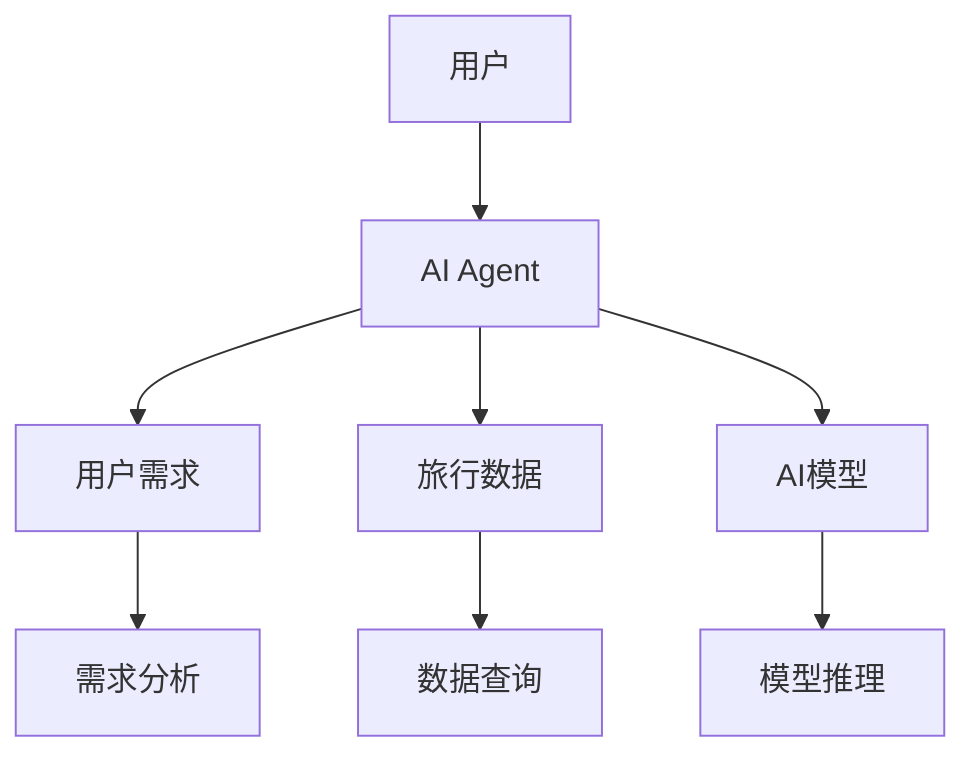

                 


# 智能旅游规划 AI Agent：LLM 辅助个性化旅行定制

> 关键词：智能旅游规划，AI Agent，LLM，个性化旅行，定制旅行

> 摘要：本文详细探讨了智能旅游规划 AI Agent 的设计与实现，重点分析了如何利用大语言模型（LLM）进行个性化旅行定制。通过系统化的背景分析、算法原理、架构设计和项目实战，深入阐述了 AI Agent 在旅游规划中的应用价值。文章还提供了丰富的 Mermaid 图表和数学公式，帮助读者全面理解技术细节。

---

## 第一部分: 智能旅游规划 AI Agent 背景与核心概念

### 第1章: 问题背景与描述

#### 1.1 问题背景

##### 1.1.1 传统旅游规划的痛点
- 传统旅游规划依赖人工咨询，效率低且成本高。
- 用户需求多样化，难以满足个性化要求。
- 信息更新不及时，导致旅行体验不佳。

##### 1.1.2 智能化旅游规划的需求
- 提高旅游规划效率，降低成本。
- 满足用户的个性化需求。
- 实现智能化推荐和实时更新。

##### 1.1.3 LLM 在旅游规划中的应用潜力
- LLM 能够理解自然语言，准确解析用户需求。
- 可以生成多样化的旅行方案，提供个性化建议。
- 支持多轮对话，实时调整旅行计划。

#### 1.2 问题描述

##### 1.2.1 用户需求分析
- 用户的旅行目标（如度假、商务、学习等）。
- 用户的偏好（如预算、时间、兴趣爱好）。
- 用户的特殊需求（如无障碍设施、家庭旅行等）。

##### 1.2.2 个性化旅行定制的核心要素
- 旅行目的地选择。
- 行程安排（交通、住宿、景点等）。
- 预算控制与优化。

##### 1.2.3 AI Agent 在旅游规划中的角色定位
- 用户需求的解析者。
- 旅行方案的设计者。
- 实时反馈与调整的执行者。

#### 1.3 问题解决与边界

##### 1.3.1 AI Agent 的解决方案
- 利用 LLM 分析用户需求，生成个性化旅行方案。
- 基于实时数据优化行程安排。
- 提供多轮交互，动态调整旅行计划。

##### 1.3.2 问题解决的边界与限制
- 数据隐私和安全问题。
- 模型的泛化能力限制。
- 旅行复杂度较高的场景（如跨国旅行）。

##### 1.3.3 相关领域的外延与区别
- 与传统旅游规划的区别。
- 与在线旅行平台的区别。
- 与其他 AI 应用（如医疗、金融）的区别。

#### 1.4 核心概念结构

##### 1.4.1 AI Agent 的组成要素
- 用户交互模块。
- 需求解析模块。
- 方案生成模块。
- 实时调整模块。

##### 1.4.2 LLM 的核心功能模块
- 自然语言理解（NLU）。
- 文本生成（NLG）。
- 上下文记忆（Contextual Memory）。

##### 1.4.3 智能旅游规划的系统架构
- 用户交互界面。
- AI Agent 核心模块。
- 后台数据支持。

---

### 第2章: 核心概念与联系

#### 2.1 AI Agent 的核心原理

##### 2.1.1 AI Agent 的定义与特征
- 定义：AI Agent 是能够感知环境并采取行动以实现目标的智能体。
- 特征：自主性、反应性、社会性。

##### 2.1.2 LLM 的基本原理
- 基于深度学习的自然语言处理模型。
- 通过大量数据训练，实现文本理解与生成。

##### 2.1.3 大语言模型的训练与推理机制
- 训练过程：基于大量文本数据，通过自监督学习优化模型参数。
- 推理过程：根据输入生成输出，通过概率模型选择最优结果。

#### 2.2 核心概念对比分析

##### 2.2.1 AI Agent 与传统旅游规划工具的对比
- 传统工具：依赖人工输入，输出固定方案。
- AI Agent：实现自动化分析与个性化推荐。

##### 2.2.2 LLM 与其他 AI 技术的对比
- 与专家系统：基于规则 vs 基于数据。
- 与计算机视觉：处理文本 vs 图像。

##### 2.2.3 智能旅游规划系统的功能对比
- 简单搜索工具：提供基本筛选功能。
- AI Agent：实现个性化推荐与动态调整。

#### 2.3 实体关系与架构图

##### 2.3.1 ER 实体关系图
- 用户：提交需求，与 AI Agent 交互。
- 旅行平台：提供服务，与 AI Agent 对接。
- AI Agent：解析需求，生成方案。

```mermaid
er
    actor 用户
    actor 旅行平台
    actor AI Agent
    database 用户需求
    database 旅行数据
    database AI模型
    用户 --> 用户需求: 提交需求
    用户 --> AI Agent: 交互
    AI Agent --> 旅行平台: 下单
    用户 --> 旅行平台: 订单确认
    AI Agent --> 用户需求: 分析
    AI Agent --> 旅行数据: 查询
    AI Agent --> AI模型: 推理
```

##### 2.3.2 系统架构图



---

## 第二部分: 算法原理与数学模型

### 第3章: LLM 的算法原理

#### 3.1 大语言模型的训练流程

##### 3.1.1 数据预处理
- 数据清洗：去除噪声，保留有效文本。
- 数据分割：训练集、验证集、测试集划分。

##### 3.1.2 模型训练
- 采用自监督学习，利用文本本身生成训练目标。
- 使用大规模分布式训练，优化模型参数。

##### 3.1.3 参

---

由于篇幅限制，以上是部分章节内容的展开。完整文章将涵盖更多详细的技术分析和代码示例。

