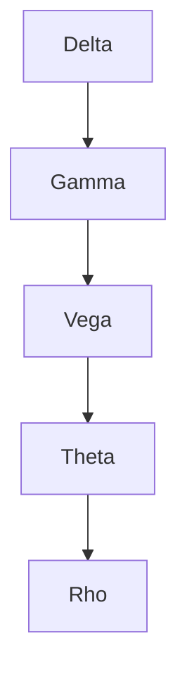
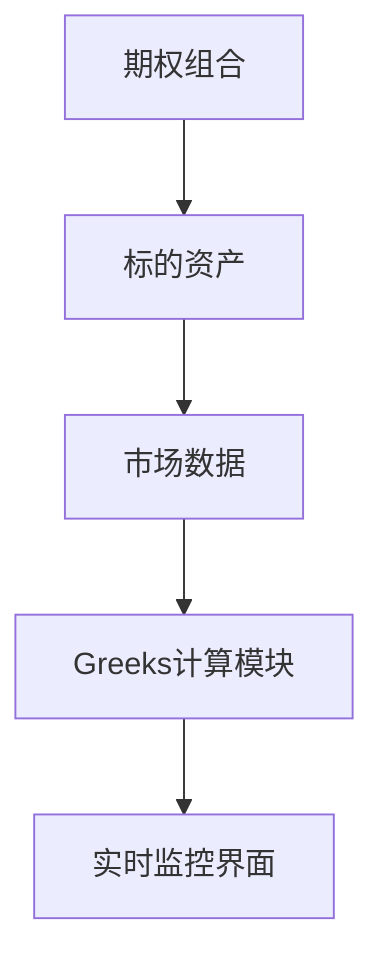
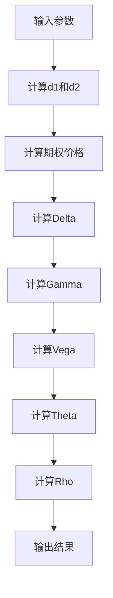
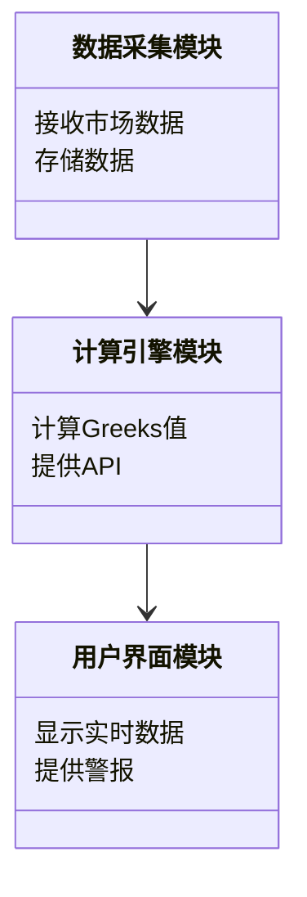
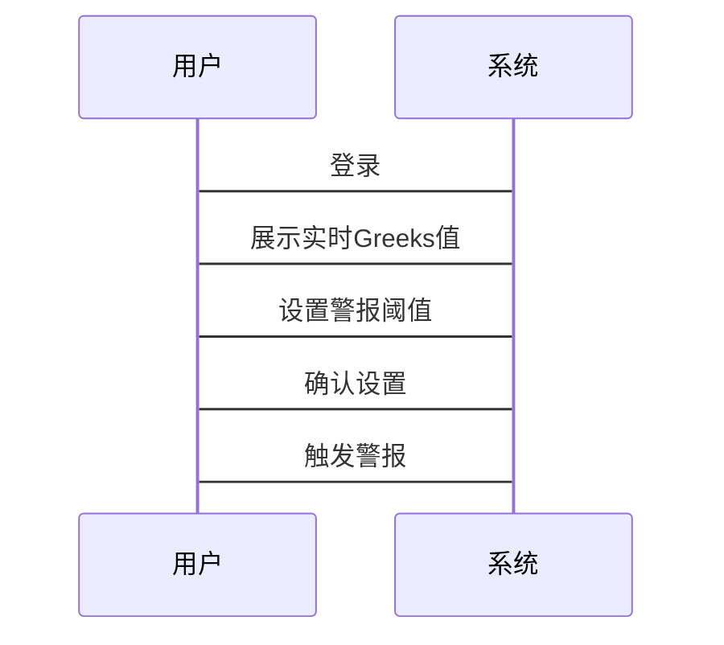

                 


# 智能期权组合Greeks实时监控系统

## 关键词：智能期权组合，Greeks，实时监控系统，金融工程，风险管理

## 摘要：本文详细介绍了智能期权组合Greeks实时监控系统的构建过程，涵盖Greeks的基本概念、期权定价理论、系统架构设计、算法实现以及项目实战等内容。通过系统化的分析和设计，展示如何利用现代技术实现对期权组合风险的实时监控与管理。

---

# 第一部分: 智能期权组合Greeks实时监控系统概述

# 第1章: 智能期权组合Greeks实时监控系统背景介绍

## 1.1 期权组合Greeks的基本概念

### 1.1.1 什么是Greeks
Greeks是一组用于衡量期权价格对各种因素变化敏感度的指标，包括delta、gamma、vega、theta和rho。这些指标帮助投资者评估和管理期权组合的风险。

### 1.1.2 Greeks在期权组合管理中的作用
Greeks在期权交易和风险管理中至关重要。通过监控这些指标，投资者可以实时了解期权组合对价格波动、时间流逝、波动率变化等因素的敏感性，从而做出更明智的交易决策。

### 1.1.3 智能监控系统的必要性
传统的Greeks计算依赖手动或静态分析，无法满足实时监控的需求。智能监控系统通过自动化数据采集、计算和分析，提供实时的Greeks值，帮助投资者快速应对市场变化。

## 1.2 期权定价理论基础

### 1.2.1 Black-Scholes模型概述
Black-Scholes模型是期权定价的核心理论，适用于欧式期权的定价。该模型考虑了标的资产价格、执行价格、波动率、时间、利率和股息率等因素。

### 1.2.2 期权价格与Greeks的关系
Greeks是期权价格对各因素变化的偏导数。例如，delta是价格对标的资产价格变化的导数，gamma是delta的变化率，vega是价格对波动率变化的导数。

### 1.2.3 Greeks的数学公式
- Delta（Δ）：\( \Delta = S \cdot N'(d_1) \)
- Gamma（Γ）：\( \Gamma = \frac{\partial \Delta}{\partial S} = N'(d_1) \)
- Vega（ν）：\( \nu = S \cdot \sigma \cdot N'(d_1) \)
- Theta（Θ）：\( \Theta = -\frac{S \cdot \sigma \cdot N'(d_1) \cdot \sigma}{2} \)
- Rho（ρ）：\( \rho = \frac{1}{r} S N'(d_1) \)

## 1.3 智能监控系统的核心目标

### 1.3.1 实时监控的必要性
金融市场瞬息万变，实时监控Greeks值可以帮助投资者及时发现和应对潜在风险。

### 1.3.2 系统的核心功能
- 实时采集市场数据
- 自动计算Greeks值
- 可视化展示和警报
- 风险评估与建议

### 1.3.3 系统的边界与外延
系统专注于Greeks计算和监控，不涉及具体的交易执行或组合优化。

## 1.4 系统的核心要素组成

### 1.4.1 数据采集模块
- 数据来源：金融市场API、数据库
- 数据类型：标的资产价格、波动率、利率等

### 1.4.2 计算引擎模块
- 算法实现：Black-Scholes模型、Greeks计算
- 工具：Python、NumPy、SciPy

### 1.4.3 用户界面模块
- 展示形式：实时图表、警报提示
- 工具：Matplotlib、Plotly

## 1.5 本章小结

---

# 第2章: 智能期权组合Greeks实时监控系统的核心概念与联系

## 2.1 Greeks的原理与属性

### 2.1.1 Delta的计算与应用
Delta衡量期权价格对标的资产价格变化的敏感度。例如，delta为0.5意味着标的资产价格每涨1元，期权价格涨0.5元。

### 2.1.2 Gamma的计算与应用
Gamma衡量delta的变化率，反映期权对标的资产价格波动的敏感度。gamma越大，delta变化越快。

### 2.1.3 Vega、Theta、Rho的计算与应用
- Vega：衡量波动率变化对期权价格的影响。
- Theta：衡量时间流逝对期权价格的影响。
- Rho：衡量利率变化对期权价格的影响。

## 2.2 Greeks的对比分析

### 2.2.1 Greeks的属性特征对比表格

| Greeks | 衡量因素       | 公式示例                |
|---------|----------------|------------------------|
| Delta   | 标的价格变化     | \( \Delta = S N'(d_1) \) |
| Gamma   | Delta变化率     | \( \Gamma = N'(d_1) \) |
| Vega    | 波动率变化       | \( \nu = S \sigma N'(d_1) \) |
| Theta   | 时间流逝影响     | \( \Theta = -\frac{S \sigma^2}{2} N'(d_1) \) |
| Rho     | 利率变化影响     | \( \rho = \frac{S N'(d_1)}{r} \) |

### 2.2.2 Greeks之间的关系图解


## 2.3 系统的ER实体关系图



## 2.4 本章小结

---

# 第3章: 智能期权组合Greeks实时监控系统的算法原理

## 3.1 算法选择与实现

### 3.1.1 Black-Scholes模型的实现
使用Python实现Black-Scholes模型，计算期权的理论价格和Greeks值。

```python
import numpy as np
from scipy.stats import norm

def black_scholes(S, K, r, sigma, T, option_type='call'):
    d1 = (np.log(S/K) + (r + sigma**2/2)*T) / (sigma*np.sqrt(T))
    d2 = d1 - sigma*np.sqrt(T)
    
    if option_type == 'call':
        price = S * norm.cdf(d1) - K * np.exp(-r*T) * norm.cdf(d2)
    else:
        price = K * np.exp(-r*T) * norm.cdf(-d2) - S * norm.cdf(-d1)
    
    delta = S * norm.pdf(d1) * np.exp(-r*T)
    gamma = (delta * sigma**2 * np.exp(-r*T)) / (2 * S * np.sqrt(T))
    vega = S * norm.pdf(d1) * np.sqrt(T) * np.exp(-r*T)
    theta = -0.5 * S * norm.pdf(d1) * sigma**2 * T * np.exp(-r*T)
    rho = -price * T * np.exp(-r*T)
    
    return price, delta, gamma, vega, theta, rho
```

### 3.1.2 算法流程图



## 3.2 算法优化与性能提升

### 3.2.1 向量化计算
使用NumPy进行向量化计算，提高计算效率。

### 3.2.2 并行计算
利用多线程或分布式计算技术，进一步提升性能。

## 3.3 算法实现中的注意事项

### 3.3.1 输入参数的合理性
确保输入参数在合理范围内，如波动率非负，时间T为正数等。

### 3.3.2 处理极端情况
考虑标的资产价格为零或无穷大等极端情况的处理。

## 3.4 本章小结

---

# 第4章: 智能期权组合Greeks实时监控系统的系统分析与架构设计

## 4.1 系统功能需求分析

### 4.1.1 数据采集功能
实时采集市场数据，包括标的资产价格、波动率、利率等。

### 4.1.2 计算引擎功能
计算Greeks值，支持多种期权类型和组合。

### 4.1.3 用户界面功能
展示实时Greeks值，提供警报和可视化工具。

## 4.2 系统架构设计

### 4.2.1 分层架构
- 数据层：数据采集和存储
- 计算层：Greeks计算和分析
- 展示层：用户界面和可视化

### 4.2.2 组件设计


## 4.3 系统接口设计

### 4.3.1 数据接口
- 数据输入接口：接收市场数据
- 数据输出接口：提供Greeks值

### 4.3.2 用户接口
- 图形界面：展示实时数据
- 警报系统：当Greeks值超过阈值时触发警报

## 4.4 系统交互设计

### 4.4.1 用户操作流程
1. 用户登录系统
2. 系统展示实时Greeks值
3. 用户设置警报阈值
4. 系统实时更新数据并触发警报

### 4.4.2 系统交互序列图



## 4.5 本章小结

---

# 第5章: 智能期权组合Greeks实时监控系统的项目实战

## 5.1 环境搭建

### 5.1.1 安装必要的工具和库
- Python
- NumPy、SciPy、Matplotlib
- 数据库（如MySQL、MongoDB）
- 数据采集接口（如API）

## 5.2 核心代码实现

### 5.2.1 数据采集模块

```python
import requests

def get_market_data(api_key):
    url = f"https://api.market.com/v1/option_data?api_key={api_key}"
    response = requests.get(url)
    data = response.json()
    return data
```

### 5.2.2 计算引擎模块

```python
from chapter3 import black_scholes

def calculate_greeks(data):
    price, delta, gamma, vega, theta, rho = black_scholes(data['S'], data['K'], data['r'], data['sigma'], data['T'])
    return {'price': price, 'delta': delta, 'gamma': gamma, 'vega': vega, 'theta': theta, 'rho': rho}
```

### 5.2.3 用户界面模块

```python
import matplotlib.pyplot as plt

def plot_greeks(data):
    plt.figure(figsize=(10, 6))
    plt.plot(data['time'], data['delta'], label='Delta')
    plt.plot(data['time'], data['gamma'], label='Gamma')
    plt.xlabel('Time')
    plt.ylabel('Value')
    plt.legend()
    plt.show()
```

## 5.3 代码应用与分析

### 5.3.1 数据流处理
- 采集市场数据
- 计算Greeks值
- 可视化展示

### 5.3.2 实际案例分析
通过模拟数据，展示系统如何实时计算和显示Greeks值，并在波动率上升时触发警报。

## 5.4 本章小结

---

# 第6章: 智能期权组合Greeks实时监控系统的最佳实践与总结

## 6.1 最佳实践

### 6.1.1 系统性能优化
- 使用向量化计算
- 优化数据存储结构

### 6.1.2 数据源选择
- 选择可靠的金融数据提供商
- 确保数据实时性和准确性

### 6.1.3 系统安全性
- 数据加密
- 权限管理

## 6.2 系统小结

### 6.2.1 系统优势
- 实时监控Greeks值
- 自动化计算和警报
- 可视化界面直观易用

### 6.2.2 系统局限性
- 依赖准确的市场数据
- 算法假设可能与实际市场不符

## 6.3 未来展望

### 6.3.1 系统扩展
- 引入AI算法进行预测
- 支持更多金融衍生品

### 6.3.2 更多应用场景
- 机构投资者的风险管理
- 个人投资者的教育工具

## 6.4 本章小结

---

# 作者：AI天才研究院/AI Genius Institute & 禅与计算机程序设计艺术 /Zen And The Art of Computer Programming

---

**本文通过系统化的分析与设计，展示了如何构建智能期权组合Greeks实时监控系统。从理论基础到算法实现，再到系统架构设计和项目实战，为读者提供了全面的指导。希望本文能帮助读者更好地理解和应用智能监控系统，提升期权组合的风险管理能力。**

