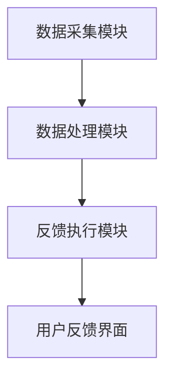

                 


# 智能浴室防滑垫：AI Agent的老人关怀系统

## 关键词：智能防滑垫，AI Agent，老人安全，物联网，传感器

## 摘要：本文介绍了一种结合AI Agent技术的智能浴室防滑垫系统，旨在提高老年人浴室安全。通过实时监测和智能调整，系统能有效预防跌倒，提升老人生活品质。文章详细讲解了系统架构、算法原理及实现方法，并通过案例分析展示了系统的实际应用价值。

---

## 第1章：智能浴室防滑垫系统背景介绍

### 1.1 老年人浴室安全问题

#### 1.1.1 老年人浴室跌倒风险分析
- 老年人因平衡能力下降，浴室跌倒风险高。
- 据统计，65岁以上老人中有40%因跌倒受伤，其中30%发生在浴室。

#### 1.1.2 跌倒对老年人健康的影响
- 跌倒可能导致骨折、头部受伤等严重健康问题。
- 恐跌心理会影响老人日常生活质量。

#### 1.1.3 防滑垫的传统解决方案及其局限性
- 传统防滑垫仅提供被动防滑，无法实时监测和主动预警。
- 安装复杂，维护困难，且无法适应不同老人需求。

### 1.2 智能防滑垫的概念与优势

#### 1.2.1 智能防滑垫的定义
- 智能防滑垫是一种结合物联网和AI技术的智能设备，实时监测使用者状态并动态调整防滑性能。

#### 1.2.2 智能防滑垫相较于传统防滑垫的优势
| 特性         | 传统防滑垫         | 智能防滑垫         |
|--------------|--------------------|--------------------|
| 感知能力     | 无                 | 高灵敏传感器       |
| 反应速度     | 无                 | 实时反馈           |
| 个性化调整   | 固定               | 动态适应           |

#### 1.2.3 老年人对智能防滑垫的实际需求
- 实时监测跌倒风险，预防事故。
- 个性化调整防滑性能，适应不同老人需求。
- 紧急情况下的智能响应和通知。

### 1.3 AI Agent在智能防滑垫中的应用

#### 1.3.1 AI Agent的基本概念
- AI Agent是具有感知环境、做出决策、执行动作的智能体。
- 在防滑垫中，AI Agent用于分析传感器数据，做出防滑调整。

#### 1.3.2 AI Agent在智能防滑垫中的角色
- **感知层**：收集老人动作数据，如体重分布、步态。
- **决策层**：分析数据，预测跌倒风险，制定防滑策略。
- **执行层**：调整防滑性能，启动预警系统。

#### 1.3.3 AI Agent如何提升老年人的安全体验
- 实时监测，预防跌倒。
- 个性化调整，提供舒适体验。
- 紧急情况快速响应，保障安全。

### 1.4 本章小结
- 介绍了老年人浴室安全问题及其严重性。
- 引出智能防滑垫的概念和优势。
- 解释了AI Agent在系统中的关键作用。

---

## 第2章：AI Agent的核心原理与技术实现

### 2.1 AI Agent的基本原理

#### 2.1.1 AI Agent的定义与分类
- **定义**：AI Agent是能够感知环境、做出决策、执行任务的智能实体。
- **分类**：基于智能水平分为反应式和认知式AI Agent。

#### 2.1.2 AI Agent的核心技术组成
- **感知层**：传感器数据采集。
- **决策层**：AI算法分析。
- **执行层**：系统反馈与调整。

#### 2.1.3 AI Agent的工作流程
1. **感知环境**：通过传感器获取数据。
2. **分析数据**：AI算法处理数据，识别潜在风险。
3. **做出决策**：根据分析结果制定应对策略。
4. **执行反馈**：调整防滑垫状态，通知用户或护理人员。

### 2.2 智能防滑垫中的AI Agent实现

#### 2.2.1 感知层：传感器数据采集
- **传感器类型**：压力传感器、加速度传感器。
- **数据采集频率**：高频采样，实时监测老人动作。

#### 2.2.2 决策层：AI算法分析
- **算法选择**：使用机器学习模型进行跌倒预测。
- **数据预处理**：滤波、特征提取。
- **模型训练**：监督学习，分类跌倒风险。

#### 2.2.3 执行层：防滑垫动态调整
- **防滑性能调整**：改变表面摩擦系数。
- **反馈机制**：动态调整支撑点，防止滑倒。

### 2.3 AI Agent在防滑垫中的具体应用

#### 2.3.1 实时监测与跌倒预测
- **监测数据**：体重分布、步频、步幅。
- **预测模型**：基于历史数据，预测跌倒概率。

#### 2.3.2 用户行为分析与个性化调整
- **行为分析**：识别异常动作，如突然转身。
- **个性化调整**：根据老人习惯，优化防滑性能。

#### 2.3.3 紧急情况下的智能响应
- **跌倒检测**：AI Agent识别跌倒动作。
- **紧急处理**：触发报警，通知护理人员。

### 2.4 本章小结
- 详细讲解了AI Agent在智能防滑垫中的实现过程。
- 介绍了感知、决策、执行三个关键环节。
- 展示了AI Agent在实时监测和跌倒预防中的应用。

---

## 第3章：系统架构与功能设计

### 3.1 系统架构设计

#### 3.1.1 系统整体架构
- **模块划分**：数据采集、数据处理、用户反馈。
- **模块关系**：数据采集模块向数据处理模块发送信号，处理后向反馈模块发送指令。

#### 3.1.2 系统架构图


#### 3.1.3 实体关系图
```mermaid
erd
actor 老年人;
actor 护理人员;
entity 传感器数据;
entity 防滑垫状态;
rule 跌倒预测算法;
```

### 3.2 系统功能模块详细设计

#### 3.2.1 数据采集模块
- **功能**：采集老人的动作数据。
- **实现**：使用多种传感器，实时采集并传输数据。

#### 3.2.2 数据处理与分析模块
- **功能**：分析数据，预测跌倒风险。
- **实现**：使用机器学习模型，分析数据特征。

#### 3.2.3 用户界面与反馈模块
- **功能**：显示系统状态，接收用户反馈。
- **实现**：友好界面设计，实时显示防滑垫状态和预警信息。

### 3.3 本章小结
- 描述了系统的整体架构和模块划分。
- 详细讲解了各功能模块的设计与实现。

---

## 第4章：系统实现与案例分析

### 4.1 环境安装与配置

#### 4.1.1 系统环境
- **硬件**：传感器模块、微控制器、无线通信模块。
- **软件**：Python编程环境，机器学习库（如TensorFlow）。

#### 4.1.2 安装步骤
1. 安装必要的Python库：`pip install numpy tensorflow scikit-learn`
2. 配置传感器连接。
3. 设置无线通信模块。

### 4.2 核心代码实现

#### 4.2.1 数据采集模块代码
```python
import numpy as np
import time

# 传感器数据模拟
def collect_data():
    sensors = np.random.normal(0.5, 0.1, 100)
    return sensors

# 数据采集循环
while True:
    data = collect_data()
    print("采集到数据：", data)
    time.sleep(1)
```

#### 4.2.2 数据处理与分析代码
```python
from sklearn import tree

# 训练跌倒预测模型
def train_model():
    X = [...]  # 特征数据
    y = [...]  # 标签数据
    clf = tree.DecisionTreeClassifier()
    clf.fit(X, y)
    return clf

# 预测跌倒风险
model = train_model()
prediction = model.predict(X_new)
print("预测结果：", prediction)
```

#### 4.2.3 用户界面与反馈代码
```python
import tkinter as tk

# 创建GUI界面
root = tk.Tk()
label = tk.Label(root, text="防滑垫状态：正常")
label.pack()

# 更新状态函数
def update_status():
    # 获取最新数据
    status = "正常"  # 示例状态
    label.config(text=f"防滑垫状态：{status}")

# 启动更新循环
root.after(1000, update_status)
root.mainloop()
```

### 4.3 案例分析与实际应用

#### 4.3.1 案例背景
- 一位75岁老人，有轻微平衡障碍。
- 在浴室中使用智能防滑垫。

#### 4.3.2 数据分析
- 传感器采集到老人步态异常，模型预测跌倒风险较高。
- 系统启动防滑调整，降低滑倒风险。

#### 4.3.3 系统反馈
- 状态界面显示“防滑垫状态：增强防滑”。
- 短信通知护理人员，准备提供帮助。

### 4.4 本章小结
- 详细讲解了系统的实现过程。
- 通过案例展示了系统的实际应用价值。

---

## 第5章：系统优化与未来展望

### 5.1 系统优化方案

#### 5.1.1 算法优化
- 引入深度学习模型，提高跌倒预测准确性。
- 使用实时数据流处理技术，减少延迟。

#### 5.1.2 系统功能扩展
- 增加远程监控功能，让家人实时查看老人状态。
- 引入语音交互，方便老人操作。

#### 5.1.3 系统性能提升
- 优化传感器灵敏度，提高数据采集精度。
- 优化算法计算速度，提升系统响应速度。

### 5.2 未来展望

#### 5.2.1 技术发展
- AI Agent技术进一步成熟，提供更多智能化服务。
- 物联网技术整合更多设备，构建智能浴室生态系统。

#### 5.2.2 应用场景拓展
- 不仅用于家庭，还可应用于养老院、公共浴室等场所。
- 结合更多健康监测功能，提供全面健康关怀。

### 5.3 本章小结
- 提出了系统的优化方向。
- 展望了技术发展和应用前景。

---

## 第6章：总结与展望

### 6.1 总结
- 本文详细介绍了智能浴室防滑垫系统的设计与实现。
- 结合AI Agent技术，系统能实时监测老人状态，预防跌倒。
- 通过案例分析，展示了系统的实际价值。

### 6.2 展望
- 随着AI和物联网技术进步，系统将更加智能化和人性化。
- 希望通过本系统的推广，提升老年人浴室安全，改善生活质量。

---

## 作者：AI天才研究院/AI Genius Institute & 禅与计算机程序设计艺术 /Zen And The Art of Computer Programming

---

**注**：由于篇幅限制，以上内容仅为文章的框架和部分内容展示，完整文章将包含更多细节和技术实现。

