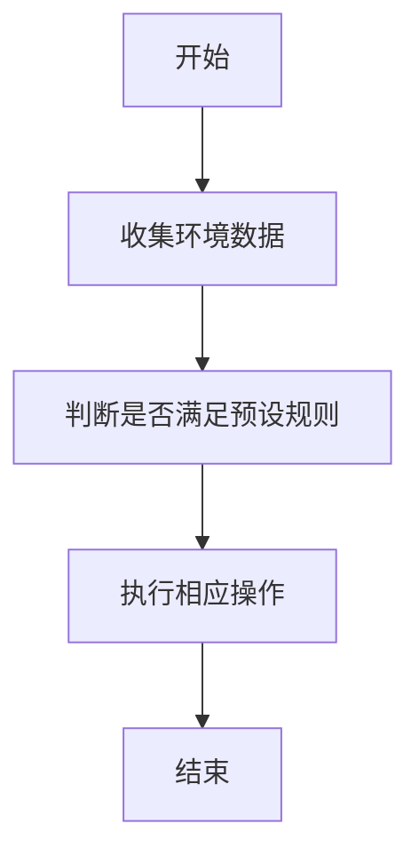
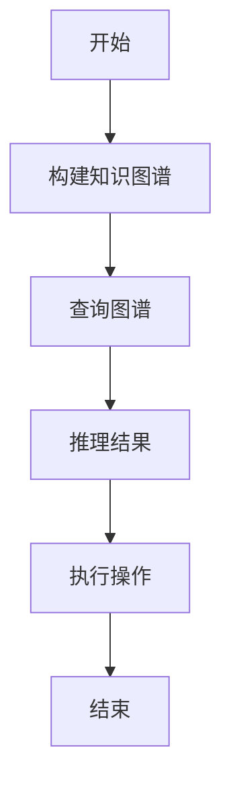
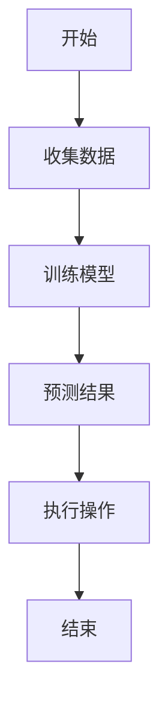
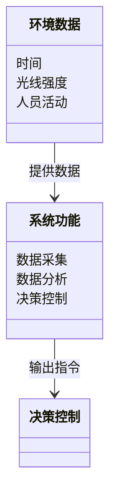
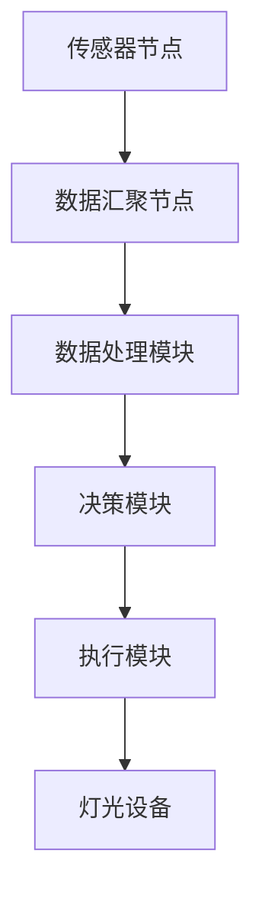
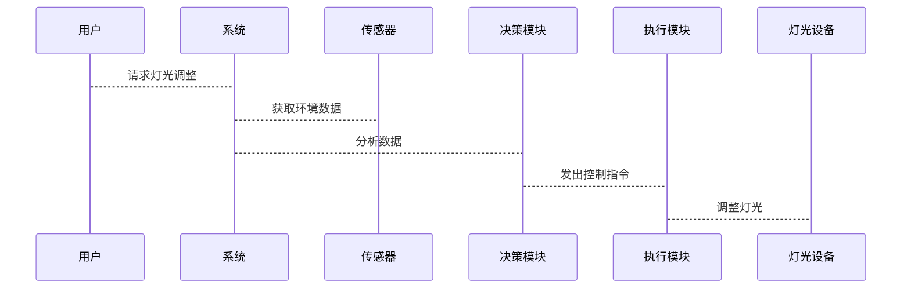

                 


# 智能灯光控制：AI Agent的情境感知系统

> 关键词：智能灯光控制，AI Agent，情境感知系统，算法原理，系统架构，项目实战

> 摘要：本文深入探讨了智能灯光控制中AI Agent的情境感知系统，分析了其核心概念、算法原理和系统架构，通过实际案例展示了AI Agent在智能灯光控制中的应用，并提供了详细的设计方案和实现步骤。

---

## 第一部分: 智能灯光控制的背景与核心概念

### 第1章: 背景介绍

#### 1.1 问题背景

##### 1.1.1 传统灯光控制的局限性
传统灯光控制系统通常基于简单的开关控制，仅能实现固定模式或手动调节，无法根据环境变化智能调整。例如，用户只能通过墙壁开关或遥控器手动切换灯光模式，无法根据时间、光线、人员活动等动态因素自动调节。

##### 1.1.2 智能化控制的需求驱动
随着智能家居和物联网技术的普及，用户对智能化生活的追求日益增长。智能灯光控制不仅需要满足基本的照明需求，还需要根据环境变化自动调整亮度、色温等参数，以提供更舒适的用户体验。

##### 1.1.3 AI Agent在灯光控制中的应用潜力
AI Agent（智能体）能够通过传感器数据、用户行为模式和环境信息，实时分析并做出决策。在灯光控制中，AI Agent可以实现情境感知，根据用户需求和环境变化自动调节灯光，提供智能化的服务。

#### 1.2 问题描述

##### 1.2.1 灯光控制的智能化目标
智能灯光控制的目标是通过AI技术实现情境感知，使灯光系统能够根据环境变化和用户需求自动调节，提供个性化和智能化的照明体验。

##### 1.2.2 情境感知在灯光控制中的作用
情境感知是AI Agent的核心能力之一，它能够实时感知环境中的各种信息（如时间、位置、光线、人员活动等），并根据这些信息做出相应的决策，例如在夜晚自动调节亮度以提供舒适的阅读环境。

##### 1.2.3 当前技术的不足与挑战
当前的灯光控制系统大多基于简单的传感器和预设规则，缺乏智能分析和动态调整的能力。主要挑战包括如何实现高效的环境感知、如何处理多源异构数据、如何保证系统的实时性和可靠性等。

#### 1.3 问题解决

##### 1.3.1 AI Agent的核心作用
AI Agent通过集成多种传感器（如光线传感器、人体传感器、时间传感器等）和数据处理技术，能够实时感知环境信息，并通过智能算法做出决策，实现智能化的灯光控制。

##### 1.3.2 情境感知系统的设计思路
情境感知系统需要整合多种数据源（如传感器数据、用户行为数据、环境数据等），通过数据融合和智能分析，生成符合用户需求的灯光控制策略。

##### 1.3.3 系统实现的关键技术
关键技术包括多传感器数据融合、智能算法设计、实时决策与控制等。需要结合边缘计算和云计算技术，确保系统的高效性和扩展性。

#### 1.4 系统边界与外延

##### 1.4.1 系统的功能边界
智能灯光控制系统的功能边界包括环境感知、数据处理、决策控制和用户交互。系统需要与智能家居平台、传感器网络和其他智能设备进行交互。

##### 1.4.2 与其他系统的接口关系
系统需要与智能家居平台（如Home Assistant）、传感器网络（如ZigBee、Wi-Fi传感器）以及用户终端设备（如手机APP）进行接口交互。

##### 1.4.3 系统扩展的可能性
系统可以通过增加新的传感器类型、引入新的AI算法模型、扩展控制设备等方式进行功能扩展。

#### 1.5 概念结构与核心要素

##### 1.5.1 AI Agent的基本组成
AI Agent由感知层、认知层和执行层组成。感知层负责收集环境信息，认知层负责分析和决策，执行层负责输出控制指令。

##### 1.5.2 情境感知系统的构成
情境感知系统包括数据采集模块、数据融合模块、智能分析模块和决策控制模块。

##### 1.5.3 灯光控制的核心要素
灯光控制的核心要素包括亮度调节、色温调节、灯光模式切换、节能优化等。

---

### 第2章: 核心概念与联系

#### 2.1 AI Agent的基本原理

##### 2.1.1 AI Agent的定义与分类
AI Agent是一种能够感知环境、自主决策并执行任务的智能实体。根据智能水平，AI Agent可以分为基于规则的Agent、基于知识的Agent和基于学习的Agent。

##### 2.1.2 AI Agent的核心属性特征
| 属性 | 描述 |
|------|------|
| 感知能力 | 能够感知环境信息 |
| 决策能力 | 能够基于感知信息做出决策 |
| 执行能力 | 能够执行决策指令 |
| 学习能力 | 能够通过经验优化决策策略 |

##### 2.1.3 AI Agent的实体关系图（ER图）
```mermaid
erDiagram
    actor 用户
    actor 环境
    actor 系统
    system 灯光控制系统
    system 数据处理模块
    system 决策模块
    system 执行模块
    用户 --> 灯光控制系统 : 请求灯光调整
    环境 --> 数据处理模块 : 提供环境数据
    数据处理模块 --> 决策模块 : 分析数据
    决策模块 --> 执行模块 : 发出控制指令
```

#### 2.2 情境感知系统的核心原理

##### 2.2.1 情境感知的定义与特点
情境感知是指系统能够感知和理解当前环境的状态，并根据环境信息做出相应的决策。其特点包括实时性、动态性和智能化。

##### 2.2.2 情境感知系统的组成要素
情境感知系统主要包括数据采集、数据融合、智能分析和决策控制四个部分。

##### 2.2.3 情境感知与灯光控制的关系
情境感知为灯光控制提供了环境信息和用户需求，使得灯光系统能够根据实际情况自动调整。

#### 2.3 核心概念的对比分析

##### 2.3.1 AI Agent与传统控制系统的对比
| 特性 | AI Agent | 传统控制系统 |
|------|----------|--------------|
| 决策方式 | 基于感知和学习 | 基于预设规则 |
| 灵活性 | 高 | 低 |
| 智能性 | 强 | 弱 |

##### 2.3.2 情境感知与传统灯光控制的对比
| 特性 | 情境感知 | 传统灯光控制 |
|------|----------|---------------|
| 信息处理 | 智能分析 | 简单逻辑判断 |
| 响应速度 | 快 | 较慢 |
| 个性化 | 强 | 弱 |

##### 2.3.3 系统架构的对比分析
传统灯光控制系统通常采用集中式架构，而基于AI Agent的情境感知系统采用分布式架构，能够更好地适应复杂环境的变化。

---

## 第3章: 算法原理讲解

### 3.1 基于规则的推理算法

#### 3.1.1 算法流程图


#### 3.1.2 算法实现
```python
def rule_based_control(environment_data):
    if environment_data['time'] >= 22 and environment_data['motion'] == False:
        return 'set_brightness(0)'
    elif environment_data['brightness'] < 50 and environment_data['motion'] == True:
        return 'increase_brightness(10)'
    else:
        return 'no_change'
```

#### 3.1.3 数学模型
规则可以表示为：如果条件A满足，则执行操作B。数学上可以表示为：
$$ \text{如果 } A \text{ 则 } B $$

### 3.2 基于知识图谱的推理算法

#### 3.2.1 算法流程图


#### 3.2.2 算法实现
```python
def knowledge_graph_reasoning(environment_data, knowledge_graph):
    query_result = knowledge_graph.query(environment_data)
    if query_result['need_high_brightness']:
        return 'increase_brightness(20)'
    else:
        return 'no_change'
```

#### 3.2.3 数学模型
知识图谱推理可以通过逻辑推理框架表示，例如：
$$ \text{如果 } A \land B \text{ 则 } C $$

### 3.3 基于机器学习的推理算法

#### 3.3.1 算法流程图


#### 3.3.2 算法实现
```python
def machine_learning_reasoning(environment_data, model):
    prediction = model.predict(environment_data)
    if prediction['high_brightness'] > 0.8:
        return 'increase_brightness(20)'
    else:
        return 'no_change'
```

#### 3.3.3 数学模型
机器学习模型通常通过概率模型表示，例如：
$$ P(\text{high brightness} | \text{environment data}) $$

---

## 第4章: 系统分析与架构设计方案

### 4.1 问题场景介绍

#### 4.1.1 系统目标
构建一个基于AI Agent的情境感知智能灯光控制系统，实现根据环境变化和用户需求自动调节灯光。

#### 4.1.2 项目介绍
本项目旨在设计和实现一个智能灯光控制系统，利用AI Agent进行情境感知，实现智能化的灯光控制。

### 4.2 系统功能设计

#### 4.2.1 领域模型


### 4.3 系统架构设计

#### 4.3.1 系统架构图


### 4.4 系统接口设计

#### 4.4.1 系统接口
- 传感器接口：接收环境数据
- 用户接口：接收用户指令
- 控制接口：输出灯光控制指令

#### 4.4.2 系统交互


---

## 第5章: 项目实战

### 5.1 环境安装

#### 5.1.1 安装Python
```bash
# 安装Python
sudo apt-get install python3 python3-pip
```

#### 5.1.2 安装依赖库
```bash
pip install numpy pandas scikit-learn matplotlib
```

### 5.2 系统核心实现

#### 5.2.1 数据采集模块
```python
import numpy as np

def collect_data():
    # 模拟环境数据
    time = np.random.randint(0, 24)
    brightness = np.random.randint(0, 100)
    motion = np.random.choice([True, False])
    return {
        'time': time,
        'brightness': brightness,
        'motion': motion
    }
```

#### 5.2.2 数据分析模块
```python
from sklearn.tree import DecisionTreeClassifier

def train_model(data):
    # 数据预处理
    features = data[['time', 'brightness']]
    target = data['motion']
    model = DecisionTreeClassifier().fit(features, target)
    return model
```

#### 5.2.3 决策控制模块
```python
def decision_control(environment_data, model):
    prediction = model.predict([[environment_data['time'], environment_data['brightness']]])
    if prediction[0] == 1:
        return 'increase_brightness(10)'
    else:
        return 'no_change'
```

### 5.3 实际案例分析

#### 5.3.1 案例背景
假设用户在晚上10点处于静止状态，系统需要自动降低亮度以节省能源。

#### 5.3.2 案例分析
环境数据：
- time = 22
- brightness = 50
- motion = False

系统决策：
- 根据规则，自动将亮度降低到0。

#### 5.3.3 代码解读
```python
environment_data = {
    'time': 22,
    'brightness': 50,
    'motion': False
}

decision = decision_control(environment_data, model)
print(decision)  # 输出：set_brightness(0)
```

---

## 第6章: 最佳实践与总结

### 6.1 最佳实践 tips

- 数据质量：确保传感器数据的准确性和实时性。
- 算法选择：根据实际需求选择合适的AI算法。
- 系统架构：采用模块化设计，便于扩展和维护。

### 6.2 小结

本文详细介绍了智能灯光控制中AI Agent的情境感知系统，从背景介绍、核心概念、算法原理到系统架构和项目实战，全面阐述了系统的实现过程。

### 6.3 注意事项

- 确保系统的安全性和稳定性。
- 定期更新模型和规则，以适应环境变化。
- 注意数据隐私保护。

### 6.4 拓展阅读

- 推荐阅读《智能控制系统设计》和《AI在物联网中的应用》。

---

## 作者

作者：AI天才研究院/AI Genius Institute  
禅与计算机程序设计艺术 /Zen And The Art of Computer Programming

