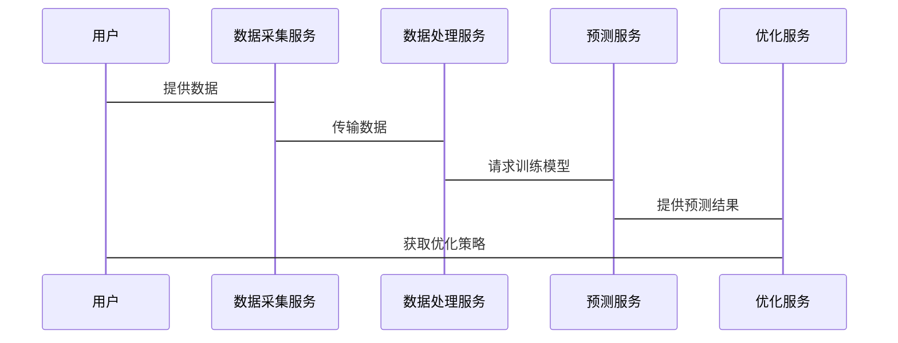

                 


# 智能现金流预测与优化管理平台

## 关键词：现金流预测，智能预测，机器学习，深度学习，现金流优化管理，时间序列分析，异常检测

## 摘要：现金流预测与优化管理是企业财务管理中的重要环节，传统的预测方法存在诸多局限性。智能现金流预测通过机器学习、深度学习等人工智能技术，实现对现金流的精准预测和优化管理。本文从智能现金流预测的核心概念出发，详细阐述其算法原理、系统架构，并通过具体案例展示其实现过程，最后总结智能现金流预测的应用价值及未来发展。

---

# 第1章: 背景与概述

## 1.1 现金流预测的重要性
### 1.1.1 现金流预测的定义与作用
现金流预测是指通过分析历史数据和市场趋势，预测未来一定时间内企业的现金流情况。它是企业财务管理中的重要工具，能够帮助企业合理规划资金使用、优化资源配置、降低财务风险。

### 1.1.2 传统现金流预测的局限性
传统现金流预测方法主要依赖历史数据分析和简单线性回归模型，存在以下问题：
- 数据维度有限，无法捕捉复杂市场变化；
- 对异常值和突变事件的处理能力不足；
- 预测精度较低，难以满足精细化管理需求。

### 1.1.3 智能现金流预测的必要性
随着人工智能技术的发展，智能现金流预测能够通过机器学习和深度学习算法，处理多维度数据，捕捉非线性关系，显著提高预测精度和鲁棒性。

## 1.2 智能现金流预测的核心概念
### 1.2.1 智能预测的定义
智能现金流预测是一种基于人工智能技术的预测方法，通过整合多源数据，利用机器学习、深度学习等算法，实现对现金流的智能预测。

### 1.2.2 智能预测与传统预测的区别
| **对比维度** | **传统预测** | **智能预测** |
|---------------|---------------|---------------|
| 数据来源      | 单一数据源    | 多源数据      |
| 模型复杂度    | 线性关系      | 非线性关系    |
| 预测精度      | 较低          | 较高          |
| 处理能力      | 无法处理异常值 | 能够处理异常值 |

### 1.2.3 智能预测的实现方式
智能现金流预测通过以下步骤实现：
1. 数据采集与预处理；
2. 特征提取与工程；
3. 模型训练与优化；
4. 预测结果输出与分析。

## 1.3 智能现金流优化管理平台的背景
### 1.3.1 企业现金流管理的挑战
企业面临市场需求波动、经济环境变化等多种不确定性因素，传统预测方法难以满足精细化管理需求。

### 1.3.2 智能化管理的必要性
通过智能现金流预测与优化管理平台，企业可以实现对现金流的实时监控、智能预测和动态调整，提升财务管理水平。

### 1.3.3 平台的目标与价值
平台的目标是通过智能化技术，帮助企业实现现金流的精准预测和优化管理。其价值体现在提高预测精度、降低财务风险、优化资源配置等方面。

## 1.4 本章小结
本章介绍了智能现金流预测的重要性、核心概念以及优化管理平台的背景，为后续内容奠定了基础。

---

# 第2章: 核心概念与技术原理

## 2.1 智能现金流预测的原理
### 2.1.1 数据驱动的预测方法
智能预测基于大量历史数据，通过机器学习算法识别数据中的模式和趋势，从而实现预测。

### 2.1.2 机器学习在预测中的应用
机器学习算法（如随机森林、支持向量机等）能够处理多维度数据，捕捉非线性关系，提高预测精度。

### 2.1.3 深度学习在预测中的优势
深度学习算法（如LSTM）能够处理时间序列数据，捕捉长期依赖关系，适合现金流预测。

## 2.2 现金流预测的关键技术
### 2.2.1 时间序列分析
时间序列分析是一种基于历史数据预测未来趋势的方法，常用模型包括ARIMA和GARCH。

### 2.2.2 异常检测与处理
通过异常检测技术识别数据中的异常值，对其进行处理以提高模型的预测精度。

### 2.2.3 数据清洗与特征工程
数据清洗包括去除噪声数据和填充缺失值；特征工程包括提取特征和构建新特征。

## 2.3 现金流预测的流程
### 2.3.1 数据采集与预处理
- 数据源：企业财务数据、市场数据等；
- 数据清洗：去除异常值、填充缺失值；
- 数据转换：标准化、归一化。

### 2.3.2 特征提取与工程
- 特征提取：从原始数据中提取有用的特征；
- 特征工程：构建新特征，如移动平均、指数平滑等。

### 2.3.3 模型训练与优化
- 模型选择：选择合适的算法（如LSTM、随机森林）；
- 模型训练：通过历史数据训练模型；
- 模型优化：调整超参数，提高预测精度。

### 2.3.4 预测结果输出与分析
- 预测结果输出：生成预测值；
- 结果分析：对比实际值与预测值，评估模型性能。

---

## 2.4 本章小结
本章详细讲解了智能现金流预测的核心概念与技术原理，为后续的系统设计与实现奠定了理论基础。

---

# 第3章: 算法原理与数学模型

## 3.1 机器学习算法原理
### 3.1.1 线性回归
线性回归是一种简单的时间序列预测方法，适用于线性关系的数据。

- 线性回归模型：$$ y = \beta_0 + \beta_1x + \epsilon $$
- 残差平方和：$$ RSS = \sum_{i=1}^{n}(y_i - \hat{y}_i)^2 $$

### 3.1.2 随机森林
随机森林是一种基于决策树的集成算法，具有较高的预测精度。

### 3.1.3 支持向量机
支持向量机通过构建超平面实现数据分类，适用于非线性关系的数据。

## 3.2 深度学习算法原理
### 3.2.1 长短期记忆网络（LSTM）
LSTM是一种特殊的RNN，能够捕捉时间序列数据中的长-term依赖关系。

- LSTM结构：输入门、遗忘门、输出门；
- LSTM单元：$$
\begin{aligned}
i &= \sigma(W_i x + U_i h_{prev}) \\
f &= \sigma(W_f x + U_f h_{prev}) \\
o &= \sigma(W_o x + U_o h_{prev}) \\
g &= \tanh(W_g x + U_g h_{prev}) \\
h &= f \cdot h_{prev} + i \cdot g
\end{aligned}
$$

### 3.2.2 循环神经网络（RNN）
RNN通过循环结构处理序列数据，适用于时间序列预测。

---

## 3.3 现金流预测的数学模型
### 3.3.1 时间序列模型
- ARIMA模型：$$ ARIMA(p, d, q) $$
- GARCH模型：$$ GARCH(p, q) $$

### 3.3.2 机器学习模型
- 线性回归模型：$$ y = \beta_0 + \beta_1x + \beta_2x^2 + \epsilon $$
- 支持向量回归模型：$$ y = \text{sign}(W \cdot \phi(x) + b) $$

---

## 3.4 本章小结
本章详细讲解了机器学习和深度学习算法的原理，以及现金流预测的数学模型，为后续的系统设计与实现提供了理论支持。

---

# 第4章: 系统架构与设计

## 4.1 系统功能设计
### 4.1.1 预测模块
- 数据输入：接收历史现金流数据；
- 特征工程：提取特征并构建新特征；
- 模型训练：训练预测模型；
- 预测结果：输出预测值。

### 4.1.2 优化模块
- 预测结果分析：对比实际值与预测值；
- 优化策略制定：根据预测结果调整现金流管理策略。

## 4.2 系统架构设计
### 4.2.1 分层架构
- 数据层：存储原始数据和处理后数据；
- 业务逻辑层：处理业务逻辑；
- 表示层：展示预测结果和优化策略。

### 4.2.2 微服务架构
- 数据采集服务：负责数据采集；
- 数据处理服务：负责数据清洗和特征工程；
- 预测服务：负责模型训练和预测；
- 优化服务：负责优化策略制定。

---

## 4.3 系统接口设计
### 4.3.1 数据接口
- 数据输入接口：接收外部数据；
- 数据输出接口：输出处理后数据。

### 4.3.2 模型接口
- 模型训练接口：训练预测模型；
- 模型预测接口：进行预测并返回结果。

## 4.4 系统交互设计
### 4.4.1 用户交互流程
1. 用户输入数据；
2. 系统进行数据处理；
3. 系统训练模型；
4. 系统输出预测结果；
5. 用户查看优化策略。

### 4.4.2 系统交互图


---

## 4.5 本章小结
本章详细讲解了智能现金流预测与优化管理平台的系统架构与设计，为后续的项目实施提供了指导。

---

# 第5章: 项目实战

## 5.1 环境安装
### 5.1.1 安装Python
- 安装Python 3.8及以上版本；
- 安装Jupyter Notebook用于开发和调试。

### 5.1.2 安装依赖库
- 使用pip安装numpy、pandas、scikit-learn、keras、tensorflow等库。

## 5.2 核心实现
### 5.2.1 数据准备
```python
import pandas as pd
import numpy as np

# 读取数据
data = pd.read_csv('cash_flow.csv')

# 数据预处理
data = data.dropna()
data = (data - data.mean()) / data.std()  # 标准化
```

### 5.2.2 特征工程
```python
from sklearn.preprocessing import OneHotEncoder

# 提取特征
features = data[['revenue', 'expenses', 'assets']]
encoder = OneHotEncoder()
encoder.fit(features)
features_encoded = encoder.transform(features).toarray()
```

### 5.2.3 模型训练
```python
from sklearn.ensemble import RandomForestRegressor
from sklearn.metrics import mean_absolute_error

# 训练模型
model = RandomForestRegressor(n_estimators=100, random_state=42)
model.fit(features_encoded, data['cash_flow'])
```

### 5.2.4 模型预测
```python
# 进行预测
predicted = model.predict(features_encoded)
print(mean_absolute_error(data['cash_flow'], predicted))
```

## 5.3 项目小结
通过本项目，我们实现了智能现金流预测系统的核心功能，验证了模型的预测精度，并展示了系统的实际应用价值。

---

# 第6章: 最佳实践与总结

## 6.1 最佳实践
### 6.1.1 数据处理
- 数据清洗：去除异常值和缺失值；
- 数据转换：标准化和归一化处理；
- 特征工程：提取有意义的特征。

### 6.1.2 模型选择
- 根据数据特点选择合适的算法；
- 对比不同算法的预测精度；
- 调整模型参数以优化性能。

### 6.1.3 系统优化
- 采用分布式架构提高处理效率；
- 使用缓存技术减少重复计算；
- 定期更新模型以适应数据变化。

## 6.2 小结
智能现金流预测与优化管理平台通过人工智能技术，显著提高了现金流预测的精度和效率，为企业财务管理提供了有力支持。

---

# 作者：AI天才研究院/AI Genius Institute & 禅与计算机程序设计艺术 /Zen And The Art of Computer Programming

