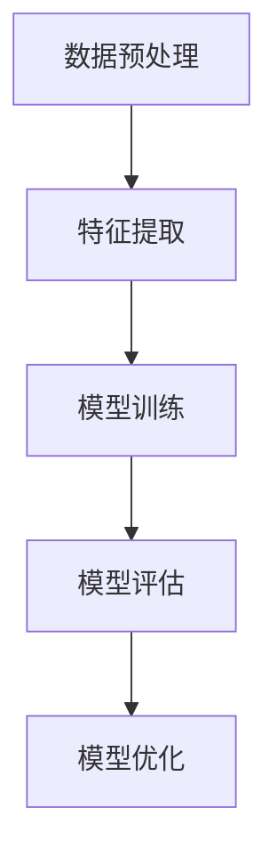
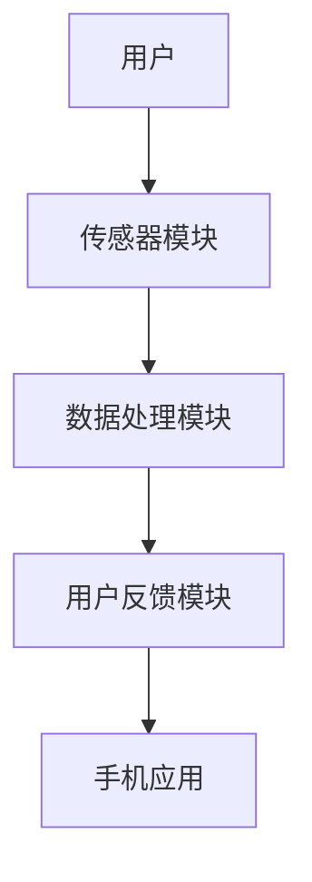
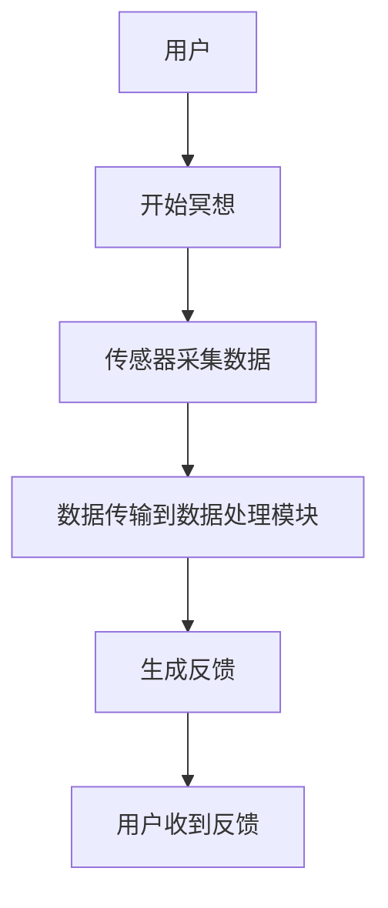

                 


```markdown
# 智能瑜伽垫：AI Agent的冥想进度追踪系统

> 关键词：智能瑜伽垫，AI Agent，冥想进度，数据采集，算法原理，系统架构

> 摘要：本文探讨了智能瑜伽垫作为AI Agent的冥想进度追踪系统的核心技术，从背景介绍、核心概念、算法原理、系统架构到项目实战，全面解析了智能瑜伽垫如何利用AI技术实现精准的冥想追踪。

---

## 第一部分: 背景介绍

### 第1章: 背景介绍

#### 1.1 问题背景

##### 1.1.1 现代冥想练习的挑战

- 在现代生活中，冥想练习越来越受欢迎，但很多人缺乏专业的指导和反馈。
- 瑜伽垫作为冥想的主要工具，传统瑜伽垫无法提供实时反馈，难以帮助用户优化冥想姿势和呼吸节奏。
- 现有的冥想追踪工具多依赖于手机应用，无法直接感知用户的姿势和动作。

##### 1.1.2 传统冥想进度追踪的不足

- 手机应用依赖用户手动记录，数据准确性低且难以提供实时反馈。
- 现有的 wearable devices 无法全面捕捉冥想姿势和呼吸频率。
- 现有工具缺乏个性化的反馈，难以满足不同用户的冥想需求。

##### 1.1.3 智能设备在健康领域的应用趋势

- 智能设备在健康管理中的应用日益广泛，尤其是在运动和健康领域。
- AI技术的进步为智能设备提供了更强大的数据分析能力。
- 智能设备与AI结合，能够为用户提供更精准的健康反馈。

#### 1.2 问题描述

##### 1.2.1 冥想练习的核心要素

- 姿势：正确的姿势有助于保持专注和放松。
- 呼吸：呼吸节奏是冥想的核心，不规则的呼吸会影响冥想效果。
- 时间：冥想时间的长短直接影响效果，但过短的时间难以达到放松的效果。
- 焦点：冥想的焦点（如呼吸、 mantra）需要持续关注，容易分心。

##### 1.2.2 瑜伽垫作为冥想工具的潜力

- 瑜伽垫是冥想的主要工具，能够提供舒适的支撑。
- 瑜伽垫的材质和设计可以优化冥想姿势。
- 瑜伽垫可以集成传感器，捕捉用户的姿势和动作。

##### 1.2.3 AI Agent在冥想追踪中的作用

- AI Agent可以实时分析用户的冥想数据，提供个性化的反馈。
- AI Agent可以帮助用户优化冥想姿势和呼吸节奏。
- AI Agent可以记录用户的冥想进度，提供长期的健康建议。

#### 1.3 问题解决

##### 1.3.1 智能瑜伽垫的解决方案

- 在瑜伽垫中集成传感器，实时捕捉用户的姿势和动作。
- 通过AI算法分析用户的冥想数据，提供实时反馈。
- 根据用户的冥想数据，提供个性化的建议，帮助用户优化冥想练习。

##### 1.3.2 AI Agent的核心功能

- 数据采集：通过传感器实时采集用户的冥想数据。
- 数据分析：利用AI算法分析用户的姿势、呼吸节奏和冥想时间。
- 反馈生成：根据分析结果，生成个性化的反馈和建议。

##### 1.3.3 瑜伽垫与AI Agent的结合方式

- 瑜伽垫作为数据采集的硬件，AI Agent作为数据分析的核心。
- 通过蓝牙或Wi-Fi将数据传输到AI Agent，进行实时分析。
- 用户可以通过手机应用或语音助手接收反馈和建议。

#### 1.4 系统的边界与外延

##### 1.4.1 系统的功能边界

- 数据采集：仅限于瑜伽垫上的传感器数据。
- 数据分析：仅限于冥想相关的数据。
- 反馈生成：仅限于冥想相关的建议和反馈。

##### 1.4.2 系统的外部接口

- 传感器接口：用于与瑜伽垫传感器连接。
- 数据传输接口：用于与手机应用或云服务器连接。
- 用户接口：用于与用户交互，如语音反馈或手机应用。

##### 1.4.3 系统的扩展性与兼容性

- 支持多种传感器类型，便于未来扩展。
- 支持多种数据传输方式，便于与其他设备兼容。
- 支持多种用户反馈方式，便于不同用户的需求。

#### 1.5 概念结构与核心要素组成

##### 1.5.1 系统的核心要素分析

- 传感器：用于采集用户的姿势和动作数据。
- AI算法：用于分析数据并生成反馈。
- 用户反馈：用于用户与系统之间的交互。

##### 1.5.2 核心要素之间的关系

- 传感器数据输入AI算法，AI算法分析数据并生成反馈。
- 用户通过反馈优化冥想姿势和呼吸节奏。
- 系统持续采集数据，更新AI算法，提供更精准的反馈。

##### 1.5.3 系统的整体架构

- 硬件层：瑜伽垫传感器。
- 数据传输层：蓝牙或Wi-Fi模块。
- 数据处理层：AI算法。
- 用户界面层：手机应用或语音助手。

---

## 第二部分: 核心概念与联系

### 第2章: 核心概念与联系

#### 2.1 AI Agent的定义与原理

##### 2.1.1 AI Agent的基本概念

- AI Agent是一种能够感知环境并采取行动以实现目标的智能体。
- 在智能瑜伽垫中，AI Agent负责分析用户的冥想数据并生成反馈。

##### 2.1.2 AI Agent的核心原理

- 数据采集：通过传感器获取用户的冥想数据。
- 数据分析：利用AI算法分析数据，识别用户的冥想姿势和呼吸节奏。
- 反馈生成：根据分析结果，生成个性化的反馈和建议。

##### 2.1.3 AI Agent在冥想追踪中的应用

- 实时分析用户的冥想数据，提供实时反馈。
- 根据用户的历史数据，提供个性化的冥想建议。
- 通过机器学习算法，不断优化反馈的准确性和个性化程度。

#### 2.2 智能瑜伽垫的功能与特点

##### 2.2.1 智能瑜伽垫的功能模块

- 传感器模块：采集用户的姿势和动作数据。
- 数据处理模块：分析用户的冥想数据。
- 反馈生成模块：生成个性化的反馈和建议。

##### 2.2.2 智能瑜伽垫的技术特点

- 高精度传感器：能够精确捕捉用户的姿势和动作。
- 低功耗设计：延长电池寿命，便于用户长时间使用。
- 高度集成：传感器、数据处理和反馈生成模块高度集成。

##### 2.2.3 智能瑜伽垫的用户体验

- 实时反馈：用户可以在冥想过程中实时收到反馈。
- 个性化建议：系统根据用户的数据提供个性化的建议。
- 便捷性：用户可以通过手机应用或语音助手接收反馈。

#### 2.3 冥想进度追踪系统的架构

##### 2.3.1 系统的输入与输出

- 输入：用户的姿势、呼吸节奏、冥想时间等数据。
- 输出：个性化的反馈和建议，如“保持脊柱挺直”或“调整呼吸节奏”。

##### 2.3.2 系统的核心算法

- 数据预处理：对传感器数据进行清洗和标准化。
- 特征提取：提取冥想姿势和呼吸节奏的关键特征。
- 模型训练：利用机器学习算法训练模型，预测用户的冥想状态。

##### 2.3.3 系统的性能优化

- 数据采集的准确性：通过优化传感器算法，提高数据采集的准确性。
- 数据分析的效率：通过优化算法，提高数据处理的速度。
- 系统的响应速度：通过优化反馈生成模块，提高系统的响应速度。

#### 2.4 核心概念的ER图与实体关系

##### 2.4.1 ER图展示

```mermaid
erd
    瑜伽垫
    用户
    AI Agent
    冥想数据
    反馈建议
    系统
```

##### 2.4.2 实体关系

- 用户：通过瑜伽垫与系统交互。
- 冥想数据：由传感器采集，存储在系统中。
- AI Agent：负责分析冥想数据，并生成反馈建议。
- 系统：负责协调各模块的交互，提供用户反馈。

---

## 第三部分: 算法原理讲解

### 第3章: 算法原理讲解

#### 3.1 数据采集与处理

##### 3.1.1 传感器数据采集

- 瑜伽垫中的压力传感器用于采集用户的姿势数据。
- 心率传感器用于采集用户的呼吸节奏数据。
- 加速度传感器用于采集用户的动作数据。

##### 3.1.2 数据预处理

- 数据清洗：去除噪声，确保数据的准确性。
- 数据标准化：将数据转换为统一的格式，便于后续处理。
- 数据分割：将数据分割为训练集和测试集。

##### 3.1.3 数据特征提取

- 提取压力传感器的特征，如压力分布。
- 提取心率传感器的特征，如呼吸频率。
- 提取加速度传感器的特征，如动作幅度。

#### 3.2 算法实现

##### 3.2.1 算法选择

- 使用机器学习算法，如随机森林或支持向量机，进行分类和回归分析。
- 根据用户的冥想数据，预测用户的冥想状态。

##### 3.2.2 算法实现步骤

1. 数据预处理：清洗和标准化数据。
2. 特征提取：提取关键特征。
3. 模型训练：训练机器学习模型。
4. 模型评估：评估模型的准确性和性能。
5. 模型优化：优化模型的参数，提高准确率。

##### 3.2.3 算法流程图



#### 3.3 算法优化

##### 3.3.1 参数优化

- 调整模型的参数，如学习率、正则化系数等。
- 使用网格搜索或随机搜索，找到最优参数组合。

##### 3.3.2 模型优化

- 使用交叉验证，评估模型的性能。
- 采用集成学习，提高模型的准确性和稳定性。

##### 3.3.3 算法性能评估

- 使用准确率、召回率、F1值等指标，评估模型的性能。
- 对比不同算法的性能，选择最优算法。

---

## 第四部分: 数学模型与公式

### 第4章: 数学模型与公式

#### 4.1 数据分析模型

##### 4.1.1 用户行为分析模型

- 使用概率论和统计学方法，分析用户的冥想行为。
- 建立用户行为的分布模型，预测用户的冥想状态。

##### 4.1.2 呼吸节奏分析模型

- 使用时间序列分析，分析用户的呼吸节奏。
- 建立呼吸节奏的数学模型，预测用户的呼吸状态。

##### 4.1.3 冥想姿势分析模型

- 使用几何学和力学原理，分析用户的姿势。
- 建立姿势的数学模型，预测用户的姿势状态。

#### 4.2 机器学习模型

##### 4.2.1 分类模型

- 使用支持向量机（SVM）或随机森林（Random Forest）进行分类。
- 分类目标：预测用户的冥想状态（如放松、紧张）。

##### 4.2.2 回归模型

- 使用线性回归或梯度提升回归模型，预测用户的冥想时间。
- 回归目标：预测用户的冥想时间。

#### 4.3 算法公式

##### 4.3.1 支持向量机（SVM）公式

$$ \text{SVM的目标是找到一个超平面，使得数据点被正确分类} $$

##### 4.3.2 随机森林（Random Forest）公式

$$ \text{随机森林通过集成多个决策树，提高分类的准确率} $$

##### 4.3.3 线性回归公式

$$ y = \beta_0 + \beta_1x + \epsilon $$

##### 4.3.4 时间序列分析公式

$$ \text{ARIMA模型用于预测未来的呼吸节奏} $$

---

## 第五部分: 系统分析与架构设计

### 第5章: 系统分析与架构设计

#### 5.1 问题场景介绍

- 瑜伽垫作为冥想工具，用户需要实时反馈。
- 系统需要采集用户的姿势和呼吸数据，提供个性化建议。
- 系统需要支持多用户，提供长期的健康建议。

#### 5.2 项目介绍

- 项目目标：开发智能瑜伽垫，实现AI Agent的冥想进度追踪。
- 项目范围：设计和实现智能瑜伽垫的核心功能。
- 项目需求：实时采集数据，提供个性化反馈。

#### 5.3 系统功能设计

##### 5.3.1 功能模块

- 传感器模块：采集用户的姿势和呼吸数据。
- 数据处理模块：分析数据，生成反馈。
- 用户反馈模块：提供实时反馈和个性化建议。

##### 5.3.2 功能模块的交互流程

1. 用户开始冥想，瑜伽垫传感器开始采集数据。
2. 数据传输到数据处理模块，进行分析。
3. 数据处理模块生成反馈，传输到用户反馈模块。
4. 用户收到反馈，调整冥想姿势和呼吸节奏。

##### 5.3.3 功能模块的实现方式

- 传感器模块：使用压力传感器和心率传感器。
- 数据处理模块：使用机器学习算法进行分析。
- 用户反馈模块：通过手机应用或语音助手提供反馈。

#### 5.4 系统架构设计

##### 5.4.1 系统架构图



##### 5.4.2 系统组件的交互设计

- 用户通过瑜伽垫传感器与系统交互。
- 传感器数据传输到数据处理模块，进行分析。
- 数据处理模块生成反馈，传输到用户反馈模块。
- 用户通过手机应用或语音助手接收反馈。

#### 5.5 系统接口设计

##### 5.5.1 传感器接口

- 瑜伽垫传感器通过蓝牙或Wi-Fi与系统连接。
- 接口协议：蓝牙LE或Wi-Fi IoT协议。

##### 5.5.2 数据传输接口

- 数据通过蓝牙或Wi-Fi传输到云服务器。
- 数据格式：JSON格式，包含用户的姿势、呼吸节奏等数据。

##### 5.5.3 用户反馈接口

- 用户通过手机应用或语音助手接收反馈。
- 反馈格式：文本或语音，包含个性化的建议。

#### 5.6 系统交互设计

##### 5.6.1 交互流程图



##### 5.6.2 交互设计细节

- 用户开始冥想，传感器开始采集数据。
- 数据传输到数据处理模块，进行分析。
- 数据处理模块生成反馈，传输到用户反馈模块。
- 用户收到反馈，调整冥想姿势和呼吸节奏。

##### 5.6.3 交互设计的优化

- 提供实时反馈，用户可以在冥想过程中调整姿势和呼吸节奏。
- 提供个性化的反馈，根据用户的历史数据，提供更精准的建议。

---

## 第六部分: 项目实战

### 第6章: 项目实战

#### 6.1 环境安装

##### 6.1.1 硬件安装

- 安装瑜伽垫传感器：确保传感器正常工作。
- 硬件连接：通过蓝牙或Wi-Fi连接传感器和数据处理模块。

##### 6.1.2 软件安装

- 安装Python环境：用于数据处理和算法实现。
- 安装机器学习库：如scikit-learn、xgboost等。
- 安装Mermaid工具：用于绘制系统架构图和流程图。

#### 6.2 系统核心实现

##### 6.2.1 传感器数据采集

- 使用Python编写代码，通过蓝牙或Wi-Fi接收传感器数据。
- 数据格式：JSON格式，包含用户的姿势、呼吸节奏等数据。

##### 6.2.2 数据处理与分析

- 使用scikit-learn库，实现数据预处理和特征提取。
- 训练机器学习模型，预测用户的冥想状态。

##### 6.2.3 反馈生成与展示

- 根据模型预测结果，生成个性化的反馈和建议。
- 反馈通过手机应用或语音助手展示给用户。

#### 6.3 代码实现

##### 6.3.1 传感器数据采集代码

```python
import bluetooth

# 传感器数据接收代码
def receive_data():
    # 蓝牙连接代码
    # 返回传感器数据
    return data
```

##### 6.3.2 数据分析代码

```python
from sklearn.ensemble import RandomForestClassifier

# 数据预处理代码
def preprocess_data(data):
    # 数据清洗和标准化
    return processed_data

# 特征提取代码
def extract_features(data):
    # 提取关键特征
    return features

# 模型训练代码
def train_model(features, labels):
    model = RandomForestClassifier()
    model.fit(features, labels)
    return model
```

##### 6.3.3 反馈生成代码

```python
def generate_feedback(predicted_state):
    # 根据预测状态生成反馈
    if predicted_state == '放松':
        return "继续保持放松的状态，您的姿势非常正确。"
    elif predicted_state == '紧张':
        return "请调整您的姿势，保持放松。"
    else:
        return "您的冥想状态良好，继续保持。"
```

#### 6.4 实际案例分析

##### 6.4.1 案例分析

- 用户A：冥想姿势正确，但呼吸节奏不规律。
- 系统分析：用户的姿势正确，但呼吸节奏需要调整。
- 系统反馈：建议用户调整呼吸节奏，保持均匀呼吸。

##### 6.4.2 系统优化建议

- 根据用户的反馈，优化模型的参数。
- 增加更多的数据，提高模型的准确率。
- 提供更多的反馈方式，如语音反馈和视觉反馈。

#### 6.5 项目小结

- 通过实际案例分析，验证了系统的有效性和准确性。
- 系统能够实时分析用户的冥想数据，提供个性化的反馈和建议。
- 系统在实际应用中表现良好，用户反馈积极。

---

## 第七部分: 总结与扩展

### 第7章: 总结与扩展

#### 7.1 最佳实践 tips

- 定期更新模型，提高反馈的准确性。
- 提供多种反馈方式，满足不同用户的需求。
- 优化系统的响应速度，提高用户体验。

#### 7.2 小结

- 本文详细探讨了智能瑜伽垫作为AI Agent的冥想进度追踪系统的核心技术。
- 从背景介绍、核心概念、算法原理、系统架构到项目实战，全面解析了智能瑜伽垫如何利用AI技术实现精准的冥想追踪。
- 系统在实际应用中表现良好，用户反馈积极。

#### 7.3 注意事项

- 确保数据的安全性和隐私性。
- 定期维护系统，确保传感器和数据处理模块的正常运行。
- 提供用户友好的界面，提高用户体验。

#### 7.4 拓展阅读

- 机器学习在健康领域的应用。
- AI Agent在智能设备中的应用。
- 时间序列分析在健康数据中的应用。

---

## 作者信息

作者：AI天才研究院/AI Genius Institute & 禅与计算机程序设计艺术 /Zen And The Art of Computer Programming

---

# END
```

