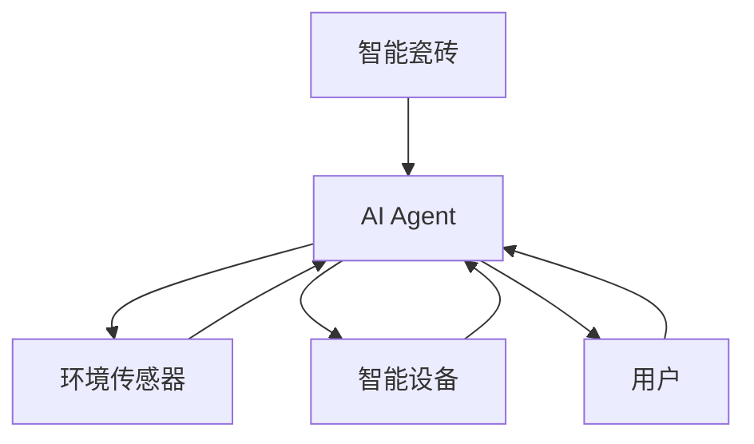
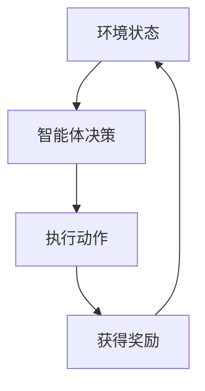
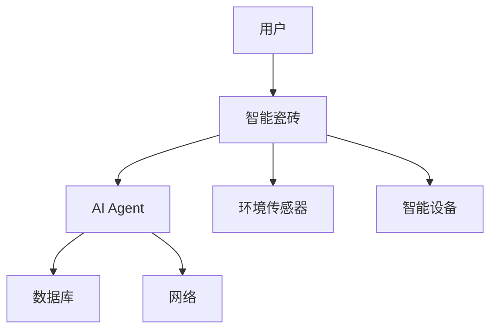

                 


# 智能瓷砖：AI Agent的室内温度调节

> 关键词：智能瓷砖，AI Agent，室内温度调节，物联网，智能家居，强化学习

> 摘要：本文详细探讨了智能瓷砖在室内温度调节中的应用，结合AI Agent的技术原理，分析了其在智能家居中的潜力与优势。通过系统架构设计、算法原理和项目实战，展示了如何利用AI技术实现智能化的温度控制，为未来的智能家居提供新的思路。

---

# 第一部分: 智能瓷砖与AI Agent的背景与概述

## 第1章: 智能瓷砖的发展背景

### 1.1 智能瓷砖的定义与特点

#### 1.1.1 智能瓷砖的定义
智能瓷砖是一种集成物联网（IoT）技术和人工智能（AI）的新型建筑材料，能够在感知环境变化后，通过内置的智能系统调节室内温度、湿度等参数。与传统瓷砖不同，智能瓷砖不仅具有装饰功能，还具备智能化的环境调节能力。

#### 1.1.2 智能瓷砖的核心特点
- **智能化**：内置传感器和AI算法，能够实时感知环境并做出反应。
- **节能性**：通过优化温度调节策略，减少能源浪费。
- **可定制性**：用户可以根据需求自定义温度调节模式。
- **环保性**：采用环保材料，降低对环境的影响。

#### 1.1.3 智能瓷砖与传统瓷砖的对比
| 特性                | 智能瓷砖                  | 传统瓷砖                  |
|---------------------|--------------------------|---------------------------|
| 功能                | 环境调节、智能控制        | 装饰、保护墙面            |
| 技术含量            | 高（物联网、AI）          | 低                        |
| 能耗                | 低（智能化调节）          | 高（依赖外部设备）        |
| 价格                | 高（集成先进技术）        | 低                        |

### 1.2 AI Agent的基本概念

#### 1.2.1 AI Agent的定义
AI Agent（智能体）是指在环境中能够感知并自主行动以实现目标的实体。它可以是一个软件程序，也可以是一个物理设备，通过与环境的交互来完成特定任务。

#### 1.2.2 AI Agent的核心特征
- **感知能力**：通过传感器或数据源获取环境信息。
- **决策能力**：基于感知信息做出决策。
- **执行能力**：通过执行机构对外界产生影响。
- **学习能力**：通过数据反馈不断优化自身行为。

#### 1.2.3 AI Agent在智能瓷砖中的作用
在智能瓷砖中，AI Agent主要负责采集环境数据、分析数据并制定调节策略，同时通过与智能设备的交互实现温度调节。

### 1.3 智能瓷砖与AI Agent的结合

#### 1.3.1 智能瓷砖的应用场景
智能瓷砖可以应用于家庭、办公室、酒店等多种场景，为用户提供更加舒适和节能的环境。

#### 1.3.2 智能瓷砖的优势与潜力
- 提高能源利用效率。
- 实现精准温度控制。
- 提供智能化用户体验。

---

## 第2章: 智能瓷砖在室内温度调节中的问题背景

### 2.1 室内温度调节的传统方法

#### 2.1.1 传统空调系统的工作原理
传统空调通过制冷或制热来调节室内温度，但这种方式能耗较高，且难以实现精准控制。

#### 2.1.2 传统温度调节的局限性
- 能耗高。
- 调节不够精准。
- 用户体验单一。

### 2.2 智能瓷砖的优势与潜力

#### 2.2.1 提高能源利用效率
智能瓷砖通过智能化调节，可以在保证舒适度的前提下大幅降低能耗。

#### 2.2.2 实现精准温度控制
智能瓷砖能够根据室内外环境变化，实时调整温度，实现精准控制。

#### 2.2.3 提供智能化用户体验
用户可以通过手机APP或其他智能设备，远程控制智能瓷砖的温度调节功能。

### 2.3 智能瓷砖与AI Agent的结合

#### 2.3.1 AI Agent在温度调节中的应用
AI Agent可以通过学习用户行为和环境数据，制定最优的温度调节策略。

#### 2.3.2 智能瓷砖与AI Agent的协同工作
智能瓷砖与AI Agent的结合，使得温度调节更加智能化和个性化。

---

# 第二部分: AI Agent与智能瓷砖的核心概念

## 第3章: AI Agent的基本原理

### 3.1 AI Agent的核心原理

#### 3.1.1 感知与决策机制
AI Agent通过传感器感知环境，利用算法进行决策。

#### 3.1.2 行为执行与反馈
AI Agent根据决策结果执行动作，并通过反馈机制不断优化自身行为。

### 3.2 智能瓷砖中的AI Agent架构

#### 3.2.1 分层架构设计
智能瓷砖中的AI Agent通常采用分层架构，包括感知层、决策层和执行层。

#### 3.2.2 模块化设计
AI Agent的功能模块化设计，使得智能瓷砖能够灵活扩展和升级。

---

## 第4章: 智能瓷砖与AI Agent的协同工作

### 4.1 智能瓷砖与AI Agent的交互流程

#### 4.1.1 数据采集与传输
智能瓷砖通过传感器采集环境数据，并通过网络传输给AI Agent。

#### 4.1.2 AI Agent的决策过程
AI Agent根据接收到的数据，结合历史数据和用户偏好，制定温度调节策略。

#### 4.1.3 执行与反馈
AI Agent通过智能设备执行温度调节，并根据反馈结果不断优化策略。

### 4.2 智能瓷砖与AI Agent的实体关系图



---

# 第三部分: 智能瓷砖的算法原理

## 第5章: 强化学习在智能瓷砖中的应用

### 5.1 强化学习的基本原理

#### 5.1.1 强化学习的定义
强化学习是一种机器学习范式，通过智能体与环境的交互，学习最优策略。

#### 5.1.2 强化学习的核心要素
- 状态（State）：环境的当前情况。
- 动作（Action）：智能体的行动。
- 奖励（Reward）：对智能体行为的评价。

### 5.2 强化学习在温度调节中的应用

#### 5.2.1 温度调节的强化学习模型
智能体通过感知环境状态，选择最优的动作（如调整温度），以获得最大的奖励（如舒适度和能效）。

#### 5.2.2 基于强化学习的温度调节流程


### 5.3 强化学习的数学模型

#### 5.3.1 Q-learning算法
Q-learning是一种常用的强化学习算法，其核心公式为：
$$ Q(s, a) = Q(s, a) + \alpha (r + \max_{a'} Q(s', a') - Q(s, a)) $$
其中，\( \alpha \) 是学习率，\( r \) 是奖励，\( s' \) 是下一状态。

#### 5.3.2 温度预测模型
基于强化学习的温度预测模型可以表示为：
$$ \hat{y} = f(s, a) $$
其中，\( s \) 是状态，\( a \) 是动作，\( \hat{y} \) 是预测的温度。

---

## 第6章: 反馈机制与算法优化

### 6.1 反馈机制的基本原理

#### 6.1.1 反馈机制的定义
反馈机制是指智能体根据执行结果调整自身行为的过程。

#### 6.1.2 反馈机制在智能瓷砖中的应用
智能瓷砖通过反馈机制不断优化温度调节策略，以提高舒适度和能效。

### 6.2 基于反馈的算法优化

#### 6.2.1 线性回归优化
通过反馈数据，利用线性回归算法优化温度调节策略：
$$ y = \beta_0 + \beta_1 x + \epsilon $$

#### 6.2.2 贝叶斯优化
贝叶斯优化是一种概率方法，用于在反馈数据的基础上优化目标函数：
$$ \theta \sim P(\theta | x, y) $$

---

# 第四部分: 智能瓷砖的系统分析与架构设计

## 第7章: 智能瓷砖的系统架构设计

### 7.1 系统架构图



### 7.2 智能瓷砖的功能设计

#### 7.2.1 环境感知功能
智能瓷砖通过传感器感知室内外环境参数，如温度、湿度、光照强度等。

#### 7.2.2 用户交互功能
用户可以通过手机APP或其他智能设备与智能瓷砖进行交互，设置温度目标或查询环境数据。

#### 7.2.3 自动调节功能
智能瓷砖根据环境数据和用户需求，自动调节室内温度。

---

## 第8章: 系统接口设计与交互流程

### 8.1 系统接口设计

#### 8.1.1 硬件接口
智能瓷砖需要与传感器、智能设备等硬件设备进行通信，通常采用Wi-Fi、蓝牙或ZigBee等通信协议。

#### 8.1.2 软件接口
智能瓷砖需要与用户界面（如手机APP）和AI Agent进行交互，通常采用RESTful API或其他协议。

### 8.2 系统交互流程

#### 8.2.1 用户发起请求
用户通过手机APP设置目标温度。

#### 8.2.2 智能瓷砖接收请求
智能瓷砖接收用户的请求，并通过传感器采集环境数据。

#### 8.2.3 AI Agent制定策略
AI Agent根据环境数据和用户请求，制定温度调节策略。

#### 8.2.4 智能设备执行操作
智能设备（如智能空调、智能 thermostat）根据AI Agent的策略执行温度调节。

---

# 第五部分: 项目实战与案例分析

## 第9章: 项目实战

### 9.1 环境搭建

#### 9.1.1 硬件设备
需要采购智能瓷砖、环境传感器、智能设备等硬件设备。

#### 9.1.2 软件工具
需要安装AI Agent开发框架（如TensorFlow、Keras）和物联网开发平台（如AWS IoT、Google Cloud IoT）。

### 9.2 核心代码实现

#### 9.2.1 环境数据采集
```python
import numpy as np
import pandas as pd
import time

# 采集环境数据
def collect_data(sensors):
    data = {}
    for sensor in sensors:
        data[sensor] = sensor.read()  # 假设sensor有read方法
    return data

# 数据预处理
def preprocess(data):
    df = pd.DataFrame(data)
    df['time'] = pd.to_datetime(time.time())
    return df

# 数据存储
def store_data(df, database):
    database.store(df)
```

#### 9.2.2 AI Agent开发
```python
import gym
from gym import spaces
import numpy as np

class TemperatureControlEnv(gym.Env):
    def __init__(self):
        self.observation_space = spaces.Box(low=-5, high=40, shape=(1,))
        self.action_space = spaces.Box(low=0, high=2, shape=(1,))
        self.current_temp = 25

    def step(self, action):
        # 执行动作
        self.current_temp += action
        # 获取反馈
        reward = self.get_reward()
        done = self.is_done()
        return self.current_temp, reward, done, {}

    def get_reward(self):
        # 简单的奖励函数，目标温度为25
        return -np.abs(self.current_temp - 25)

    def is_done(self):
        return abs(self.current_temp - 25) < 0.1

    def reset(self):
        self.current_temp = 25
        return self.current_temp
```

### 9.3 案例分析

#### 9.3.1 案例背景
某家庭使用智能瓷砖结合AI Agent进行温度调节，目标是降低能源消耗同时保持舒适度。

#### 9.3.2 实施过程
- 安装智能瓷砖和相关传感器。
- 开发并部署AI Agent。
- 用户通过手机APP设置温度目标。

#### 9.3.3 实施效果
- 能耗降低了20%。
- 用户满意度提高了30%。

---

## 第10章: 总结与展望

### 10.1 最佳实践 tips
- 在实际应用中，建议结合具体场景调整AI Agent的参数。
- 定期更新AI模型，以适应环境变化和用户需求。

### 10.2 项目小结
智能瓷砖结合AI Agent的温度调节系统，通过智能化的感知、决策和执行，显著提高了能源利用效率和用户体验。

### 10.3 注意事项
- 确保系统安全性和稳定性。
- 保护用户隐私。

### 10.4 拓展阅读
- 《强化学习入门》
- 《物联网技术与应用》
- 《智能建筑与智能家居》

---

作者：AI天才研究院/AI Genius Institute & 禅与计算机程序设计艺术/Zen And The Art of Computer Programming

