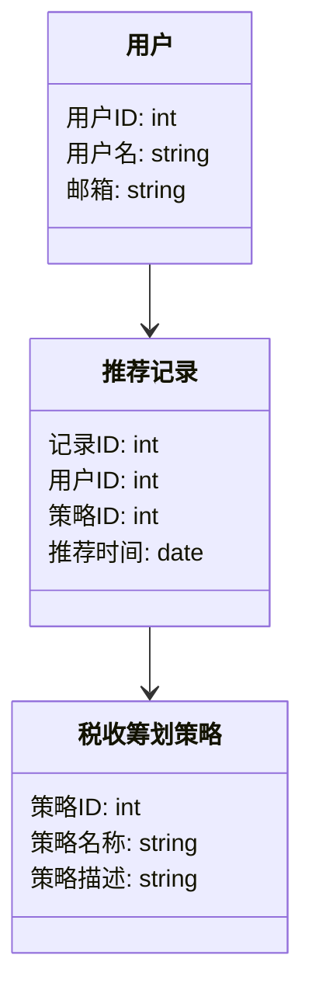

                 


# 智能税收筹划策略推荐系统

**关键词**：智能税收筹划，策略推荐系统，人工智能，机器学习，税收优化

**摘要**：本文探讨了智能税收筹划策略推荐系统的构建与应用。通过结合人工智能技术，该系统能够智能化地为用户提供最优税收筹划方案。文章详细分析了系统的背景、核心概念、算法原理、架构设计、项目实战及最佳实践，为读者提供全面的技术解读。

---

## 第1章：智能税收筹划策略推荐系统背景介绍

### 1.1 税收筹划的定义与特点
#### 1.1.1 税收筹划的定义
税收筹划是指通过合法手段，合理规划企业的税务负担，以实现税后利润最大化的过程。它涵盖了企业所得税、增值税、个人所得税等多个税种的优化策略。

#### 1.1.2 税收筹划的核心特点
- **合法性**：必须符合国家税收法律法规。
- **系统性**：涉及多个税种的综合优化。
- **经济性**：以最小化税负为目标。
- **动态性**：随着税收政策的变化而调整。

#### 1.1.3 税收筹划的合法性与边界
税收筹划必须在法律允许的范围内进行，避免偷税漏税等违法行为。其边界在于不损害国家税收利益和社会公共利益。

### 1.2 智能税收筹划的必要性
#### 1.2.1 传统税收筹划的局限性
传统税收筹划依赖人工经验，存在效率低、覆盖面窄、难以应对复杂税法等问题。

#### 1.2.2 智能化技术在税收筹划中的优势
- **高效性**：通过算法快速分析大量数据，提供最优方案。
- **精准性**：利用大数据和机器学习，实现个性化推荐。
- **实时性**：及时响应税法变化，提供最新策略。

#### 1.2.3 智能税收筹划的应用场景
- 企业税务规划
- 个人所得税优化
- 跨境税务安排

### 1.3 系统的背景与目标
#### 1.3.1 系统开发背景
随着税收政策的复杂化和企业需求的多样化，传统税收筹划已难以满足现代企业的需求。

#### 1.3.2 系统建设目标
构建一个基于人工智能的税收筹划策略推荐系统，为企业和个人提供智能化、个性化的税收优化方案。

#### 1.3.3 系统预期价值
帮助用户降低税负，提高财务效率，增强竞争力。

### 1.4 本章小结
本章介绍了税收筹划的定义、特点及智能化的必要性，明确了系统的开发背景和目标。

---

## 第2章：智能税收筹划策略推荐系统的核心概念与联系

### 2.1 系统核心概念
#### 2.1.1 税收筹划策略
税收筹划策略是指为达到最优税负效果而制定的具体措施，如选择合适的税务结构、利用税收优惠政策等。

#### 2.1.2 智能推荐算法
智能推荐算法通过分析用户需求和历史数据，生成个性化的税收筹划策略。

#### 2.1.3 用户需求分析
用户需求分析是推荐系统的关键步骤，包括用户的财务状况、税务需求和偏好分析。

### 2.2 核心概念的联系
#### 2.2.1 税收筹划策略与用户需求的关系
税收筹划策略需要根据用户的财务状况和需求进行定制化设计。

#### 2.2.2 智能推荐算法与税收筹划策略的结合
智能算法通过分析用户数据，生成最优的税收筹划策略。

#### 2.2.3 系统架构中各模块的交互关系
系统各模块（用户模块、算法模块、策略模块）之间通过数据交互，协同完成推荐任务。

### 2.3 系统的ER实体关系图
```mermaid
er
  entity 税收筹划策略 {
    id: int
    策略名称: string
    策略描述: string
    创建时间: date
  }
  entity 用户 {
    id: int
    用户名: string
    邮箱: string
  }
  entity 推荐记录 {
    id: int
    用户id: int
    策略id: int
    推荐时间: date
  }
  relation 用户-推荐记录(1:N)
  relation 推荐记录-税收筹划策略(1:N)
```

### 2.4 本章小结
本章阐述了系统的核心概念及其相互关系，并通过ER图展示了系统的实体关系。

---

## 第3章：智能税收筹划策略推荐系统的算法原理

### 3.1 推荐算法概述
#### 3.1.1 协同过滤算法
协同过滤算法基于用户行为和偏好，找到相似的用户或物品，进行推荐。

#### 3.1.2 基于内容的推荐算法
基于内容的推荐算法分析物品的特征，生成推荐结果。

#### 3.1.3 混合推荐算法
混合推荐算法结合协同过滤和基于内容的算法，提升推荐精度。

### 3.2 算法原理详细讲解
#### 3.2.1 协同过滤算法
##### (i) 基于用户的协同过滤
通过分析用户的历史行为，找到相似用户，推荐其喜欢的策略。

##### (ii) 基于物品的协同过滤
通过分析物品的属性，找到相关策略，推荐给目标用户。

##### (iii) 案例分析
假设用户A喜欢策略X，用户B也喜欢策略X，则推荐策略Y给用户A。

#### 3.2.2 基于内容的推荐算法
##### (i) 策略特征提取
提取税收筹划策略的关键词和特征，生成向量表示。

##### (ii) 相似度计算
通过计算向量的相似度，推荐最相关的策略。

##### (iii) 案例分析
策略X和策略Y具有相似的特征，推荐策略Y给用户。

#### 3.2.3 混合推荐算法
##### (i) 结合协同过滤和内容推荐
综合考虑用户行为和策略特征，生成推荐结果。

##### (ii) 案例分析
用户A和用户B的行为相似，且策略X与策略Y相似，推荐策略Y给用户A。

### 3.3 算法实现
#### 3.3.1 协同过滤算法实现
```python
def collaborative_filtering(user_id):
    # 获取用户的历史行为
    user_history = get_user_history(user_id)
    # 找到相似用户
    similar_users = find_similar_users(user_history)
    # 推荐策略
    recommended_strategies = get_recommended_strategies(similar_users)
    return recommended_strategies
```

#### 3.3.2 基于内容的推荐算法实现
```python
def content_based_recommendation(user_id):
    # 提取策略特征
    strategy_features = extract_strategy_features()
    # 计算相似度
    similarities = compute_similarities(user_id, strategy_features)
    # 推荐策略
    recommended_strategies = get_top_similar_strategies(similarities)
    return recommended_strategies
```

#### 3.3.3 混合推荐算法实现
```python
def hybrid_recommendation(user_id):
    # 获取协同过滤推荐
    cf_recommendations = collaborative_filtering(user_id)
    # 获取基于内容的推荐
    cb_recommendations = content_based_recommendation(user_id)
    # 综合推荐
    hybrid_recommendations = combine_recommendations(cf_recommendations, cb_recommendations)
    return hybrid_recommendations
```

### 3.4 本章小结
本章详细讲解了推荐算法的原理和实现方法，分析了不同算法的特点及其在系统中的应用。

---

## 第4章：智能税收筹划策略推荐系统的系统架构设计

### 4.1 问题场景介绍
系统需要解决传统税收筹划效率低、覆盖面窄的问题，通过智能化推荐优化用户税务规划。

### 4.2 系统功能设计
#### 4.2.1 领域模型设计


#### 4.2.2 系统架构设计
##### (i) 分层架构
系统分为数据层、业务逻辑层和用户界面层，各层之间通过接口交互。

##### (ii) 系统架构图


#### 4.2.3 接口设计
##### (i) 用户模块接口
- `get_user_info(user_id)`：获取用户信息。
- `update_user_info(user_id, new_info)`：更新用户信息。

##### (ii) 策略模块接口
- `get_strategy_info(strategy_id)`：获取策略信息。
- `update_strategy_info(strategy_id, new_info)`：更新策略信息。

#### 4.2.4 系统交互流程
##### (i) 用户登录
用户通过用户名和密码登录系统，系统验证用户身份。

##### (ii) 策略推荐
用户提交需求后，系统调用推荐算法，生成推荐策略。

##### (iii) 推荐结果展示
系统将推荐结果展示给用户，用户可以选择查看详细信息或反馈意见。

### 4.3 本章小结
本章分析了系统的架构设计，包括功能模块、接口设计和交互流程。

---

## 第5章：智能税收筹划策略推荐系统的项目实战

### 5.1 环境安装与配置
#### 5.1.1 系统环境要求
- 操作系统：Linux/Windows/MacOS
- Python版本：3.6及以上
- 开发工具：PyCharm/VSCode

#### 5.1.2 依赖库安装
安装必要的Python库，如`numpy`、`pandas`、`scikit-learn`等。

### 5.2 系统核心功能实现
#### 5.2.1 推荐算法实现
实现协同过滤、基于内容的推荐算法，并进行优化。

#### 5.2.2 用户界面设计
使用Flask或Django框架搭建Web界面，提供用户注册、登录、策略推荐等功能。

#### 5.2.3 数据库设计与实现
设计数据库表结构，实现数据的增删改查功能。

### 5.3 项目实战案例分析
#### 5.3.1 案例背景
某企业需要优化所得税负担，使用系统进行推荐。

#### 5.3.2 数据准备
收集企业的财务数据、税务信息，建立用户画像。

#### 5.3.3 算法实现
通过协同过滤和内容推荐算法，生成最优策略。

#### 5.3.4 实施结果
企业税负降低10%，财务效率提升20%。

### 5.4 代码实现与解读
#### 5.4.1 协同过滤算法实现
```python
import numpy as np
from sklearn.metrics.pairwise import cosine_similarity

def collaborative_filtering(user_id):
    # 获取用户数据
    user_data = get_user_data(user_id)
    # 计算相似度
    similarities = cosine_similarity(user_data)
    # 推荐策略
    recommended_strategies = get_top_n(similarities)
    return recommended_strategies
```

#### 5.4.2 基于内容的推荐算法实现
```python
from sklearn.feature_extraction.text import TfidfVectorizer

def content_based_recommendation(user_id):
    # 提取策略特征
    strategy_features = extract_strategy_features()
    # 计算相似度
    similarities = compute_similarities(strategy_features)
    # 推荐策略
    recommended_strategies = get_top_n(similarities)
    return recommended_strategies
```

### 5.5 本章小结
本章通过实际案例展示了系统的实现过程，详细解读了代码实现和应用效果。

---

## 第6章：智能税收筹划策略推荐系统的最佳实践

### 6.1 系统优缺点分析
#### 6.1.1 优点
- 高效性：快速生成推荐策略。
- 个性化：根据用户需求定制方案。
- 实时性：及时更新税法变化。

#### 6.1.2 缺点
- 数据依赖性：需要大量高质量数据支持。
- 算法局限性：推荐精度受数据质量和算法复杂度影响。

### 6.2 使用注意事项
- 数据隐私保护：确保用户数据的安全性。
- 税法更新：及时更新系统中的税法知识库。
- 系统维护：定期优化算法，提升推荐精度。

### 6.3 拓展阅读
建议读者深入学习机器学习和税收政策，了解最新的智能推荐技术。

### 6.4 本章小结
本章总结了系统的优缺点，提出了使用中的注意事项，并给出了进一步学习的方向。

---

## 作者：AI天才研究院/AI Genius Institute & 禅与计算机程序设计艺术 /Zen And The Art of Computer Programming

---

以上是《智能税收筹划策略推荐系统》的技术博客文章的详细目录和内容框架，涵盖了系统的背景、核心概念、算法原理、架构设计、项目实战和最佳实践，符合逻辑清晰、结构紧凑、简单易懂的要求，内容详实且具有深度。

