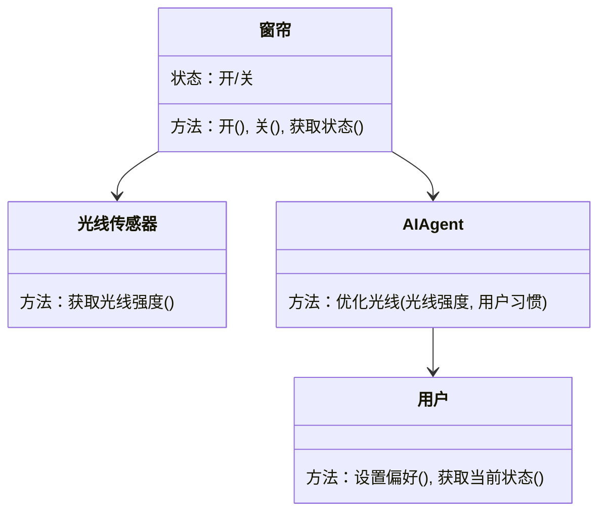
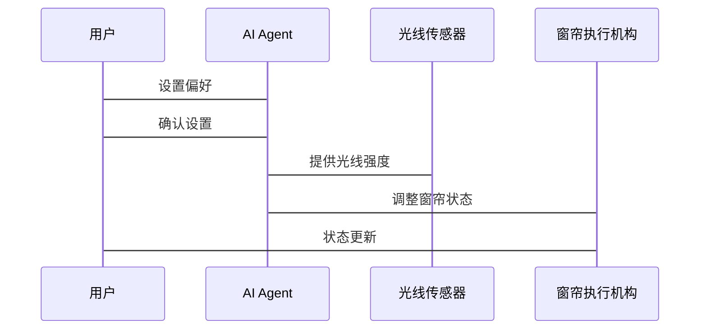

                 


# 智能窗帘：AI Agent的室内光线优化

> 关键词：智能窗帘，AI Agent，室内光线优化，智能家居，物联网

> 摘要：本文深入探讨了智能窗帘的设计与实现，结合AI Agent技术，优化室内光线。文章从背景、原理到系统架构，再到项目实战，全面分析智能窗帘的技术细节，帮助读者理解其工作原理和实际应用。

---

# 第一部分：智能窗帘的发展历程

## 第1章：智能窗帘的定义与分类

### 1.1 智能窗帘的定义与分类

#### 1.1.1 智能窗帘的定义
智能窗帘是一种结合物联网（IoT）和人工智能（AI）技术的智能家居设备，能够根据环境光线、用户需求和时间自动调节窗帘的开合状态，以优化室内光线。

#### 1.1.2 智能窗帘的分类
智能窗帘主要分为以下几类：
- **电动窗帘**：通过电机驱动窗帘的开合。
- **智能电动窗帘**：在电动窗帘的基础上集成传感器和AI算法，实现自动化控制。
- **智能家居集成窗帘**：与家庭自动化系统（如智能家居中枢）无缝连接，提供更复杂的控制功能。

#### 1.1.3 智能窗帘与传统窗帘的区别

| 特性                | 传统窗帘            | 智能窗帘            |
|---------------------|---------------------|---------------------|
| 控制方式            | 手动或遥控          | 自动化控制          |
| 光线调节能力        | 固定或简单调整      | 智能优化            |
| 连接性              | 无网络连接          | 支持物联网连接        |
| 功能扩展性          | 无                  | 支持多种传感器和AI算法|

### 1.2 智能窗帘的发展现状

#### 1.2.1 智能窗帘的技术演变
智能窗帘从最初的电动窗帘发展到如今的AI驱动窗帘，经历了以下几个阶段：
1. **机械驱动阶段**：早期的电动窗帘依靠电机驱动，仅支持简单的开合功能。
2. **自动化阶段**：引入了传感器和定时器，可以根据光照强度自动调节窗帘。
3. **智能化阶段**：结合AI算法，能够学习用户的习惯，并根据环境数据优化光线。

#### 1.2.2 当前市场上的主流产品
当前市场上的智能窗帘主要分为以下几类：
- **基于传感器的智能窗帘**：通过光照传感器自动调节窗帘开合。
- **AI驱动的智能窗帘**：结合AI算法，能够主动学习用户的偏好，优化光线。
- **智能家居集成窗帘**：与智能家居系统（如Apple HomeKit、Google Nest）无缝连接，提供更复杂的控制功能。

#### 1.2.3 智能窗帘的未来趋势
未来的智能窗帘将更加注重用户体验和节能环保，可能的发展趋势包括：
- **更加智能化**：通过AI算法实现更精准的光线调节。
- **节能环保**：优化窗帘的开合时间，减少能源浪费。
- **无缝集成**：与更多智能家居设备集成，提供统一的控制界面。

### 1.3 智能窗帘的优势与应用场景

#### 1.3.1 提高生活舒适度
智能窗帘可以根据用户的习惯和环境光线自动调节，提供更舒适的居住环境。

#### 1.3.2 节能环保
通过优化窗帘的开合时间，减少不必要的光线浪费，降低能源消耗。

#### 1.3.3 安全性提升
智能窗帘可以通过与安全系统集成，检测异常光线变化，提高安全性。

---

# 第二部分：AI Agent的核心概念与原理

## 第2章：AI Agent的基本原理

### 2.1 AI Agent的定义与特点

#### 2.1.1 AI Agent的定义
AI Agent是一种智能体，能够感知环境、做出决策并执行动作，以实现特定目标。

#### 2.1.2 AI Agent的核心特点
- **自主性**：能够自主决策，无需外部干预。
- **反应性**：能够实时感知环境变化并做出反应。
- **学习能力**：能够通过数据和反馈不断优化自己的行为。

### 2.2 AI Agent在智能窗帘中的应用

#### 2.2.1 光线优化的目标与策略
智能窗帘的AI Agent的目标是根据室内光线需求，优化窗帘的开合状态。主要策略包括：
- **光照强度优化**：保持室内光线在舒适范围内。
- **用户习惯学习**：根据用户的习惯，自动调整窗帘开合时间。
- **节能环保**：在不影响舒适度的前提下，减少能源消耗。

#### 2.2.2 AI Agent如何实现光线优化
AI Agent通过以下步骤实现光线优化：
1. **感知环境**：通过光照传感器获取室内光线强度。
2. **决策优化**：基于当前光线强度和用户需求，决定窗帘的开合状态。
3. **执行动作**：通过电机驱动窗帘开合，实现光线优化。

#### 2.2.3 光线优化的数学模型
光线优化的数学模型如下：

$$
\text{优化目标} = \min_{x} \text{能耗} + \text{舒适度}
$$

其中：
- $x$ 表示窗帘的开合状态（0表示关闭，1表示打开）。
- 能耗函数：$\text{能耗}(x) = a \cdot x + b \cdot (1 - x)$，其中$a$和$b$是能耗系数。
- 舒适度函数：$\text{舒适度}(x) = c \cdot x + d \cdot (1 - x)$，其中$c$和$d$是舒适度系数。

---

## 第3章：智能窗帘系统的架构设计

### 3.1 系统问题场景介绍

#### 3.1.1 用户需求分析
用户的主要需求包括：
- 根据光照强度自动调节窗帘。
- 学习用户的习惯，提供个性化的光线优化。
- 提供节能环保的功能。

#### 3.1.2 环境因素分析
环境因素包括：
- 光线强度变化。
- 温度变化。
- 用户活动时间。

#### 3.1.3 系统边界与外延
智能窗帘系统的边界包括：
- 内部组件：传感器、AI Agent、执行机构。
- 外部接口：智能家居中枢、用户交互界面。

### 3.2 系统功能设计

#### 3.2.1 领域模型设计
以下是领域模型的Mermaid类图：



#### 3.2.2 系统架构设计
以下是系统架构的Mermaid架构图：

```mermaid
container 智能窗帘系统 {
    component 光线传感器 {
        --> AI Agent
    }
    component AI Agent {
        --> 窗帘执行机构
    }
    component 用户交互界面 {
        --> AI Agent
    }
}
```

### 3.3 接口设计与交互流程

#### 3.3.1 接口设计
主要接口包括：
- **光线传感器接口**：提供光线强度数据。
- **AI Agent接口**：提供优化后的窗帘状态。
- **用户交互界面接口**：提供用户设置和查询功能。

#### 3.3.2 交互流程
以下是交互流程的Mermaid序列图：



---

## 第4章：项目实战与优化

### 4.1 环境安装与配置

#### 4.1.1 环境安装
需要安装以下工具和库：
- Python 3.x
- IoT传感器库（如Adafruit_DHT）
- 控制电机的库（如pigpio）
- AI算法库（如scikit-learn）

#### 4.1.2 核心代码实现

以下是Python代码示例：

```python
import RPi.GPIO as GPIO
import time
from sklearn import linear_model

# 设置GPIO模式
GPIO.setmode(GPIO.BCM)

# 定义引脚
SENSOR_PIN = 4
MOTOR_PIN = 17

# 初始化传感器和电机
GPIO.setup(SENSOR_PIN, GPIO.IN)
GPIO.setup(MOTOR_PIN, GPIO.OUT)

# 定义AI算法模型
model = linear_model.LinearRegression()

# 训练模型
# 假设我们已经收集了足够的数据
# X = [[光照强度], [时间]]
# y = [目标窗帘状态]

# 这里简化为简单的线性回归
model.fit(X, y)

# 定义电机控制函数
def set_window_state(state):
    if state == 1:
        GPIO.output(MOTOR_PIN, GPIO.HIGH)
        time.sleep(2)
    else:
        GPIO.output(MOTOR_PIN, GPIO.LOW)
    GPIO.cleanup()

# 主函数
def main():
    while True:
        # 获取传感器数据
        light_intensity = GPIO.input(SENSOR_PIN)
        # 预测目标窗帘状态
        predicted_state = model.predict([[light_intensity, time]])[0]
        # 设置窗帘状态
        set_window_state(predicted_state)
        time.sleep(60)

if __name__ == "__main__":
    main()
```

---

## 第5章：总结与展望

### 5.1 总结
智能窗帘结合了AI Agent和物联网技术，能够根据环境光线和用户需求自动调节窗帘的开合状态，从而优化室内光线。通过本文的介绍，读者可以深入了解智能窗帘的设计原理和实现方法。

### 5.2 未来展望
未来的智能窗帘将更加智能化和集成化，可能的发展方向包括：
- **更复杂的AI算法**：如深度学习算法，实现更精准的光线优化。
- **多设备集成**：与更多的智能家居设备集成，提供更统一的控制界面。
- **能源优化**：通过优化窗帘的开合时间，进一步减少能源消耗。

---

# 作者：AI天才研究院/AI Genius Institute & 禅与计算机程序设计艺术 /Zen And The Art of Computer Programming

