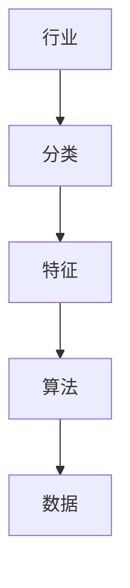
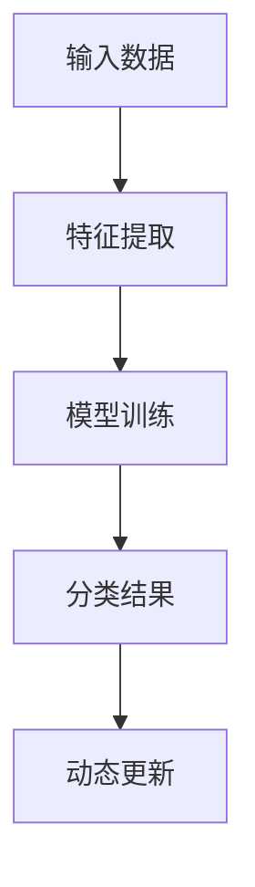
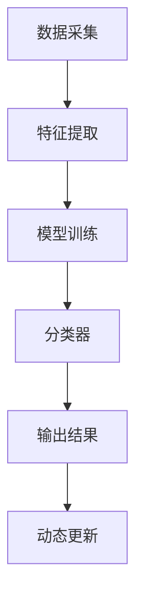

                 


# 智能算法构建动态行业分类

> 关键词：动态行业分类，智能算法，机器学习，数据挖掘，行业分析

> 摘要：本文详细探讨了如何利用智能算法构建动态行业分类系统，从背景介绍、核心概念、算法原理到系统架构、项目实战等多方面展开分析。通过实际案例和详细代码实现，展示了动态行业分类在实践中的应用价值。

---

## 目录

1. [智能算法构建动态行业分类的背景与核心概念](#智能算法构建动态行业分类的背景与核心概念)
   1.1 问题背景
   1.2 问题描述
   1.3 问题解决与边界
   1.4 核心概念与结构
2. [动态行业分类的核心概念与联系](#动态行业分类的核心概念与联系)
   2.1 核心概念原理
   2.2 核心概念对比
   2.3 ER实体关系图
3. [智能算法的数学模型与原理](#智能算法的数学模型与原理)
   3.1 算法原理
   3.2 算法流程图
   3.3 算法实现
4. [系统架构与设计](#系统架构与设计)
   4.1 功能模块设计
   4.2 系统架构图
   4.3 系统接口设计
   4.4 系统交互流程图
5. [项目实战](#项目实战)
   5.1 环境安装与配置
   5.2 核心代码实现
   5.3 案例分析与结果展示
6. [最佳实践与总结](#最佳实践与总结)
   6.1 实践经验分享
   6.2 问题总结与优化建议
   6.3 拓展阅读与未来方向

---

## 第一部分: 智能算法构建动态行业分类的背景与核心概念

### 1.1 问题背景

#### 1.1.1 行业分类的传统方法与局限性
传统行业分类方法依赖于人工经验和静态规则，难以适应快速变化的市场环境。例如，零售行业的分类可能需要定期手动更新，无法实时反映市场趋势。

#### 1.1.2 动态行业分类的必要性
随着市场竞争加剧和技术进步，行业分类需要动态更新，以捕捉新兴趋势和市场变化。智能算法能够实时分析数据，自动调整分类标准。

#### 1.1.3 智能算法在行业分类中的作用
智能算法通过数据挖掘和机器学习技术，能够从海量数据中提取特征，自动分类行业，显著提高分类的准确性和效率。

### 1.2 问题描述

#### 1.2.1 动态行业分类的核心挑战
- 数据实时性要求高
- 分类标准动态变化
- 算法的可解释性和鲁棒性

#### 1.2.2 数据驱动的行业分类需求
行业分类需要基于实时数据，动态调整分类标准，以反映市场变化。

#### 1.2.3 智能算法的解决方案
利用机器学习算法，构建动态分类模型，实时更新行业分类。

### 1.3 问题解决与边界

#### 1.3.1 动态行业分类的实现目标
- 实时更新行业分类
- 提高分类准确率
- 减少人工干预

#### 1.3.2 算法的适用边界与限制
- 数据质量要求高
- 计算资源消耗较大
- 适用于数据量较大的行业

#### 1.3.3 行业分类的动态更新机制
- 定时更新：每隔一定时间更新分类
- 事件驱动：当市场变化触发更新
- 混合机制：结合定时和事件驱动

### 1.4 核心概念与结构

#### 1.4.1 智能算法的定义与组成
智能算法由数据输入、特征提取、模型训练和分类输出组成，能够自适应调整分类标准。

#### 1.4.2 动态行业分类的系统架构
系统架构包括数据采集、特征提取、模型训练、分类输出和动态更新模块。

#### 1.4.3 核心要素与功能模块
- 数据采集模块
- 特征提取模块
- 模型训练模块
- 分类输出模块
- 动态更新模块

---

## 第二部分: 动态行业分类的核心概念与联系

### 2.1 核心概念原理

#### 2.1.1 智能算法的基本原理
智能算法通过学习数据特征，构建分类模型，实现对行业的自动分类。

#### 2.1.2 动态行业分类的数学模型
分类模型基于概率论和统计学习理论，动态调整分类器参数。

#### 2.1.3 算法与行业的映射关系
算法通过特征提取和模型训练，将行业数据映射到分类结果。

### 2.2 核心概念对比

| 对比维度       | 传统行业分类       | 动态行业分类       |
|----------------|------------------|------------------|
| 分类依据       | 静态规则         | 动态数据驱动     |
| 更新频率       | 定期更新         | 实时更新         |
| 分类精度       | 较低             | 较高             |
| 适用场景       | 稳定市场环境     | 动态变化市场环境 |

### 2.3 ER实体关系图



---

## 第三部分: 智能算法的数学模型与原理

### 3.1 算法原理

#### 3.1.1 分类算法的数学模型
使用决策树、随机森林等算法，构建分类模型。

#### 3.1.2 动态更新的数学公式
分类模型通过在线学习算法，动态更新参数。

#### 3.1.3 算法的收敛性分析
算法在训练过程中逐步收敛，分类精度不断提高。

### 3.2 算法流程图



### 3.3 算法实现

#### 3.3.1 Python源代码实现

```python
import pandas as pd
from sklearn.tree import DecisionTreeClassifier
from sklearn.model_selection import train_test_split

# 数据加载
data = pd.read_csv('industry_data.csv')

# 特征提取
X = data.drop('label', axis=1)
y = data['label']

# 数据分割
X_train, X_test, y_train, y_test = train_test_split(X, y, test_size=0.2)

# 模型训练
model = DecisionTreeClassifier()
model.fit(X_train, y_train)

# 分类结果
y_pred = model.predict(X_test)

# 动态更新
# （此处省略动态更新的具体实现）
```

#### 3.3.2 分类结果分析

分类准确率：$$ accuracy = \frac{correct}{total} $$

---

## 第四部分: 系统架构与设计

### 4.1 功能模块设计

#### 4.1.1 功能模块说明
- 数据采集模块：负责收集行业数据
- 特征提取模块：提取行业特征
- 模型训练模块：训练分类模型
- 分类输出模块：输出分类结果
- 动态更新模块：动态调整分类模型

#### 4.1.2 功能模块流程图



---

## 第五部分: 项目实战

### 5.1 环境安装与配置

#### 5.1.1 环境要求
- Python 3.8+
- scikit-learn库
- pandas库

#### 5.1.2 安装依赖
```bash
pip install scikit-learn pandas
```

### 5.2 核心代码实现

#### 5.2.1 数据加载与预处理

```python
import pandas as pd

# 加载数据
data = pd.read_csv('industry_data.csv')

# 数据预处理
data.dropna(inplace=True)
```

#### 5.2.2 模型训练与分类

```python
from sklearn.tree import DecisionTreeClassifier
from sklearn.model_selection import train_test_split

# 数据分割
X = data.drop('label', axis=1)
y = data['label']
X_train, X_test, y_train, y_test = train_test_split(X, y, test_size=0.2)

# 模型训练
model = DecisionTreeClassifier()
model.fit(X_train, y_train)

# 预测结果
y_pred = model.predict(X_test)
print("预测结果:", y_pred)
```

#### 5.2.3 案例分析

假设我们有一个零售行业的数据集，包含销售额、利润、客户数量等特征。通过训练分类模型，可以将企业分为不同的市场细分，帮助企业制定精准的市场策略。

---

## 第六部分: 最佳实践与总结

### 6.1 实践经验分享

- 数据预处理是关键，确保数据质量
- 选择合适的算法，提升分类精度
- 定期评估模型性能，及时优化

### 6.2 问题总结与优化建议

- 提高算法的可解释性
- 优化动态更新机制
- 增强系统的容错能力

### 6.3 拓展阅读与未来方向

- 深度学习在行业分类中的应用
- 联合学习算法的研究
- 行业分类的可视化分析

---

## 作者：AI天才研究院/AI Genius Institute & 禅与计算机程序设计艺术 /Zen And The Art of Computer Programming

---

### 总结

通过本文的详细分析，我们了解了智能算法在动态行业分类中的应用，从背景介绍到系统实现，再到项目实战，为读者提供了全面的指导。未来，随着技术的进步，智能算法将在更多领域展现出其强大的能力。

