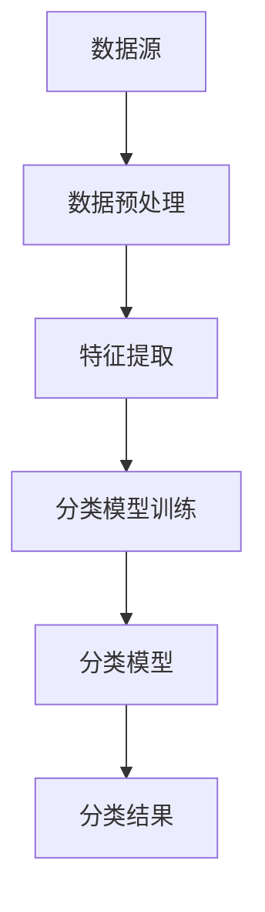

                 


# 智能算法构建动态行业分类体系

## 关键词：智能算法、动态行业分类、机器学习、特征提取、分类模型

## 摘要：
智能算法在动态行业分类中的应用日益广泛，传统的静态分类体系已难以应对快速变化的市场环境。本文将系统介绍智能算法如何构建动态行业分类体系，涵盖从背景介绍到项目实战的各个方面。通过详细阐述算法原理、数学模型、系统架构及实际案例，本文旨在帮助读者理解并掌握智能算法在动态行业分类中的应用。

---

# 第1章：智能算法与动态行业分类概述

## 1.1 智能算法的定义与特点

### 1.1.1 智能算法的基本概念
智能算法是一种基于机器学习、深度学习等技术的算法，能够通过数据学习和自适应优化来完成特定任务。与传统算法不同，智能算法具有自适应性和灵活性，能够根据数据的变化动态调整模型。

### 1.1.2 智能算法的核心特点
- **自适应性**：能够根据输入数据的变化自动调整模型参数。
- **数据驱动**：依赖大量数据进行训练和优化。
- **非线性关系**：能够处理复杂的数据关系，捕捉数据中的隐含模式。

### 1.1.3 智能算法与传统算法的区别
| 特性 | 智能算法 | 传统算法 |
|------|----------|----------|
| 数据依赖性 | 高 | 低 |
| 自适应性 | 强 | 弱 |
| 处理复杂性 | 善于处理非线性关系 | 善于处理线性关系 |

## 1.2 动态行业分类的背景与意义

### 1.2.1 行业分类的传统方法
传统的行业分类方法通常基于固定的规则和静态数据，例如行业标准和历史统计数据。这种方法在数据变化较快的场景下表现不佳。

### 1.2.2 动态行业分类的必要性
随着市场的快速变化，行业之间的界限变得模糊，传统的静态分类方法难以满足实时分类的需求。动态行业分类能够根据最新的数据动态调整分类结果，具有更强的适应性。

### 1.2.3 智能算法在动态分类中的作用
智能算法能够实时处理海量数据，发现数据中的潜在模式和关系，从而实现动态行业分类。

## 1.3 本书的核心目标与结构

### 1.3.1 本书的核心目标
通过智能算法构建动态行业分类体系，解决传统分类方法的局限性。

### 1.3.2 本书的章节结构
- 第1章：智能算法与动态行业分类概述
- 第2章：智能算法的核心概念
- 第3章：分类模型的数学基础
- 第4章：系统架构与设计
- 第5章：项目实战
- 第6章：总结与展望

### 1.3.3 本书的适用读者
本书适用于数据科学家、软件工程师、行业分析师以及对智能算法感兴趣的读者。

---

# 第2章：智能算法的核心概念

## 2.1 分类模型的基本结构

### 2.1.1 分类模型的输入与输出
- **输入**：行业相关的特征数据，例如企业的经营指标、市场表现等。
- **输出**：行业分类结果，例如金融、科技、制造等。

### 2.1.2 分类模型的性能指标
- **准确率**：分类正确的比例。
- **召回率**：实际属于某类的样本中被正确分类的比例。
- **F1值**：准确率和召回率的调和平均值。

## 2.2 动态行业分类的特征提取

### 2.2.1 特征提取的基本概念
特征提取是将行业相关的数据转化为可用于分类的特征向量的过程。

### 2.2.2 常见的特征提取方法
- **主成分分析（PCA）**：通过降维提取主要特征。
- **Word2Vec**：将行业关键词转化为向量表示。
- **TF-IDF**：提取文本数据中的重要关键词。

### 2.2.3 特征选择的优化策略
- **基于统计的方法**：如卡方检验。
- **基于模型的方法**：如LASSO回归。
- **基于树模型的方法**：如随机森林中的特征重要性排序。

## 2.3 智能算法的分类方法

### 2.3.1 监督学习与无监督学习
- **监督学习**：基于标注数据进行分类。
- **无监督学习**：基于无标注数据进行聚类。

### 2.3.2 分流分类与回归分类
- **分流分类**：将数据分为多个类别。
- **回归分类**：将数据分为连续的类别。

### 2.3.3 集成学习与深度学习
- **集成学习**：通过组合多个模型的结果提高分类性能。
- **深度学习**：通过深度神经网络提取复杂的特征。

---

# 第3章：分类模型的数学基础

## 3.1 分类模型的基本公式

### 3.1.1 损失函数
$$ L(y, y_{\text{pred}}) = \frac{1}{N}\sum_{i=1}^{N}(y_i - y_{\text{pred},i})^2 $$

### 3.1.2 优化目标
$$ \text{minimize} \quad \sum_{i=1}^{N} \text{loss}(y_i, y_{\text{pred},i}) + \lambda \cdot \text{正则化项} $$

### 3.1.3 评价指标
$$ \text{准确率} = \frac{\text{正确分类数}}{\text{总样本数}} $$

## 3.2 常见分类算法的数学推导

### 3.2.1 逻辑回归
- **损失函数**：
  $$ L(y, y_{\text{pred}}) = -\sum_{i=1}^{N} [y_i \log y_{\text{pred},i} + (1 - y_i) \log (1 - y_{\text{pred},i})] $$
- **优化目标**：
  $$ \text{minimize} \quad -\sum_{i=1}^{N} [y_i \log y_{\text{pred},i} + (1 - y_i) \log (1 - y_{\text{pred},i})] $$

### 3.2.2 支持向量机
- **目标函数**：
  $$ \text{minimize} \quad \frac{1}{2} \sum_{i=1}^{N} \alpha_i^2 + C \sum_{i=1}^{N} \xi_i $$
- **拉格朗日对偶**：
  $$ \max \quad \sum_{i=1}^{N} y_i \alpha_i - \frac{1}{2} \sum_{i=1}^{N} \sum_{j=1}^{N} y_i y_j \alpha_i \alpha_j K(x_i, x_j) $$

### 3.2.3 决策树
- **信息增益**：
  $$ \text{信息增益} = \sum_{k=1}^{K} p_k \log \frac{1}{p_k} $$

---

# 第4章：系统架构与设计

## 4.1 系统功能模块划分

### 4.1.1 数据采集模块
- 数据来源：企业公开数据、市场报告、新闻数据等。

### 4.1.2 特征提取模块
- 特征提取方法：PCA、TF-IDF等。

### 4.1.3 分类模型模块
- 分类算法：逻辑回归、支持向量机、随机森林等。

## 4.2 系统架构设计

### 4.2.1 系统功能设计
- 数据预处理：清洗、转换、特征提取。
- 模型训练：选择合适的算法，训练分类模型。
- 模型部署：将模型部署到生产环境，实时分类。

### 4.2.2 系统架构图


## 4.3 系统接口设计

### 4.3.1 数据接口
- 输入接口：接收行业数据。
- 输出接口：返回分类结果。

### 4.3.2 模型接口
- 训练接口：接收训练数据，返回训练好的模型。
- 预测接口：接收待分类数据，返回分类结果。

---

# 第5章：项目实战

## 5.1 环境安装

### 5.1.1 安装Python
```bash
python --version
pip install --upgrade pip
```

### 5.1.2 安装机器学习库
```bash
pip install numpy scikit-learn
```

## 5.2 核心代码实现

### 5.2.1 数据预处理
```python
import numpy as np
from sklearn.preprocessing import StandardScaler

# 数据预处理
data = np.array([[1, 2, 3], [4, 5, 6], [7, 8, 9]])
scaler = StandardScaler()
scaled_data = scaler.fit_transform(data)
print(scaled_data)
```

### 5.2.2 特征提取
```python
from sklearn.decomposition import PCA

pca = PCA(n_components=2)
reduced_data = pca.fit_transform(data)
print(reduced_data)
```

### 5.2.3 模型训练与预测
```python
from sklearn.svm import SVC
from sklearn.model_selection import train_test_split

X_train, X_test, y_train, y_test = train_test_split(scaled_data, [0, 1, 2], test_size=0.3)
model = SVC()
model.fit(X_train, y_train)
print(model.score(X_test, y_test))
```

## 5.3 实际案例分析
假设我们有以下企业数据：
- 企业A：制造业，年收入10亿，员工数500人。
- 企业B：科技业，年收入5亿，员工数300人。
- 企业C：金融业，年收入20亿，员工数800人。

通过智能算法，我们可以动态调整这些企业的分类。

---

# 第6章：总结与展望

## 6.1 小结
智能算法能够有效构建动态行业分类体系，提高分类的准确性和实时性。

## 6.2 注意事项
- 数据质量对分类结果影响较大，需要确保数据的准确性和完整性。
- 模型的选择需要根据具体场景进行调整，避免过度拟合。

## 6.3 拓展阅读
- 《机器学习实战》
- 《深度学习》
- 《数据挖掘导论》

---

# 作者：AI天才研究院/AI Genius Institute & 禅与计算机程序设计艺术 /Zen And The Art of Computer Programming

---

通过以上结构，您可以逐步展开每个部分的内容，撰写一篇完整的博客文章。

