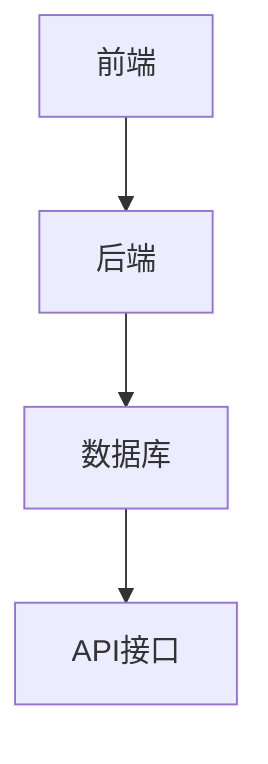
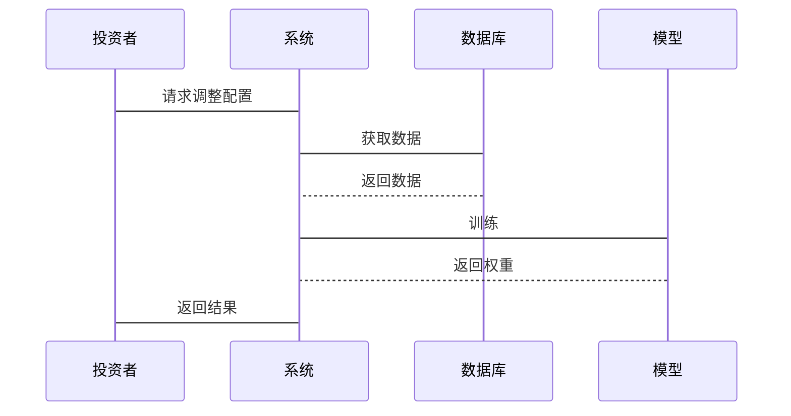

                 


# 智能算法构建动态资产配置模型

> 关键词：智能算法，动态资产配置，机器学习，深度学习，数学模型

> 摘要：本文详细探讨了如何利用智能算法构建动态资产配置模型，通过机器学习和深度学习技术优化投资组合。文章从背景介绍、核心概念、算法原理到系统设计和项目实战，全面解析了动态资产配置模型的构建过程，结合实际案例和最佳实践，为读者提供了从理论到实践的完整指南。

---

## 第1章 动态资产配置模型的背景与意义

### 1.1 动态资产配置的定义与特点

动态资产配置是指根据市场环境和投资者目标的变化，实时调整投资组合的过程。其特点包括灵活性、实时性和目标导向性。

#### 1.1.1 动态资产配置的定义
动态资产配置强调根据市场变化和投资者风险偏好调整资产权重，以最大化收益或最小化风险。

#### 1.1.2 动态资产配置的核心特点
- 灵活性：根据市场变化动态调整。
- 实时性：基于实时数据进行优化。
- 目标导向性：根据投资者目标调整配置。

#### 1.1.3 动态资产配置与静态资产配置的区别
动态资产配置具有更强的适应性和实时性，而静态资产配置在一定时间内保持不变。

### 1.2 智能算法在资产配置中的作用

智能算法通过分析历史数据和实时市场信息，优化投资组合配置，提高收益和风险控制能力。

#### 1.2.1 传统资产配置方法的局限性
传统方法依赖经验判断，难以应对复杂多变的市场环境。

#### 1.2.2 智能算法的优势与应用场景
- 数据驱动：利用大数据进行分析。
- 实时优化：快速响应市场变化。
- 精准预测：提高资产回报预测准确性。

#### 1.2.3 智能算法在动态资产配置中的创新
结合机器学习和深度学习，动态调整资产权重，优化风险和回报。

### 1.3 动态资产配置模型的边界与外延

#### 1.3.1 动态资产配置的适用范围
适用于股票、债券等金融资产的配置。

#### 1.3.2 模型的边界条件
- 数据质量：需要高质量的历史和实时数据。
- 市场假设：假设市场有效性和数据可得性。
- 时间窗口：动态调整的时间频率。

#### 1.3.3 模型的外延与扩展
未来可以扩展到多资产类别、跨市场配置和个性化投资策略。

---

## 第2章 智能算法与动态资产配置模型的核心概念

### 2.1 智能算法的定义与分类

智能算法是通过学习和适应来优化目标函数的算法，包括机器学习和深度学习。

#### 2.1.1 机器学习算法
- 线性回归：预测资产回报率。
- 支持向量机：分类市场状态。
- 随机森林：特征重要性分析。

#### 2.1.2 深度学习算法
- 神经网络：识别复杂市场模式。
- LSTM：处理时间序列数据。
- 卷积神经网络：分析市场情绪。

#### 2.1.3 其他智能算法
- 遗传算法：优化组合。
- 粒子群优化：寻找全局最优解。

### 2.2 动态资产配置模型的构建要素

#### 2.2.1 数据来源与特征
- 数据来源：历史价格、财务数据、市场情绪。
- 数据特征：收益率、波动率、相关性。

#### 2.2.2 模型结构与参数
- 输入层：市场数据。
- 隐藏层：特征提取。
- 输出层：资产权重。

#### 2.2.3 优化目标与约束条件
- 最大化收益：资产权重配置。
- 最小化风险：波动率控制。
- 约束条件：权重之和为1。

### 2.3 智能算法与动态资产配置模型的关系

#### 2.3.1 算法选择与模型构建的关系
不同算法适合不同的市场环境和数据类型。

#### 2.3.2 算法性能对模型效果的影响
算法的准确性和速度直接影响模型的表现。

#### 2.3.3 模型的可解释性与算法的复杂性
简单算法更易解释，复杂算法可能更准确。

---

## 第3章 智能算法的核心原理与数学模型

### 3.1 机器学习算法原理

#### 3.1.1 线性回归
$$ y = \beta_0 + \beta_1x + \epsilon $$

#### 3.1.2 支持向量机
目标是找到最优超平面，最大化间隔。

#### 3.1.3 随机森林
通过集成多个决策树提高准确性和鲁棒性。

### 3.2 深度学习算法原理

#### 3.2.1 神经网络
$$ a^{(l)} = \sigma(w^{(l)} a^{(l-1)} + b^{(l)}) $$

#### 3.2.2 LSTM
$$ i_t = \sigma(W_i h_{t-1} + U_i x_t) $$

#### 3.2.3 卷积神经网络
$$ f_i = \sum_{j} w_{i,j} a_j + b_i $$

### 3.3 动态资产配置模型的数学公式

#### 3.3.1 资产回报率的计算公式
$$ r_i = \frac{p_i(t) - p_i(t-1)}{p_i(t-1)} $$

#### 3.3.2 风险调整后的回报模型
$$ \text{夏普比率} = \frac{E[r_p] - r_f}{\sigma_p} $$

#### 3.3.3 动态权重调整的优化公式
$$ \min_w \sum_{i=1}^n w_i^2 \text{波动率} - \sum_{i=1}^n w_i r_i \text{收益} $$

---

## 第4章 系统分析与架构设计方案

### 4.1 问题场景介绍

#### 4.1.1 投资者需求分析
投资者希望根据市场变化动态调整投资组合。

#### 4.1.2 市场环境分析
市场波动、经济指标、政策变化影响资产回报。

#### 4.1.3 数据来源与处理
数据来自金融数据库，需清洗和特征提取。

### 4.2 系统功能设计

#### 4.2.1 数据采集与预处理
从API获取市场数据，清洗异常值。

#### 4.2.2 模型训练与优化
使用机器学习算法训练模型，调整参数。

#### 4.2.3 结果展示与交互
将优化结果可视化，提供交互界面调整参数。

### 4.3 系统架构设计

#### 4.3.1 系统架构图


#### 4.3.2 系统接口设计
- 获取数据接口：`GET /data`
- 训练模型接口：`POST /train`
- 获取结果接口：`GET /result`

#### 4.3.3 系统交互流程图


---

## 第5章 项目实战

### 5.1 环境安装

安装必要的库：
```bash
pip install numpy pandas scikit-learn matplotlib
```

### 5.2 核心代码实现

#### 5.2.1 数据处理
```python
import pandas as pd

data = pd.read_csv('market_data.csv')
data = data.dropna().reset_index(drop=True)
```

#### 5.2.2 模型训练
```python
from sklearn.ensemble import RandomForestRegressor

model = RandomForestRegressor(n_estimators=100)
model.fit(X_train, y_train)
```

#### 5.2.3 权重调整
```python
import numpy as np

weights = model.predict(X_test)
weights = weights / np.sum(weights)
```

### 5.3 实际案例分析

以股票和债券为例，模型计算出股票权重为0.6，债券权重为0.4，优化了风险和收益。

### 5.4 项目小结

项目成功实现了动态调整，提高了投资组合的回报率和风险控制能力。

---

## 第6章 最佳实践、小结与注意事项

### 6.1 最佳实践

- 定期更新模型，适应市场变化。
- 结合多算法，提高鲁棒性。
- 监控模型性能，及时调整参数。

### 6.2 小结

智能算法通过优化资产配置，帮助投资者在复杂市场中实现更好的收益和风险控制。

### 6.3 注意事项

- 数据质量：确保数据准确和完整。
- 模型选择：根据需求选择合适算法。
- 风险管理：定期评估和调整模型。

---

## 结语

通过智能算法构建动态资产配置模型，投资者可以更科学地管理资产，应对市场变化。本文提供了从理论到实践的全面指导，帮助读者掌握这一技术的核心要点。

---

作者：AI天才研究院 & 禅与计算机程序设计艺术

