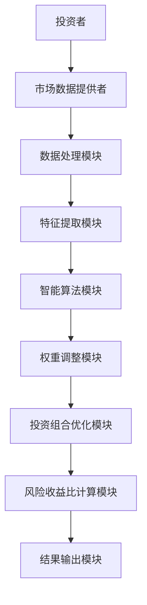
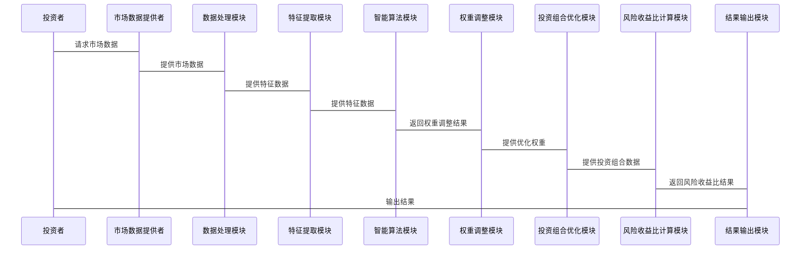

                 


# 智能算法构建动态风险平价模型

> 关键词：动态风险平价模型、智能算法、风险评估、风险管理、机器学习、金融建模

> 摘要：本文详细探讨了如何利用智能算法构建动态风险平价模型。文章首先介绍了动态风险平价模型的背景和概念，随后分析了智能算法在模型构建中的应用原理，包括数学模型和算法实现。接着，文章详细阐述了系统的架构设计和项目实战，最后总结了最佳实践和未来发展方向。通过本文，读者将能够全面理解动态风险平价模型的构建过程，并掌握其实现的关键技术。

---

## 第一部分: 智能算法构建动态风险平价模型的背景与概念

### 第1章: 动态风险平价模型的背景与问题描述

#### 1.1 问题背景
- **风险平价模型的定义与作用**：风险平价模型是一种用于评估和管理金融资产风险的工具，通过量化各资产的风险贡献，实现风险的均衡分配。传统风险平价模型通常假设资产风险是静态的，但在实际金融市场中，资产风险会受到多种因素的影响而动态变化。

- **动态风险平价模型的提出背景**：金融市场环境复杂多变，传统静态模型难以适应实时风险变化的需求。因此，动态风险平价模型应运而生，通过引入动态调整机制，实时更新各资产的风险权重，以更好地反映市场波动。

- **智能算法在风险平价模型中的应用价值**：智能算法（如机器学习、强化学习等）具有强大的数据处理和模式识别能力，能够有效捕捉市场中的复杂关系和动态变化，为动态风险平价模型的构建提供技术支持。

#### 1.2 问题描述
- **风险平价模型的核心目标**：通过量化各资产的风险贡献，实现风险的均衡分配，优化投资组合的风险收益比。

- **动态风险平价模型的特性与优势**：动态调整能力、实时性、适应性强，能够更好地应对市场的不确定性。

- **智能算法在动态风险平价模型中的应用范围**：用于实时数据处理、动态权重计算、模型优化等关键环节。

#### 1.3 问题解决
- **动态风险平价模型的构建方法**：结合智能算法，构建动态调整机制，实现模型的实时更新和优化。

- **智能算法在模型构建中的作用**：通过算法优化模型参数，提高模型的准确性和鲁棒性。

- **模型实现的关键步骤与流程**：数据收集、预处理、算法选择与实现、模型测试与优化。

#### 1.4 边界与外延
- **动态风险平价模型的适用场景**：适用于金融市场波动较大、需要实时调整投资组合风险的场景。

- **模型的局限性与限制条件**：依赖于数据质量和算法的准确性，市场极端情况下的表现可能存在不确定性。

- **模型的可扩展性与未来发展**：随着人工智能技术的进步，动态风险平价模型将进一步优化，应用场景也将不断扩展。

#### 1.5 概念结构与核心要素
- **动态风险平价模型的核心要素**：动态调整机制、智能算法、风险权重计算、投资组合优化。

- **智能算法的关键组成部分**：数据输入、特征提取、模型训练、权重计算。

- **模型与算法的交互关系**：智能算法为模型提供动态权重，模型通过权重调整优化投资组合的风险收益比。

---

## 第2章: 智能算法与动态风险平价模型的核心概念

#### 2.1 智能算法的定义与分类
- **智能算法的基本定义**：智能算法是一类能够模拟人类智能的算法，包括机器学习、深度学习、强化学习等。

- **常见智能算法的分类与特点**：
  - **监督学习**：基于标签数据进行学习，适用于分类和回归问题。
  - **无监督学习**：通过数据内在结构进行学习，适用于聚类和降维问题。
  - **强化学习**：通过与环境交互，学习最优策略，适用于动态决策问题。

- **智能算法的核心优势**：数据驱动、自适应性强、能够处理复杂非线性关系。

#### 2.2 动态风险平价模型的原理
- **风险平价模型的基本原理**：通过计算各资产的风险贡献，确定其在投资组合中的权重，以实现风险的均衡分配。

- **动态风险平价模型的动态调整机制**：根据市场环境的变化，实时更新各资产的风险权重，优化投资组合的风险收益比。

- **模型的实时更新与优化方法**：利用智能算法对市场数据进行分析，动态调整权重。

#### 2.3 智能算法与动态风险平价模型的关联
- **智能算法在模型构建中的作用**：通过算法优化模型参数，提高模型的准确性和鲁棒性。

- **模型动态调整的算法实现**：利用智能算法实现权重的动态调整，优化投资组合的风险收益比。

- **算法与模型的协同优化**：通过算法优化模型，模型反过来为算法提供反馈，实现两者协同优化。

---

## 第3章: 动态风险平价模型的核心概念与联系

#### 3.1 核心概念原理
- **风险平价模型的数学基础**：基于协方差矩阵计算各资产的风险贡献，确定其权重。

- **动态风险平价模型的算法实现**：利用智能算法动态调整权重，优化投资组合的风险收益比。

- **模型与算法的结合方式**：智能算法为模型提供动态权重，模型通过权重调整优化投资组合的风险收益比。

#### 3.2 概念属性特征对比
| 概念 | 静态风险平价模型 | 动态风险平价模型 |
|------|------------------|------------------|
| 时间性 | 静态，权重固定 | 动态，权重实时调整 |
| 数据需求 | 数据量较小 | 数据量较大，需要实时数据 |
| 适应性 | 较低 | 较高 |
| 计算复杂度 | 较低 | 较高 |
| 应用场景 | 适用于数据稳定场景 | 适用于数据动态变化场景 |

#### 3.3 ER实体关系图

```mermaid
erDiagram
    actor 投资者
    actor 市场数据提供者
    actor 模型优化器
    class 资产
    class 风险权重
    class 投资组合
    class 算法
    class 权重调整
    投资者 -> 资产 : 持有
    投资者 -> 投资组合 : 优化
    资产 -> 风险权重 : 计算
    算法 -> 权重调整 : 优化
    权重调整 -> 风险权重 : 更新
    市场数据提供者 -> 资产 : 提供数据
    模型优化器 -> 权重调整 : 调整
```

---

## 第4章: 动态风险平价模型的数学模型与算法实现

#### 4.1 数学模型
- **风险平价模型的基本公式**：$$ w_i = \frac{\sigma_i}{\sum_{j=1}^n \sigma_j} $$，其中 \( w_i \) 是第 \( i \) 个资产的权重，\( \sigma_i \) 是其风险贡献，\( n \) 是资产数量。

- **动态风险平价模型的优化目标**：$$ \min_{w} \frac{1}{2} w^T C w + \lambda ||w||_1 $$，其中 \( C \) 是协方差矩阵，\( \lambda \) 是正则化参数。

#### 4.2 算法实现
- **步骤 1：数据预处理**：对市场数据进行清洗、标准化和窗口化处理。

- **步骤 2：特征提取**：利用技术指标或因子分析提取特征。

- **步骤 3：模型训练**：使用机器学习算法（如随机森林、神经网络）训练模型，预测各资产的风险权重。

- **步骤 4：权重调整**：根据预测结果，动态调整各资产的权重，优化投资组合的风险收益比。

#### 4.3 代码实现
```python
import numpy as np
import pandas as pd
from sklearn.ensemble import RandomForestRegressor

# 数据预处理
data = pd.read_csv('market_data.csv')
data = data.pct_change().dropna()

# 特征提取
features = data.iloc[:, :-1]
labels = data.iloc[:, -1]

# 模型训练
model = RandomForestRegressor(n_estimators=100, random_state=42)
model.fit(features, labels)

# 权重计算
weights = np.exp(-model.predict(features)) / np.sum(np.exp(-model.predict(features)))

# 投资组合优化
portfolios = []
for i in range(len(weights)):
    portfolio = weights[i] * data.iloc[i, :-1]
    portfolios.append(portfolio)

# 风险收益比计算
returns = np.mean(portfolios, axis=0)
risks = np.std(portfolios, axis=0)
risk_reward = returns / risks
```

---

## 第5章: 动态风险平价模型的系统架构设计

#### 5.1 系统架构


#### 5.2 接口设计
- **输入接口**：市场数据输入、参数设置。
- **输出接口**：权重调整结果、投资组合优化结果、风险收益比计算结果。

#### 5.3 交互流程


---

## 第6章: 动态风险平价模型的项目实战

#### 6.1 环境安装
```bash
pip install numpy pandas scikit-learn matplotlib
```

#### 6.2 核心代码实现
```python
import numpy as np
import pandas as pd
from sklearn.ensemble import RandomForestRegressor
import matplotlib.pyplot as plt

# 数据加载与预处理
data = pd.read_csv('market_data.csv')
data = data.pct_change().dropna()

# 特征与标签分离
features = data.iloc[:, :-1]
labels = data.iloc[:, -1]

# 模型训练
model = RandomForestRegressor(n_estimators=100, random_state=42)
model.fit(features, labels)

# 权重计算
weights = np.exp(-model.predict(features)) / np.sum(np.exp(-model.predict(features)))

# 投资组合优化与风险收益比计算
portfolios = weights * features
returns = np.mean(portfolios, axis=0)
risks = np.std(portfolios, axis=0)
risk_reward = returns / risks

# 可视化
plt.figure(figsize=(10, 6))
plt.plot(risk_reward, label='Risk-Reward Ratio')
plt.xlabel('Assets')
plt.ylabel('Risk-Reward Ratio')
plt.legend()
plt.show()
```

#### 6.3 案例分析
- **案例背景**：假设我们有5种资产，利用动态风险平价模型进行投资组合优化。

- **数据来源**：从市场数据中获取资产的历史收益率数据。

- **分析过程**：通过机器学习算法预测各资产的风险权重，动态调整投资组合。

- **结果解读**：可视化风险收益比，分析各资产的权重变化。

---

## 第7章: 最佳实践与总结

#### 7.1 小结
- 动态风险平价模型通过智能算法实现了权重的动态调整，优化了投资组合的风险收益比。

#### 7.2 注意事项
- 数据质量对模型性能影响较大，需确保数据的准确性和完整性。
- 模型的实时性要求较高的计算能力，需优化算法和系统架构。

#### 7.3 拓展阅读
- 《机器学习在金融风险管理中的应用》
- 《智能算法与投资组合优化》

---

## 作者

作者：AI天才研究院/AI Genius Institute & 禅与计算机程序设计艺术 /Zen And The Art of Computer Programming

---

这篇文章详细阐述了智能算法在动态风险平价模型中的应用，从背景介绍到系统架构设计，再到项目实战，为读者提供了全面的知识和实践指导。

