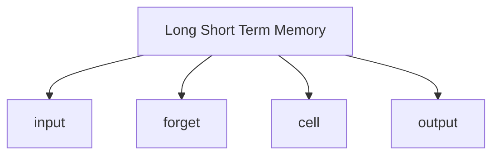
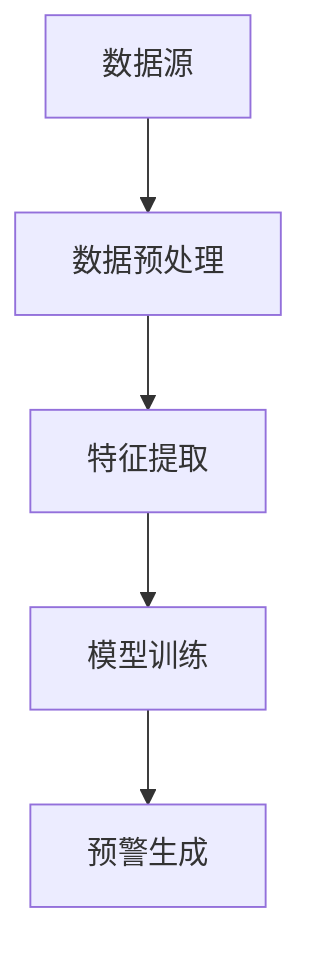

                 


# 智能算法构建动态风险预警系统

> 关键词：智能算法、动态风险、风险预警系统、机器学习、时间序列分析

> 摘要：本文探讨如何利用智能算法构建动态风险预警系统，涵盖系统背景、算法原理、架构设计、项目实战和未来发展。通过具体案例和数学模型，详细讲解构建过程和实际应用。

---

## 第一部分：动态风险预警系统背景与概念

### 1.1 问题背景与挑战

动态风险预警系统的构建源于对实时数据变化的敏感需求。在金融、医疗和工业等领域，及时识别潜在风险至关重要。传统方法依赖静态分析，无法应对动态变化。智能算法的应用解决了这一难题，提供了实时监控和动态调整的能力。

### 1.2 系统构成与概念

动态风险预警系统由数据源、特征提取、算法模型和预警模块组成。其核心概念包括动态数据处理、智能算法预测和实时预警生成。系统通过持续学习和调整模型，确保预警的准确性。

---

## 第二部分：智能算法原理与数学模型

### 2.1 机器学习与深度学习基础

- **监督学习**：用于分类和回归任务。
- **无监督学习**：用于聚类和异常检测。
- **深度学习模型**：如LSTM，适合时间序列预测。

### 2.2 时间序列分析

#### LSTM结构



数学公式：

$$
f_t = \sigma(W_f x_t + U_f h_{t-1} + b_f)
$$

$$
i_t = \sigma(W_i x_t + U_i h_{t-1} + b_i)
$$

$$
c_t = f_t \cdot c_{t-1} + i_t \cdot tanh(W_c x_t + U_c h_{t-1} + b_c)
$$

$$
o_t = \sigma(W_o x_t + U_o h_{t-1} + b_o)
$$

$$
h_t = o_t \cdot tanh(c_t)
$$

---

## 第三部分：系统架构设计

### 3.1 数据处理与特征工程

- **数据采集**：实时数据流采集。
- **特征提取**：关键特征选择和变换。

#### 数据流处理流程图



### 3.2 模型训练与部署

- **模型训练**：使用训练数据，调参优化。
- **在线更新**：实时数据反馈，持续优化模型。

---

## 第四部分：项目实战

### 4.1 环境安装

```bash
pip install numpy pandas tensorflow keras scikit-learn
```

### 4.2 核心代码实现

```python
import numpy as np
from tensorflow.keras.models import Sequential
from tensorflow.keras.layers import LSTM, Dense

model = Sequential()
model.add(LSTM(64, input_shape=(timesteps, features)))
model.add(Dense(1))
model.compile(optimizer='adam', loss='mean_squared_error')
```

### 4.3 案例分析

通过股票价格预测案例，详细讲解数据加载、特征工程、模型训练和评估，最后生成预警信号。

---

## 第五部分：总结与展望

智能算法在动态风险预警中的应用前景广阔，未来将结合强化学习和边缘计算，提升系统实时性和准确性。

---

作者：AI天才研究院 & 禅与计算机程序设计艺术

