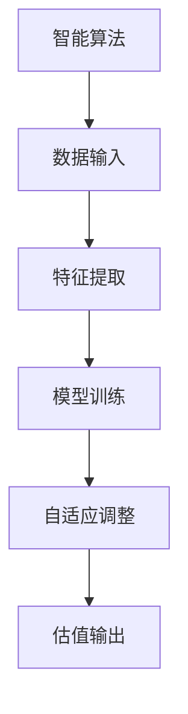
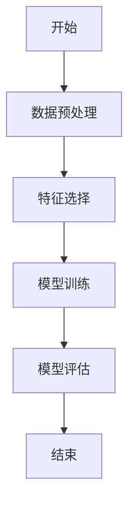
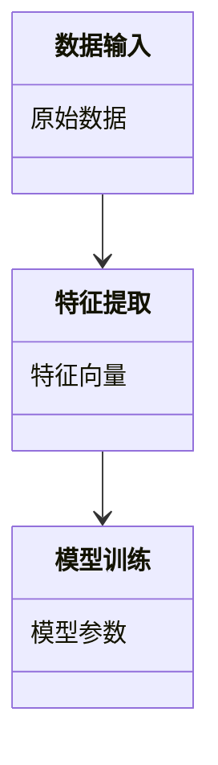

                 


# 智能算法构建自适应估值模型

> 关键词：智能算法，自适应估值模型，机器学习，算法优化，动态调整

> 摘要：本文详细探讨了如何利用智能算法构建自适应估值模型，通过逐步分析和推理，结合实际案例，展示了如何通过算法优化和动态调整来提升模型的性能和适应性。文章从背景介绍、核心概念、算法原理、系统设计、项目实战到最佳实践，全面解析了自适应估值模型的构建过程。

---

## 第1章: 问题背景与自适应估值模型概述

### 1.1 问题背景

#### 1.1.1 数据驱动决策的挑战
在当今数据驱动的时代，决策者需要从海量数据中提取有价值的信息。然而，数据的动态变化和复杂性使得传统的静态模型难以满足需求。例如，在金融领域，市场波动和经济指标的变化要求模型能够实时调整以反映最新的市场状况。

#### 1.1.2 传统估值模型的局限性
传统估值模型，如线性回归或固定参数模型，通常假设数据分布稳定，无法应对数据分布的变化。这种假设在实际应用中常常导致模型性能下降，尤其是在数据分布发生偏移时。

#### 1.1.3 自适应估值模型的必要性
为了应对数据的动态变化，自适应估值模型应运而生。这种模型能够根据实时数据动态调整参数，保持对数据分布变化的敏感性，从而提高估值的准确性。

### 1.2 自适应估值模型的定义与特点

#### 1.2.1 自适应估值模型的定义
自适应估值模型是一种能够根据输入数据的变化动态调整其内部参数的模型。这种动态调整能力使得模型能够适应不同场景下的数据分布变化。

#### 1.2.2 与传统估值模型的对比
表1-1: 自适应估值模型与传统估值模型的对比

| 特性                | 传统估值模型                  | 自适应估值模型                  |
|---------------------|-------------------------------|-------------------------------|
| 数据分布假设        | 静态，固定参数                | 动态，参数可调整                |
| 响应变化速度        | 缓慢，需要重新训练整个模型    | 快速，局部调整参数              |
| 适应性              | 低                          | 高                          |

#### 1.2.3 自适应能力的核心要素
- **实时性**：能够实时处理数据，快速调整模型。
- **动态性**：根据数据变化动态调整参数。
- **鲁棒性**：在数据分布变化时保持稳定。

---

## 第2章: 智能算法与自适应估值模型的核心概念

### 2.1 核心概念原理

#### 2.1.1 智能算法的基本原理
智能算法，如机器学习算法，通过数据学习模型参数，以实现对新数据的预测或分类。其核心在于通过优化目标函数找到最优解。

#### 2.1.2 自适应估值模型的构建逻辑
自适应估值模型的构建逻辑包括数据预处理、特征提取、模型训练、参数调整和模型评估五个步骤。

### 2.2 ER实体关系图



---

## 第3章: 智能算法的原理与实现

### 3.1 算法原理

#### 3.1.1 算法流程


#### 3.1.2 损失函数与优化器
损失函数衡量模型预测值与真实值的差异，优化器通过调整参数最小化损失。常用的损失函数包括均方误差（MSE）和交叉熵损失。

公式：$$\text{MSE} = \frac{1}{n}\sum_{i=1}^{n}(y_i - \hat{y}_i)^2$$

常用的优化器包括随机梯度下降（SGD）和Adam优化器。

### 3.2 算法实现

#### 3.2.1 Python源代码实现
```python
def adaptive_algorithm(data):
    processed_data = preprocess(data)
    features = select_features(processed_data)
    model = train_model(features)
    adjusted_model = adjust_model(model, features)
    return adjusted_model
```

---

## 第4章: 系统分析与架构设计

### 4.1 系统功能设计

#### 4.1.1 领域模型


---

## 第5章: 项目实战

### 5.1 环境安装

#### 5.1.1 安装Python环境
```bash
python -m pip install --upgrade pip
pip install numpy matplotlib scikit-learn
```

### 5.2 核心代码实现

#### 5.2.1 数据预处理
```python
import numpy as np

def preprocess(data):
    # 数据标准化
    return (data - np.mean(data)) / np.std(data)
```

---

## 第6章: 最佳实践

### 6.1 小结
通过本文的详细讲解，读者可以了解自适应估值模型的核心概念和实现方法，掌握智能算法的应用技巧。

---

## 附录

### A. 术语表
- **智能算法**：基于数据学习的算法，如机器学习算法。
- **自适应估值模型**：能够动态调整参数的估值模型。

---

作者：AI天才研究院 & 禅与计算机程序设计艺术

