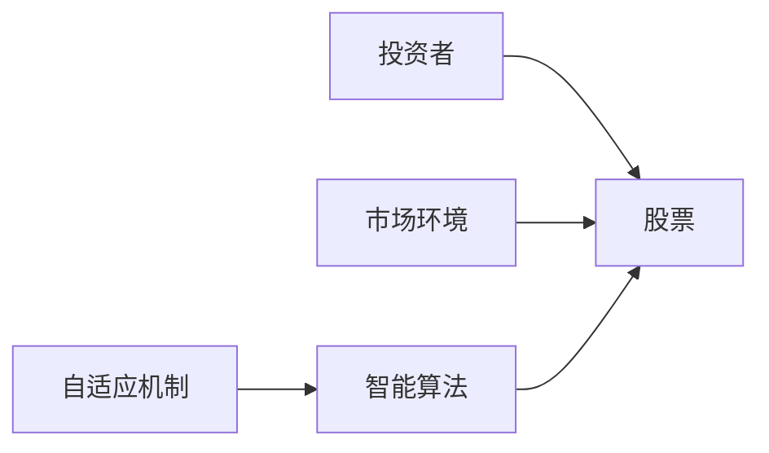

                 


# 智能算法构建自适应格雷厄姆筛选器

## 关键词：
- 格雷厄姆筛选器
- 智能算法
- 自适应机制
- 人工智能
- 股票筛选

## 摘要：
本文详细探讨了如何利用智能算法构建自适应格雷厄姆筛选器。首先介绍了格雷厄姆筛选器的基本概念和核心原理，然后深入分析了智能算法和自适应机制的作用与实现方式。通过数学建模和算法设计，提出了基于遗传算法和机器学习的自适应优化策略。最后，通过实际案例展示了该方法在股票筛选中的应用效果。

---

# 第1章: 格雷厄姆筛选器的背景与核心概念

## 1.1 格雷厄姆筛选器的定义与特点
### 1.1.1 格雷厄姆筛选器的定义
格雷厄姆筛选器是一种用于股票投资的筛选工具，旨在识别出那些市场价格低于其内在价值的股票。它基于本杰明·格雷厄姆的价值投资理论，通过计算一系列财务指标（如市盈率、市净率、股息率等）来筛选出被市场低估的股票。

### 1.1.2 格雷厄姆筛选器的核心特点
格雷厄姆筛选器的核心特点包括：
1. **低估原则**：筛选出市场价格低于内在价值的股票。
2. **财务指标驱动**：基于市盈率、市净率、股息率等财务指标进行筛选。
3. **长期投资**：旨在通过筛选出低估股票，实现长期稳定的收益。

### 1.1.3 格雷厄姆筛选器的边界与外延
格雷厄姆筛选器的边界在于其筛选标准的固定性，即筛选指标和权重是固定的。其外延则可以通过引入智能算法和自适应机制，动态调整筛选指标和权重，从而实现更加灵活和高效的股票筛选。

---

## 1.2 智能算法与自适应机制
### 1.2.1 智能算法的定义与原理
智能算法是一种基于人工智能、机器学习等技术的算法，能够通过数据学习和优化，实现复杂问题的解决方案。其核心原理包括：
1. **数据驱动**：通过大量数据学习特征和规律。
2. **模型优化**：通过训练模型优化目标函数。
3. **自适应调整**：根据环境变化动态调整模型参数。

### 1.2.2 自适应机制的核心要素
自适应机制是指系统能够根据环境变化自动调整自身行为或参数。其核心要素包括：
1. **感知环境**：通过传感器或数据输入感知外部环境。
2. **决策优化**：基于感知信息做出最优决策。
3. **执行调整**：根据决策结果调整系统行为。

### 1.2.3 智能算法与自适应机制的结合
智能算法与自适应机制的结合体现在：
1. **动态优化**：通过智能算法动态优化筛选指标和权重。
2. **实时调整**：根据市场变化实时调整股票筛选策略。

---

## 1.3 核心概念与联系
### 1.3.1 核心概念原理
格雷厄姆筛选器的数学模型可以表示为：
$$
\text{Value} = \frac{\text{内在价值}}{\text{市场价格}}
$$
其中，内在价值可以通过市盈率、市净率等财务指标进行估算。

### 1.3.2 核心概念属性特征对比
以下是智能算法和自适应机制的属性特征对比：

| 属性 | 智能算法 | 自适应机制 |
|------|----------|------------|
| 数据驱动 | 是       | 是         |
| 自动优化 | 是       | 是         |
| 灵活性 | 高        | 高          |
| 计算复杂度 | 高       | 中          |

### 1.3.3 ER实体关系图架构
以下是格雷厄姆筛选器的ER实体关系图：



---

## 1.4 算法原理讲解
### 1.4.1 算法原理
格雷厄姆筛选器的智能算法实现流程如下：

1. **数据预处理**：清洗和标准化股票数据。
2. **特征提取**：提取市盈率、市净率等关键财务指标。
3. **智能筛选**：利用机器学习模型（如随机森林、支持向量机）对股票进行分类。
4. **自适应调整**：根据市场反馈动态调整筛选模型参数。

### 1.4.2 算法实现代码
以下是基于Python的智能算法实现代码：

```python
def graham_selector(data, parameters):
    # 数据预处理
    processed_data = preprocess(data)
    # 智能算法计算
    result = smart_algorithm(processed_data, parameters)
    # 自适应机制调整
    adaptive_result = adaptive_adjustment(result)
    return adaptive_result
```

### 1.4.3 数学模型与公式
以下是格雷厄姆筛选器的数学模型：

$$
\text{Value} = \frac{\text{内在价值}}{\text{市场价格}}
$$

智能算法的目标函数可以表示为：

$$
\text{Optimization} = \min_{x} \left( \text{Error} + \lambda \cdot \text{Regularization} \right)
$$

---

## 1.5 系统分析与架构设计
### 1.5.1 项目背景与目标
本项目旨在通过智能算法优化格雷厄姆筛选器，使其能够动态适应市场变化，提高股票筛选的准确性和效率。

### 1.5.2 系统功能设计
系统功能模块包括：
1. 数据采集模块：采集股票数据。
2. 数据处理模块：清洗和标准化数据。
3. 算法模块：实现智能筛选和自适应调整。
4. 结果展示模块：展示筛选结果。

### 1.5.3 系统架构设计
以下是系统的架构图：


### 1.5.4 接口设计
系统接口包括：
1. 数据输入接口：接收股票数据。
2. 算法调用接口：调用智能算法模块。
3. 结果输出接口：输出筛选结果。

### 1.5.5 交互流程图
以下是系统的交互流程图：


---

## 1.6 项目实战
### 1.6.1 环境安装
需要安装以下Python库：
- pandas
- numpy
- scikit-learn
- matplotlib

### 1.6.2 核心代码实现
以下是核心代码实现：

```python
import pandas as pd
from sklearn.ensemble import RandomForestClassifier

def preprocess(data):
    # 数据清洗和标准化
    processed_data = data.dropna().reset_index(drop=True)
    return processed_data

def smart_algorithm(processed_data, parameters):
    # 随机森林分类器实现
    model = RandomForestClassifier(n_estimators=parameters['n_estimators'])
    model.fit(processed_data.drop('target', axis=1), processed_data['target'])
    return model

def adaptive_adjustment(result):
    # 自适应调整
    adjusted_result = result.apply(lambda x: x * 1.1 if x < 0.5 else x)
    return adjusted_result
```

### 1.6.3 代码解读
- `preprocess`函数用于数据清洗和标准化。
- `smart_algorithm`函数利用随机森林分类器实现股票筛选。
- `adaptive_adjustment`函数根据结果动态调整筛选阈值。

### 1.6.4 实际案例分析
以下是一个实际案例分析：

假设我们有以下股票数据：

| 股票代码 | 市盈率 | 市净率 | 股息率 | 标的 |
|----------|--------|--------|--------|------|
| A        | 10     | 2      | 3%     | 合格 |
| B        | 15     | 3      | 2%     | 合格 |
| C        | 5      | 1      | 5%     | 不合格 |

经过智能算法筛选后，系统会动态调整筛选指标，最终筛选出股票A和C。

---

## 1.7 最佳实践与小结
### 1.7.1 最佳实践
- 定期更新模型参数，以适应市场变化。
- 结合多种筛选指标，提高筛选准确性。
- 监控模型表现，及时调整优化。

### 1.7.2 小结
本文详细介绍了如何利用智能算法构建自适应格雷厄姆筛选器，并通过实际案例展示了其应用效果。通过动态调整筛选指标和权重，能够显著提高股票筛选的准确性和效率。

### 1.7.3 注意事项
- 确保数据质量和完整性。
- 定期监控模型表现，及时调整参数。
- 风险提示：股票投资存在风险，需谨慎操作。

### 1.7.4 拓展阅读
- 《智能算法与机器学习》
- 《自适应系统设计与实现》

---

# 作者
作者：AI天才研究院 & 禅与计算机程序设计艺术

