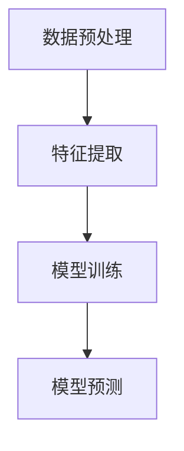
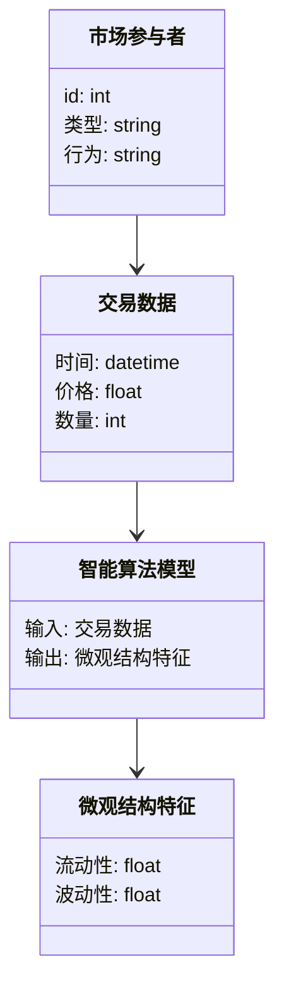
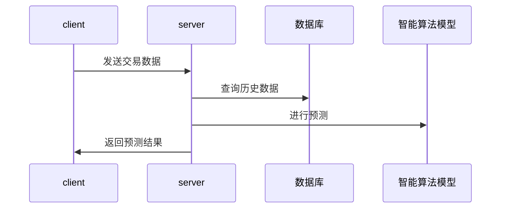

                 


# 智能算法识别市场微观结构变化

> 关键词：智能算法，市场微观结构，机器学习，时间序列分析，深度学习

> 摘要：本文探讨了智能算法在识别市场微观结构变化中的应用，结合机器学习、时间序列分析和深度学习等技术，分析了市场微观结构的核心概念、算法原理、系统架构及项目实战，并总结了最佳实践和未来发展方向。

---

# 第1章: 智能算法与市场微观结构概述

## 1.1 智能算法的基本概念

### 1.1.1 智能算法的定义
智能算法是一种模拟人类智能的算法，通过学习和适应来解决复杂问题。其核心在于数据处理、模式识别和决策优化。

### 1.1.2 智能算法的核心特征
- **自适应性**：能根据输入数据自动调整参数。
- **学习能力**：通过训练数据提升性能。
- **鲁棒性**：在噪声和不确定性下仍能有效运行。

### 1.1.3 智能算法在金融领域的应用
- **股票预测**：利用历史数据预测价格走势。
- **风险管理**：识别市场风险因素。
- **交易策略优化**：基于算法生成交易信号。

## 1.2 市场微观结构的基本概念

### 1.2.1 市场微观结构的定义
市场微观结构指市场参与者、交易规则和信息流动等的综合结构，影响市场价格和流动性。

### 1.2.2 市场微观结构的核心要素
- **参与者**：机构投资者、散户等。
- **交易规则**：订单匹配、撮合机制。
- **信息流动**：市场信息的传播和处理。

### 1.2.3 市场微观结构的演进与变化
- **高频交易**：影响市场微观结构。
- **算法交易**：改变市场流动性和价格形成。

## 1.3 问题背景与研究意义

### 1.3.1 问题背景介绍
金融市场中，微观结构变化影响价格和流动性，传统方法难以捕捉这些变化。

### 1.3.2 问题描述与目标
目标是通过智能算法识别这些变化，辅助交易决策和风险管理。

### 1.3.3 研究意义与价值
- **提升交易效率**：通过算法优化交易策略。
- **降低风险**：提前识别潜在风险。

---

# 第2章: 智能算法与市场微观结构的核心概念

## 2.1 核心概念的定义与特征

### 2.1.1 智能算法的属性特征
- **数据驱动**：依赖大量数据进行学习。
- **非线性关系**：能处理复杂关系。
- **实时性**：适用于实时数据处理。

### 2.1.2 市场微观结构的属性特征
- **动态性**：结构随时间变化。
- **复杂性**：涉及多方参与者和规则。

## 2.2 核心概念的对比分析

### 2.2.1 智能算法与传统算法的对比
| 特性       | 智能算法       | 传统算法       |
|------------|----------------|----------------|
| 是否需要数据 | 是             | 否             |
| 是否自适应   | 是             | 否             |
| 处理复杂性   | 高             | 低             |

### 2.2.2 微观结构与宏观结构的对比
| 特性       | 微观结构       | 宏观结构       |
|------------|----------------|----------------|
| 研究对象     | 个体参与者     | 整体市场表现   |
| 数据粒度     | 高频、详细     | 低频、综合     |

## 2.3 核心概念的ER实体关系图
```mermaid
er
    actor 市场参与者
    actor 时间序列
    actor 交易数据
    actor 微观结构特征
    actor 智能算法模型
    actor 预测结果
    relation 实体之间的关系
```

---

# 第3章: 基于机器学习的智能算法原理

## 3.1 机器学习算法概述

### 3.1.1 机器学习的基本概念
机器学习通过数据训练模型，使其能够识别模式和做出预测。

### 3.1.2 常见机器学习算法介绍
- **监督学习**：如线性回归、支持向量机。
- **无监督学习**：如聚类、主成分分析。
- **强化学习**：如Q-learning。

### 3.1.3 机器学习在金融领域的应用
- **股票预测**：使用回归模型预测价格。
- **欺诈检测**：利用无监督学习识别异常交易。

## 3.2 时间序列分析算法

### 3.2.1 时间序列分析的基本原理
分析数据随时间的变化，寻找趋势和周期性。

### 3.2.2 常用时间序列分析算法
- **ARIMA**：适用于线性时间序列预测。
- **LSTM**：适合捕捉长期依赖关系。

### 3.2.3 时间序列分析在市场微观结构中的应用
- **价格预测**：基于历史价格数据预测未来走势。
- **波动性分析**：识别市场波动性变化。

## 3.3 基于深度学习的算法

### 3.3.1 深度学习的基本原理
通过多层神经网络学习数据特征。

### 3.3.2 常用深度学习算法
- **CNN**：适合图像数据，应用于市场情绪分析。
- **RNN**：适用于序列数据，用于时间序列预测。

### 3.3.3 深度学习在市场微观结构识别中的应用
- **情绪分析**：通过自然语言处理分析市场情绪。
- **模式识别**：识别市场中的隐藏模式。

## 3.4 算法实现与数学模型

### 3.4.1 算法实现的流程图


### 3.4.2 线性回归模型
$$ y = \beta_0 + \beta_1x + \epsilon $$

### 3.4.3 LSTM网络结构
```python
import keras
from keras.layers import LSTM, Dense

model = Sequential()
model.add(LSTM(64, input_shape=(timesteps, features)))
model.add(Dense(1))
model.compile(optimizer='adam', loss='mean_squared_error')
```

---

# 第4章: 市场微观结构变化的系统分析与架构设计

## 4.1 问题场景介绍
金融市场中，高频交易和算法交易导致市场微观结构变化，影响市场效率和稳定性。

## 4.2 系统功能设计

### 4.2.1 领域模型类图


## 4.3 系统架构设计

### 4.3.1 系统架构图


### 4.3.2 系统接口设计
- **API接口**：提供数据查询和模型调用接口。
- **数据库接口**：用于存储交易数据和预测结果。

### 4.3.3 系统交互序列图


---

# 第5章: 项目实战与案例分析

## 5.1 项目实战

### 5.1.1 环境安装
- **Python**：安装3.8及以上版本。
- **库安装**：使用pip安装numpy、pandas、keras、tensorflow等。

### 5.1.2 核心实现

#### 数据预处理
```python
import pandas as pd
import numpy as np

data = pd.read_csv('交易数据.csv')
data = data.dropna()
data = (data - data.mean()) / data.std()
```

#### 模型训练
```python
from keras.models import Sequential
from keras.layers import LSTM, Dense

model = Sequential()
model.add(LSTM(64, input_shape=(timesteps, features)))
model.add(Dense(1))
model.compile(optimizer='adam', loss='mean_squared_error')
model.fit(X_train, y_train, epochs=100, batch_size=32)
```

#### 模型预测
```python
y_pred = model.predict(X_test)
```

### 5.1.3 案例分析
使用LSTM模型预测股票价格，分析预测结果与实际数据的差异，调整模型参数以优化性能。

---

# 第6章: 总结与展望

## 6.1 总结
智能算法在识别市场微观结构变化中展现了巨大潜力，通过机器学习和深度学习技术，提升了交易效率和风险管理能力。

## 6.2 展望
未来，随着技术进步，智能算法将更广泛地应用于金融市场，可能出现更复杂的模型和更高的预测精度。

---

# 作者：AI天才研究院/AI Genius Institute & 禅与计算机程序设计艺术 /Zen And The Art of Computer Programming

