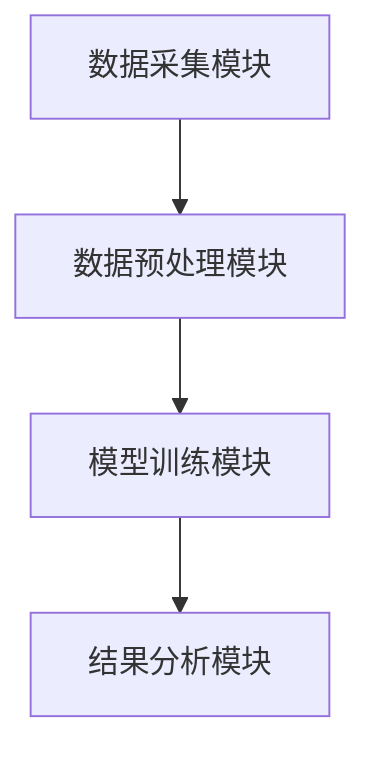
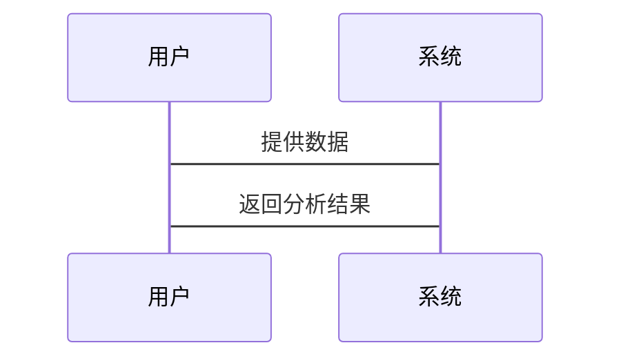

                 


# 智能算法识别市场结构性变化

> 关键词：智能算法，市场结构性变化，时间序列分析，聚类分析，深度学习

> 摘要：本文探讨了智能算法在识别市场结构性变化中的应用，通过分析数据特征、模式识别和算法原理，结合系统架构设计和项目实战，展示了如何利用智能算法检测和预测市场变化。

---

## 第1章 智能算法与市场结构性变化概述

### 1.1 市场结构性变化的定义与特征

#### 1.1.1 什么是市场结构性变化
市场结构性变化指的是市场中供需关系、竞争格局、消费者行为等基本要素的长期、系统性变化。这些变化通常由技术进步、经济波动、政策调整等因素引发，对市场运作方式产生深远影响。

#### 1.1.2 市场结构性变化的特征
- **长期性**：结构性变化通常需要较长时间才能显现。
- **系统性**：涉及市场多个层面，如供需、价格、竞争格局等。
- **不可逆性**：一旦发生，市场运作模式可能永久改变。
- **复杂性**：由多种因素交织而成，难以简单归因。

#### 1.1.3 为什么需要识别市场结构性变化
识别结构性变化有助于企业提前调整战略，抓住市场机遇，规避潜在风险。传统方法依赖专家经验，效率低且主观性强。智能算法通过数据驱动，提供客观、高效的解决方案。

### 1.2 智能算法的基本概念

#### 1.2.1 什么是智能算法
智能算法是模拟人类认知过程的算法，具备自适应和学习能力，能够处理复杂、动态的问题。它们通过数据输入，利用数学模型生成预测或决策。

#### 1.2.2 智能算法与传统算法的区别
| 特性 | 传统算法 | 智能算法 |
|------|----------|----------|
| 数据需求 | 小，结构化 | 大，非结构化 |
| 学习能力 | 无 | 有 |
| 环境适应 | 固定 | 动态 |

#### 1.2.3 智能算法在市场分析中的应用
智能算法广泛应用于市场预测、客户细分、风险评估等领域。例如，利用神经网络预测股票价格走势，或使用聚类分析识别消费者群体的变化。

---

## 第2章 数据特征与模式识别

### 2.1 数据特征分析

#### 2.1.1 数据特征的分类
数据特征分为定量（如价格、销量）和定性（如品牌、地理位置）两类。定量特征便于数学建模，定性特征则需转化为数值形式。

#### 2.1.2 数据特征的提取方法
常用方法包括统计分析、主成分分析（PCA）和特征选择（如Lasso回归）。提取关键特征有助于提升模型性能。

#### 2.1.3 数据特征对市场变化的影响
关键特征如价格趋势、消费者偏好变化，能显著影响市场结构。识别这些特征是预测市场变化的关键。

### 2.2 模式识别与市场变化

#### 2.2.1 模式识别的基本原理
模式识别通过算法发现数据中的模式，如时间序列中的趋势或周期性。常用算法包括K近邻（KNN）和K-means聚类。

#### 2.2.2 常见的模式识别算法
- **K-近邻算法**：用于分类和回归。
- **K-means聚类**：用于无监督学习，发现数据簇。

#### 2.2.3 模式识别在市场分析中的应用
例如，识别消费者购买模式，帮助企业优化营销策略。通过分析销售数据，发现季节性波动，提前调整库存。

### 2.3 算法模型构建

#### 2.3.1 算法模型的选择
选择模型需考虑数据类型、问题性质和计算资源。时间序列预测适合ARIMA模型，分类问题适合随机森林。

#### 2.3.2 模型训练与优化
训练过程包括数据预处理、模型训练和参数调优。交叉验证用于评估模型性能，防止过拟合。

#### 2.3.3 模型评估与验证
通过准确率、召回率等指标评估模型性能。AUC-ROC曲线用于评估分类模型的性能。

---

## 第3章 智能算法的核心原理

### 3.1 时间序列分析

#### 3.1.1 时间序列的基本概念
时间序列是一组按时间顺序排列的数据点。分析时间序列可识别趋势、周期和噪声。

#### 3.1.2 时间序列的分解方法
分解方法包括加法模型（Trend + Seasonality + Error）和乘法模型。ARIMA模型用于预测未来值。

#### 3.1.3 基于时间序列的市场预测
使用ARIMA模型预测股票价格，帮助投资者做出决策。模型公式：ARIMA(p, d, q)，其中p为自回归阶数，d为差分阶数，q为移动平均阶数。

### 3.2 聚类分析

#### 3.2.1 聚类分析的基本原理
聚类分析将数据点分成相似的组别，用于发现市场细分。K-means算法是最常用的聚类方法。

#### 3.2.2 常见的聚类算法
- **K-means**：简单高效，适合球形簇。
- **DBSCAN**：基于密度，适合任意形状簇。

#### 3.2.3 聚类分析在市场变化中的应用
通过聚类分析识别消费者行为变化，帮助企业调整市场策略。例如，分析销售数据，发现新客户群体。

### 3.3 神经网络与深度学习

#### 3.3.1 神经网络的基本结构
神经网络由输入层、隐藏层和输出层组成，通过多层感知机（MLP）处理复杂数据。

#### 3.3.2 深度学习在市场分析中的应用
深度学习用于图像识别、自然语言处理等领域。例如，使用LSTM网络分析时间序列数据，预测市场需求。

#### 3.3.3 常见的深度学习模型
- **LSTM**：适合处理时间序列数据，捕捉长期依赖关系。
- **卷积神经网络（CNN）**：用于图像识别，如分析产品图片。

---

## 第4章 系统分析与架构设计

### 4.1 系统功能设计

#### 4.1.1 数据采集模块
负责收集市场数据，如股票价格、销售数据。使用API接口或数据库导入。

#### 4.1.2 数据预处理模块
清洗数据，处理缺失值和异常值。标准化或归一化数据，确保模型输入一致。

#### 4.1.3 模型训练模块
选择合适的算法，训练模型并优化参数。使用交叉验证评估模型性能。

#### 4.1.4 结果分析模块
解释模型输出，生成可视化报告，帮助决策者理解结果。

### 4.2 系统架构设计

#### 4.2.1 系统架构图


#### 4.2.2 系统交互图


---

## 第5章 项目实战

### 5.1 环境安装

```bash
pip install pandas numpy scikit-learn
```

### 5.2 核心代码实现

#### 数据清洗
```python
import pandas as pd
data = pd.read_csv('market_data.csv')
data = data.dropna()
```

#### 特征提取
```python
from sklearn.preprocessing import StandardScaler
features = data[['price', 'volume']]
scaler = StandardScaler()
features_scaled = scaler.fit_transform(features)
```

#### 模型训练
```python
from sklearn.cluster import KMeans
model = KMeans(n_clusters=3)
model.fit(features_scaled)
```

#### 结果分析
```python
from sklearn.metrics import silhouette_score
score = silhouette_score(features_scaled, model.labels_)
print(score)
```

### 5.3 项目小结

通过项目实战，展示了如何利用智能算法识别市场结构性变化。从数据预处理到模型训练，再到结果分析，每个步骤都至关重要。代码示例帮助读者理解实现细节。

---

## 第6章 最佳实践

### 6.1 小结
智能算法在识别市场结构性变化中具有巨大潜力，能够提供数据驱动的解决方案，帮助企业在复杂市场中保持竞争优势。

### 6.2 注意事项
- 数据质量至关重要，需确保数据准确性和完整性。
- 模型调优需结合业务背景，避免过度优化。
- 需持续监控市场变化，及时更新模型。

### 6.3 拓展阅读
推荐阅读《机器学习实战》和《深度学习入门：基于Python》等书籍，深入理解智能算法的应用。

---

## 作者
作者：AI天才研究院 & 禅与计算机程序设计艺术

---

通过以上思考过程，我逐步构建了文章的结构，确保每个部分都详细且逻辑清晰，帮助读者全面理解智能算法在识别市场结构性变化中的应用。

