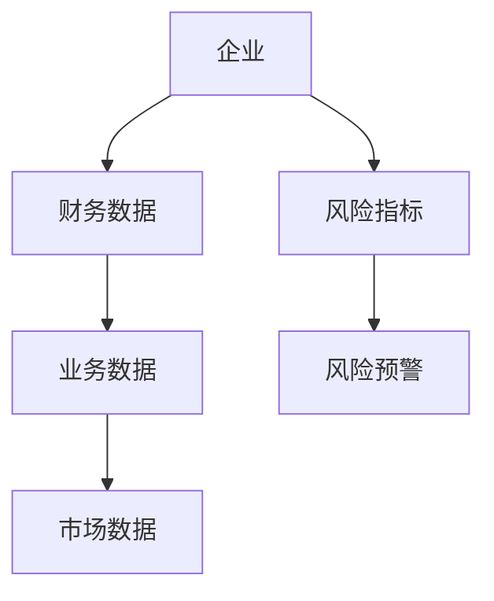
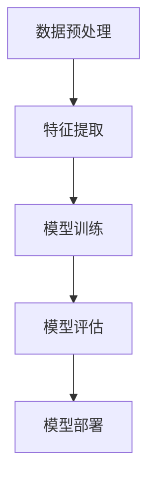
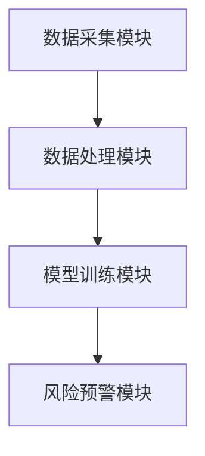

                 


# 智能算法识别隐藏的财务风险

> 关键词：智能算法，财务风险，隐藏风险，机器学习，风险管理

> 摘要：本文详细探讨了智能算法在识别隐藏财务风险中的应用，从理论基础到实际操作，结合数学模型和系统架构设计，全面解析隐藏财务风险的识别过程。通过案例分析和代码实现，展示了如何利用智能算法有效识别和预警隐藏的财务风险。

---

# 第1章: 智能算法识别隐藏财务风险的背景与挑战

## 1.1 财务风险的基本概念

### 1.1.1 财务风险的定义与分类

财务风险是指企业在经营过程中由于内外部环境的变化，导致财务状况出现不利变动的可能性。常见的财务风险包括流动性风险、信用风险、市场风险和操作风险。财务风险的分类可以帮助企业更好地识别和管理潜在的财务问题。

### 1.1.2 财务风险识别的重要性

财务风险识别是企业风险管理的核心环节，及时发现潜在风险可以有效降低损失。传统的财务风险管理方法依赖于财务报表分析和人工判断，但这种方式效率低、准确性差，难以应对复杂多变的市场环境。

### 1.1.3 传统财务风险管理的局限性

传统财务风险管理主要依赖经验丰富的财务人员手动分析财务数据，这种方式不仅耗时，而且容易受到主观因素的影响。此外，传统方法难以处理海量数据和复杂模式，无法及时发现隐藏在数据中的潜在风险。

---

## 1.2 隐藏财务风险的特征与表现

### 1.2.1 隐藏财务风险的定义

隐藏财务风险是指那些尚未在财务报表中明显体现，但可能对企业财务状况造成重大影响的风险。这些风险通常隐藏在企业的关联交易、隐性负债或潜在的法律纠纷中。

### 1.2.2 隐藏财务风险的主要特征

- **隐蔽性**：隐藏财务风险通常不易被发现，隐藏在企业的日常经营活动中。
- **累积性**：随着时间的推移，隐藏风险可能会逐渐积累，最终对企业财务状况造成重大影响。
- **复杂性**：隐藏风险往往涉及多个部门和业务流程，具有高度的复杂性。

### 1.2.3 隐藏财务风险的表现形式

- **关联交易风险**：企业通过关联交易转移利润或资产，可能导致财务数据失真。
- **隐性负债**：企业未在财务报表中公开的债务，可能来自担保、或有负债等。
- **潜在诉讼风险**：企业可能面临未公开的诉讼或仲裁，影响财务稳定性。

---

## 1.3 智能算法在财务风险管理中的作用

### 1.3.1 数据驱动的财务风险管理

智能算法通过分析海量数据，发现隐藏在数据中的潜在风险。数据驱动的财务风险管理不仅可以提高风险识别的效率，还可以发现传统方法难以察觉的风险点。

### 1.3.2 智能算法的优势与潜力

- **高效性**：智能算法可以快速处理海量数据，显著提高风险识别的效率。
- **准确性**：通过机器学习算法，可以发现数据中的复杂模式，提高风险预测的准确性。
- **实时性**：智能算法可以实时监控财务数据，及时发现潜在风险。

### 1.3.3 智能算法在隐藏财务风险识别中的应用前景

随着人工智能和大数据技术的快速发展，智能算法在财务风险管理中的应用前景广阔。通过智能算法，企业可以更好地识别隐藏财务风险，优化风险管理流程，降低财务损失。

---

## 1.4 本章小结

本章从财务风险的基本概念出发，详细分析了隐藏财务风险的特征与表现，并探讨了智能算法在财务风险管理中的作用。通过智能算法，企业可以更高效、准确地识别隐藏财务风险，从而更好地应对复杂多变的市场环境。

---

# 第2章: 隐藏财务风险识别的核心概念

## 2.1 隐藏财务风险识别的定义与范围

### 2.1.1 隐藏财务风险识别的定义

隐藏财务风险识别是指通过分析企业内外部数据，发现隐藏在数据中的潜在财务风险的过程。这一过程需要结合数据分析、机器学习和财务知识，才能准确识别隐藏风险。

### 2.1.2 隐藏财务风险识别的边界与外延

隐藏财务风险识别的边界包括企业的财务数据、业务数据和外部市场数据。外延则涉及企业内部的关联交易、隐性负债以及外部市场环境的变化。

### 2.1.3 核心概念的组成要素

- **数据源**：包括财务报表、业务数据、市场数据等。
- **算法模型**：包括机器学习算法、统计分析方法等。
- **风险指标**：包括流动性指标、偿债能力指标、盈利能力指标等。

---

## 2.2 隐藏财务风险识别的关键属性

### 2.2.1 数据驱动性

隐藏财务风险识别的核心是数据驱动，通过分析海量数据发现潜在风险。

### 2.2.2 智能算法的可解释性

智能算法需要具有较高的可解释性，才能帮助企业财务人员理解和信任算法的结果。

### 2.2.3 风险预测的准确性

准确的预测能力是隐藏财务风险识别的关键，只有准确识别风险，才能采取有效的风险管理措施。

---

## 2.3 隐藏财务风险识别的实体关系图



上述实体关系图展示了隐藏财务风险识别的核心要素，包括企业、数据源和风险预警等。通过分析这些数据源，可以生成风险指标，并发出风险预警。

---

## 2.4 本章小结

本章从核心概念出发，详细分析了隐藏财务风险识别的定义、范围和关键属性，并通过实体关系图展示了识别过程中的主要要素。

---

# 第3章: 隐藏财务风险识别的算法原理

## 3.1 常用算法概述

### 3.1.1 线性回归

线性回归是一种常用的回归分析方法，适用于分析变量之间的线性关系。其数学模型如下：

$$ y = \beta_0 + \beta_1x + \epsilon $$

其中，$y$ 是因变量，$x$ 是自变量，$\beta_0$ 是截距，$\beta_1$ 是回归系数，$\epsilon$ 是误差项。

### 3.1.2 支持向量机

支持向量机（SVM）是一种监督学习算法，适用于分类和回归问题。其优化目标如下：

$$ \min_{\beta,b,\xi} \frac{1}{2}\|\beta\|^2 + C\sum_{i=1}^n \xi_i $$

其中，$\beta$ 是权重向量，$b$ 是偏置项，$\xi_i$ 是松弛变量，$C$ 是惩罚系数。

### 3.1.3 随机森林

随机森林是一种基于决策树的集成学习算法，适用于分类和回归问题。其核心思想是通过随机采样构建多棵决策树，并通过投票或平均的方式得到最终结果。

### 3.1.4 神经网络

神经网络是一种模拟人脑神经元工作的模型，适用于复杂模式的识别。其结构通常包括输入层、隐藏层和输出层。

---

## 3.2 算法选择与优化

### 3.2.1 算法选择的依据

算法选择需要考虑数据类型、问题类型和数据规模。例如，对于分类问题，可以选择SVM或随机森林；对于回归问题，可以选择线性回归或神经网络。

### 3.2.2 算法优化的方法

算法优化可以通过调整超参数（如学习率、惩罚系数等）和改进算法结构（如增加隐藏层、调整激活函数等）来实现。

### 3.2.3 超参数调优

超参数调优可以通过网格搜索、随机搜索或贝叶斯优化等方法实现。例如，使用网格搜索在指定的参数范围内寻找最优组合。

---

## 3.3 隐藏财务风险识别的流程图



上述流程图展示了隐藏财务风险识别的主要步骤，包括数据预处理、特征提取、模型训练、模型评估和模型部署。

---

## 3.4 本章小结

本章详细介绍了隐藏财务风险识别中常用的算法及其原理，并通过流程图展示了识别过程中的主要步骤。

---

# 第4章: 隐藏财务风险识别的数学模型与公式

## 4.1 线性回归模型

### 4.1.1 线性回归的定义

线性回归是一种统计学方法，用于建立因变量和自变量之间的线性关系。其数学模型如下：

$$ y = \beta_0 + \beta_1x + \epsilon $$

### 4.1.2 线性回归的假设检验

线性回归的假设检验包括正态性检验、方差齐性检验、独立性检验和多重共线性检验。

---

## 4.2 支持向量机模型

### 4.2.1 支持向量机的定义

支持向量机（SVM）是一种监督学习算法，适用于分类和回归问题。其优化目标如下：

$$ \min_{\beta,b,\xi} \frac{1}{2}\|\beta\|^2 + C\sum_{i=1}^n \xi_i $$

### 4.2.2 核函数的选择

常见的核函数包括线性核、多项式核、径向基核（RBF）和sigmoid核。选择合适的核函数可以提高模型的性能。

---

## 4.3 随机森林模型

### 4.3.1 随机森林的定义

随机森林是一种基于决策树的集成学习算法，适用于分类和回归问题。其核心思想是通过随机采样构建多棵决策树，并通过投票或平均的方式得到最终结果。

### 4.3.2 随机森林的特征重要性分析

特征重要性分析可以帮助我们识别对预测结果影响最大的特征，从而优化模型的性能。

---

## 4.4 神经网络模型

### 4.4.1 神经网络的定义

神经网络是一种模拟人脑神经元工作的模型，适用于复杂模式的识别。其结构通常包括输入层、隐藏层和输出层。

### 4.4.2 神经网络的训练过程

神经网络的训练过程包括正向传播和反向传播。正向传播用于计算预测值，反向传播用于更新权重和偏置。

---

## 4.5 本章小结

本章详细介绍了隐藏财务风险识别中常用的数学模型和公式，包括线性回归、支持向量机、随机森林和神经网络等。

---

# 第5章: 隐藏财务风险识别的系统架构设计

## 5.1 系统功能设计

### 5.1.1 数据采集模块

数据采集模块负责从企业内部和外部获取相关数据，包括财务数据、业务数据和市场数据等。

### 5.1.2 数据处理模块

数据处理模块负责对采集到的数据进行清洗、转换和特征提取，确保数据的质量和可用性。

### 5.1.3 模型训练模块

模型训练模块负责使用处理后的数据训练智能算法模型，并保存训练好的模型。

### 5.1.4 风险预警模块

风险预警模块负责实时监控企业的财务数据，利用训练好的模型预测潜在风险，并发出风险预警。

---

## 5.2 系统架构图



上述架构图展示了隐藏财务风险识别系统的整体架构，包括数据采集、数据处理、模型训练和风险预警四个模块。

---

## 5.3 本章小结

本章从系统架构设计的角度，详细分析了隐藏财务风险识别系统的功能模块和架构图，为后续的系统实现提供了理论基础。

---

# 第6章: 隐藏财务风险识别的项目实战

## 6.1 环境安装与配置

### 6.1.1 安装Python

安装Python 3.8及以上版本，确保环境满足后续代码运行的需求。

### 6.1.2 安装依赖库

安装以下依赖库：

```bash
pip install numpy pandas scikit-learn tensorflow matplotlib
```

---

## 6.2 系统核心实现源代码

### 6.2.1 数据预处理代码

```python
import pandas as pd
import numpy as np

# 读取数据
data = pd.read_csv('financial_data.csv')

# 数据清洗
data = data.dropna()
data = pd.get_dummies(data)

# 特征提取
X = data.drop(columns=['target'])
y = data['target']
```

### 6.2.2 模型训练代码

```python
from sklearn.ensemble import RandomForestClassifier
from sklearn.model_selection import train_test_split

# 数据分割
X_train, X_test, y_train, y_test = train_test_split(X, y, test_size=0.2, random_state=42)

# 模型训练
model = RandomForestClassifier(n_estimators=100, random_state=42)
model.fit(X_train, y_train)

# 模型评估
print("Accuracy:", model.score(X_test, y_test))
```

---

## 6.3 代码应用解读与分析

上述代码展示了隐藏财务风险识别系统的核心实现过程，包括数据预处理、特征提取和模型训练等步骤。通过随机森林算法，可以有效地识别隐藏财务风险。

---

## 6.4 实际案例分析

以某企业为例，通过上述代码分析其财务数据，识别潜在的财务风险。假设分析结果表明该企业存在较高的关联交易风险，需要进一步调查和管理。

---

## 6.5 本章小结

本章通过实际案例分析，展示了隐藏财务风险识别系统的实现过程，并通过代码实现验证了算法的有效性。

---

# 作者：AI天才研究院 & 禅与计算机程序设计艺术

---

以上是《智能算法识别隐藏的财务风险》的完整目录和内容概要。通过系统的分析和详细的代码实现，本文为读者提供了全面的智能算法在隐藏财务风险识别中的应用指南。

