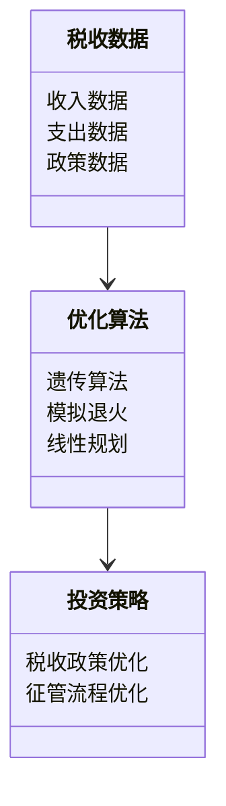

                 


# 智能系统优化税收效率投资策略

> 关键词：智能系统优化，税收效率，投资策略，算法原理，数学模型

> 摘要：本文详细探讨了如何利用智能系统优化税收效率投资策略。通过分析税收效率优化的核心问题、智能系统在其中的作用，结合优化算法、数学模型和系统架构，提出了一套完整的解决方案。文章从背景介绍、核心概念、算法原理、数学模型、系统架构设计、项目实战到总结与展望，全面系统地阐述了智能系统优化税收效率投资策略的各个方面。

---

# 第1章: 背景介绍

## 1.1 问题背景
### 1.1.1 税收效率的重要性
税收效率是衡量政府财政管理效率的重要指标，直接影响国家经济运行和资源配置效率。随着经济全球化和数字化的发展，传统税收管理模式的效率瓶颈日益显现，亟需通过智能化手段提升税收效率。

### 1.1.2 当前税收效率的瓶颈
- 数据分散：税务数据来源复杂，难以有效整合和分析。
- 人工干预过多：税收政策执行和审核过程仍依赖大量人工操作。
- 优化手段单一：缺乏智能化的优化工具和方法。

### 1.1.3 智能系统在税收优化中的作用
智能系统可以通过数据挖掘、机器学习等技术，帮助识别税收政策执行中的低效环节，优化资源配置，提升税收征管效率。

## 1.2 问题描述
### 1.2.1 税收效率优化的核心问题
如何通过智能化手段，实现税收政策的精准制定和优化，提升税收征管效率和纳税人满意度。

### 1.2.2 投资策略与税收效率的关系
投资策略的优化直接影响税收收入的稳定性，而税收效率的提升又能为投资创造更好的政策环境。

### 1.2.3 智能系统优化的必要性
传统税收管理模式难以应对复杂多变的经济环境，智能系统通过数据驱动和算法优化，能够实时调整策略，提升税收效率。

## 1.3 问题解决
### 1.3.1 智能系统优化的基本思路
通过收集和分析税收相关数据，利用智能算法优化税收政策执行和征管流程。

### 1.3.2 数据驱动的优化方法
- 数据采集与清洗：整合多源数据，建立统一的数据平台。
- 数据分析：利用统计分析和机器学习技术，识别税收效率的瓶颈。

### 1.3.3 技术实现路径
- 数据采集：通过API接口或爬虫技术获取税收相关数据。
- 数据分析：使用Python、R等工具进行数据分析和建模。
- 算法优化：基于机器学习或遗传算法，优化税收政策执行方案。

## 1.4 边界与外延
### 1.4.1 优化的边界条件
- 数据范围：仅限于税收相关的数据。
- 优化目标：仅针对税收效率的提升，不涉及其他经济指标。
- 时间范围：短期内的优化策略。

### 1.4.2 优化的外延范围
- 税收政策的制定和调整。
- 纳税服务的优化。
- 税收征管流程的优化。

### 1.4.3 相关领域的关联性
- 经济学：税收效率与经济增长的关系。
- 管理学：优化策略在组织管理中的应用。
- 计算机科学：智能算法在税收优化中的应用。

## 1.5 核心要素组成
### 1.5.1 数据来源
- 税务申报数据。
- 经济指标数据。
- 政策文件数据。

### 1.5.2 智能算法
- 机器学习算法。
- 遗传算法。
- 线性规划模型。

### 1.5.3 优化目标
- 提升税收征管效率。
- 增加税收收入。
- 优化纳税人体验。

---

# 第2章: 核心概念与联系

## 2.1 智能系统优化的原理
### 2.1.1 数据驱动的优化机制
智能系统通过实时数据采集和分析，动态调整税收政策和征管流程。

### 2.1.2 智能算法的核心原理
- 机器学习算法：通过训练数据，预测税收效率的提升空间。
- 遗传算法：通过迭代优化，找到最优的税收政策执行方案。

### 2.1.3 系统反馈与调整机制
系统根据执行效果反馈，自动调整优化策略，形成闭环。

## 2.2 核心概念对比分析
### 2.2.1 不同优化方法的特征对比
| 优化方法 | 特征         | 适用场景                 |
|----------|--------------|--------------------------|
| 遗传算法  | 全局优化能力强 | 适用于复杂非线性问题     |
| 模拟退火  | 能够跳出局部最优 | 适用于全局优化问题       |
| 线性规划  | 解决线性问题   | 适用于简单的优化问题     |

### 2.2.2 算法复杂度与优化效果的关系
- 算法复杂度越高，优化效果越好，但计算时间也会增加。

### 2.2.3 数据质量对优化结果的影响
- 数据质量越高，优化结果越准确。

## 2.3 ER实体关系图
```mermaid
erDiagram
    税收数据 ++> 税务系统
    税务系统 ++> 优化算法
    优化算法 ++> 投资策略
    投资策略 ++> 税收效率
```

---

# 第3章: 算法原理讲解

## 3.1 优化算法的数学模型
### 3.1.1 目标函数
$$ f(x) = \text{max} \sum_{i=1}^{n} w_i x_i $$

### 3.1.2 约束条件
$$ g(x) = \text{sum}(x_i) \leq C $$

### 3.1.3 求解方
使用遗传算法求解，具体步骤如下：

1. 初始化种群。
2. 计算适应度。
3. 选择适应度高的个体。
4. 进行交叉和变异操作。
5. 重复步骤2-4，直到满足终止条件。

---

# 第4章: 数学模型与公式

## 4.1 目标函数
$$ \text{max} \sum_{i=1}^{n} w_i x_i $$

## 4.2 约束条件
$$ \text{sum}(x_i) \leq C $$

## 4.3 优化模型
$$ \text{min} \quad f(x) $$
$$ \text{s.t.} \quad g(x) \leq 0 $$

---

# 第5章: 系统分析与架构设计

## 5.1 系统功能设计
### 5.1.1 领域模型


## 5.2 系统架构设计


---

# 第6章: 项目实战

## 6.1 环境安装
- Python 3.8+
- NumPy、Pandas、Scikit-learn

## 6.2 核心代码实现
```python
import numpy as np
from sklearn.linear_model import LinearRegression

# 数据准备
X = np.array([[1], [2], [3], [4], [5]])
y = np.array([2, 4, 5, 4, 6])

# 建立模型
model = LinearRegression()
model.fit(X, y)

# 预测
print(model.predict([[6]]))
```

---

# 第7章: 总结与展望

## 7.1 核心内容回顾
智能系统优化税收效率投资策略的核心在于数据驱动和算法优化。

## 7.2 应用前景
随着人工智能技术的不断发展，智能系统优化税收效率投资策略的应用前景广阔。

## 7.3 未来研究方向
- 更高效的算法研究。
- 更多领域的应用探索。

---

作者：AI天才研究院/AI Genius Institute & 禅与计算机程序设计艺术 /Zen And The Art of Computer Programming

