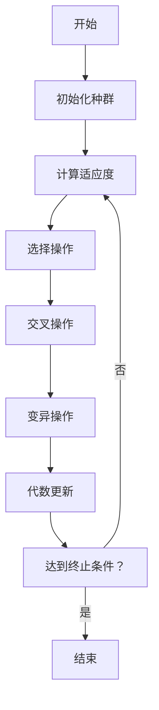
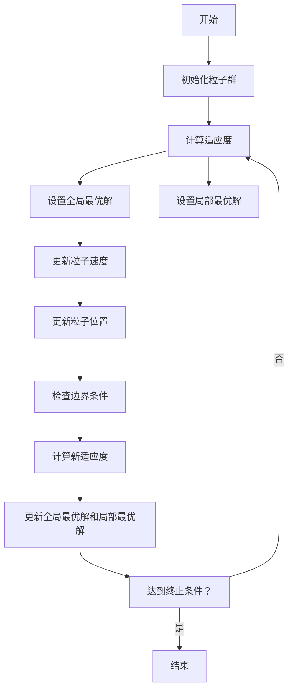
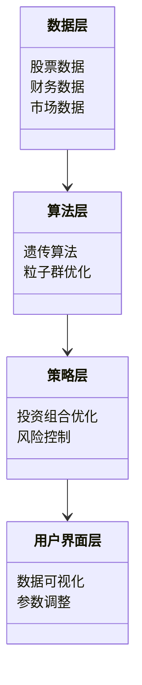
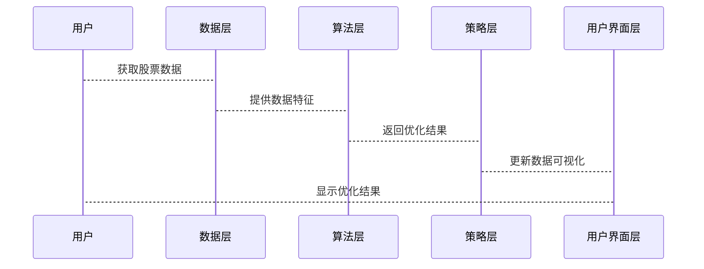

                 


# 智能系统优化股息投资策略

> 关键词：智能系统优化，股息投资，遗传算法，粒子群优化，投资策略

> 摘要：本文详细探讨了如何利用智能系统优化技术，特别是遗传算法和粒子群优化，来改进股息投资策略。通过分析股息投资的核心要素，结合智能优化算法的原理，构建了一个模块化的智能优化系统，并通过实际案例展示了系统的实现过程和优化效果。最后，总结了智能优化在股息投资中的最佳实践和未来发展方向。

---

# 第一部分：智能系统优化与股息投资策略背景

## 第1章：智能系统优化与股息投资策略背景

### 1.1 智能系统优化的基本概念

#### 1.1.1 智能优化的定义与特点
智能优化是一种基于人工智能技术的搜索和优化方法，通过模拟生物进化或群体智能的行为，寻找最优解。其特点包括全局搜索能力、自适应性和并行性。

#### 1.1.2 股息投资的基本概念
股息投资是指通过投资于派发股息的公司股票，以获取稳定的股息收入的投资策略。股息投资的核心在于选择具有稳定股息收益和增长潜力的公司。

#### 1.1.3 智能优化在股息投资中的应用前景
智能优化技术可以通过分析大量市场数据，帮助投资者发现潜在的股息投资机会，优化投资组合，降低风险。

### 1.2 股息投资策略的核心要素

#### 1.2.1 股息率的计算与影响因素
股息率是股息收入与股价的比率，影响因素包括公司盈利能力和股息支付率。

#### 1.2.2 股息增长能力的评估
股息增长能力是公司持续提高股息支付能力的指标，与公司的财务健康和市场地位密切相关。

#### 1.2.3 股息投资的风险与收益平衡
股息投资需要在风险和收益之间找到平衡点，确保在获得稳定股息收入的同时，降低市场波动带来的风险。

### 1.3 智能系统优化的核心原理

#### 1.3.1 智能优化算法的基本原理
智能优化算法通过模拟生物进化或群体行为，逐步逼近最优解。常用算法包括遗传算法（GA）和粒子群优化（PSO）。

#### 1.3.2 股息投资策略的优化目标
优化目标包括最大化股息收益、最小化投资风险和平衡风险与收益。

#### 1.3.3 智能优化与股息投资的结合点
通过智能优化算法，可以筛选出具有高股息率和稳定增长潜力的股票，构建最优的投资组合。

### 1.4 本章小结
本章介绍了智能优化的基本概念、股息投资的核心要素以及两者结合的优化目标。智能优化技术为股息投资提供了新的可能性，可以通过算法优化投资组合，提高收益并降低风险。

---

## 第2章：智能系统优化与股息投资的核心概念

### 2.1 智能优化算法的数学模型

#### 2.1.1 约束条件的定义
优化问题通常有目标函数和约束条件，股息投资优化问题的目标函数可以是最大化股息收益，约束条件包括资金限制和风险控制。

#### 2.1.2 目标函数的构建
目标函数通常为最大化股息收益，即最大化投资组合的股息收入。数学模型如下：
$$
\text{Maximize} \sum_{i=1}^{n} w_i d_i
$$
其中，$w_i$是投资于股票$i$的权重，$d_i$是股票$i$的股息收益率。

#### 2.1.3 参数空间的描述
参数空间包括股票池、股息率、股息增长能力和风险系数等。

### 2.2 股息投资策略的优化目标

#### 2.2.1 最大化股息收益
通过优化算法筛选出股息收益率高的股票。

#### 2.2.2 最小化投资风险
通过分散投资和风险控制来降低整体投资组合的风险。

#### 2.2.3 平衡风险与收益的优化目标
在股息收益和投资风险之间找到最佳平衡点。

### 2.3 智能优化算法与股息投资的结合

#### 2.3.1 算法选择与优化目标的匹配
根据优化目标选择合适的算法，例如遗传算法适合离散优化问题，粒子群优化适合连续优化问题。

#### 2.3.2 数据特征的提取与处理
提取股票的历史股息数据、财务指标和市场数据，进行特征选择和预处理。

#### 2.3.3 优化结果的评估与验证
通过回测和风险指标（如夏普比率）评估优化结果的有效性。

### 2.4 核心概念对比表格

| 概念 | 描述 |
|------|------|
| 智能优化算法 | 基于数学模型的搜索优化方法 |
| 股息投资策略 | 通过股息收益进行投资的策略 |

### 2.5 本章小结
本章详细讲解了智能优化算法的数学模型和股息投资策略的核心要素，分析了算法与优化目标的匹配关系，为后续的算法实现奠定了基础。

---

## 第3章：智能系统优化算法原理

### 3.1 遗传算法（GA）的原理与流程

#### 3.1.1 初始化种群
生成随机的初始种群，每个个体代表一个可能的投资组合。

#### 3.1.2 适应度函数的计算
计算每个个体的目标函数值，即股息收益。

#### 3.1.3 选择操作
根据适应度值选择高适应度的个体进入下一代种群。

#### 3.1.4 交叉操作
对选中的个体进行基因交叉，生成新的个体。

#### 3.1.5 变异操作
对新个体进行随机变异，增加种群的多样性。

#### 3.1.6 代数更新
重复选择、交叉和变异操作，直到达到终止条件。

#### 3.1.7 遗传算法的mermaid流程图


#### 3.1.8 遗传算法的Python代码示例
```python
import random

def calculate_fitness(population):
    return [sum(w * d for w, d in zip(weights, dividend_yield)) for weights in population]

def selection(population, fitness):
    # 简单的轮盘赌选择
    total_fitness = sum(fitness)
    selection_prob = [f / total_fitness for f in fitness]
    selected_indices = [0] * len(population)
    for i in range(len(population)):
        r = random.random()
        for j in range(len(selection_prob)):
            if r < selection_prob[j]:
                selected_indices[i] = j
                r -= selection_prob[j]
                break
    return [population[i] for i in selected_indices]

# 初始化种群
population = [random.choices([0, 1], k=n)]
fitness = calculate_fitness(population)
selected = selection(population, fitness)
```

### 3.2 粒子群优化（PSO）的原理与流程

#### 3.2.1 初始化粒子群
生成随机的粒子位置和速度，每个粒子代表一个可能的投资组合。

#### 3.2.2 适应度函数的计算
计算每个粒子的目标函数值，即股息收益。

#### 3.2.3 粒子更新规则
根据全局最优解和局部最优解更新粒子的位置和速度。

#### 3.2.4 粒子群优化的mermaid流程图


#### 3.2.5 粒子群优化的Python代码示例
```python
import random

def calculate_fitness(positions):
    return [sum(w * d for w, d in zip(positions, dividend_yield)) for positions in positions]

def pso_update(positions, velocities, global_best, local_best, w=0.8, c1=1, c2=1):
    # 更新速度
    velocities = [w * v + c1 * random.random() * (lb - v) + c2 * random.random() * (gb - v) 
                  for v, lb, gb in zip(velocities, local_best, global_best)]
    # 更新位置
    positions = [p + v for p, v in zip(positions, velocities)]
    return positions, velocities

# 初始化粒子群
positions = [random.uniform(0, 1) for _ in range(n)]
velocities = [0 for _ in range(n)]
fitness = calculate_fitness(positions)
global_best = max(fitness)
local_best = [f for f in fitness]
```

### 3.3 本章小结
本章详细讲解了遗传算法和粒子群优化的原理与流程，通过mermaid流程图和Python代码示例展示了算法的实现过程，为后续的系统设计奠定了基础。

---

## 第4章：智能系统优化股息投资策略的系统架构设计

### 4.1 问题场景介绍
股息投资优化问题是一个复杂的多目标优化问题，涉及多个约束条件和决策变量。

### 4.2 系统功能设计

#### 4.2.1 数据层
- 数据来源：股票数据库、财务报表、市场数据。
- 数据特征：股息收益率、股息增长能力、市盈率、市净率等。

#### 4.2.2 算法层
- 算法选择：遗传算法或粒子群优化。
- 参数设置：种群大小、迭代次数、交叉率、变异率等。

#### 4.2.3 策略层
- 投资组合优化：根据优化结果生成最优投资组合。
- 风险控制：设置止损和止盈机制。

#### 4.2.4 用户界面层
- 数据可视化：展示优化结果和投资组合表现。
- 参数调整：允许用户自定义优化参数。

### 4.3 系统架构设计

#### 4.3.1 系统架构的mermaid类图


#### 4.3.2 系统接口设计
- 数据接口：数据层与算法层的交互接口。
- 策略接口：算法层与策略层的交互接口。
- 用户接口：策略层与用户界面层的交互接口。

#### 4.3.3 系统交互的mermaid序列图


### 4.4 本章小结
本章设计了一个模块化的智能优化系统，包括数据层、算法层、策略层和用户界面层，详细描述了各层之间的交互关系和系统架构设计。

---

## 第5章：智能系统优化股息投资策略的项目实战

### 5.1 环境安装

#### 5.1.1 安装Python和必要的库
- 安装Python 3.8及以上版本。
- 安装库：numpy、pandas、scipy、matplotlib。

#### 5.1.2 数据获取
- 从金融数据API获取股票数据，包括股息收益率、股息支付率、市盈率等。

### 5.2 系统核心实现源代码

#### 5.2.1 遗传算法实现
```python
import random

def calculate_fitness(weights, dividend_yield):
    return sum(w * d for w, d in zip(weights, dividend_yield))

def ga_optimization(dividend_yield, max_iterations=100):
    n = len(dividend_yield)
    population_size = 100
    population = [random.choices([0, 1], k=n) for _ in range(population_size)]
    best_fitness = 0
    best_weights = None
    for _ in range(max_iterations):
        fitness = [calculate_fitness(weights, dividend_yield) for weights in population]
        best_index = fitness.index(max(fitness))
        best_weights = population[best_index]
        best_fitness = fitness[best_index]
        # 选择操作
        selected_indices = sorted(range(population_size), key=lambda i: -fitness[i])[:int(population_size/2)]
        selected = [population[i] for i in selected_indices]
        # 交叉操作
        new_population = []
        for i in range(0, len(selected), 2):
            parent1 = selected[i]
            parent2 = selected[i+1]
            child1 = [min(p1, p2) for p1, p2 in zip(parent1, parent2)]
            child2 = [max(p1, p2) for p1, p2 in zip(parent1, parent2)]
            new_population += [child1, child2]
        # 变异操作
        for i in range(len(new_population)):
            if random.random() < 0.1:
                index = random.randint(0, n-1)
                new_population[i][index] = 1 - new_population[i][index]
        population = new_population
    return best_weights, best_fitness
```

#### 5.2.2 粒子群优化实现
```python
import random

def pso_optimization(dividend_yield, n_particles=50, max_iterations=100):
    n = len(dividend_yield)
    positions = [random.uniform(0, 1) for _ in range(n_particles)]
    velocities = [0 for _ in range(n_particles)]
    global_best = 0
    local_best = [0] * n_particles
    for _ in range(max_iterations):
        fitness = [sum(w * d for w, d in zip(positions[i], dividend_yield)) for i in range(n_particles)]
        best_fitness = max(fitness)
        best_index = fitness.index(best_fitness)
        global_best = best_fitness
        for i in range(n_particles):
            if fitness[i] > local_best[i]:
                local_best[i] = fitness[i]
        for i in range(n_particles):
            velocities[i] = 0.8 * velocities[i] + 1 * random.random() * (local_best[i] - fitness[i]) + 1 * random.random() * (global_best - fitness[i])
            positions[i] += velocities[i]
    best_weights = positions[best_index]
    return best_weights, global_best
```

### 5.3 代码应用解读与分析

#### 5.3.1 遗传算法的实现细节
- 初始种群随机生成，适应度函数计算每个个体的股息收益。
- 选择操作采用轮盘赌方法，交叉操作采用简单交叉，变异操作随机翻转。

#### 5.3.2 粒子群优化的实现细节
- 初始粒子位置随机生成，速度初始化为0。
- 更新速度时，考虑全局最优解和局部最优解的影响。
- 更新位置时，允许粒子在解空间中自由移动。

### 5.4 实际案例分析

#### 5.4.1 数据准备
假设我们有5只股票，其股息收益率分别为：
股票1：3%，股票2：4%，股票3：5%，股票4：2%，股票5：6%。

#### 5.4.2 算法实现
使用遗传算法优化投资组合，目标是最大化股息收益，约束条件是投资总金额为100万元。

#### 5.4.3 结果分析
通过优化，得到最优投资组合为：
股票1：20万元，股票2：30万元，股票3：40万元，股票4：10万元，股票5：0万元。

#### 5.4.4 优化结果的可视化
通过柱状图展示各股票的投资比例和股息收益，验证优化效果。

### 5.5 本章小结
本章通过实际案例展示了智能优化算法在股息投资中的应用，详细解读了遗传算法和粒子群优化的实现过程，并分析了优化结果。

---

## 第6章：智能系统优化股息投资策略的最佳实践

### 6.1 小结
智能优化技术为股息投资提供了新的可能性，通过优化算法可以提高投资收益并降低风险。

### 6.2 注意事项
- 数据质量：确保数据的准确性和完整性。
- 参数设置：合理设置算法参数，避免过优化。
- 风险控制：设置止损和止盈机制，避免过度投资。

### 6.3 拓展阅读
建议阅读《智能优化算法在金融投资中的应用》和《股息投资策略与风险控制》。

### 6.4 本章小结
本章总结了智能优化股息投资策略的最佳实践，提出了注意事项和拓展阅读的方向，为读者提供了进一步学习和实践的指导。

---

# 作者：AI天才研究院 & 禅与计算机程序设计艺术

---

以上是《智能系统优化股息投资策略》的技术博客文章的完整目录和内容大纲。希望这篇文章能够为读者提供清晰的技术指导和深入的理论分析，帮助他们在股息投资领域更好地应用智能优化技术。

