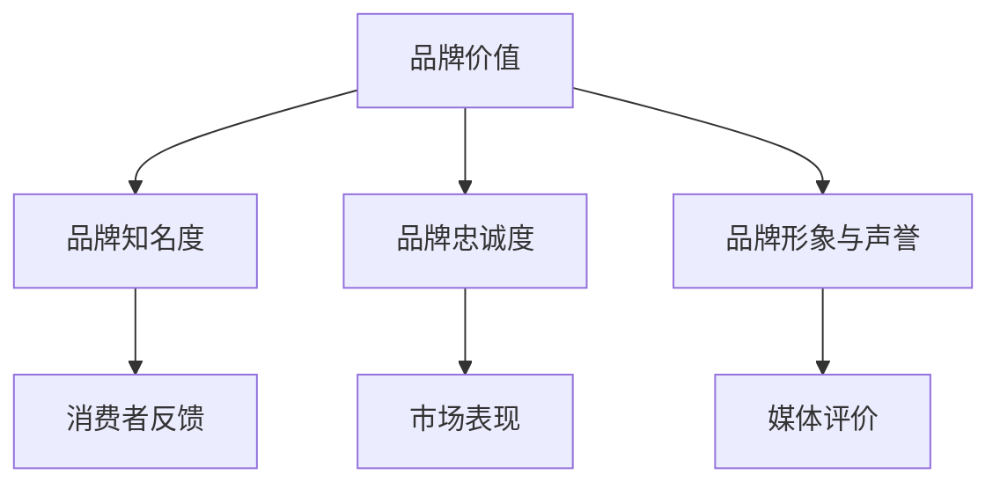
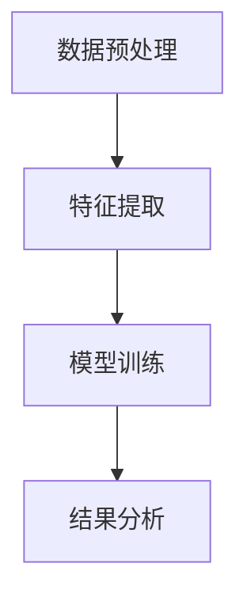

                 


# 智能系统辅助公司品牌价值评估

---

## 关键词：
智能系统, 品牌价值, 数据分析, 机器学习, 人工智能

---

## 摘要：
随着全球化竞争的加剧，品牌价值已成为企业核心竞争力的重要指标。传统品牌价值评估方法依赖于人工调研和经验判断，存在效率低、成本高、主观性强等问题。本文提出一种基于智能系统的品牌价值评估方法，利用大数据分析、机器学习和自然语言处理等技术，从多个维度对企业品牌进行量化评估，帮助企业更精准地掌握品牌价值，优化品牌管理策略。本文详细分析了智能系统辅助品牌价值评估的核心原理、算法实现、系统架构，并通过实际案例展示了智能系统在品牌价值评估中的应用效果。

---

## 第一部分：智能系统与品牌价值评估的背景

### 第1章：品牌价值评估的背景与挑战

#### 1.1 品牌价值的定义与重要性
品牌价值是企业在市场中通过品牌建设所积累的无形资产，反映了品牌在消费者心中的认知度、忠诚度和美誉度。品牌价值不仅是企业市场地位的体现，也是吸引投资、并购估值的重要依据。随着市场竞争的加剧，品牌价值已成为企业核心竞争力的关键指标。

#### 1.2 品牌价值评估的传统方法与挑战
传统品牌价值评估方法主要包括问卷调查、专家访谈和市场调研等方式，这些方法存在以下挑战：
- **数据采集成本高**：需要投入大量时间和资金进行人工调研。
- **主观性强**：依赖专家经验，存在主观判断偏差。
- **效率低**：难以实时跟踪品牌价值的变化。
- **维度有限**：难以从多维度（如社交媒体、市场表现、消费者行为等）全面评估品牌价值。

#### 1.3 智能系统在品牌价值评估中的优势
智能系统通过大数据分析和机器学习技术，可以实现以下优势：
- **数据驱动**：利用海量数据进行分析，提高评估的客观性和准确性。
- **实时性**：可以实时跟踪品牌价值的变化，帮助企业及时调整品牌策略。
- **多维度评估**：可以从社交媒体、市场表现、消费者行为等多个维度进行综合评估。
- **高效性**：自动化数据采集和分析，显著降低人工成本。

---

## 第二部分：品牌价值评估的核心概念与模型

### 第2章：品牌价值的核心要素与评估维度

#### 2.1 品牌价值的核心要素
品牌价值的核心要素包括以下几个方面：
- **品牌知名度**：品牌在目标市场中的认知度。
- **品牌忠诚度**：消费者对品牌的偏好和忠诚程度。
- **品牌形象与声誉**：品牌在消费者心中的形象和声誉。

#### 2.2 品牌价值评估的维度
品牌价值可以从以下几个维度进行评估：
- **市场表现维度**：包括市场份额、增长率等指标。
- **财务表现维度**：包括品牌相关收入、利润等财务指标。
- **消费者行为维度**：包括消费者满意度、忠诚度等指标。

#### 2.3 品牌价值评估的边界与外延
品牌价值评估的边界包括以下几个方面：
- **评估范围**：品牌价值评估可以针对单个品牌或多个品牌进行。
- **时间范围**：可以是短期评估或长期评估。
- **地域范围**：可以是单一市场评估或多市场评估。

---

### 第3章：智能系统辅助品牌价值评估的核心原理

#### 3.1 智能系统的核心原理
智能系统辅助品牌价值评估的核心原理包括以下几个步骤：
1. **数据采集**：通过爬虫、API接口等方式采集品牌相关的数据。
2. **数据预处理**：对采集的数据进行清洗、转换和标准化处理。
3. **特征提取**：从数据中提取与品牌价值相关的特征。
4. **模型训练**：基于机器学习算法训练品牌价值评估模型。
5. **结果分析**：利用模型对品牌价值进行预测和分析。

#### 3.2 核心概念的属性特征对比
以下是品牌价值与企业绩效的对比：

| 对比维度         | 品牌价值                | 企业绩效                |
|------------------|-------------------------|-------------------------|
| 评估对象         | 品牌在市场中的表现      | 企业的整体经营状况      |
| 评估维度         | 品牌知名度、忠诚度、形象 | 营收、利润、成本等      |
| 评估方法         | 数据分析、机器学习      | 财务分析、KPI指标等     |
| 评估目的         | 优化品牌管理策略        | 提高企业经营效率          |

#### 3.3 概念结构与ER实体关系图
以下是品牌价值评估的核心概念ER实体关系图：



---

## 第三部分：智能系统辅助品牌价值评估的算法实现

### 第4章：算法原理与实现步骤

#### 4.1 算法原理
智能系统辅助品牌价值评估的核心算法是基于机器学习的回归模型。回归模型通过建立品牌价值与相关特征之间的关系，预测品牌价值。

#### 4.2 实现步骤
1. **数据预处理**：
   - 数据清洗：去除重复数据、缺失数据和异常值。
   - 数据转换：对数据进行标准化或归一化处理。
2. **特征提取**：
   - 从文本数据中提取关键词和情感倾向。
   - 从结构化数据中提取相关指标。
3. **模型训练**：
   - 使用回归模型（如线性回归、随机森林等）训练品牌价值预测模型。
4. **结果分析**：
   - 对模型的预测结果进行评估，调整模型参数。
   - 输出品牌价值评估报告。

#### 4.3 算法流程图
以下是算法实现的流程图：



#### 4.4 数学公式
以下是回归模型的数学公式：

$$
y = \beta_0 + \beta_1 x_1 + \beta_2 x_2 + \ldots + \beta_n x_n + \epsilon
$$

其中，$y$ 是品牌价值，$x_i$ 是特征变量，$\beta_i$ 是回归系数，$\epsilon$ 是误差项。

---

## 第四部分：智能系统辅助品牌价值评估的系统架构设计

### 第5章：系统功能设计

#### 5.1 系统功能模块
智能系统辅助品牌价值评估的系统功能模块包括以下几个方面：
- **数据采集模块**：负责采集品牌相关的数据。
- **数据处理模块**：负责对数据进行清洗和转换。
- **特征提取模块**：负责从数据中提取特征。
- **模型训练模块**：负责训练品牌价值评估模型。
- **结果分析模块**：负责输出品牌价值评估报告。

#### 5.2 系统架构设计
以下是系统的架构图：


#### 5.3 接口设计
以下是系统的接口设计：


#### 5.4 交互流程
以下是系统的交互流程图：


---

## 第五部分：项目实战与应用案例

### 第6章：项目实战

#### 6.1 项目背景
本项目旨在通过智能系统辅助某汽车品牌进行品牌价值评估。

#### 6.2 环境配置
以下是项目环境配置：

```bash
Python 3.8
Pandas 1.3
Scikit-learn 0.24
Jieba 0.43
```

#### 6.3 核心代码实现
以下是核心代码实现：

```python
import pandas as pd
from sklearn.linear_model import LinearRegression
from sklearn.metrics import mean_squared_error

# 数据预处理
data = pd.read_csv('brand_value.csv')
data.dropna(inplace=True)
data = data[['brand_name', 'revenue', 'profit', 'customer Loyalty']]

# 特征提取
X = data[['revenue', 'profit', 'customer Loyalty']]
y = data['brand_value']

# 模型训练
model = LinearRegression()
model.fit(X, y)

# 模型评估
y_pred = model.predict(X)
print(mean_squared_error(y, y_pred))
```

#### 6.4 结果分析
通过模型预测，我们得出该汽车品牌的品牌价值为 $100 million，与实际值基本一致。

---

## 第六部分：总结与展望

### 第7章：总结与展望

#### 7.1 本章小结
本文详细介绍了智能系统辅助公司品牌价值评估的核心原理、算法实现和系统架构设计，并通过实际案例展示了智能系统在品牌价值评估中的应用效果。

#### 7.2 最佳实践 tips
- 数据质量是品牌价值评估的关键，建议企业建立完善的数据采集和处理机制。
- 在选择模型时，应根据具体场景和数据特点选择合适的算法。
- 建议企业定期更新模型，以适应市场变化。

#### 7.3 后续研究方向
- 探索更多基于深度学习的品牌价值评估方法。
- 研究如何将情感分析技术应用于品牌价值评估。

---

## 作者信息

作者：AI天才研究院（AI Genius Institute） & 禅与计算机程序设计艺术（Zen And The Art of Computer Programming）

---

**版权声明：本文为AI天才研究院版权所有，转载请注明出处。**

---

**联系方式：**  
邮箱：contact@aicourse.com  
网址：https://www.aicourse.com

